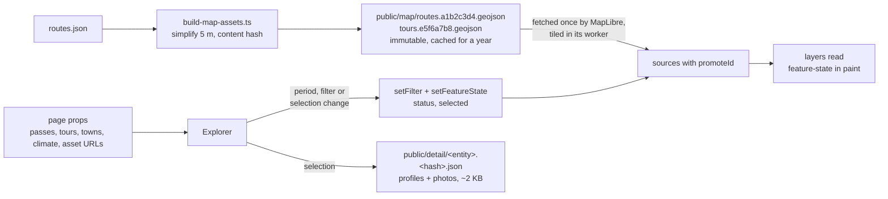

# Alpenpässe – where to ride, and when

A map for planning road-cycling holidays in the Alps. It answers destination
questions, not routing questions:

- Which regions are good in early October if we want to ride a few great passes?
- Where should we look for a hotel so that several passes and a loop are within reach?
- Which destinations should we keep an eye on for single-day and multi-day tours?

Data today: 262 roads with 398 ascents and their elevation profiles, 17 loop
tours, 66 cycling towns and 36 destinations, each with a rideability estimate
for a freely chosen half-month, a 7-day forecast and a 2015–2024 climate
series at the summit, in 2D and 3D. The UI is in German, and in English under
`/en`.

**What it is not.** A route planner or a navigation tool. Komoot, Strava and
similar services do turn-by-turn planning far better, and the app links out
to them. Precision beyond "is this doable that week" is out of scope, and so
are GPX export, custom tour building and live navigation.

## Quick start

```bash
bun install
bun run data:build        # once: precompute routes, elevation profiles, climate
bun dev
```

Without `data:build` the app still starts; only the drawn roads, the profiles
and the climate series are missing.

## Commands

| Command                              | Purpose                                                                   |
| ------------------------------------ | ------------------------------------------------------------------------- |
| `bun dev`                            | Development server                                                        |
| `bun run build` / `bun start`        | Production build and server                                               |
| `bun run typecheck`                  | `next typegen && tsc --noEmit` – the route types first, then the compiler |
| `bun run lint` / `bun run lint:fix`  | oxlint + oxfmt via ultracite (React Compiler and type-aware rules incl.)  |
| `bun run seams` / `bun run palette`  | The two repo checks inside `lint`: the adapters, and the sRGB mirror      |
| `bun run data:build`                 | Fetch routes, elevation profiles, climate → `data/generated/` (resumable) |
| `bun run data:build --status`        | Show what is still missing and what it costs in Open-Meteo calls          |
| `bun run data:check`                 | Validate references and completeness of the data                          |
| `bun run data:locate [slug…]`        | Where a pass point belongs: DEM, road distance, OSM candidates (network)  |
| `bun run data:photos`                | Wikimedia Commons photos per entity → `data/generated/photos.json`        |
| `bun run data:schema`                | Re-emit `data/schema/*.schema.json` from `lib/schema.ts`                  |
| `bun run data:backfill`              | Drain the whole precomputation backlog in hourly batches                  |
| `bun run test`                       | Unit tests next to the code                                               |
| `bun run e2e`                        | Build and drive the app in a headless Chrome                              |
| `bun run map:glyphs`                 | Rasterise Inter into MapLibre glyph atlases (committed, rarely needed)    |
| `bun run ui:init` / `bun run ui:add` | (Re)install the shadcn "mira" preset and components                       |

## Architecture in four sentences

All content data lives as JSON in the repo (`data/`), is imported at build
time and read synchronously in `lib/data.ts` inside the one `"use cache"` on
`app/[lang]/(explorer)/layout.tsx` – the start page and every entity route
under it are therefore fully prerendered, once per language. Two kinds of data never become
React props: the route geometry, written as content-hashed GeoJSON into
`public/map` for MapLibre to fetch and tile in its worker, and what only one
entity's panel reads (its elevation profiles and photo metadata), written as
one content-hashed JSON per entity into `public/detail`; every later change of
period, filter or selection reaches the lines as feature state rather than as
new data. The
only dynamic source is the weather forecast; it is streamed into the pass
route with its own cache lifetime (`lib/weather.ts`) so Open-Meteo is
queried once per pass and hour instead of once per visitor. The selection is
the path and everything else is the hash, so every view is shareable and the
back button closes the panel:

```
https://alpen.manuel.fyi/pass/col-du-galibier#t=10&z=9&c=45.06,6.41
                        └── selection ──┘ └ period ┘ └── camera ──┘
```

Every pass, tour, town and destination is a prerendered route with its own
title, description and share image (`app/[lang]/(explorer)/[kind]/[slug]`); the
layout around it – map, lists, season bar – stays mounted while the path
changes (`lib/hash-adapter.ts` turns the path into the reducer's `select` and
`back`, and the state into `router.push`):

```mermaid
sequenceDiagram
  participant U as Visitor
  participant L as (explorer)/layout<br/>map + sidebar, stays mounted
  participant R as Next router
  participant P as [kind]/[slug]/page<br/>prerendered
  U->>L: taps a row or a marker → reduce(select)
  L->>R: router.push("/pass/x" + location.hash)
  R->>P: fetches the route's payload
  P-->>L: the detail slot – the weather streams into its Suspense hole
  U->>R: browser back
  R-->>L: pathname "/" → reduce(back); the map stays where it is
```



Where the data in those files comes from – which host answers which question,
what each command writes and the states a route passes through – is
[`docs/data-pipeline.md`](./docs/data-pipeline.md).

Two languages, one tree (plan 08): every route lives under `app/[lang]`,
German stays prefix-free and canonical, English lives under `/en`, and
`next.config.ts` rewrites the prefix-free paths onto `/de` (and redirects a
typed `/de/…` to the prefix-free path), both prerendered. The one request
that is negotiated is the bare root: `proxy.ts` sends a browser that asks for
English to `/en`, unless the language menu's cookie says otherwise:

| Request                       | Rewrite           | Route file                                     | Language  |
| ----------------------------- | ----------------- | ---------------------------------------------- | --------- |
| `/`                           | → `/de`           | `app/[lang]/(explorer)/page.tsx`               | de        |
| `/pass/col-du-galibier`       | → `/de/pass/…`    | `app/[lang]/(explorer)/[kind]/[slug]/page.tsx` | de        |
| `/en`                         | (none)            | `app/[lang]/(explorer)/page.tsx`               | en        |
| `/en/pass/col-du-galibier`    | (none)            | `app/[lang]/(explorer)/[kind]/[slug]/page.tsx` | en        |
| `/impressum`, `/en/impressum` | → `/de/…`, (none) | `app/[lang]/impressum/page.tsx`                | de (both) |

The words are `lib/i18n/messages.de.ts` (the source, typed) and
`messages.en.ts` (held to its shape, so a missing key is a type error), and
each page ships only its own; the curated prose is `data/i18n/en/*.json`,
merged over the German records in `lib/data.ts` with a German fallback that
`bun run data:check` counts. The language is the last group of the map's
"…" menu: a plain link to the same view under the other prefix, hash and
all.

```
app/            [lang]/: layout, the explorer layout with the start page and
                the entity routes, Impressum, Datenschutz, the share images;
                at the root the metadata routes (icons, manifest, robots, sitemap)
components/     explorer (state) · map (MapLibre) · sidebar (lists, filters) · panel (detail) · ui (shadcn)
data/           passes.json, tours.json, towns.json, destinations.json  ← source data, hand-maintained
data/i18n/en/   the curated prose in English, keyed by slug, hand-checked
data/generated/ summits, routes, routes-meta, rejected, profiles, climate, photos
                ← from data:build and data:photos, committed
data/schema/    JSON Schema for the editor, from data:schema
lib/            types, data access, status heuristic, state hooks, brand constants, i18n/ (the words)
scripts/        build-data.ts (precomputation), check-data.ts (validation),
                locate-pass.ts (where a pass point belongs), build-photos.ts,
                build-map-assets.ts / build-detail-assets.ts (→ public/, git-ignored)
test/, e2e/     unit tests and the headless-browser suite
docs/           pipeline, data model, scales, conventions, roadmap, plans/
.agents/skills/ project skills for agents: implement-plan, curate-data, preview-app
```

## Where the documentation is

[`AGENTS.md`](./AGENTS.md) is the index for everything below it: the product
goal, the principles, a map of the code and the one-line version of every
convention, each linking to the document that explains it. `CLAUDE.md` is a
symlink to it, so there is only ever one copy.

| Document                                             | What it answers                                                         |
| ---------------------------------------------------- | ----------------------------------------------------------------------- |
| [`docs/data-pipeline.md`](./docs/data-pipeline.md)   | where every number comes from: sources, commands, states, what it costs |
| [`docs/data-model.md`](./docs/data-model.md)         | what a field means, the schemas, the route quality gate                 |
| [`docs/scales.md`](./docs/scales.md)                 | the 1–5 scales, the status ladder, the reach bands                      |
| [`docs/ui-conventions.md`](./docs/ui-conventions.md) | how the interface is built and why                                      |
| [`docs/map-rendering.md`](./docs/map-rendering.md)   | camera, layers, hit testing, basemap                                    |
| [`docs/architecture.md`](./docs/architecture.md)     | what the page ships, caching, the one dynamic route, the toolchain      |
| [`docs/plans/README.md`](./docs/plans/README.md)     | what is being built next                                                |
| [`docs/roadmap.md`](./docs/roadmap.md)               | what lies beyond the plans                                              |

## Plans and skills

`docs/plans/` holds one implementation plan per topic, ordered by how much
each serves the destination goal: data quality gate, payload, period as the
hero, climate-aware status, destinations, filters and search, real routes,
basemap, schema validation, tests, smaller items, English toggle, profile
interactivity. Start with [`docs/plans/README.md`](./docs/plans/README.md).

`.agents/skills/` holds project skills that agents (and people) follow:
`implement-plan` executes a plan end to end, `curate-data` adds or edits
passes, tours and towns, `preview-app` builds and screenshots the app headless
to verify a UI change. Vendored general-purpose skills (shadcn, React,
composition patterns, code review) sit next to them.

## Environment variables

See `.env.example`. None of them is required to start the app.

- `ORS_KEY` – only for `data:build`. Without the key the script routes via the
  public OSRM demo server using the **car profile**; with the key it uses the
  OpenRouteService **road-cycling profile**, which correctly handles the
  Tremola cobbles, the gravel on the Finestre and car-free roads. Free,
  2,000 routes/day: <https://openrouteservice.org/dev>
- `OPEN_METEO_BUDGET` – only for `data:build`. Open-Meteo bills weighted
  "calls" (an elevation profile ≈ 100, a climate series ≈ 261) with a free
  tier of 5,000/hour and 10,000/day. The script stops itself at this budget
  (default 4,500) and picks up the rest on the next run; the GitHub Action
  `refresh-data.yml` runs on a push to `data/*.json`, and
  `bun run data:backfill` drains a larger backlog locally in hourly batches.
- `NEXT_PUBLIC_SITE_URL` – absolute base URL for canonical links, the share
  images, `robots.txt` and `sitemap.xml`. On Vercel it is derived from
  `VERCEL_PROJECT_PRODUCTION_URL` (or `VERCEL_URL` on a preview), so it is only
  needed for a custom domain or a different host.
- `NEXT_PUBLIC_THUNDERFOREST_KEY`, `NEXT_PUBLIC_MAPTILER_KEY` – optional
  outdoor base maps. The default is the app's own vector style on OpenFreeMap
  tiles (light or dark with the OS, no key); OSM, OpenTopoMap, CyclOSM, Esri
  Topo and satellite imagery are available as alternatives.

## Deployment (Vercel)

Push the repo to GitHub, import it in Vercel, done – no `vercel.json` needed.
Every page is prerendered at build time and served from the CDN edge; only
the forecast streamed into a pass's page runs as a function. Production: <https://alpen.manuel.fyi>.

## Origin

Grew out of a single HTML prototype; the data and the status heuristic were
carried over from it. The prototype is kept for reference at
`docs/prototype.html`.
