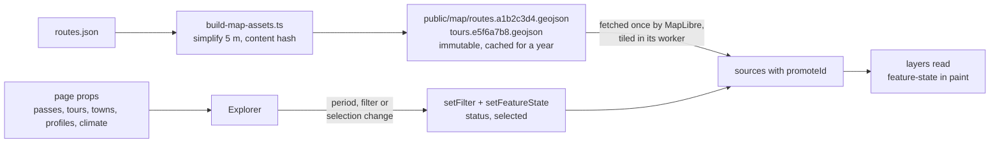

# Alpenpässe – where to ride, and when

A map for planning road-cycling holidays in the Alps. It answers destination
questions, not routing questions:

- Which regions are good in early October if we want to ride a few great passes?
- Where should we look for a hotel so that several passes and a loop are within reach?
- Which destinations should we keep an eye on for single-day and multi-day tours?

Data today: 92 passes with ascents and elevation profiles, 9 loop tours and
26 cycling towns, each with a rideability estimate for a freely chosen
half-month, a 7-day forecast and a 2015–2024 climate series at the summit, in
2D and 3D. The UI is in German.

**What it is not.** A route planner or a navigation tool. Komoot, Strava and
similar services do turn-by-turn planning far better, and the app links out
to them. Precision beyond "is this doable that week" is out of scope, and so
are GPX export, custom tour building and live navigation.

## Quick start

```bash
bun install
bun run data:build        # once: precompute routes, elevation profiles, climate
bun dev
```

Without `data:build` the app still starts; only the drawn roads, the profiles
and the climate series are missing.

## Commands

| Command                              | Purpose                                                                   |
| ------------------------------------ | ------------------------------------------------------------------------- |
| `bun dev`                            | Development server                                                        |
| `bun run build` / `bun start`        | Production build and server                                               |
| `bun run typecheck`                  | `tsc --noEmit`                                                            |
| `bun run lint` / `bun run lint:fix`  | oxlint + oxfmt via ultracite (incl. React Compiler rules)                 |
| `bun run data:build`                 | Fetch routes, elevation profiles, climate → `data/generated/` (resumable) |
| `bun run data:build --status`        | Show what is still missing and what it costs in Open-Meteo calls          |
| `bun run data:check`                 | Validate references and completeness of the data                          |
| `bun run data:locate [slug…]`        | Where a pass point belongs: DEM, road distance, OSM candidates (network)  |
| `bun run ui:init` / `bun run ui:add` | (Re)install the shadcn "mira" preset and components                       |

## Architecture in four sentences

All content data lives as JSON in the repo (`data/`), is imported at build
time and served through `"use cache"` in `lib/data.ts` as cached segments –
the start page is therefore fully prerendered. The route geometry is the one
exception that never becomes React props: `scripts/build-map-assets.ts` writes
it as content-hashed GeoJSON into `public/map`, MapLibre fetches those files
once and tiles them in its worker, and every later change of period, filter
or selection reaches the lines as feature state rather than as new data. The
only dynamic source is the weather forecast; it goes through
`app/api/weather/[slug]/route.ts` with its own cache lifetime so Open-Meteo is
queried once per pass and half hour instead of once per visitor. All
interaction state lives in one client component (`components/explorer.tsx`)
and is mirrored into the URL hash, so every view is shareable (plan 02 in
`docs/plans/` moves entities to real routes).



```
app/            layout, start page, weather route, Impressum, Datenschutz,
                metadata routes (icons, share image, manifest, robots, sitemap)
components/     explorer (state) · map (MapLibre) · sidebar (lists, filters) · panel (detail) · ui (shadcn)
data/           passes.json, tours.json, towns.json  ← source data, hand-maintained
data/generated/ routes.json, profiles.json, climate.json  ← from data:build, committed
lib/            types, data access, status heuristic, state hooks, brand constants
scripts/        build-data.ts (precomputation), check-data.ts (validation),
                build-map-assets.ts (GeoJSON for the map → public/map, git-ignored)
docs/           scales, data model, roadmap, plans/
.agents/skills/ project skills for agents: implement-plan, curate-data, preview-app
```

More in [`AGENTS.md`](./AGENTS.md) and [`docs/`](./docs).

## Plans and skills

`docs/plans/` holds one implementation plan per topic, ordered by how much
each serves the destination goal: data quality gate, payload, period as the
hero, climate-aware status, destinations, filters and search, real routes,
basemap, schema validation, tests, smaller items, English toggle, profile
interactivity. Start with [`docs/plans/README.md`](./docs/plans/README.md).

`.agents/skills/` holds project skills that agents (and people) follow:
`implement-plan` executes a plan end to end, `curate-data` adds or edits
passes, tours and towns, `preview-app` builds and screenshots the app headless
to verify a UI change. Vendored general-purpose skills (shadcn, React,
composition patterns, code review) sit next to them.

## Environment variables

See `.env.example`. None of them is required to start the app.

- `ORS_KEY` – only for `data:build`. Without the key the script routes via the
  public OSRM demo server using the **car profile**; with the key it uses the
  OpenRouteService **road-cycling profile**, which correctly handles the
  Tremola cobbles, the gravel on the Finestre and car-free roads. Free,
  2,000 routes/day: <https://openrouteservice.org/dev>
- `OPEN_METEO_BUDGET` – only for `data:build`. Open-Meteo bills weighted
  "calls" (an elevation profile ≈ 100, a climate series ≈ 261) with a free
  tier of 5,000/hour and 10,000/day. The script stops itself at this budget
  (default 4,500) and picks up the rest on the next run; the GitHub Action
  `refresh-data.yml` runs twice a day until nothing is missing.
- `NEXT_PUBLIC_SITE_URL` – absolute base URL for canonical links, the share
  images, `robots.txt` and `sitemap.xml`. On Vercel it is derived from
  `VERCEL_PROJECT_PRODUCTION_URL` (or `VERCEL_URL` on a preview), so it is only
  needed for a custom domain or a different host.
- `NEXT_PUBLIC_THUNDERFOREST_KEY`, `NEXT_PUBLIC_MAPTILER_KEY` – optional
  outdoor base maps. The default is the app's own vector style on OpenFreeMap
  tiles (light or dark with the OS, no key); OSM, OpenTopoMap, CyclOSM, Esri
  Topo and satellite imagery are available as alternatives.

## Deployment (Vercel)

Push the repo to GitHub, import it in Vercel, done – no `vercel.json` needed.
The start page is prerendered at build time and served from the CDN edge;
only the weather route runs as a function. Production: <https://alpen.manuel.fyi>.

## Origin

Grew out of a single HTML prototype; the data and the status heuristic were
carried over from it. The prototype is kept for reference at
`docs/prototype.html`.
