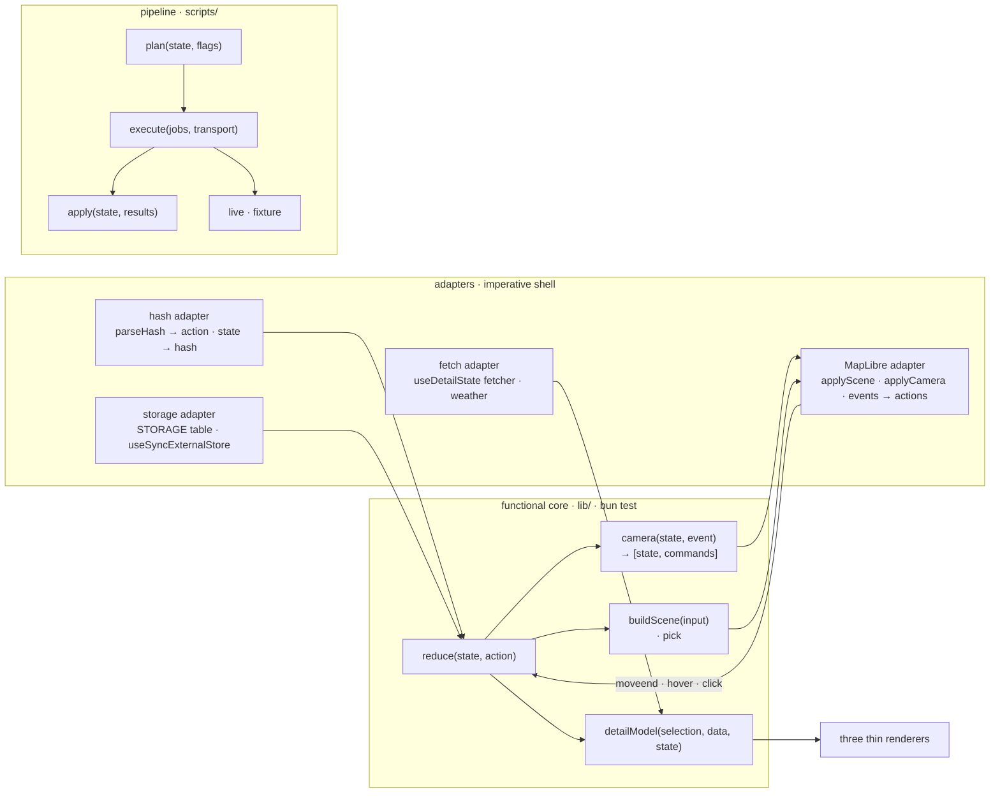
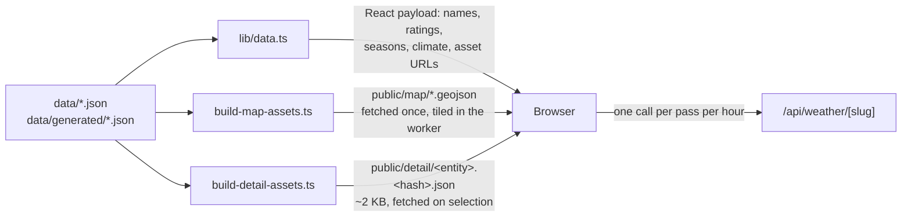

# Architecture and toolchain

What the page is allowed to ship, how it is cached, the single dynamic route
and the tools that check all of it. `AGENTS.md` links to each section and keeps
the one-line version.

Where the data in those files comes from is
[`data-pipeline.md`](./data-pipeline.md); what it means is
[`data-model.md`](./data-model.md).

## Functional core, imperative shell

**Decisions are values; effects apply them.** The app is four pure modules
behind four adapters, and the pipeline is the same shape one layer down. A
decision is a function of its arguments, so it has a table test; an effect
takes the value that function produced and hands it to the platform, so it has
nothing left to decide.

### The five invariants

1. **`lib/` is pure.** No module under `lib/` reads `window`, `document`,
   `location`, `localStorage`, `sessionStorage`, `fetch`, `matchMedia`,
   `navigator`, `history` or the two DOM observers, and none imports
   `maplibre-gl` for anything but its types – except the adapters below.
   Checked by `no-restricted-globals` and `no-restricted-imports` over
   `lib/**` in `oxlint.config.ts`, where the allow-list stands with a comment
   per entry saying which world the file is a window onto.
2. **Every effect applies a value.** A `useEffect` under `components/` calls
   an adapter with a value the core produced; it does not branch on state to
   decide what to call. The map's effects are one per input – the build, the
   scene, the five camera events, the four the environment changes – and a
   reviewer can name what each one applies.
3. **One transport per world.** The hash is read and written in one file,
   `alpenpaesse:` is spelled in one table, and the MapLibre calls that move
   the camera or change what is drawn live in the two appliers. Checked by
   `scripts/check-seams.ts`, which runs inside `bun run lint` and therefore in
   CI; its `SEAMS` table carries the reason per owner.
4. **The core carries the tests.** `bun test` covers the reducer, the camera
   machine, the scene, the pick, the detail model and the offline pipeline.
   The e2e suite is ten scenarios of smoke: one timeout for the suite, none
   per scenario, no monkey-patching, and nothing read off `window.__alpen` but
   the map handle.
5. **A new feature enters as data.** The official closure status
   ([`roadmap.md`](./roadmap.md) §1) is one pipeline job kind, one field on
   the row, one scene input and one reducer case, and it needs no effect
   edited. That is the test of whether the seams are real.

### The four adapters, and the three hooks beside them

| Adapter                                                      | World                                                   |
| ------------------------------------------------------------ | ------------------------------------------------------- |
| `lib/hash-adapter.ts` (`useHashAdapter`, `cameraIntent`)     | `location.hash` in as `load`, the state out as the hash |
| `lib/use-stored.ts` (`useStorageAdapter`, `readStoredState`) | `localStorage` and `sessionStorage`, behind `STORAGE`   |
| `components/map/apply-scene.ts`, `apply-camera.ts`           | MapLibre: the scene's difference, the camera's commands |
| `lib/use-fetch.ts` (through `lib/detail-state.ts`)           | `fetch`, as the three answers a request can give        |

Three more hooks touch the platform and are on the same allow-list, because
they read it rather than decide anything with it: `lib/use-media-query.ts`
(`matchMedia` and the viewport height, including the map's whole environment
as one value), `lib/use-height.ts` (a `ResizeObserver` on the shell's two
bars) and `lib/use-roving.ts` (a `MutationObserver` and focus, turning a list
into one tab stop). Every entry needs its comment and its reason; when the
list passes eight, review it rather than extending it.

The core is four functions with names, not a framework: the reducer is a
switch, the camera is a switch, the scene and the model are functions. The
moment a generic dispatcher, a middleware chain or a "store" abstraction
appears, this has failed in the other direction.

## What travels as props, and what does not

Four transports, and the rule is what reads the data: the sidebar reads
everything on every keystroke, so its data is a prop; the panel reads one
entity at a time, so its data is a file.

### Route geometry never travels as props

`scripts/build-map-assets.ts` (runs before `dev` and `build`, next to the
worker copy) simplifies `routes.json` to 5 m and writes one content-hashed
GeoJSON per kind into `public/map` (git-ignored, cached immutably via
`next.config.ts`). `lib/data.ts` derives the same file names with
`lib/map-assets.ts` and hands the page the URLs plus one bounding box per tour
and per pass – what a selection is framed into, and the one thing a camera
cannot wait for a fetch to learn (10 KB for all 201 passes, four rounded
numbers each); MapLibre fetches the files and tiles them in its worker.
Nothing ever calls `setData` on the `routes` and `tours` sources: which lines
show is a layer filter (which also keeps hidden lines out of hit-testing),
status, hover and selection are feature state – both of them scene fields
(`lib/map-scene.ts`), applied by `applyScene`. MapLibre keeps that state
per source and applies it to tiles as they load, so it is set as soon as the
style is parsed (`style.load`) and needs no re-application when the file
arrives. Points (passes, towns) stay in-memory sources, because their symbol
layers need real properties; the lines carry only what addresses them, since
what the hover label says is looked up from the entity rather than read off a
rendered feature. Anything else the client used to read from the
geometry is precomputed on the server: tours within reach of an entity
(`lib/nearby.ts`) and the road coordinate of every profile sample
(`ProfileWithCoords`).

Both this file and the per-entity detail files below are named by
`lib/derived-file.ts`, which owns the content hash, the name it produces, the
pattern that prunes last build's names and the source `next.config.ts` caches
for a year. The three have to agree or the app serves a stale file forever,
so they are one definition with one test rather than three spellings that
happen to match today.

### Neither does what only one entity's panel reads

The same rule, one layer up: `scripts/build-detail-assets.ts` writes one
content-hashed JSON per pass, tour and town into `public/detail` (git-ignored,
cached immutably) holding that entity's elevation profiles and its Commons
photo metadata, `lib/data.ts` derives the same names with
`lib/detail-assets.ts` and hands the page one URL per entity, and `DetailPanel`
fetches the one that is selected. Measured per prop on the prerendered page,
those two were 297 KB and 77 KB gzipped of 468 KB; the page now carries 147 KB
and a selection costs about 2 KB. A block that waits for the file says so, and
reserves the box it will fill – `PhotoCarousel` shows a slide-shaped skeleton
for as many photos as `DetailAsset.photos` promises and nothing at all where
that is zero, the ascent list shows a `PROFILE_ASPECT`-shaped skeleton –
because everything a list row already showed (name, status, season strip,
ratings) is in the page and must not flicker. What the sidebar reads stays a
prop, and that is the line: the climate series is 42 KB gzipped and
`buildPassRows`/`facetCount` read it on every keystroke, so a late arrival
would mean a filter counting wrong for a moment (see
["A filter is a chip, and no chip lies"](./ui-conventions.md#a-filter-is-a-chip-and-no-chip-lies)).

## Rendering and caching

### Cache Components

`"use cache"` sits on `app/page.tsx`, and that is the only place it sits.
Everything the page shows comes from JSON imported at build time, so
`lib/data.ts` is plain synchronous code: the page's own cache entry covers the
derivations it runs – the asset URLs, the reachable tours, the town hulls, the
graded year of every pass – and they are run once, at prerender. The getters
used to carry a `"use cache"` each. None of them had a lifetime, a tag or a
second caller, so the only thing the extra entries bought was a second copy of
the same values in the cache store; `next build` reports `○ /` either way.
(The weather route is the other cached thing, and it is cached for a reason of
its own: an upstream call per pass per hour. See below.)

A `"use cache"` function has to be `async` even where it awaits nothing, which
is why `app/page.tsx` is async and carries the one `require-await` exception in
`oxlint.config.ts`. Introducing `cookies()`, `headers()` or `searchParams`
breaks prerendering – put such things in a separate dynamic child component
inside `<Suspense>` instead.

### React Compiler is on

No manual `useMemo`/`useCallback` for optimisation; oxlint ports the whole
React Compiler rule set under `react/*` (`set-state-in-effect`, `purity`,
`immutability`, `refs`, `preserve-manual-memoization`, …) and every one of them
is an error. `setState` in an effect is needed in exactly one documented place
(`useHashAdapter` in `lib/hash-adapter.ts`, which dispatches the `load` action
from a layout effect after hydration).

### Site metadata is generated, never committed as a binary

Icons, the share image, the manifest, `robots.txt` and `sitemap.xml` are Next
metadata routes under `app/`, prerendered at build time. Everything they need –
name, claim, base URL, the colours and the mark geometry – lives in
`lib/brand.ts`, because neither Satori nor a manifest can read CSS variables;
its colours are the tokens of `TOKENS` (`lib/palette.ts`), the one sRGB mirror
of `app/globals.css`, which `bun run palette` holds against the stylesheet
(see ["Colours only via tokens"](./map-rendering.md#colours-only-via-tokens)).
`lib/mark.tsx` paints that geometry as the badge the favicon, the touch icon
and the share image all share. Change those two, not the routes. The badge is
monochrome and has its own small grey scale rather than the UI tokens: it is
seen at 16 px against unknown browser chrome, where depth has to come from tone
and the page palette does not carry far enough. `robots.ts` welcomes search
engines and turns away the training and answer-engine crawlers; pages that
carry `robots: { index: false }` stay crawlable on purpose, since a crawler has
to fetch a page to see that.

## The one dynamic route lives inside a free tier, and the numbers are in the file

`app/api/weather/[slug]` is the only thing a visitor can spend somebody's quota
on. Open-Meteo's non-commercial allowance is 10 000 calls a day, so the worst
case has to be computed rather than hoped for: one cached call per pass per
window, 201 passes, which is why the window is an hour (≈ 4 800/day) and not
the half hour it was (≈ 9 600/day). Three rules follow. A window that gets
shorter has to be checked against that product again. A successful answer
carries `s-maxage`, so the repeats inside a window are served by the CDN and
not by the function. And a failure is never left to each visitor to retry: a
thrown forecast is not cached, so a rate limit or an outage would arrive
undamped, and a module-level cooldown bounds what one warm instance will ask.
That cooldown sits _inside_ the cached function, where a cache hit never
reaches it – one failing pass must not blank the weather of the other 200 – and
it is armed wherever the host fails it – the fetch, the status, an answer this
route cannot read – rather than in the handler, or it would re-arm on its own
rejection and never end. What Open-Meteo has no value for is a `null`, and it
stays one cell wide: `WeatherDay` takes a null measurement and the panel prints
a dash for it, because a week with one empty snowfall is still a forecast and
losing all seven days over it is not a trade anybody would make. It cannot be helped along at the edge:
Vercel's CDN stores only 200, 404, 410 and the redirects, so a `Cache-Control`
on a 502 is inert, and dressing a failure as a 200 to make it cacheable is not
worth the lie. The 404 for an unknown slug _is_ cacheable and says so. The same
arithmetic is why the app is non-commercial in both senses: ads or affiliate
links would break Vercel's Hobby terms and Open-Meteo's free tier in the same
move. Donations would not, which is why the sidebar footer links to Ko-fi
(`SUPPORT_URL` in `lib/brand.ts`) and carries nothing else that costs anyone
money – as a plain link, never the widget, so the privacy page can say that
nothing loads from there until it is clicked.

## Toolchain

### TypeScript 7, one compiler under its own name

`typescript` is TypeScript 7, and it is the only TypeScript in the tree. Both
`bun run typecheck` and `next build` compile with it.

It used to be two packages: `@typescript/native` aliased to TypeScript 7 for
the `tsc` binary, and the `typescript` name aliased to `@typescript/typescript6`
for the editor's language service. That arrangement quietly type-checked the
build with a different compiler than `bun run typecheck`, because `next build`
resolves the `typescript` package name and that name was 6.0. Collapsing the
two cost nothing and made Next's TypeScript step about three times faster
(12s → 4s on this repo), because the build now runs the native compiler
instead of the JavaScript one.

Two things follow from having only TypeScript 7:

- **The `typescript` dependency is load-bearing, not decoration.** Remove it and
  `next build` does not skip its TypeScript step – it installs a TypeScript
  itself, with whichever package manager it detects, rewriting `package.json`
  and dropping a foreign lockfile next to `bun.lock`.
- **The editor is on its own.** TypeScript 7 ships `tsc` and an `unstable` API,
  no `tsserver.js` and no full JavaScript API, so there is no workspace language
  service to point an editor at; `.vscode/settings.json` no longer sets
  `js/ts.tsdk.path`. The editor falls back to its own bundled TypeScript, which
  is a release behind the compiler – `bun run typecheck` is the authority, and
  CI runs it. For TypeScript 7 in the editor, install its native-preview
  extension.

Do not add TypeScript 6 back under its own name to get the language service:
it pulls in `@typescript/old`, which also claims the `tsc` binary, and
`bun run typecheck` then silently runs the old compiler.

### Bun is pinned by `engines`, and the web container is dragged up to it

`engines.bun` in `package.json` is the floor, and it is not decoration: on Bun
1.3 `bun run build` dies in Next's TypeScript step, and `bun run e2e` and the
`preview-app` skill cannot start at all, because both drive Chrome through
`Bun.WebView` (Bun 1.4+). Claude Code on the web ships whatever Bun its image
was built with, so `.claude/hooks/session-start.sh` runs at session start,
upgrades Bun when it is below that floor and installs the dependencies with
`--frozen-lockfile` – an older Bun rewrites `bun.lock` to the previous format
on the first install. The hook only runs in the remote container
(`CLAUDE_CODE_REMOTE`); a local machine manages its own toolchain. Raise the
floor in `package.json` and the hook follows.

### oxlint and oxfmt, no ESLint

`bun run lint` is `ultracite check` (oxlint plus an oxfmt format check),
`bun run lint:fix` writes the fixes. oxlint's `nextjs` and `react` plugins
cover everything `eslint-config-next` did, React Compiler rules included, so
ESLint and `eslint-config-next` are gone. The two config files only ever
_deviate_ from the ultracite preset, and every deviation carries the reason
next to it – keep it that way rather than silencing a rule at the call site.

The type-aware rules run as well. `oxlint-tsgolint` (typescript-go) executes
the `typescript/*` rules that need type information – `no-floating-promises`,
`no-misused-promises`, `no-unnecessary-type-assertion` and their kin – and
`options.typeAware` in `oxlint.config.ts` switches them on, so `bun run lint`,
the editor and CI see the same findings. The pass reads `tsconfig.json`, adds
about three seconds to the syntax pass, and builds a TypeScript program of its
own; `bun run typecheck` stays the type check (`--type-check` would only repeat
it). The package version tracks TypeScript – `7.0.2xxx` is TypeScript 7.0.2
plus a patch counter – so bump it together with `typescript`. MapLibre's
typings use the `GeoJSON` global from `@types/geojson`, which tsc finds on its
own and tsgolint only when `tsconfig.json` names it in `types` – hence that
entry and the explicit devDependency. The preset enables every rule tsgolint
implements; the noisy ones (`strict-boolean-expressions`,
`no-confusing-void-expression`, `no-unsafe-type-assertion`) are tuned or
switched off in the config, each with its reason.
