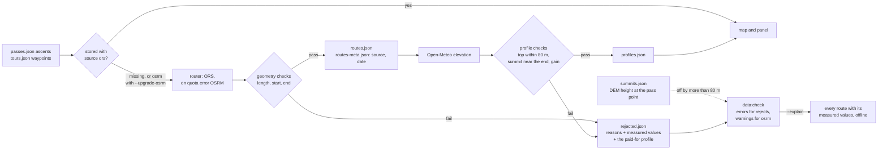

# Data model

All types live in [`lib/types.ts`](../lib/types.ts). Source data is maintained
by hand; derived data comes from `scripts/build-data.ts`.

## Source data (hand-maintained)

### `data/passes.json`

```jsonc
{
  "slug": "col-du-galibier",       // stable, derived from the name; umlauts → ae/oe/ue
  "name": "Col du Galibier",
  "country": "FR",                  // "CH/IT" for border passes
  "region": "Westalpen",            // Westalpen | Zentralalpen | Ostalpen | Dolomiten
  "lat": 45.064, "lon": 6.408,
  "elevation": 2642,
  "classicAscent": "18 km, 6,9 % ab Valloire (34 km via Télégraphe)",
  "beauty": 5, "fame": 5, "difficulty": 5, "traffic": 2,   // 1–5, see scales.md
  "season": { "opens": 6, "closes": 10.5 },  // half-months; null = cleared year-round
  "note": "…",                       // one or two sentences of editorial commentary
  "ascents": [{ "from": { "lat": 45.165, "lon": 6.430 }, "label": "Valloire (Nord)" }]
}
```

An ascent (or a tour) may carry a `check` object that widens **one** limit of the
route quality gate for that entry alone, with a mandatory `note` saying why:

```jsonc
"ascents": [{
  "from": { "lat": 47.446, "lon": 12.392 }, "label": "Kitzbühel",
  "check": { "maxTopDelta": 420, "note": "Straße endet am Alpenhaus unter dem Gipfel" }
}]
```

`season.maintained: true` marks managed toll roads (Grossglockner, Timmelsjoch,
Nockalm …). They are cleared of snow and therefore get no elevation penalty in
the status heuristic.

**Time reckoning:** A `Period` is a half-month. `10` = early October,
`10.5` = late October. `PERIODS` in `lib/status.ts` lists all 24.

### `data/tours.json`

`passes` contains pass **slugs**; the tour status is computed from them as the
worst status among the passes involved. `waypoints` are rough anchor points
that routing connects into a line.

### `data/towns.json`

Towns with road-cycling infrastructure (workshops, rentals, bike hotels). `why`
is a single sentence naming the surrounding passes and the infrastructure.

## Derived data (`bun run data:build`)

| File | Key | Contents |
| --- | --- | --- |
| `routes.json` | `<pass-slug>:<index>`, `tour:<tour-slug>` | Road geometry as `[lat, lon][]` |
| `profiles.json` | `<pass-slug>:<index>` | km, elevation gain, average gradient, anchor points |
| `climate.json` | `<pass-slug>` | 24 half-months with average temperatures and frost/snow/rain share |
| `routes-meta.json` | as `routes.json` | `source` (`ors` \| `osrm`) and `fetchedAt` – which router produced this route |
| `rejected.json` | as `routes.json` | routes the quality gate refused, with the reasons, the measured values and the paid-for profile |
| `summits.json` | `<pass-slug>` | DEM height at the pass coordinate, to catch a wrong summit point |

These files belong in the repo. They only change when passes, ascents or tours
change – the script skips everything that already exists.

### The route quality gate

Nothing reaches `routes.json` unmeasured. A geometry is measured, judged, and
only then written; what fails goes to `rejected.json` instead, so a wrong route
neither reaches the map nor spends 100 Open-Meteo calls on a useless profile.



What the checks look at, for one ascent:

```
 elevation
   ▲                                        top within 80 m of pass.elevation
   │                                 ●──●   and inside the last 25 % of the distance
   │                           ●──●──┘
   │                     ●──●──┘
   │               ●──●──┘
   │         ●──●──┘
   │   ●──●──┘
   └───┼───────────────────────────────┼────► distance, at most 60 km
     start within 2 km              end within 500 m
     of ascent.from                 of the pass coordinate
```

Measuring and judging are separate functions in `scripts/lib/validate.ts`, and
`check-data.ts` re-measures the stored geometries rather than trusting what the
build wrote. That is what keeps the thresholds tunable: `bun run data:check
--explain` prints every route with its measured values and marks the violations,
offline and without a single API call, so the effect of changing a limit is
visible before anything is re-fetched. The thresholds themselves are listed in
the `curate-data` skill.

### What it costs

Routing is effectively free: ORS allows 2 000 requests a day and the whole
dataset is ~180 of them, one per ascent and one per tour. Open-Meteo is the
constraint, and its **hourly** limit binds first – 5 000 calls/h against ~100
calls per elevation profile, so a run places about 45 profiles before
`OPEN_METEO_BUDGET` (default 4500) stops it. A climate series costs ~261 calls,
but that file is complete and its window is frozen, so it no longer contributes.

`bun run data:build --status` shows the backlog and how many runs it needs;
`scripts/backfill.sh` drains it in hourly batches until nothing is missing.

## Adding a pass

1. Add an entry to `data/passes.json` (slug following the same pattern).
2. `ORS_KEY=… bun run data:build` – fetches only the new routes, profiles and
   the climate series, and runs each new route through the gate.
3. `bun run data:check` – validates references, value ranges, completeness and
   the plausibility of every stored route.

If the gate rejects the new ascent, `rejected.json` names the measured value
that broke a limit. There are exactly three ways out, and the `curate-data`
skill describes when each applies: fix the coordinates, set `ascent.check` with
a note, or change the limit itself.
