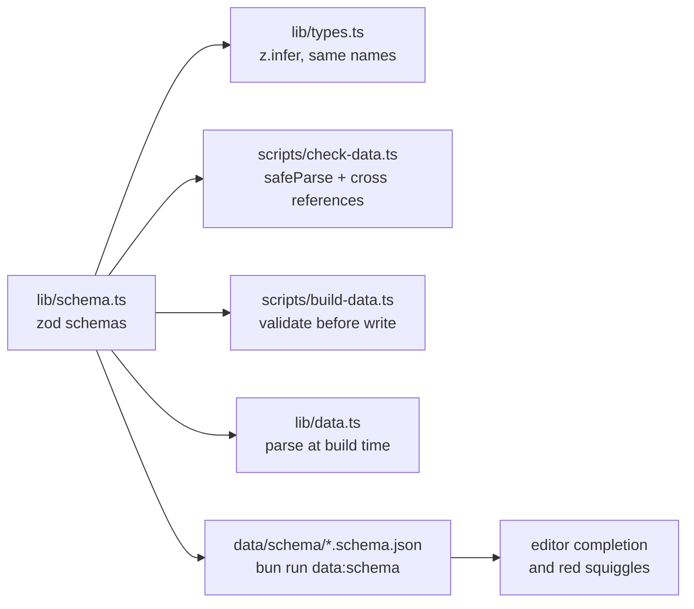

# Data model

All types come from [`lib/schema.ts`](../lib/schema.ts): the zod schemas there
are the single description of every file in `data/`, and
[`lib/types.ts`](../lib/types.ts) only re-exports the inferred types under
their established names. Source data is maintained by hand; derived data
comes from `scripts/build-data.ts`.

## How the schemas are used



- `bun run data:check` parses every file with `safeParse` and prints
  path-qualified errors (`passes.json › [12].season.closes: …`), then runs
  the cross-reference checks (tour → pass slugs, aliases, routes and profiles
  present). It also verifies that the hand-maintained files are in canonical
  form (`JSON.stringify(data, null, 1)` plus a trailing newline) and that
  the JSON Schema files are current.
- `lib/data.ts` parses the files once when the server module loads, so a
  broken file fails `next build` rather than the UI.
- `scripts/build-data.ts` validates every generated file before writing it.
- `bun run data:schema` emits `data/schema/*.schema.json`; `.vscode/settings.json`
  maps the data files to them, which gives completion and red squiggles in
  the editor. Regenerate them in the same PR that changes `lib/schema.ts`.

Only server and script code imports `lib/schema.ts`; components import the
types from `lib/types.ts` so zod never reaches the client bundle. The fixed
vocabularies (regions, countries) live in `lib/regions.ts`, which both sides
share.

## Source data (hand-maintained)

### `data/passes.json`

```jsonc
{
  "slug": "col-du-galibier", // stable, derived from the name; umlauts → ae/oe/ue
  "name": "Col du Galibier",
  "aliases": ["Galibier"], // optional: other spellings people search for
  "country": "FR", // "CH/IT" for border passes
  "region": "Westalpen", // Westalpen | Zentralalpen | Ostalpen | Dolomiten
  "lat": 45.064,
  "lon": 6.408,
  "elevation": 2642,
  "classicAscent": "18 km, 6,9 % ab Valloire (34 km via Télégraphe)",
  "beauty": 5,
  "fame": 5,
  "difficulty": 5,
  "traffic": 2, // 1–5, see scales.md
  "season": { "opens": 6, "closes": 10.5 }, // half-months; null = cleared year-round
  "note": "…", // one or two sentences of editorial commentary
  "ascents": [
    { "from": { "lat": 45.165, "lon": 6.43 }, "label": "Valloire (Nord)" },
  ],
}
```

`season.maintained: true` marks managed toll roads (Grossglockner, Timmelsjoch,
Nockalm …). They are cleared of snow and therefore get no elevation penalty in
the status heuristic.

`aliases` feeds the search only (never a name of another pass; `data:check`
rejects duplicates). Search folds accents, ß and punctuation on both sides
(`lib/search.ts`), so "Vrsic" finds Vršič without an alias; aliases are for
genuinely different names such as "Stilfser Joch".

**Time reckoning:** A `Period` is a half-month. `10` = early October,
`10.5` = late October. `PERIODS` in `lib/status.ts` lists all 24.

Which half-month the app shows is decided in this order:

```
hash t=…  ───────────────► present? ── yes ──► use it, never store it (someone else's link)
                               │ no
localStorage alpenpaesse:period ► present? ── yes ──► use it (the visitor's last choice)
                               │ no
today's half-month, computed on the server in Europe/Berlin (prerendered, revalidated every 15 min)
```

`todayPeriod()` reads the calendar in `Europe/Berlin`; because a half-month is
15 days wide, a visitor in another timezone is at most one day off at a
boundary, which never changes the bucket by more than that day. Only the
period control writes to `localStorage`, so opening a shared link never
overwrites the visitor's own preference.

### `data/tours.json`

`passes` contains pass **slugs**; the tour status is computed from them as the
worst status among the passes involved. `waypoints` are rough anchor points
that routing connects into a line.

### `data/towns.json`

Towns with road-cycling infrastructure (workshops, rentals, bike hotels). `why`
is a single sentence naming the surrounding passes and the infrastructure.

## Derived data (`bun run data:build`)

| File            | Key                                       | Contents                                                           |
| --------------- | ----------------------------------------- | ------------------------------------------------------------------ |
| `routes.json`   | `<pass-slug>:<index>`, `tour:<tour-slug>` | Road geometry as `[lat, lon][]`                                    |
| `profiles.json` | `<pass-slug>:<index>`                     | km, elevation gain, average gradient, anchor points                |
| `climate.json`  | `<pass-slug>`                             | 24 half-months with average temperatures and frost/snow/rain share |

These files belong in the repo. They only change when passes or ascents are
added – the script skips everything that already exists. Because Open-Meteo
bills a profile as ≈100 and a climate series as ≈261 "calls" against a free
tier of 10,000/day, a larger backlog is drained over several runs
(`OPEN_METEO_BUDGET`, twice-daily `refresh-data.yml`). `bun run data:build
--status` shows the backlog and its cost.

## Adding a pass

1. Add an entry to `data/passes.json` (slug following the same pattern).
2. `bun run data:build` – fetches only the new routes, profiles and the climate series.
3. `bun run data:check` – validates the schema, references and completeness.
