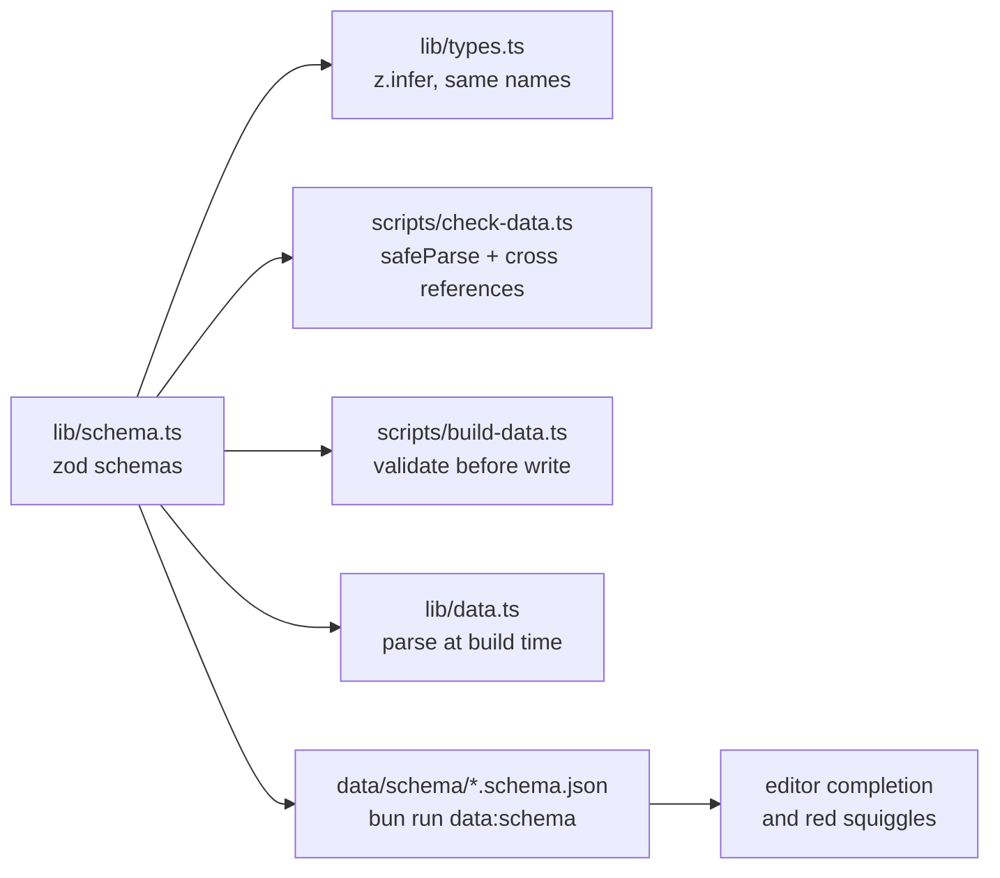
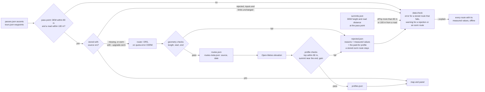

# Data model

All types come from [`lib/schema.ts`](../lib/schema.ts): the zod schemas there
are the single description of every file in `data/`, and
[`lib/types.ts`](../lib/types.ts) only re-exports the inferred types under
their established names. Source data is maintained by hand; derived data
comes from `scripts/build-data.ts`.

## How the schemas are used



- `bun run data:check` parses every file with `safeParse` and prints
  path-qualified errors (`passes.json › [12].season.closes: …`), then runs
  the cross-reference checks (tour → pass slugs, aliases, routes and profiles
  present). It also verifies that the hand-maintained files are in canonical
  form (`JSON.stringify(data, null, 1)` plus a trailing newline) and that
  the JSON Schema files are current.
- `lib/data.ts` parses the files once when the server module loads, so a
  broken file fails `next build` rather than the UI.
- `scripts/build-data.ts` validates every generated file before writing it.
- `bun run data:schema` emits `data/schema/*.schema.json`; `.vscode/settings.json`
  maps the data files to them, which gives completion and red squiggles in
  the editor. Regenerate them in the same PR that changes `lib/schema.ts`.

Only server and script code imports `lib/schema.ts`; components import the
types from `lib/types.ts` so zod never reaches the client bundle. The fixed
vocabularies (regions, countries) live in `lib/regions.ts`, which both sides
share.

## Source data (hand-maintained)

### `data/passes.json`

```jsonc
{
  "slug": "col-du-galibier", // stable, derived from the name; umlauts → ae/oe/ue
  "name": "Col du Galibier",
  "aliases": ["Galibier"], // optional: other spellings people search for
  "country": "FR", // "CH/IT" for border passes
  "region": "Westalpen", // Westalpen | Zentralalpen | Ostalpen | Dolomiten
  "lat": 45.064,
  "lon": 6.408,
  "elevation": 2642,
  "deadEnd": true, // optional: the road ends at the summit, no crossing
  "roadSummit": true, // optional: highest asphalt, no mountain_pass node in OSM
  "classicAscent": "18 km, 6,9 % ab Valloire (34 km via Télégraphe)",
  "beauty": 5,
  "fame": 5,
  "difficulty": 5,
  "traffic": 2, // 1–5, see scales.md
  "season": { "opens": 6, "closes": 10.5 }, // half-months; null = cleared year-round
  "note": "…", // one or two sentences of editorial commentary
  "ascents": [
    { "from": { "lat": 45.165, "lon": 6.43 }, "label": "Valloire (Nord)" },
  ],
}
```

An ascent (or a tour) may carry a `check` object that widens a limit of the
route quality gate for that entry alone – only the limits its own validator
reads – with a mandatory `note` saying why:

```jsonc
"ascents": [{
  "from": { "lat": 47.446, "lon": 12.392 }, "label": "Kitzbühel",
  "check": { "maxTopDelta": 420, "note": "Straße endet am Alpenhaus unter dem Gipfel" }
}]
```

`season.maintained: true` marks managed toll roads (Grossglockner, Timmelsjoch,
Nockalm …). They are cleared of snow and therefore get no elevation penalty in
the status heuristic.

Not every entry is a pass in the strict sense. Two optional flags say how the
entry differs, and they are independent of each other and of `maintained`:

- `deadEnd: true` – the road ends at the summit (Ötztaler Gletscherstraße,
  Tre Cime, Kitzbüheler Horn …). The descent is the ascent ridden backwards
  and the climb cannot be part of a loop, so `data:check` warns when a tour
  lists such a pass, and the detail panel says so under "Auffahrten". It is
  curated, not derived from the number of ascents: the Nockalmstraße has two
  ascents and is a crossing, the Umbrailpass has one and is not a dead end.
- `roadSummit: true` – the summit point is the highest point of the asphalt
  rather than a saddle, because OSM carries no `mountain_pass` node for it.
  `bun run data:locate` then skips the pass-node search and offers the highest
  sample of the stored route instead, and `--apply` takes it – judged on DEM
  height and road distance, since there is no name to match. The gate's summit
  checks are unchanged: a correct road-summit point passes them like any pass.
  Every dead end is a road summit; a crossing can be one too (Roßfeld-
  Panoramastraße, Nockalmstraße).

`aliases` feeds the search only (never a name of another pass; `data:check`
rejects duplicates). Search folds accents, ß and punctuation on both sides
(`lib/search.ts`), so "Vrsic" finds Vršič without an alias; aliases are for
genuinely different names such as "Stilfser Joch".

**Time reckoning:** A `Period` is a half-month. `10` = early October,
`10.5` = late October. `PERIODS` in `lib/status.ts` lists all 24.

Which half-month the app shows is decided in this order:

```
hash t=…  ───────────────► present? ── yes ──► use it, never store it (someone else's link)
                               │ no
localStorage alpenpaesse:period ► present? ── yes ──► use it (the visitor's last choice)
                               │ no
today's half-month, computed on the server in Europe/Berlin (prerendered, revalidated every 15 min)
```

`todayPeriod()` reads the calendar in `Europe/Berlin`; because a half-month is
15 days wide, a visitor in another timezone is at most one day off at a
boundary, which never changes the bucket by more than that day. Only the
period control writes to `localStorage`, so opening a shared link never
overwrites the visitor's own preference.

### `data/tours.json`

`passes` contains pass **slugs**; the tour status is computed from them as the
worst status among the passes involved. `waypoints` are rough anchor points
that routing connects into a line.

### `data/towns.json`

Towns with road-cycling infrastructure (workshops, rentals, bike hotels). `why`
is a single sentence naming the surrounding passes and the infrastructure.

## Derived data (`bun run data:build`)

| File               | Key                                       | Contents                                                                                                                                                       |
| ------------------ | ----------------------------------------- | -------------------------------------------------------------------------------------------------------------------------------------------------------------- |
| `routes.json`      | `<pass-slug>:<index>`, `tour:<tour-slug>` | Road geometry as `[lat, lon][]`                                                                                                                                |
| `profiles.json`    | `<pass-slug>:<index>`                     | km, elevation gain, average and steepest-kilometre gradient, ~100 samples                                                                                      |
| `climate.json`     | `<pass-slug>`                             | 24 half-months with average temperatures and frost/snow/rain share; the verdict reads `snowPct`, `frostPct`, `wetPct` and `tmax` (`lib/status.ts`)             |
| `routes-meta.json` | as `routes.json`                          | `source` (`ors` \| `osrm`) and `fetchedAt` – which router produced this route                                                                                  |
| `rejected.json`    | as `routes.json`                          | routes the quality gate refused, with the reasons, the measured values, the paid-for profile and a hash of the inputs they were routed for                     |
| `summits.json`     | `<pass-slug>`                             | DEM height (`dem`) and distance to the nearest road (`roadDist`) at the pass coordinate, with the `lat`/`lon` they were read at, to catch a wrong summit point |

A profile's samples are ~100 points of the ascent's road geometry, taken at
`Math.round(i * step)` of `routes.json` (`lib/profile.ts`). The coordinate of a
sample is therefore derivable from the route and is not stored twice;
`lib/data.ts` derives it on the server (`ProfileWithCoords`) – which is what
lets the detail panel put a cursor on the map while you scrub the profile,
without the route itself reaching the client. The same getter family derives
`valleys` (`getValleys()`, `valleyElevations()` in `lib/profile.ts`): the
lowest `start` of a pass's profiles, which is the elevation the summit
climate is taken down to for the heat signal (`valleyTmax()`, see
`docs/scales.md`, "Derived values"). The client gets the number per slug, not
the profiles. The map draws the routes from
static GeoJSON instead: `scripts/build-map-assets.ts` writes `routes.json`,
simplified to 5 m, as content-hashed files into `public/map` (git-ignored),
see plan 01.
`dist` measures **along the road**, not from sample to sample: a chord chain
through the Stelvio's 48 hairpins comes out two kilometres short, and
`profile.km` would disagree with the gate's `ascentMetrics.km`, which has always
measured the full geometry. Everything derived from `dist` and `ele` – `km`,
`avgGradient`, `maxKmGradient` – can be recomputed offline with
`bun run data:build --backfill`.

The steepest kilometre is an estimate, not a measurement: the samples are a few
hundred metres apart and carry DEM noise, and a maximum over ninety windows
picks the worst of it. `steepestKm` smooths and fits a line through each window
to keep the bias down, and the panel labels the section accordingly.

These files belong in the repo. They only change when passes, ascents or tours
change – the script skips everything that already exists.

### The route quality gate

Nothing reaches `routes.json` unmeasured. A geometry is measured, judged, and
only then written; what fails goes to `rejected.json` instead, so a wrong route
neither reaches the map nor spends 100 Open-Meteo calls on a useless profile.



What the checks look at, for one ascent:

```
 elevation
   ▲                                        top within 80 m of pass.elevation
   │                                 ●──●   and inside the last 25 % of the distance
   │                           ●──●──┘
   │                     ●──●──┘
   │               ●──●──┘
   │         ●──●──┘
   │   ●──●──┘
   └───┼───────────────────────────────┼────► distance, at most 60 km
     start within 2 km              end within 500 m
     of ascent.from                 of the pass coordinate
```

Measuring and judging are separate functions in `scripts/lib/validate.ts`, and
`check-data.ts` re-measures the stored geometries rather than trusting what the
build wrote. That is what keeps the thresholds tunable: `bun run data:check
--explain` prints every route with its measured values and marks the violations,
offline and without a single API call, so the effect of changing a limit is
visible before anything is re-fetched. The thresholds themselves are listed in
the `curate-data` skill.

### What it costs

Routing is effectively free: ORS allows 2 000 requests a day and the whole
dataset is ~180 of them, one per ascent and one per tour. Open-Meteo is the
constraint, and its **hourly** limit binds first – 5 000 calls/h against ~100
calls per elevation profile, so a run places about 45 profiles before
`OPEN_METEO_BUDGET` (default 4500) stops it. A climate series costs ~261 calls,
but that file is complete and its window is frozen, so it no longer contributes.

`bun run data:build --status` shows the backlog and how many runs it needs;
`scripts/backfill.sh` drains it in hourly batches until nothing is missing.

## Adding a pass

1. Add an entry to `data/passes.json` (slug following the same pattern).
2. `ORS_KEY=… bun run data:build` – fetches only the new routes, profiles and
   the climate series, and runs each new route through the gate.
3. `bun run data:check` – validates the schema, references and completeness,
   and the plausibility of every stored route.

If the gate rejects the new ascent, `rejected.json` names the measured value
that broke a limit. There are exactly three ways out, and the `curate-data`
skill describes when each applies: fix the coordinates, set `ascent.check` with
a note, or change the limit itself. Each of them is picked up by the next
`data:build` on its own: a rejection remembers the inputs it was routed for and
is retried when they change or when its stored metrics pass the current limits,
and not otherwise.
