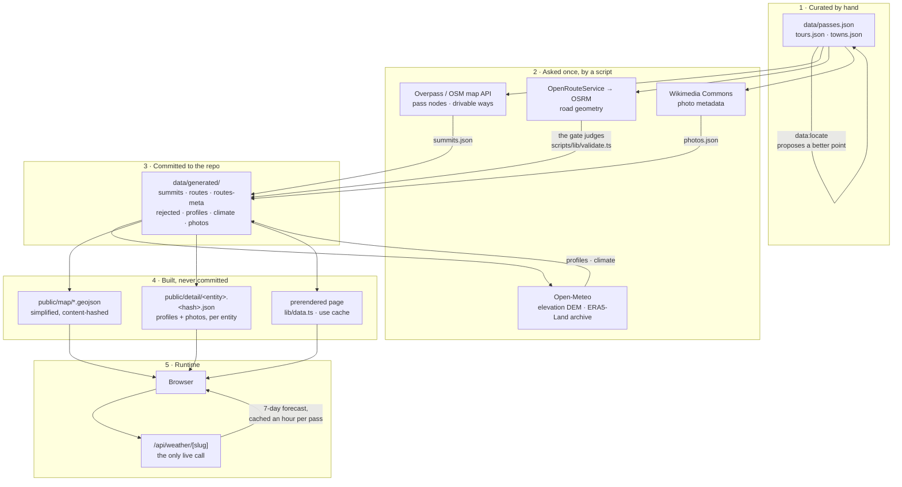
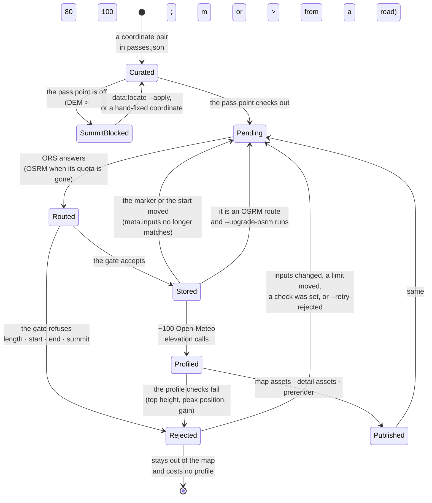

# The data pipeline: where every number comes from

Almost nothing in this app is fetched while somebody looks at it. A handful of
scripts ask a handful of hosts once, judge what comes back, and commit the
answers; the site is then built out of files that are already in the
repository. This document is the map of that journey: which host answers which
question, what its answer is called on disk, and which state a single ascent is
in between "somebody typed a coordinate" and "a line is drawn on the map".

Adjacent documents: [`data-model.md`](./data-model.md) says what the fields
_mean_ and how they are validated, [`architecture.md`](./architecture.md) how
the finished files reach the browser, and [`scales.md`](./scales.md) how the
numbers become a verdict. The `curate-data` skill in `.agents/skills/` is the
hands-on procedure for changing source data.

## The whole pipeline in one picture

Read it as five holding places. Stage 1 is editorial and the only place a human
writes. Stage 2 is the network, and every request in it is made by a script,
never by a browser. Stage 3 is what the repository carries, which is why a
clone builds the whole app offline. Stage 4 is derived on every `dev` and
`build` and git-ignored, because it is a pure function of stage 3. Stage 5 is
the single exception to all of it: the forecast, which cannot be precomputed
because it is about next week.

## The stages, by command

| Command                                       | Run it when                                                 | Asks                                                      | Writes                                                                                   |
| --------------------------------------------- | ----------------------------------------------------------- | --------------------------------------------------------- | ---------------------------------------------------------------------------------------- |
| _(edit by hand)_                              | a pass, tour or town is added or corrected                  | –                                                         | `data/*.json`                                                                            |
| `bun run data:locate [slug…]`                 | the gate blocks a pass, or a marker looks wrong             | Overpass (or OSM map API), Open-Meteo                     | nothing, unless `--apply` moves a coordinate in `data/passes.json`                       |
| `bun run data:build`                          | after any source-data change; resumable, skips what is done | OSM, ORS/OSRM, Open-Meteo                                 | `data/generated/{summits,routes,routes-meta,rejected,profiles,climate}.json`             |
| `bun run data:photos`                         | after adding an entity, or to refresh the slideshow         | Wikimedia Commons                                         | `data/generated/photos.json`                                                             |
| `bun run data:check [--explain]`              | before every commit that touches data; runs in CI           | nothing – offline                                         | nothing; prints errors and warnings                                                      |
| `bun run data:schema`                         | in the same PR as a change to `lib/schema.ts`               | nothing                                                   | `data/schema/*.schema.json`                                                              |
| `bun run scripts/analyze-coverage.ts [slug…]` | before a curation round: where is a base thin?              | Overpass, recorded per query in `scripts/.cache/coverage` | nothing; prints listed roads, candidates and single-sided passes per base and reach band |
| `bun run map:glyphs`                          | only when the font or the glyph ranges change               | the Inter release, fontnik                                | `public/map/fonts` (committed)                                                           |
| `bun dev` / `bun run build`                   | always                                                      | nothing                                                   | `public/map`, `public/detail`, `public/maplibre` (all git-ignored)                       |

The coverage report is how a candidate becomes an entry: it asks Overpass for
every `mountain_pass` and `natural=saddle` node within `REACH_MAX_KM` of a base
that has a paved road within 300 m, matches them against `passes.json` (a node
within 500 m of a marker is that entry) and prints the rest per reach band,
sorted by elevation. A line in that report is read by a human, who writes the
entry with its four scales, its season and its note, runs `data:locate` on the
point and `data:build` on the rest – nothing is imported. The second run is
offline: the answers are cached, `--refresh` asks again.

Three flags of `data:build` matter often enough to name here: `--status` counts
the backlog and what it costs in Open-Meteo calls, `--retry-rejected` asks
again for everything the gate refused, and `--upgrade-osrm` re-routes the
car-profile routes once an `ORS_KEY` is available. `scripts/backfill.sh`
(`bun run data:backfill`) simply runs `data:build` in hourly batches until
nothing is missing.

## Where the facts come from

Every host in stage 2, what it is good at, and what it cannot do. Nothing here
is asked at runtime.

Every request a script makes goes through one seam. `scripts/lib/hosts.ts`
holds one function per question – `ors.route`, `osrm.route`,
`openMeteo.elevation`, `openMeteo.archive`, `overpass.query`, `osmMap.bbox`,
`commons.geosearch`, `commons.search`, `commons.thumbnail`, `github.release` –
and each composes its URL, names the weight the host bills and parses the
answer with a zod schema, so a host's address and its answer shape exist in
that file and nowhere else – the shapes the pure modules measure and rank on
are inferred from those schemas. A row of an answer that cannot be read is
skipped rather than taken for the whole answer: a relation among the OSM nodes
and ways, a Commons file whose image info has no size. The function takes a
`Transport` (`scripts/lib/transport.ts`): the live one keeps a pacer per host
from the `HOSTS` table – the gap, the Open-Meteo budget, `Retry-After`, the
words that say a quota is spent – and is the only `fetch` under `scripts/`;
the fixture one answers from recorded files (`<dir>/<host>/<hash>.json`, keyed
by method, URL and body), and is what the coverage report keeps its cache in.
`scripts/lib/osm.ts` sits on the same seam and decides between Overpass and
the map API.

| Source                                        | Abbreviation                                                                                                                    | Answers                                                             | Format                     | Key / limit                                     | Strong at                                                                                          | Weak at                                                                                                                           |
| --------------------------------------------- | ------------------------------------------------------------------------------------------------------------------------------- | ------------------------------------------------------------------- | -------------------------- | ----------------------------------------------- | -------------------------------------------------------------------------------------------------- | --------------------------------------------------------------------------------------------------------------------------------- |
| **The curator**                               | –                                                                                                                               | name, rating, season, tags, ascent starts                           | JSON by hand               | –                                               | judgement no dataset has: beauty, fame, traffic, why a town is worth a week                        | one person's opinion, and no check can catch a wrong 4                                                                            |
| **OpenRouteService**                          | ORS                                                                                                                             | the road from an ascent start to the pass                           | GeoJSON `LineString`       | `ORS_KEY`, free: 2 000/day, 40/min              | a genuine **road-cycling** profile: takes the Tremola cobbles, the Finestre gravel, car-free roads | 404s on roads its graph rejects; a spent daily quota stops it mid-run                                                             |
| **Open Source Routing Machine** (demo server) | OSRM                                                                                                                            | the same question, car profile                                      | JSON, coordinate list      | no key, 1 request/s, fair use                   | always there, no key, good enough for most alpine roads                                            | a car profile cuts corners a cyclist does not and refuses car-free roads → marked `osrm` in `routes-meta.json` and upgraded later |
| **Open-Meteo Elevation**                      | uses the Copernicus DEM (digital elevation model), GLO-90 ≈ 90 m grid                                                           | the height of up to 100 coordinates at once                         | JSON array                 | no key, weighted quota (see below)              | one request per elevation profile; consistent worldwide                                            | grid noise of a few metres (hence 10 m gain smoothing and an 80 m gate); ~100 billed calls per profile                            |
| **Open-Meteo Archive**                        | ERA5-Land (ECMWF ReAnalysis v5, land surface), 2015–2024                                                                        | daily max/min temperature, snowfall, precipitation                  | JSON series                | no key, ~261 calls per pass                     | ten full years in one request, height-corrected to the pass elevation                              | a ~9 km grid cannot see a single saddle; `snowfall_sum` is fresh snow, not snow lying on the road                                 |
| **Open-Meteo Forecast**                       | –                                                                                                                               | the next 7 days for one pass                                        | JSON                       | no key, 10 000 calls/day shared with the above  | the only thing the app cannot precompute                                                           | the one quota a visitor can spend – hence the hour-long cache and the cooldown                                                    |
| **Overpass API**                              | –                                                                                                                               | `mountain_pass` / saddle nodes near a point, drivable ways under it | JSON (Overpass elements)   | no key, fair use                                | one request covers a batch of 25 points; filtering happens on the server                           | a single host with no SLA – when it is down, curation stops, which is why there is a fallback                                     |
| **OSM map API**                               | OSM = OpenStreetMap                                                                                                             | everything inside a bounding box                                    | JSON (`/api/0.6/map.json`) | no key, fair use                                | it is openstreetmap.org itself: "OSM is down" and "curation is down" become the same outage        | one request per point, megabytes where Overpass sends kilobytes, 400 when the box is too full                                     |
| **Wikimedia Commons API**                     | –                                                                                                                               | photos within 2–2.5 km, author, licence, file page, thumbnail URL   | JSON (`action=query`)      | no key, descriptive User-Agent, serial requests | free, licensed, already rendered on a CDN – no binary enters the repo                              | no editorial eye: signs and maps have to be filtered by name and ranked out; 429s under load; only a fixed ladder of widths       |
| **OpenFreeMap**                               | vector tiles in the OpenMapTiles schema, built from OSM                                                                         | the basemap under everything                                        | PBF vector tiles           | no key                                          | free, no key, planet-wide, and the app paints it in its own palette                                | no SLA and no support; the schema is what it is                                                                                   |
| **AWS Terrain Tiles**                         | Terrarium (elevation encoded in the RGB channels of a PNG)                                                                      | the hillshade                                                       | PNG raster tiles           | no key                                          | relief for free, at every zoom                                                                     | a raster: it cannot follow the colour scheme the way the vector layers do                                                         |
| **Raster alternatives**                       | OSM standard · OpenTopoMap · CyclOSM · Esri World Topo & Imagery · Thunderforest Outdoors · MapTiler Outdoor · Waymarked Trails | optional base layers in the layer popover                           | PNG/JPEG raster tiles      | keys only for Thunderforest and MapTiler        | familiar cartography, satellite imagery                                                            | no dark mode, no palette control; two of them need a key that the deployment may not have                                         |
| **Inter** (rsms/inter release)                | SDF = signed distance field, the atlas format MapLibre draws text from                                                          | the map's own glyphs                                                | PBF glyph ranges           | –                                               | map and panels share one face; no font server to wait for                                          | rasterised ahead of time, so a new range means running `map:glyphs` again                                                         |

Links out to quaeldich.de, Komoot, Google Maps and OpenStreetMap appear in the
detail panel, but nothing is ever fetched from them: they are destinations for
the reader, not sources for the app.

## What ends up on disk

| File                                 | Key                                   | Written by            | Format                               | In git | Read by                                    |
| ------------------------------------ | ------------------------------------- | --------------------- | ------------------------------------ | ------ | ------------------------------------------ |
| `data/passes.json`                   | `slug`                                | a human               | array of `Pass`                      | yes    | everything                                 |
| `data/tours.json`                    | `slug`                                | a human               | array of `Tour`                      | yes    | everything                                 |
| `data/towns.json`                    | `slug`                                | a human               | array of `Town`                      | yes    | everything                                 |
| `data/generated/summits.json`        | `<pass-slug>`                         | `data:build`          | `{ dem, roadDist, lat, lon }`        | yes    | the gate, `data:check`, `data:locate`      |
| `data/generated/routes.json`         | `<pass-slug>:<i>`, `tour:<tour-slug>` | `data:build`          | `[lat, lon][]`                       | yes    | map assets, profiles, `data:check`         |
| `data/generated/routes-meta.json`    | as `routes.json`                      | `data:build`          | `{ source, fetchedAt, inputs }`      | yes    | the retry rules, `data:check`              |
| `data/generated/rejected.json`       | as `routes.json`                      | `data:build`          | reasons + measured values + `inputs` | yes    | the retry rules, `data:check`, the curator |
| `data/generated/profiles.json`       | `<pass-slug>:<i>`                     | `data:build`          | `dist`, `ele`, gain, gradients       | yes    | detail assets, valley heights              |
| `data/generated/climate.json`        | `<pass-slug>`                         | `data:build`          | 24 half-months × 5 values            | yes    | the status heuristic, the climate chart    |
| `data/generated/photos.json`         | `pass-<slug>` · `tour-…` · `town-…`   | `data:photos`         | URL, author, licence, blur data URI  | yes    | detail assets                              |
| `data/schema/*.schema.json`          | –                                     | `data:schema`         | JSON Schema                          | yes    | the editor                                 |
| `public/map/routes.<hash>.geojson`   | –                                     | `build-map-assets`    | GeoJSON, simplified to 5 m           | no     | MapLibre                                   |
| `public/map/style-{light,dark}.json` | –                                     | `build-map-style`     | MapLibre style                       | no     | a style editor, not the app                |
| `public/map/fonts/**`                | –                                     | `map:glyphs`          | SDF glyph ranges                     | yes    | MapLibre                                   |
| `public/detail/<entity>.<hash>.json` | –                                     | `build-detail-assets` | profiles + photo metadata            | no     | the detail panel                           |

The rule behind the "In git" column: a file is committed when producing it
costs an API call, and derived when producing it costs only CPU. That is why
`routes.json` is in the repository and the simplified GeoJSON next to it is
not.

## The life of one ascent

An ascent is one entry in a pass's `ascents` array, and it travels through the
build as one key (`<pass-slug>:<index>`). These are the states it can be in;
`bun run data:build --status` counts how many keys sit in each.

Two of those arrows are the ones that are easy to get wrong, so they are worth
saying in words:

- **A route is pending when its question changed, not only when it is
  missing.** `meta.inputs` hashes what the route was fetched _for_ – the
  ascent's start, the marker, its elevation, its `check`. Move a coordinate and
  the hash stops matching, so the next `data:build` routes it again by itself
  instead of leaving a geometry that ends at the old marker.
- **A rejection is retried exactly when the outcome could differ**: its inputs
  changed, or its stored metrics would pass today's limits (because a limit
  moved or an `ascent.check` was added). Otherwise the router would give the
  same answer and the run would only rewrite a timestamp.

A tour (`tour:<slug>`) runs through the same states, measured against the tour
limits instead of the ascent limits, and earns no elevation profile. A pass's
`summits.json` entry is a state above all of this: while it fails, every ascent
of that pass stays blocked, which is the whole point – a marker that is 300 m
out in height is not on the road, and every route to it would end short and
every profile paid for it would be wasted.

## What a run costs

Routing is effectively free: ~180 ORS requests for the whole dataset against
2 000 a day. Open-Meteo is the constraint, and it bills weighted **calls**
rather than requests – one call per location per 14 days per 10 variables:

| Request                         | Weighted calls | Fits in one free hour (5 000) |
| ------------------------------- | -------------- | ----------------------------- |
| One elevation profile (100 pts) | ~100           | ~45 after the default budget  |
| One climate series (10 years)   | ~261           | ~19                           |
| One 7-day forecast              | 1              | –                             |

`OPEN_METEO_BUDGET` (default 4 500) stops a run before the hourly window does;
whatever is left is picked up by the next one. `scripts/backfill.sh` drains a
large backlog in hourly batches, and `.github/workflows/refresh-data.yml` runs
the same thing on a push to `data/*.json` and commits the result. There is
deliberately no schedule on that workflow: nothing in the pipeline is
time-varying – the climate window is frozen at 2015–2024 – so a cron could
structurally never find work once the backlog is drained.

The forecast is the one quota a visitor can spend, and the arithmetic that
keeps 201 passes inside the free tier is in
[`architecture.md`](./architecture.md#the-one-dynamic-route-lives-inside-a-free-tier-and-the-numbers-are-in-the-file).

## Where to look when something is wrong

| Symptom                                          | Look at                                                                                          |
| ------------------------------------------------ | ------------------------------------------------------------------------------------------------ |
| A pass has no line on the map                    | `rejected.json` for its key, then `bun run data:check --explain`                                 |
| `data:check` errors on a stored route            | the route was hand-edited or a limit moved; re-measure with `--explain`, then `--retry-rejected` |
| Every ascent of one pass is missing              | the summit gate: `summits.json`, then `bun run data:locate <slug>`                               |
| A route looks like a car detour                  | `routes-meta.json` says `osrm`; re-run with `ORS_KEY` and `--upgrade-osrm`                       |
| Profiles are missing after a successful run      | the Open-Meteo budget ran out – `--status`, then run again or use `data:backfill`                |
| The climate chart is empty for a new pass        | `climate.json` has no entry yet; one run costs ~261 calls                                        |
| A photo is wrong or missing                      | `bun run data:photos --only <slug> --refresh`                                                    |
| The map draws nothing at all after a fresh clone | `public/map` is git-ignored; `bun dev` regenerates it                                            |

## Glossary

| Term             | Means                                                                                                                     |
| ---------------- | ------------------------------------------------------------------------------------------------------------------------- |
| **ORS**          | OpenRouteService – the router with a road-cycling profile                                                                 |
| **OSRM**         | Open Source Routing Machine – the public demo server, car profile, used as the fallback                                   |
| **OSM**          | OpenStreetMap – the map database both routers and Overpass are built on                                                   |
| **Overpass**     | a query API over OSM data; asks for elements matching a filter inside a radius                                            |
| **DEM**          | digital elevation model – a height grid. Here: Copernicus GLO-90 via Open-Meteo, and Terrarium tiles for the hillshade    |
| **ERA5-Land**    | the ECMWF reanalysis of the land surface: modelled weather for every day since 1950, ~9 km grid                           |
| **The gate**     | `scripts/lib/validate.ts` – measures a geometry, judges it against `LIMITS`, and decides `routes.json` or `rejected.json` |
| **`inputs`**     | a hash of what a stored route was fetched for; a mismatch makes it as pending as a missing route                          |
| **Half-month**   | the app's unit of time. `10` = early October, `10.5` = late October, 24 in a year                                         |
| **Content hash** | the file name of a derived asset is a hash of its content, so it can be cached forever and can never go stale             |
| **SDF**          | signed distance field – how MapLibre stores glyphs so labels stay sharp at any size                                       |
| **PBF**          | protocol-buffer binary format – vector tiles and glyph ranges                                                             |
