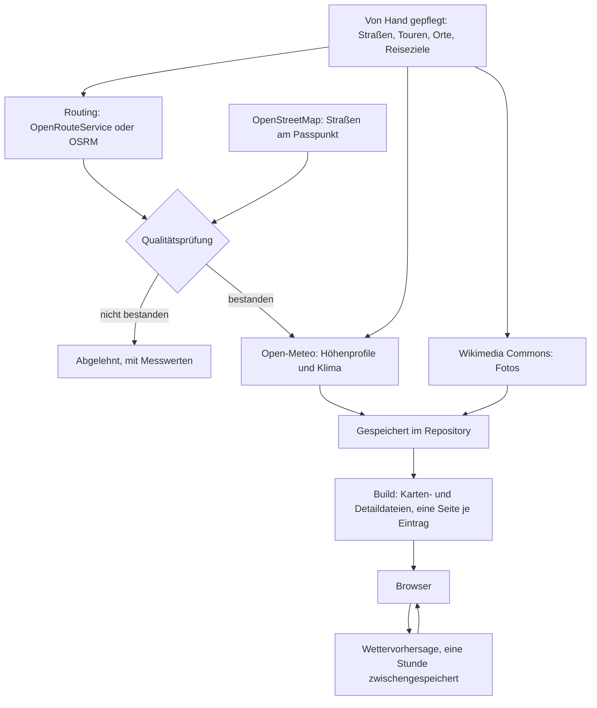

# Der Weg der Daten

Fast nichts wird abgefragt, während du die Karte ansiehst: Skripte fragen
die Quellen einmal, prüfen die Antworten und legen sie im Repository ab. Nur
die Wettervorhersage kommt live.

## Das Ganze in einem Bild

Die Daten liegen an fünf Stellen hintereinander: von Hand gepflegt, einmal
abgefragt, im Repository gespeichert, beim Build abgeleitet und schließlich
im Browser. Nur der erste Schritt ist Handarbeit, und nur die
Wettervorhersage wird abgefragt, während jemand die Karte benutzt.

## 1. Von Hand gepflegt

Vier Dateien beschreiben Straßen, Rundtouren, Orte und Reiseziele: Namen,
Koordinaten von Passpunkt und Auffahrtsbeginn, Bewertungen, Belag,
Öffnungsfenster, Notizen, bei Reisezielen Kreis und Texte (was genau, steht
unter [Woher die Daten kommen](data-sources.md)). Hier schreibt ein Mensch,
sonst nirgends.

## 2. Einmal abgefragt

Ein Skript (`data:build`) liest diese Dateien und fragt die Quellen nach dem,
was noch fehlt – und nur danach. Was schon gespeichert ist, wird nicht noch
einmal abgerufen.

- **Passpunkt prüfen.** Zuerst wird für jeden Pass geprüft, ob der
  eingetragene Punkt stimmt: Das Geländemodell muss dort höchstens 80 m von
  der eingetragenen Höhe abweichen, und eine befahrbare Straße muss höchstens
  100 m entfernt sein. Fällt ein Passpunkt durch, bleiben alle Auffahrten
  dieses Passes gesperrt, bis er korrigiert ist – jede Strecke dorthin würde
  sonst neben der Straße enden. Ein Hilfsskript (`data:locate`) schlägt dafür
  einen besseren Punkt aus OpenStreetMap vor.
- **Routen.** Für jede Auffahrt und jede Rundtour berechnet ein
  Routing-Dienst den Straßenverlauf – auf Asphalt mit einem Rennrad-, auf
  ungeteerten Straßen mit einem Mountainbike-Profil.
- **Prüfen** (nächster Abschnitt).
- **Höhenprofil.** Nur für Strecken, die die Prüfung bestanden haben, werden
  rund 100 Höhenpunkte bei Open-Meteo abgefragt.
- **Klima.** Für jeden Pass einmal die zehnjährige Klimareihe.
- **Fotos.** Ein eigenes Skript (`data:photos`) holt die Angaben zu den Fotos
  von Wikimedia Commons.

Open-Meteo erlaubt nur eine begrenzte Zahl von Abfragen pro Stunde. Ein Lauf
hört deshalb vor der Grenze auf, und der nächste macht dort weiter.

Jede gespeicherte Strecke merkt sich, wofür sie berechnet wurde: Start,
Passpunkt und dessen Höhe, bei ungeteerten Straßen auch das Profil. Wird eine
Koordinate verschoben oder der Belag geändert, passt die Strecke nicht mehr
dazu, und der nächste Lauf berechnet sie von selbst neu, statt eine Linie
stehen zu lassen, die beim alten Punkt endet.

## Die Qualitätsprüfung der Strecken

Keine Strecke kommt ungeprüft auf die Karte. Für eine Auffahrt gilt heute:

| Prüfung        | Grenze                                                                      |
| -------------- | --------------------------------------------------------------------------- |
| Länge          | höchstens 60 km                                                             |
| Start          | höchstens 2 km vom eingetragenen Beginn der Auffahrt                        |
| Ende           | höchstens 500 m vom Passpunkt                                               |
| höchster Punkt | höchstens 80 m von der Passhöhe entfernt und im letzten Viertel der Strecke |
| Höhenmeter     | höchstens 3.000 m                                                           |

Die ersten drei Prüfungen brauchen nur den Straßenverlauf, die letzten
beiden das Höhenprofil. Eine Rundtour darf höchstens 15 % von ihrer von Hand
eingetragenen Länge abweichen, und ihre Enden müssen höchstens 2 km vom
ersten und letzten Wegpunkt liegen. Höhen-, Balkon- und Talstraßen führen
nicht auf einen Gipfel zu und werden deshalb gemessen wie eine Tour.

Was durchfällt, landet mit den gemessenen Werten und den Gründen in einer
Liste abgelehnter Strecken. Es erscheint nicht auf der Karte, und eine
Strecke, die schon am Straßenverlauf scheitert, kostet kein Höhenprofil.
Heute betrifft das eine Handvoll Auffahrten. Für einen begründeten
Sonderfall – etwa eine Straße, die unterhalb des Gipfels endet – kann eine
einzelne Auffahrt eine weitere Grenze bekommen, immer mit einer
schriftlichen Begründung.

Messen und Beurteilen sind getrennt. Jede Strecke behält ihre Messwerte,
deshalb lässt sich eine geänderte Grenze an allen Strecken ausprobieren,
ohne eine einzige Abfrage zu stellen. Eine abgelehnte Strecke wird nur dann
neu angefragt, wenn sich ihre Eingaben geändert haben oder sie die
heutigen Grenzen bestehen würde – sonst käme dieselbe Antwort zurück.

Die Grenzen stehen in `LIMITS` in
[scripts/lib/validate.ts](../../../scripts/lib/validate.ts); wie die Prüfung
im Einzelnen funktioniert, erklärt [data-model.md](../../data-model.md)
(englisch).

## 3. Gespeichert und geprüft

Die Antworten – Passpunkt-Prüfung, Strecken, abgelehnte Strecken,
Höhenprofile, Klima, Fotoangaben – werden im Repository gespeichert. Die
Regel dahinter: Was eine Abfrage bei einem fremden Dienst kostet, wird
gespeichert; was sich aus Gespeichertem ausrechnen lässt, wird bei jedem
Build neu erzeugt. Deshalb lässt sich die ganze App ohne Netz bauen.

Nach jeder Änderung an den Daten läuft `data:check`, von Hand und in der
automatischen Prüfung des Repositorys, ohne eine einzige Abfrage. Es prüft,
ob jede Datei ihrem Schema entspricht, ob alle Verweise stimmen (etwa ob
jede Tour nur Pässe nennt, die es gibt) und ob Strecken und Profile
vollständig sind. Bei den Reisezielen warnt es, wenn ein empfohlener Ort
außerhalb des Kreises liegt oder eine Korrektur nur wiederholt, was der Kreis
schon sagt, und es listet die Straßen, die in keinem Reiseziel liegen.
Außerdem misst es jede gespeicherte Strecke neu und hält sie gegen die
heutigen Grenzen. Eine gespeicherte Strecke, die durchfällt, ist ein Fehler;
eine abgelehnte oder nur mit OSRM berechnete ist eine Warnung.

## 4. Beim Build abgeleitet

Beim Bauen der Seite entsteht, was der Browser tatsächlich lädt:

- **Die Kartendatei**: alle Strecken, auf 5 m vereinfacht, als GeoJSON.
- **Eine Detaildatei je Straße, Tour und Ort**: Höhenprofile und
  Fotoangaben. Sie wird erst geladen, wenn du den Eintrag öffnest.
- **Die fertige Seite**: Hier wird unter anderem der Status aller Straßen und
  Touren für alle 24 Halbmonate einmal berechnet. Weil die Schwellen im Code
  stehen und sich ändern können, wird der Status nicht gespeichert, sondern
  bei jedem Build neu ermittelt. Ebenso entsteht hier, welche Straßen, Touren
  und Orte zu welchem Reiseziel gehören, und die Umrandung, mit der die Karte
  es zeigt.
- **Eine Seite je Eintrag**: Jeder Pass, jede Tour, jeder Ort und jedes
  Reiseziel bekommt eine eigene Adresse (`/pass/…`, `/tour/…`, `/ort/…`,
  `/ziel/…`), auf Deutsch und unter `/en` auf Englisch, jeweils mit eigenem
  Titel und Vorschaubild zum Teilen.

Die Namen der Karten- und Detaildateien enthalten eine Prüfsumme ihres
Inhalts. Ändert sich der Inhalt, ändert sich der Name – deshalb dürfen
Browser und Server sie beliebig lange zwischenspeichern.

## 5. Im Browser

Der Browser lädt die fertige Seite und die Kartendatei, beim Öffnen eines
Eintrags dessen Detaildatei. Direkt bei den Anbietern holt er die
Kartenkacheln (OpenFreeMap, das Relief und gegebenenfalls eine andere
Grundkarte) und die Fotos von Wikimedia.

Die einzige Abfrage, deren Antwort nicht schon beim Build feststeht, ist die
**Wettervorhersage**. Sie läuft über den Server der App, der Open-Meteo
fragt und die Antwort je Pass eine Stunde lang zwischenspeichert. So bleibt
die Zahl der Anfragen auch bei vielen Besuchern im kostenlosen Rahmen von
Open-Meteo. Schlägt eine Anfrage fehl, legt der Server eine Pause ein,
statt es bei jedem Besucher neu zu versuchen. Fehlt für einen Tag ein
einzelner Wert, zeigt die Vorhersage dort einen Strich.

## Mehr dazu

- [data-pipeline.md](../../data-pipeline.md) (englisch): jede Quelle, jeder
  Befehl, die Zustände einer Auffahrt und was ein Lauf kostet.
- [data-model.md](../../data-model.md) (englisch): was jedes Feld bedeutet und
  was die Qualitätsprüfung misst.
- [architecture.md](../../architecture.md) (englisch): wie die fertigen
  Dateien in den Browser kommen und wie die Wetterabfrage im kostenlosen
  Rahmen bleibt.
