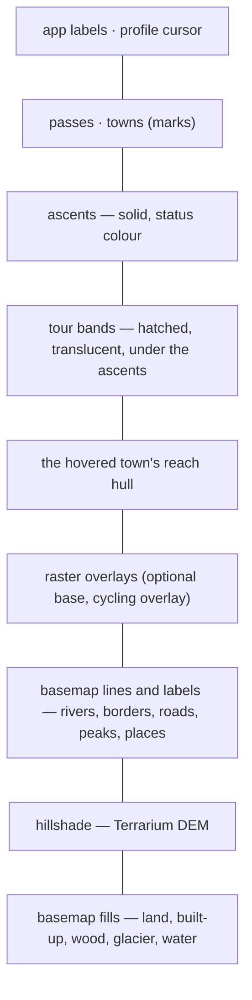
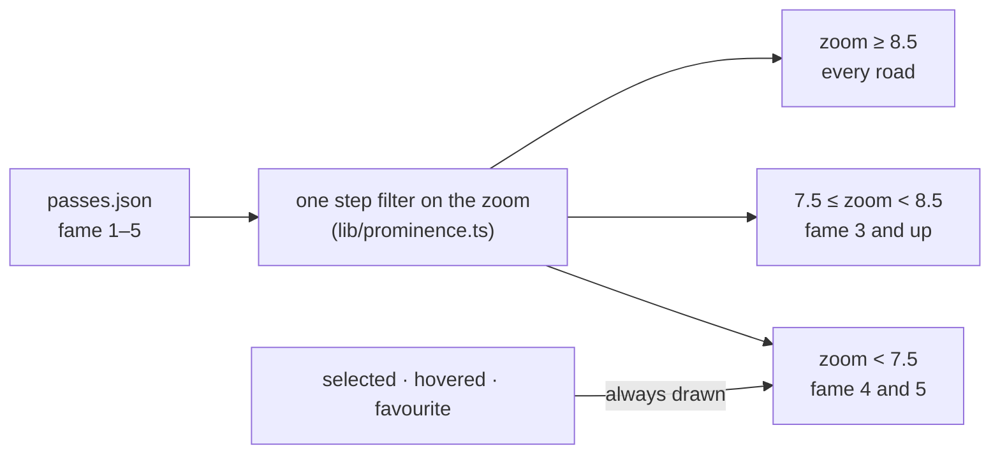
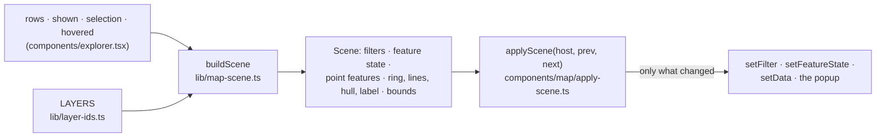
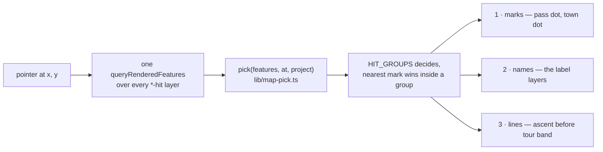

# Map rendering

MapLibre is the page, so its rules are load-bearing: what the camera does when
a selection arrives, what is drawn and in which order, what answers the
pointer, where the colours come from and which two workarounds the library
needs. `AGENTS.md` links to each section and keeps the one-line version.

The panels in front of the map are described in
[`ui-conventions.md`](./ui-conventions.md); why the geometry arrives as static
files rather than as props is in [`architecture.md`](./architecture.md).

## The camera

### The padding is never set on its own

What the panels cover reaches MapLibre as camera padding, and padding is not a
passive margin: the centre is drawn in the middle of the _padded_ box, so
`setPadding` – a `jumpTo` – moves the picture by half of what changed. On a
phone that is the detail sheet's 55 % of the screen in one frame, a jump at the
start of every selection. So a selection carries the new padding into its own
flight (one movement instead of a jump and a movement, which is also why a pass
or a tour is framed with `cameraForBounds` + `flyTo` rather than `fitBounds`:
that one drops the padding before it flies, and the frame has to be measured
against where the camera lands – `fitInset` in `lib/map-camera.ts`), and a
padding change with no camera move behind it – a sheet dragged to another snap
point, the sidebar folding away – eases in. Only the first padding is set
outright, before the map has drawn a frame that could jump. Which is also the
rule while a flight is in the air: it owns the padding until it lands. The
panels can ask for another one meanwhile – a sheet dragged to a different snap
point, a phone's toolbar changing the viewport height by four pixels – and
easing to it there would cut the flight short a frame before it arrived, so
what is still owed is applied on `moveend` instead. The panel claims its share
one commit _before_ the camera sets off, which is what keeps that opening
still: a padding the map has not applied yet cannot move it.

What the padding is _made_ of is a second question, and it has one answer:
`shellGeometry` (`lib/shell-geometry.ts`), a pure `(bars, viewport, sheet,
panels) → { inset, vars }` with its own unit tests. The same numbers
feed the camera and, as the `--shell-*` custom properties `vars` carries, the
Tailwind classes the panels and the season card are laid out with – so a panel
width exists once rather than twice, and `sheetCover` converts Base UI's two
ways of spelling a snap point plus the drawer's own `--drawer-inset`, which is
measured off a mounted popup (`useSheetInset`) rather than copied out of a
generated file.

What the map asks the _device_ is one prop as well: `MapEnvironment`
(`lib/use-media-query.ts`) carries the colour scheme, whether the pointer is
coarse, whether motion is unwanted and whether the shell is the phone one.
`appLayers` takes it as an argument, which is what finally makes it the pure
function its doc comment always claimed; a scheme change is a re-render rather
than a listener the map registers on its own, and `window.matchMedia` appears
nowhere else.

None of that is a property of the padding: it is a property of what the camera
is doing at the moment the padding changes. So the rules are one transition
table, `camera(state, event, env) → [state, commands]` in `lib/map-camera.ts`,
and `pass-map.tsx` only turns what happens – a selection, a new inset, a shared
link, `moveend`, the delay timer, the style parsing – into events and hands the
commands to `applyCamera` (`components/map/apply-camera.ts`), the one place the
MapLibre camera methods are called. A whole selection is therefore a list of
events in a unit test, with no WebGL in sight, which is where the traces below
are pinned (`lib/map-camera.test.ts`).

| State        | Event                    | → State    | Commands                        |
| ------------ | ------------------------ | ---------- | ------------------------------- |
| `cold`       | `intent`                 | `cold`     | –                               |
| `cold`       | `inset`                  | `cold`     | – (collected for the first one) |
| `cold`       | `ready`                  | `idle`     | `setPadding`, `fitBounds`¹      |
| `idle`       | `ready` (not yet fitted) | `idle`     | `fitBounds`¹                    |
| `idle`       | `inset`                  | `idle`     | `easeTo` unless `sameInset`     |
| `idle`       | `moveend`                | `idle`     | `writeHash`                     |
| `idle`       | `selection`              | `awaiting` | `schedule`                      |
| `awaiting`   | `inset`                  | `awaiting` | – (the flight will carry it)    |
| `awaiting`   | `moveend` (not by hand)  | `awaiting` | – (an older flight landing)     |
| `awaiting`   | `moveend` (by hand)      | `idle`     | `cancel`, `writeHash`           |
| `awaiting`   | `selection`              | `awaiting` | `cancel`, `schedule`            |
| `awaiting`   | `delay`                  | `flying`   | `flyTo`²                        |
| `flying`     | `inset`                  | `flying`   | – (the flight owns the padding) |
| `flying`     | `selection`              | `awaiting` | `schedule`                      |
| `flying`     | `moveend`                | `idle`     | `writeHash`                     |
| `flying`     | `moveend` (padding owed) | `settling` | `easeTo`                        |
| `settling`   | `moveend`                | `idle`     | `writeHash`                     |
| any but cold | `requestedView`          | `idle`     | `cancel`³, `jumpTo`             |

¹ Only with nothing in the link to open on, and only once there is something to
frame. ² With `easeTo` instead when the map has no frame and no point for the
selection – what it cannot frame still owes the panel its space. ³ Only when a
flight was scheduled.

The last row is a hash pasted into an open page and nothing else: the hash the
page opened on reaches the machine as the `intent`, never as a `requestedView`
(`load` in `lib/app-state.ts`). Both at once would cancel the very flight the
link's own selection scheduled.

Two of those rows are bugs that the shape of the thing prevents rather than
fixes. A flight for A landing inside B's delay window settles nothing, so it
can no longer ease A's leftover padding into the flight B is about to make; and
the hash is written once per settled flight rather than once per frame the
camera came to rest on.

### The panel opens with the tap; the camera follows it

Selecting answers a question about a pass, not about the map, so `DetailPanel`
gets the selection in the same frame as the map's layers, the highlighted row
and the hash (`selection` and `last` in `lib/app-state.ts`, two values: what is
selected and what the leaving sheet keeps showing). The flight is the slower half:
`pass-map.tsx` leaves the panel `SELECT_DELAY` to draw and then takes
`SELECT_MS` – longer than the 500 ms it was, because nothing waits behind it
any more – to get there. It ran the other way round first: the map flew and the
panel opened on arrival. The reason was real – the panel is the most expensive
thing the app draws (the photo slideshow, the elevation profiles with a polygon
per sample, the climate chart with recharts behind it), and on a phone-sized
viewport drawing it into a flight cost that flight about a third of its frame
rate – but the cure put a wait in front of the answer to buy a smooth camera
movement, which is the wrong way round. Opening first and moving after keeps
the two out of each other's frames just as well, and what waits is now the half
nobody asked for. Everything that is still on its way when the panel opens
keeps its own height while it waits, so nothing below it ever jumps: the
profile skeleton has the drawing's aspect ratio (`PROFILE_ASPECT`) and the
chart's `next/dynamic` placeholder its height (`CHART_HEIGHT`, a module of its
own so the placeholder does not import recharts). The selected row is put into
view without a smooth scroll in the sheet layout: the detail drawer is usually
in front of the list when it happens, so it would animate a list nobody can see
against the drawer animation that can be seen.

### A selection is framed, not centred

What makes a pass worth a holiday is the road up to it, and both sides of a
traverse are what "over the Galibier" means, so selecting one fits the box of
all its ascents (`passBounds`, precomputed next to `tourBounds` in
`lib/map-assets.ts`) instead of centring on the marker – `PASS_MAX_ZOOM` keeps
a short climb from filling the screen with two hairpins, and a pass the map
draws no ascent for falls back to its point. The box has to fit between the
shell's two bars, which are translucent but no less opaque to a reader: the
header's and the season bar's measured heights are the map's top and bottom
padding at every width (`useHeight` in `components/shell.tsx`; on desktop the
bar is
a card and its gap from the edge counts too). On a phone the detail sheet takes
55 % of the screen on top of that, and it is the larger of the two at the
bottom that counts. All of it is one calculation, `shellGeometry` in
`lib/shell-geometry.ts`.

### The map opens on the home range

With nothing in the link the map opens on the frame around what it draws –
but of the home range only (`HOME_RANGE` in `lib/regions.ts`, the Alps), not
of everything. The Alps and the Pyrenees are 600 km apart, and a first
screen that held both would show neither: the alpine dots would be a smear
at zoom 5. So `buildScene` carries two boxes, `bounds` around everything
drawn – what the fit button frames, pressed on purpose – and `opening`
around the home range's roads and loops, which is what `onReady` in the
camera fits (plan 26). A loop is at home where its passes are
(`TourRow.range`), the one definition `data:check` and the frame guard read
too; with nothing of the home range drawn, a Pyrenees chip pressed say, the
opening frame is what is drawn. `lib/default-frame.test.ts` holds every
range's own frame to a readable zoom at a laptop's viewport under the
sidebar, so a range whose roads spread too far to read fails the build
rather than the visitor. The other ranges are reached through their chip,
the search and a shared link; a link carrying a range chip opens fitted to
what it lists, like every link without a camera.

## What is drawn

Bottom to top, and because MapLibre places labels from the top of the style
down, this is also the collision priority: a pass label wins against a town
name, and both win against the basemap's own place names.

### A tour holds its ascents; it does not sit beside them

A tour _is_ the union of several ascents – the Sellaronda is its four passes –
so it is drawn as what it is: a band wide enough to hold them, laid _under_ the
ascents so it reaches past them on both sides. What a tour contains is then
read from the map rather than from the list, which a mark running alongside the
ascents cannot say. The band is translucent, so the hillshade and the roads
keep showing through something that covers this much ground, and hatched rather
than solid, so it is told apart from an ascent by texture and not only by
weight – the looser of the two marks, which is the right order, since the
ascent is the rated thing and keeps the solid line and the opaque status
colour. `DASH` counts in multiples of the line width, so on a band this wide
the numbers have to be well below 1: widen the band and the dashes lengthen
with it unless they come down to match, and long dashes on a wide line read as
a chain of blocks rather than as a texture.

### Translucent lines need `line-layer-opacity`, not `line-opacity`

MapLibre draws a line as one triangle strip, so a bend tighter than the line is
wide runs the strip over itself. `line-opacity` is applied per feature, so
every such overlap composites twice and a switchback fills with blotches;
`line-layer-opacity` (MapLibre GL JS 6+) flattens the layer to a single surface
first and composites that once, which is what makes a translucent line usable
in a hairpin at all. It is data-constant – zoom and global state only, no
feature state – so anything per-feature has to be carried by width or colour
instead. `line-gap-width` has a second, purely geometric failure in the same
bends, folding its inner side inside out; there is no property that fixes that
one, so offset lines stay out. Widths interpolate with the zoom and grow again
for the selected tour; because a zoom expression may only be the input of the
_outermost_ stop function, the selection case goes inside the stops
(`tourWidth`) – the same reason the pass hit radius is one `interpolate` with a
`max` per stop rather than a `max` around one.

### The overview draws by fame, the list draws everything

Two hundred dots read at zoom 7; four hundred would not, and the file is
heading there (`docs/plans/24-depth-per-destination.md`). So the pass dots have
a level of detail: a `step` on `["zoom"]` – the one place a MapLibre filter may
read the zoom – with a fame floor per level (`PROMINENCE` in
`lib/prominence.ts`), on the dot layer and on its hit layer, so a hidden pass
does not answer the pointer either. It is a level of detail and not a filter:
the list is untouched, no chip carries it, and the line in the map's bottom
corner says which level is showing ("Bei dieser Zoomstufe: bekannte Pässe"),
falling silent once everything is drawn. What the visitor put on the map or is
pointing at ignores the rule – a selected dot is always drawn, a favourite is
a star at every zoom, and the hovered pass is drawn again from the one-feature
hover source (`hover-mark`), so a row hovered in the list never rings an empty
patch of map. The labels keep their own, older ladder; a dot always appears
before its name. The lines are not thinned: an ascent is a few pixels wide and
reads as texture where a dot would read as noise.

## What the map draws is a value

The map draws a value, not the result of a handful of effects. `buildScene`
takes the three lists of rows, the "auf der Karte" switches, the selection and
the hover and returns one `Scene`: which ascents and tours the filters let
through, the feature state of each of them, the pass and town features with
the properties the style paints from, the hover surfaces – the ring, the wider
lines, the reach hull and the label – and the box a fit frames. It is pure, so
what the map shows is tested without a WebGL context (`lib/map-scene.test.ts`).

`applyScene` is the only place `setFilter`, `setFeatureState` and `setData` are
called, the sibling of `applyCamera` and the same shape: a host, a value and no
decisions of its own. It hands MapLibre the difference between the scene it
applied last and the one it has now, because a scene is rebuilt on every render
and a `setData` on a source of two hundred points re-tiles it in the worker – a
hover that changes nothing has to cost nothing, which a recording host pins
down in `components/map/apply-scene.test.ts`. An id that leaves the scene needs
no write: its line is filtered out, and when the filter lets it through again
it is missing from the applied scene and written in full.

One hover, therefore, for both halves of the screen. The map's pointer reports
what it is over and paints nothing itself; the row in the list reports the same
way, and both are answered by the same scene – which is why a town hovered in
the list now outlines what it reaches, as one hovered on the map always did.
The label points at the entity rather than at the pointer: a hit on an ascent
is a hit on its pass, so it stands where the ring does, and a tour, which has
no point of its own, is labelled at the centre of its box. On a coarse pointer
there is no label at all – a finger that touches a mark has already tapped it,
and a popup under it would cover what was just tapped.

Every layer id lives in `LAYERS` (`lib/layer-ids.ts`): per kind the mark, the
names beside it and the transparent hit layer, with the pass labels generated
from the same fame ladder the style builds them from. The style, the applier,
the pick and the e2e read that one table, so a layer renamed or a sixth fame
level added cannot quietly stop answering the pointer.

## What answers the pointer is not what is drawn

A pass dot is a few pixels across and an ascent line 3.5 wide, so every kind
carries a transparent hit layer over its mark (`*-hit` in `appLayers`): a disc
per point, a wide line per route, sized from the pointer – about 44 px on
touch, half of that with a mouse – and never narrower than the mark plus a
margin. A name is part of its mark: the label layers answer the pointer too.
Because several layers answer for the same pixel, there is no handler per
layer: the map runs one `queryRenderedFeatures` over all of them and asks
`pick` which single entity a hover or a click means. `pick` decides over plain
records – a layer id, a slug, a point – and a `project` function, so the rule
behind every click is tested without a map (`lib/map-pick.test.ts`).
`HIT_GROUPS` spells the priority out rather than taking it from the style,
because the two disagree – marks before names before lines, and the tour band
lies _under_ the ascents but reaches past them, so a click inside it hits both
and the ascent is the more specific answer – and within a group the mark
nearest the pointer wins. An ascent is answered as its pass: the hit's kind
comes from the layer that answered, and the route layers belong to a pass. A
hit layer needs the same filter as the layer it widens, or a hidden tour still
answers, which is why both carry the same scene field. The hover popup is a
label, not a target: it is suppressed on a coarse pointer and click-through
everywhere (`app/globals.css`).

## Colours and the basemap

### Colours only via tokens

MapLibre cannot read CSS variables; the map reads them once via
`getComputedStyle` (`readColors` in `components/map/app-layers.ts`, the module
that holds every paint expression). Add new map colours there rather than
hard-coding them.

What is painted before there is a document to read – the generated basemap
style, and the icons, the share image and the manifest in `lib/brand.ts` –
cannot do that, so `TOKENS` in `lib/palette.ts` carries the tokens as sRGB and
everything outside the document reads that one table. It is a copy, and a copy
is only allowed to exist while something says when it has stopped being one:
`bun run palette` (`scripts/check-palette.ts`, inside `bun run lint`) converts
every `oklch()` in `app/globals.css` and fails on a difference. The two copies
that preceded it – one in `lib/palette.ts`, one in `lib/brand.ts` – had drifted
from the stylesheet and from each other over every token they shared, which is
the whole argument for the check. The rest of `PALETTE` is the basemap's own
tones (land, water, wood, roads, its labels): chosen against the tokens, not
derived from them, and so not part of the comparison.

### The basemap is generated, and it follows the OS scheme

The default base is a vector style painted from the app's own palette
(`lib/basemap.ts`, colours in `lib/palette.ts`), tiles from OpenFreeMap, no
key. Layer stack, bottom to top: the basemap's fills (land, built-up, wood,
glacier, water), the hillshade from the Terrarium DEM, the basemap's lines and
labels (rivers, borders, roads from zoom 6 to minor roads at 11, road names at
12, lakes, peaks with elevation at 10, places), the raster overlays, then the
app's own layers (the hovered town's reach, the tour bands, the ascents on top
of them, towns, passes, labels, profile cursor). MapLibre places labels from
the top of the style down, so that order is also their collision priority: a
pass label wins against a town name, and both win against the basemap's own
place names. Roads are thin and neutral and there are no POIs: the mountain
roads that matter are the app's lines, and the status and tour colours are what
should dominate. Labels prefer `name:de`. The raster alternatives (OSM,
OpenTopoMap, CyclOSM, Esri, satellite) stay in the layer popover; a raster base
is one layer below the hillshade. Switching base or scheme never rebuilds the
map: `applyBase` (`components/map/app-layers.ts`) swaps only the layers whose id starts with
`base`, and a `prefers-color-scheme` change re-reads the tokens, repaints the
icons and sets every paint property of the app's layers again from the same
`appLayers` definition the style was built from – camera, sources, filters and
feature state stay. Glyphs are served from `public/map/fonts`: the Latin ranges
of Inter, the UI's own face, rasterised once into MapLibre's glyph atlases by
`scripts/build-glyphs.ts` and committed – so map and panels share one family,
the hermetic e2e suite renders labels and the map has no font server to wait
for; `scripts/build-map-style.ts` writes the same style as two standalone JSON
files for tuning in a style editor.

## MapLibre needs two workarounds

Its web worker is resolved via `import.meta.url`, which Turbopack does not
serve, so `scripts/copy-maplibre-worker.ts` copies the worker into
`public/maplibre` (git-ignored, runs before `dev` and `build`) and
`pass-map.tsx` calls `setWorkerUrl`. And computed CSS custom properties come
back as `lab()`, which MapLibre cannot parse; `toRgb` in
`components/map/app-layers.ts` converts them through a canvas pixel before they
reach the style.
