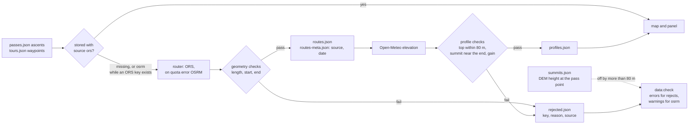

# 00 · Route quality gate

**Status:** proposed · **Effort:** S (half a day of code, plus waiting for API
quota) · **Depends on:** – · **Unblocks:** 01, 12, and trust in the map in
general

## Goal

No routed ascent or tour is stored unless it passes plausibility checks, every
route records which router produced it, and the routes that are wrong today
are re-fetched. Tours stop being drawn as straight lines between waypoints.

## Why now

- All 9 tours and 83 of 171 ascents have no route. The only refresh run so far
  made one OpenRouteService request, received "Quota exceeded" and stopped
  routing for the whole run; `scripts/build-data.ts` has no fallback for that
  case and the workflow runs only twice a day.
- 11 stored ascents are wrong and nothing catches them. Examples, stated summit
  vs. profile top: Col du Mont Cenis ascent 1 is routed over 271 km
  (2,081 m vs 2,723 m); Roßfeld-Panoramastraße reaches 703 m instead of
  1,560 m; Kitzbüheler Horn 1,596 m instead of 1,996 m; Col des Champs ascent 0
  is a 5 km stub ending at 1,730 m instead of 2,087 m; Col de la Colombière
  ascent 0 ends at the pass point but 340 m too low, which points at a wrong
  summit coordinate rather than a wrong route.
- The script never revisits an existing key and does not record whether a route
  came from ORS (road-cycling profile) or the OSRM demo (car profile), so a bad
  OSRM route is frozen forever.
- A wrong route also burns Open-Meteo budget on a useless profile.

## Non-goals

Official closure data, traffic from OSM, difficulty from the profile: all
separate roadmap items.

## The mechanism in one picture

### Before


### After



What the checks look at, for one ascent:

```
 elevation
   ▲                                        top within 80 m of pass.elevation
   │                                 ●──●   and inside the last 15 % of the distance
   │                           ●──●──┘
   │                     ●──●──┘
   │               ●──●──┘
   │         ●──●──┘
   │   ●──●──┘
   └───┼───────────────────────────────┼────► distance, at most 60 km
     start within 2 km              end within 500 m
     of ascent.from                 of the pass coordinate
```

Life of one route key:

```
missing ──fetch──► candidate ──checks pass──► stored (source: ors | osrm)
                       │                            │
                  checks fail                  osrm, and an ORS key is present
                       ▼                            ▼
              rejected (reason) ──fix coordinates or --retry-rejected──► missing
```

## Design

### Provenance without changing the route shape

Keep `routes.json` as `{ key: [lat, lon][] }` so nothing downstream changes.
Add `data/generated/routes-meta.json`:

```jsonc
{
  "col-du-galibier:0": {
    "source": "ors",
    "fetchedAt": "2026-09-08",
    "km": 17.2,
  },
}
```

`source` is `"ors"` or `"osrm"`. Entries without meta are treated as `"osrm"`
(the pessimistic assumption for everything fetched before this plan).

### Checks

Run after routing, before the write, and again after the profile:

| Check                           | Ascent                           | Tour                                                |
| ------------------------------- | -------------------------------- | --------------------------------------------------- |
| Length                          | ≤ 60 km                          | ≤ 1.2 × sum of straight waypoint legs, and ≤ 900 km |
| Start                           | ≤ 2 km from `ascent.from`        | ≤ 2 km from first waypoint                          |
| End                             | ≤ 500 m from the pass coordinate | ≤ 2 km from the last waypoint                       |
| Profile top vs `pass.elevation` | within 80 m                      | –                                                   |
| Position of the highest sample  | in the last 15 % of the distance | –                                                   |
| Elevation gain                  | ≤ 3,000 m                        | –                                                   |

A failing route is not stored. The reason goes to
`data/generated/rejected.json` as `{ key: { reason, source, at } }` so the
next run does not retry blindly, `data:check` can list it, and a human can tell
a routing problem from a coordinate problem. `bun run data:build --retry-rejected`
clears the list and tries again (for example after fixing coordinates in
`passes.json`, or once an ORS key is available).

### Summit sanity

Once per pass, fetch the DEM elevation of the pass coordinate itself
(Open-Meteo elevation, 92 calls in total) and warn when it differs from
`pass.elevation` by more than 80 m. This is the check that catches Colombière-
style errors where the summit point is off. Store results in
`data/generated/summits.json` so it costs nothing on later runs.

### Quota behaviour

- When ORS reports "Quota exceeded", continue with OSRM for the remaining
  jobs, tagged `source: "osrm"`, instead of stopping. The gate makes this
  safe enough; the upgrade step below fixes the profile difference later.
- When an ORS key is present and `meta.source === "osrm"`, re-route those keys
  first (bounded by the daily quota; ~40 requests per minute).

### check-data

- Error, not warning: any stored route that fails the checks above (uses
  `profiles.json` where needed). This makes the 11 known-bad routes fail CI
  until they are re-fetched or their source coordinates are fixed.
- Warning: routes with `source: "osrm"` when an ORS key could upgrade them.
- Keep "Route fehlt" a warning until the backlog is gone, then promote it (see
  plan 11).

## Steps

1. Add `routes-meta.json`, `rejected.json`, `summits.json` handling to
   `scripts/build-data.ts` (read at start, write with the same chained
   `write()`).
2. Implement `validateAscentRoute()` / `validateTourRoute()` /
   `validateProfile()` as pure functions in `scripts/lib/validate.ts` so plan
   10 can unit-test them with the 11 known-bad fixtures.
3. Wire the checks into `route()` → `doProfile()`; on rejection delete any
   partial profile.
4. Add the OSRM fallback on `QuotaExhausted` from ORS and the OSRM→ORS upgrade
   pass.
5. Add the summit check with its own cache file.
6. Extend `scripts/check-data.ts` with the error/warning rules above.
7. Delete the 11 known-bad keys from `routes.json` and `profiles.json`, run
   `bun run data:build` with an ORS key, review the log, fix coordinates in
   `passes.json` for the ones that fail again, commit data and generated files
   together.
8. Run the workflow by hand until `data:build --status` reports nothing
   missing; then shorten the schedule to once a day.

### Documentation

Move the "after" flowchart and the ascent sketch into `docs/data-model.md`
("Derived data"), and the check table into the `curate-data` skill, so the
gate is explained where the data is edited and where a rejected route is
diagnosed.

## Acceptance criteria

- `bun run data:check` fails on any route that violates the table above.
- All 9 tours and all ascents with valid coordinates have routes; the map
  shows no straight-line tours.
- `routes-meta.json` has an entry for every route; no entry says `osrm` while
  an ORS key was available during the run.
- The summit check reports zero passes off by more than 80 m, or each one has a
  fixed coordinate.
- `docs/data-model.md` shows the gate as a diagram and the `curate-data`
  skill lists the checks with their thresholds.

## Risks and open questions

- Some ascents legitimately end below the summit marker (e.g. Kitzbüheler Horn
  ends at the Alpenhaus). Decide per case: move the pass coordinate to the end
  of the road, or add `ascent.end` as an optional override. Prefer the former.
- ORS cycling-road may refuse private toll roads (Roßfeld, Kitzbüheler Horn).
  If both routers fail, keep the ascent without a route rather than with a
  wrong one; the panel already handles "Kein Höhenprofil vorhanden".
