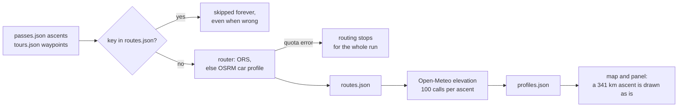
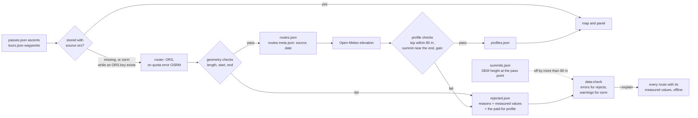

# 00 · Route quality gate

**Status:** in progress · **Effort:** S (half a day of code, plus three hourly
runs to drain the backlog) · **Depends on:** – · **Unblocks:** 01, 12, and
trust in the map in general

## Goal

No routed ascent or tour is stored unless it passes plausibility checks, every
route records which router produced it, and the routes that are wrong today
are re-fetched. Tours stop being drawn as straight lines between waypoints.

Second goal, of equal weight: the checks must be **tunable**. A gate whose
thresholds cannot be revisited cheaply gets loosened until it catches nothing.

## Why now

- All 9 tours and 94 of 171 ascents have no route. The only refresh run so far
  made one OpenRouteService request, received "Quota exceeded" and stopped
  routing for the whole run; `scripts/build-data.ts` had no fallback for that
  case.
- 11 stored ascents were wrong and nothing caught them. Stated summit vs.
  profile top: Col du Mont Cenis ascent 1 routed over 341 km (+642 m,
  6,274 Hm); Roßfeld-Panoramastraße 857 m too low; Kitzbüheler Horn 400 m too
  low; Col des Champs ascent 0 a 5 km stub 357 m too low; Col de la Colombière
  ascent 0 at the pass point but 343 m too low, which points at a wrong summit
  coordinate rather than a wrong route.
- The script never revisited an existing key and did not record whether a route
  came from ORS (road-cycling profile) or the OSRM demo (car profile), so a bad
  OSRM route was frozen forever.
- A wrong route also burns Open-Meteo budget on a useless profile.

### What the numbers actually are

Three corrections to the earlier draft, all measured rather than assumed:

- **The bottleneck is elevation, not weather.** `climate.json` is complete
  (92 of 92 passes) and its window is frozen (`CLIMATE_FROM`/`CLIMATE_TO` =
  2015-01-01…2024-12-31), so it contributes nothing to the backlog. The
  expensive call is the Copernicus DEM lookup for the height profile:
  100 Open-Meteo calls per ascent.
- **The hourly cap binds before the daily one.** Open-Meteo allows 5,000
  calls/h and 10,000/day, so a run can place at most ~50 profiles and the
  default `OPEN_METEO_BUDGET=4500` is already sized just under that ceiling.
  The 9,492 outstanding calls are therefore **three runs an hour apart**, not
  a multi-day affair.
- **Routing is free and fits in one shot.** 103 ORS requests against a free
  quota of 2,000/day is 5 % of one day, about five minutes of wall clock.
  Ascents are two waypoints (one request); the longest tour has 37 waypoints
  and still fits in ORS's 50-coordinate chunk, so tours are one request each.

| Step                                      | Requests | Open-Meteo calls | Limit               |
| ----------------------------------------- | -------- | ---------------- | ------------------- |
| 94 missing + 9 tour routes                | 103 ORS  | –                | 2,000/day           |
| 11 re-fetched after the gate removed them | 11 ORS   | –                |                     |
| 94 elevation profiles (tours have none)   | –        | 9,400            | 5,000/h, 10,000/day |
| 92 summit heights                         | –        | 92               | one batch           |
| Climate                                   | –        | 0 (complete)     |                     |

## Non-goals

Official closure data, traffic from OSM, difficulty from the profile: all
separate roadmap items. Self-hosting a router is not in scope either; the
`OSRM_HOST` environment variable is the one affordance left behind for it
(see "Risks and open questions").

## The mechanism in one picture

### Before



### After



What the checks look at, for one ascent:

```
 elevation
   ▲                                        top within 80 m of pass.elevation
   │                                 ●──●   and inside the last 25 % of the distance
   │                           ●──●──┘
   │                     ●──●──┘
   │               ●──●──┘
   │         ●──●──┘
   │   ●──●──┘
   └───┼───────────────────────────────┼────► distance, at most 60 km
     start within 2 km              end within 500 m
     of ascent.from                 of the pass coordinate
```

Life of one route key:

```
missing ──fetch──► candidate ──checks pass──► stored (source: ors | osrm)
                       │                            │
                  checks fail                  osrm, and an ORS key is present
                       ▼                            ▼
              rejected (reasons + metrics + profile)
                       │
        ┌──────────────┼───────────────────┐
        ▼              ▼                   ▼
  fix coordinates  set ascent.check   change a limit in validate.ts
  in passes.json   with a note        then --retry-rejected
        └──────────────┴───────────────────┘
                       ▼
                    missing
```

## Design

### Measuring and judging are separate

This is the piece that makes the thresholds tunable, and it is the main
departure from the first draft. `scripts/lib/validate.ts` has two kinds of
function and no I/O at all:

- `ascentMetrics()` / `tourMetrics()` / `withProfile()` produce **numbers**:
  length, distance from the intended start, distance from the summit, deviation
  of the profile top, where the highest sample sits, elevation gain.
- `checkAscent()` / `checkTour()` compare those numbers against `LIMITS`.

Because judging is a pure function of stored numbers, re-judging the entire
dataset against a changed limit is a local computation.
`bun run data:check --explain` prints every route with its measured values and
marks the ones that violate a limit — offline, in milliseconds, without a
single API call. Changing a threshold and seeing what it would do is free.

### Provenance without changing the route shape

`routes.json` stays `{ key: [lat, lon][] }` so nothing downstream changes.
`data/generated/routes-meta.json` records provenance only:

```jsonc
{ "col-du-galibier:0": { "source": "ors", "fetchedAt": "2026-09-08" } }
```

`source` is `"ors"` or `"osrm"`; an entry without meta counts as `"osrm"`, the
pessimistic assumption for everything fetched before this plan. Metrics are
deliberately **not** cached here — they are recomputed from `routes.json` on
demand, so a hand-edited geometry cannot hide behind stale meta.

### What a rejection keeps, and why

`data/generated/rejected.json`:

```jsonc
{
  "col-du-mont-cenis:1": {
    "reasons": [
      "Länge 341.44 km > 60 km",
      "Profilhöhe weicht +642 m ab > 80 m",
    ],
    "metrics": {
      "km": 341.44,
      "startDist": 0.025,
      "endDist": 0.019,
      "topDelta": 642,
      "peakAt": 0.505,
      "gain": 6274,
    },
    "source": "osrm",
    "hash": "3f1ab29c",
    "firstSeen": "2026-09-08",
    "lastSeen": "2026-09-08",
    "profile": {},
  },
}
```

Three deliberate choices:

- **The measured values are kept, the geometry is not.** Tuning needs the
  numbers, and the geometry is free to fetch again (ORS routing costs nothing
  against the quota). Keeping thousands of coordinates per reject in git would
  buy nothing.
- **The elevation profile _is_ kept.** That is the only expensive part, so
  loosening a threshold and running `--retry-rejected` spends **zero**
  Open-Meteo calls: the route is re-fetched for free and the cached profile is
  reused, guarded by `hash` so a changed geometry gets a fresh profile.
- **`firstSeen` plus `hash`, not a run counter.** A counter would rewrite the
  file on every run and produce a diff even when nothing changed. The age
  (`data:check` prints "abgewiesen seit … (N Tage)") is the signal that a human
  has to fix a coordinate, and an unchanged `hash` on a retry says outright
  that the router is not the problem.

### Checks

Run after routing, before the write, and again after the profile:

| Check                                | Limit                               | Fitted how                                                  |
| ------------------------------------ | ----------------------------------- | ----------------------------------------------------------- |
| Ascent length                        | ≤ 60 km                             | max legitimate 35 km, failures at 60.4/66.3/341 km          |
| Ascent start                         | ≤ 2 km from `ascent.from`           | the ORS snapping radius, so router and gate agree           |
| Ascent end                           | ≤ 500 m from the pass coordinate    | max observed 250 m                                          |
| Profile top vs `pass.elevation`      | within 80 m                         | clean gap: good ≤ 50 m, bad ≥ 123 m                         |
| Position of the highest sample       | in the last 25 %                    | worst genuine failure 65 %, tightest correct ascent 81 %    |
| Elevation gain                       | ≤ 3,000 m                           | max legitimate 2,363 Hm, the broken one 6,274 Hm            |
| Tour length vs the curated `tour.km` | within 15 %                         | seven tours within ±7 %, two sparse ones at +29 % and +37 % |
| Tour start/end                       | ≤ 2 km from the first/last waypoint | –                                                           |
| DEM height at the pass point         | within 80 m                         | same DEM noise as the profile top                           |

The thresholds were **fitted to the 88 routes that already existed**, not
chosen first. That run initially flagged 12 ascents; the twelfth (Grimselpass
ab Gletsch, highest sample at 81 % of a 6 km climb) was a false positive, which
is why the position check sits at 75 % rather than the 85 % of the first draft.
The remaining 11 are exactly the known-bad set.

Tour length is checked against the hand-maintained `tour.km` — those figures
come from the events themselves (Marmotte 174 km, Ötztaler 227 km) — instead of
against a ratio to the straight waypoint legs. That ratio measures how densely a
tour happens to be sampled, not whether its route is right.

### Exceptions, with a note

Some ascents legitimately break a limit: the Kitzbüheler Horn road ends at the
Alpenhaus, below the summit marker. `Ascent.check` and `Tour.check`
(`RouteCheck` in `lib/types.ts`) widen a single limit for a single entry:

```jsonc
{
  "from": {},
  "label": "Kitzbühel",
  "check": {
    "maxTopDelta": 420,
    "note": "Straße endet am Alpenhaus unter dem Gipfel",
  },
}
```

`note` is mandatory and `data:check` errors without it. Without this escape
hatch the gate would stay permanently red and the thresholds would get loosened
globally to silence it — which is the failure mode this plan exists to prevent.

### Quota behaviour

- ORS and OSRM now have their own limiters and both exist for the whole run.
  When ORS reports "Quota exceeded" the run **continues** on OSRM, tagged
  `source: "osrm"`, instead of stopping.
- When an ORS key is present and `meta.source === "osrm"`, those keys are
  re-routed; if the fallback returns OSRM again, the stored route is kept
  rather than pointlessly rewritten.
- A route is stored as soon as its **geometry** passes, before the profile is
  paid for, so a run cut short by the Open-Meteo budget keeps its free routing
  work. The profile checks of the next run can still take it back out.

### check-data

- **Error:** any stored route that fails the checks (recomputed from
  `routes.json` + `profiles.json`, no network).
- **Error:** any entry in `rejected.json`, with its age and the three ways out.
- **Error:** a `check` without a `note`.
- **Warning:** routes with `source: "osrm"` when an ORS key could upgrade them.
- **Warning:** a summit whose DEM height is off by more than 80 m.
- Keep "Route fehlt" a warning until the backlog is gone, then promote it
  (see plan 11).

### The workflow is a backlog drainer, not a refresher

Nothing in the pipeline is time-varying: the climate window is frozen, and
routes and profiles only change when `data/*.json` changes. The twice-daily
cron existed solely to work around the Open-Meteo hourly cap. Once the backlog
is drained a scheduled run structurally cannot find work — its own header says
"Runs with nothing missing finish in seconds and commit nothing".

`refresh-data.yml` therefore drops the cron and triggers on `push` to
`data/*.json` plus `workflow_dispatch`. The path filter covers the source files
only, so the bot's own commit to `data/generated/**` cannot retrigger it. A real
schedule becomes justified again with the live closure status, which is a
different job with a different cadence.

## Steps

1. ✅ `scripts/lib/validate.ts`: metrics, `LIMITS`, `checkAscent`,
   `checkTour`, `checkSummit`, `geometryHash` — pure, no I/O.
2. ✅ `scripts/lib/validate.test.ts` on plan 10's suite (`bun test lib` picks it
   up by path): the 11 known-bad ascents and the nine routed tours as fixtures,
   so a limit that stops catching one of them fails the build.
3. ✅ Fit the thresholds against the existing 88 routes before writing the gate,
   so they separate the known-good from the known-bad rather than being round
   numbers.
4. ✅ `routes-meta.json`, `rejected.json`, `summits.json` in
   `scripts/build-data.ts`, written through the same chained `write()`.
5. ✅ Wire the gate into routing → profile; on rejection remove any partial
   route and profile and cache the profile for a free retry.
6. ✅ Separate ORS and OSRM limiters, OSRM fallback on `QuotaExhaustedError`, and the
   OSRM→ORS upgrade pass.
7. ✅ The summit check with its own cache file (one batch, 92 calls).
8. ✅ `check-data.ts`: the error/warning rules above and `--explain`.
9. ✅ Remove the 11 known-bad keys from `routes.json` and `profiles.json` so the
   backfill re-fetches them through the gate.
10. ✅ `scripts/backfill.sh` plus `bun run data:build --pending`, so the three
    hourly runs are one command.
11. ✅ `refresh-data.yml`: push trigger instead of the cron.
12. ✅ First backfill run (OSRM only, no key in the environment): 143 of 180
    keys routed and stored, 37 refused, 92 summit heights fetched. Every stored
    route passes every check – the gate refused everything that did not.
13. ✅ Fix the pass coordinates the summit check found: 13 of the 23 are moved
    onto the pass (see below). Ten are left.
14. ⬜ Upgrade the provisional OSRM routes to ORS and let the moved coordinates
    take effect in one pass:
    `ORS_KEY=… bun run data:backfill --upgrade-osrm --retry-rejected`
    (≈ 139 routes, ≈ 14 000 Open-Meteo calls ≈ 4 hourly runs).
15. ⬜ Decide the remaining ten coordinates once ORS has routed them.

### What the first run found

The DEM height at the pass coordinate and the routed profile agree, independently,
that **23 of 92 pass coordinates are wrong** – far more than the 11 bad routes
this plan started from. Jaufenpass is the clearest: the route reaches the stated
coordinate (18 m away), the DEM there reads 1 873 m, the profile top reads
1 873 m, and `passes.json` says 2 094 m. The route is right and the coordinate is
221 m too low. The same signature repeats as `endDist` rejections where _both_
ascents of a pass end at the identical distance from the stated point (Allos
1.04 km, Colombière 515 m, Croix de Fer 506 m) – two different roads cannot be
wrong by the same amount, so the point they are measured against is.

### Fixing the coordinates

OSM settles most of them. A single Overpass query for `mountain_pass=yes` and
`natural=saddle` nodes within 4 km of each suspect coordinate returned a node
carrying the pass's own name for 13 of the 23, and three independent sources
agree on every one: the node's name, its `ele` tag against the curated
elevation (Δ 0–35 m), and the Copernicus DEM at the proposed point (Δ 1–29 m,
against 100–670 m at the old point). The elevations were right throughout –
that is precisely what made the comparison decisive – so only coordinates moved.

Hahntennjoch was 4 km out, Passo Duran and Passo Staulanza 2–3.6 km, the rest
0.3–3 km. Moving a coordinate invalidates two things, both handled: the cached
DEM height in `summits.json` is dropped so the next run re-measures it, and the
stored route now ends up to 3.9 km from the pass, which `data:check` reports as
an implausible stored route until the upgrade re-routes it.

The remaining ten split in two:

- **Four are real passes** whose node lay outside the 4 km radius (Col des
  Champs, Col de la Couillole, Colle Fauniera, Colle San Carlo). A wider query
  finds them.
- **Six are not passes at all** but toll and summit roads – Roßfeld, Villacher
  Alpenstraße, Nockalmstraße, Malta-Hochalmstraße, Ötztaler Gletscherstraße,
  Kitzbüheler Horn – so OSM has no node to look up and the coordinate has to be
  the high point of the _road_. These are deliberately left until ORS has routed
  them: the OSRM car profile refuses or truncates most of them (Roßfeld tops out
  at 703 m of 1 560 m), so the stored geometry says nothing about where the road
  really ends. Once the cycling profile has driven them, the profile top names
  the high point, and whatever still disagrees is a case for `ascent.check`
  rather than a moved coordinate.

Three defects the first run exposed, all fixed:

- `gate()` logged `Route: …` even when it was only re-judging geometry that came
  out of `routes.json`, which read as fresh routing and made an OSRM-only run
  look like an ORS failure. It now logs only what it actually fetched, and no
  longer restamps `routes-meta.json` with today's date for a route it did not
  fetch.
- A route stored from the OSRM fallback while an ORS key exists is provisional by
  construction, yet its profile was fetched anyway – 100 Open-Meteo calls on a
  road the upgrade pass will replace. Profiles for such routes are now deferred
  until the geometry is final.
- `--pending` reported 0 while every stored route was still a car route, so
  `backfill.sh` finished with "Nichts mehr offen". It now says plainly that the
  data is provisional and names the upgrade command.

### Documentation

- ✅ The "after" flowchart and the ascent sketch move into `docs/data-model.md`
  ("Derived data").
- ✅ The check table with its thresholds goes into the `curate-data` skill, so
  it is next to the data it constrains.
- ✅ `AGENTS.md` / `CLAUDE.md` gain the gate under "Where things live".

## Acceptance criteria

- [x] `bun run data:check` fails on any route that violates the table above.
- [x] `bun run data:check --explain` prints every route's measured values
      without network access, so a threshold change can be evaluated for free.
- [x] `bun run data:build --retry-rejected` re-tries rejected keys and spends no
      Open-Meteo calls when the geometry comes back unchanged.
- [x] A `check` without a `note` is an error.
- [ ] All 9 tours and all ascents with valid coordinates have routes; the map
      shows no straight-line tours.
- [ ] `routes-meta.json` has an entry for every route; no entry says `osrm`
      while an ORS key was available during the run.
- [ ] The summit check reports zero passes off by more than 80 m, or each one
      has a fixed coordinate.
- [x] `docs/data-model.md` shows the gate as a diagram and the `curate-data`
      skill lists the checks with their thresholds.
- [x] The 11 known-bad ascents are unit-test fixtures, so loosening a limit past
      them fails the build.

The four open boxes all depend on step 12, which needs an ORS key.

## Risks and open questions

- Some ascents legitimately end below the summit marker (Kitzbüheler Horn ends
  at the Alpenhaus). Decide per case: move the pass coordinate to the end of the
  road, or set `ascent.check` with a note. Prefer the former; the escape hatch
  exists so the decision can wait without the gate going red forever.
- ORS cycling-road may refuse private toll roads (Roßfeld, Kitzbüheler Horn).
  If both routers fail, the ascent keeps no route rather than a wrong one; the
  panel already handles "Kein Höhenprofil vorhanden".
- **The tour threshold was fitted against OSRM car routes**, since no tour had
  a route of its own: seven of nine land within ±7 % of their stated distance,
  Sellaronda at +37 % and Maratona lang at +29 % because their waypoints are too
  sparse to pin the loop down. Re-confirm the 15 % once ORS has routed them, and
  expect those two to need denser waypoints rather than a wider limit.
- **A second router as a cross-check** is the strongest quality signal
  available and is not built here. Two independent routers agreeing on length
  and endpoint says more than any threshold, and it is self-calibrating.
  `OSRM_HOST` makes a locally built OSRM bike graph usable
  (`osrm-extract -p bicycle.lua` over the 2.2 GB Geofabrik Alps extract, ~11 GB
  RAM, one Docker afternoon), but note that the stock `bicycle.lua` is a
  commuter profile that likes tracks and gravel — it needs surface penalties
  before it is a fair second opinion. Worth a scratch experiment, not worth
  putting in CI.
