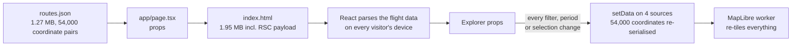
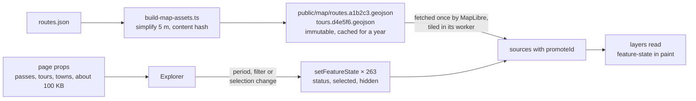

# 01 · Map data out of the React payload

**Status:** proposed · **Effort:** M · **Depends on:** 00 (for complete data;
the plan itself works with partial data) · **Unblocks:** 02, 07

## Goal

The start page stops shipping route geometry as React props. MapLibre loads
geometry as static GeoJSON files and the app updates status, selection and
favourite state through feature state instead of re-serialising every source
on every change.

## Why now

Measured on the deployed build (identical to `main`):

| What ships on first load   | Size                                       |
| -------------------------- | ------------------------------------------ |
| Start page HTML            | 1.95 MB raw, 422 KB gzipped                |
| RSC payload embedded in it | 1.57 MB, of which `routes.json` is 1.27 MB |
| Coordinate pairs inlined   | 54,083                                     |
| MapLibre chunk             | 1.37 MB raw, 390 KB gzipped                |

React parses the routes once as flight data; then `components/map/pass-map.tsx`
re-serialises all four sources into GeoJSON on every filter, period or
selection change (`setData` on `passes`, `routes`, `tours`, `towns`). Once the
92 missing routes arrive (plan 00) the payload roughly doubles. Holiday
planning happens on hotel Wi-Fi and phones; this is the biggest lever.

## Non-goals

Changing how passes, tours and towns themselves reach the client (they are
small); lazy loading of profiles and climate (optional phase 4).

## The mechanism in one picture

### Before



### After



What travels when:

```
                  before                                after
first load        HTML 1.95 MB (422 KB gz)              HTML about 250 KB
                                                        + routes.geojson about 350 KB gz, cacheable
period change     4 × setData, 54,000 coordinates       263 × setFeatureState
select a pass     4 × setData                           2 × setFeatureState (old and new)
```

## Design

### Build step

`scripts/build-map-assets.ts`, run before `dev` and `build` next to the
MapLibre worker copy, reads `data/generated/routes.json` and writes:

- `public/map/routes.<hash>.geojson`: one `LineString` per ascent with
  `properties: { id: "col-du-galibier:0", pass: "col-du-galibier", ascent: 0,
name, label }`.
- `public/map/tours.<hash>.geojson`: one `LineString` per tour with
  `properties: { id: slug, name, color, km, elevationGain }`; tours without a
  routed geometry are omitted rather than drawn as straight lines.
- `lib/generated/map-assets.ts` exporting the two URLs (the hash is the first 8
  characters of a SHA-256 of the file content, so the files are immutable and
  cacheable forever; `public/map` is git-ignored like `public/maplibre`).

Simplify lines with Douglas–Peucker at 5 m tolerance before writing (about 40
lines of code; no dependency). Measure the reduction and record it in the PR.

### Map sources

```ts
routes: { type: "geojson", data: ROUTES_URL, promoteId: "id" },
tours:  { type: "geojson", data: TOURS_URL,  promoteId: "id" },
```

`passes` and `towns` stay in-memory GeoJSON sources fed from props: they are
small, and their symbol layers need real properties (icon image for stars,
label filters by fame), which feature state cannot drive.

### Feature state

After the sources report `sourcedata` with `isSourceLoaded`, and on every
change of `passes` / `selection` / `hiddenTours`, set per feature:

```ts
map.setFeatureState({ source: "routes", id }, { status, selected, hidden });
map.setFeatureState({ source: "tours", id }, { selected, hidden });
```

Paint expressions read `["feature-state", "status"]`; hidden lines get
`line-opacity: 0` and the click handler ignores features whose state says
`hidden`. Feature state resets when a source reloads, so re-apply it in the
`sourcedata` handler. 263 `setFeatureState` calls are negligible; the current
full `setData` of 54,000 coordinates is not.

Filtered-out passes: today their ascent lines disappear because the routes
source is rebuilt from `passRows`. With feature state, set `hidden: true` on
their routes instead.

### What the client still needs from geometry

- `Nearby` in the detail panel checks tour proximity by walking tour geometry.
  Precompute `data/generated/nearby.json` at build (plan 11, item 7) and drop
  the `routes` prop from `DetailPanel`.
- `fitToVisible` extends bounds with tour geometry. Use the tour bounding boxes
  stored in the GeoJSON properties (`bbox` per feature) instead; read them via
  `map.querySourceFeatures` or keep a tiny `tours-bbox` map in
  `lib/generated/map-assets.ts`.
- Plan 07 needs sample coordinates for the profile cursor; it stores them in
  the profile, not in the route.

### Loading behaviour

Passes render at once from props; ascents and tours appear when MapLibre has
fetched the files (parsed in its worker, off the main thread). No spinner is
needed; the current behaviour already draws lines a moment after the markers.

## Steps

1. Write `scripts/build-map-assets.ts` with simplification and hashing; wire it
   into the `dev` and `build` scripts; add `public/map` to `.gitignore`.
2. Add `promoteId` sources and switch the paint expressions in `pass-map.tsx`
   to feature state; keep the old `setData` path behind a flag for one PR so
   the two can be compared visually.
3. Implement the feature-state effect with `sourcedata` re-application.
4. Remove the `routes` prop from `Explorer`, `DetailPanel` and `PassMap`;
   replace `Nearby`'s geometry walk with the precomputed list.
5. Measure: HTML size, RSC size, time to interactive on a throttled profile
   (Playwright trace or Lighthouse), and the size of the GeoJSON files before
   and after simplification. Put the numbers in the PR.
6. Optional phase: move `profiles` and `climate` to per-pass JSON under
   `public/data/pass/<slug>.json`, fetched when a pass is selected. With plan
   02 this becomes unnecessary because the detail is server-rendered per slug.

### Documentation

Put the "after" flowchart into the README section "Architecture in three
sentences" (which then needs a fourth sentence about map assets) and update
the map row in `AGENTS.md` to mention feature state and `public/map`.

## Acceptance criteria

- Start page HTML under 250 KB raw with all routes present.
- No `setData` call on period change or selection change; only feature state.
- Ascent lines, tour lines, hover popups and click selection behave as before,
  including hidden tours and filtered passes.
- Hash restoration with a selected tour still fits the tour bounds.
- README and `AGENTS.md` describe the asset pipeline with the diagram.

## Risks and open questions

- `promoteId` needs unique ids per source; the ascent key already is one.
- Feature-state-driven opacity keeps hidden features hit-testable; the click
  handler must check the state (or use `setFilter` with the hidden list, which
  is cheap for 9 tours).
- Vercel serves `public/` with `Cache-Control: public, max-age=0, must-revalidate`
  by default; the content hash in the filename is what makes long caching safe.
  Add a `headers()` rule in `next.config.ts` for `/map/:path*` with
  `max-age=31536000, immutable`.
