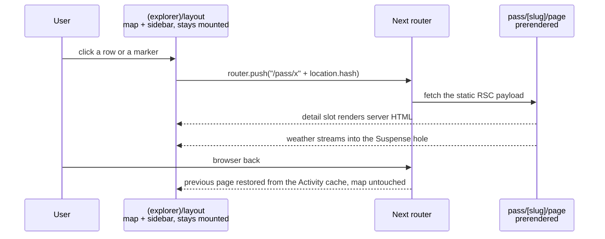

# 02 · Real routes instead of the hash

**Status:** done (September 2026) – the explorer as a layout, one prerendered
route per pass, tour, town and destination (`/pass`, `/tour`, `/ort`,
`/ziel`) with title, description and share image, the address-bar adapter
pushing the selection and reading it back, the weather streamed into the pass
route's Suspense hole with `connection()` in front (so a build asks
Open-Meteo for nothing), the API route gone, old `#pass=` links moved over,
the sitemap. Deviations, on purpose: one dynamic segment `[kind]/[slug]`
rather than three folders, so the metadata and the share image are written
once; no `dynamicParams = false`, which Cache Components refuse – an unknown
path is `notFound()`; the pushed entries are counted in `sessionStorage`
through the storage adapter's own table (`pushed` in `STORAGE`), so a reload
keeps the count; `WeatherSlot` holds pass A's forecast back while pass B's
route is still on its way; the panel's prose is not rendered on the
server – the model reads the half-month, the hover and the detail file, and
rendering it a second time would cost a second model for text the route's
description already carries; the rows stay buttons (the adapter pushes) rather
than links · **Effort:** L · **Depends on:** 01 (smaller payload
first, otherwise every prerendered route carries the geometry), 28 and 33
(the router is an adapter swap rather than a rewrite: the selection is a
reducer case either way) · **Unblocks:** 08, per-entity share previews,
search traffic

## Goal

Every pass, tour, town (and later destination) has its own URL that is
prerendered, has its own title and Open Graph image, works with the browser
back button, and renders the detail panel on the server with the weather
streamed in. Camera, period and filters stay client-side in the hash.

## Why now

- `lib/hash-adapter.ts` writes every state change with `history.replaceState`,
  so there is never a history entry: the desktop back button leaves the site
  and the Android back gesture exits the app while a pass is open.
- There is one URL and one Open Graph image for 127 entities. Sharing "look at
  this pass" produces the generic card.
- Nothing is crawlable, so the app cannot be found by people searching for
  "Passo dello Stelvio Rennrad Oktober", which is exactly the destination
  question it answers.
- The weather table is a client fetch with a skeleton; server rendering with
  Suspense removes both.

## Non-goals

Moving camera, period or filters into the URL path or search params (search
params would make the page dynamic; the hash costs nothing). Server-side
locale detection (plan 08 keeps that static too).

## The mechanism in one picture

```
before   https://alpen.manuel.fyi/#pass=col-du-galibier&t=10&z=9&c=45.06,6.41
                                   └── selection ──┘ └ period ┘ └── camera ──┘
         one prerendered page, one title, one share image
         replaceState on every change: no history entry, back leaves the site

after    https://alpen.manuel.fyi/pass/col-du-galibier#t=10&z=9&c=45.06,6.41
                                  └── selection ──┘ └ period ┘ └── camera ──┘
         127 prerendered routes, each with title, description and share image
         push per selection: back closes the panel, forward reopens it
```



## Design

### Route tree

```
app/
  layout.tsx                      html, fonts, metadata (unchanged)
  (explorer)/
    layout.tsx                    server: loads data, renders <Explorer> with {children} as the detail slot
    page.tsx                      "/"  → no selection, empty slot
    pass/[slug]/page.tsx          generateStaticParams → 92 slugs, dynamicParams = false
    pass/[slug]/opengraph-image.tsx
    tour/[slug]/page.tsx  (+ opengraph-image)
    ort/[slug]/page.tsx   (+ opengraph-image)
  impressum/page.tsx, datenschutz/page.tsx   unchanged
  sitemap.ts, robots.ts
```

The explorer layout persists across child navigations, so the map, the
sidebar and their state stay mounted. Cache Components additionally keep up to
three visited pages alive with React's `Activity`, which makes back/forward
instant.

### Selection comes from the URL

The router **replaces the hash adapter of plan 28 and emits the same
actions**. Nothing about the selection itself moves: it stays a case of
`reduce` (`lib/app-state.ts`) with every consequence in it – the sheet stack,
the tab, the hover it clears – and the new adapter is one more thing that can
raise `select`, `back` and `load`.

- A router adapter beside `lib/hash-adapter.ts` reads `usePathname()`
  (`/pass/x` → `{ kind: "pass", slug: "x" }`) and dispatches
  `{ type: "select" }`, or `{ type: "back" }` on `/`; the hash keeps its half
  of the `load` action (camera, period, filters).
- Going the other way, the adapter turns a state whose selection has changed
  into `router.push(hrefFor(selection) + location.hash)` where it writes
  `history.replaceState` today. Pushing a path without the hash would drop the
  camera and the period, so the hash is appended explicitly.
- `back` still dispatches `{ type: "back" }`; the adapter turns that into
  `router.back()` when the previous entry belongs to the app (track a counter
  in `sessionStorage`), otherwise `router.push("/" + hash)`.
- Rows use `<Link href prefetch={false}>` so 92 rows do not prefetch 92 RSC
  payloads; prefetch on hover/focus via `router.prefetch` if navigation feels
  slow (it should not, the pages are static).
- Map clicks dispatch `select` as today.
- The opening camera stays one value: `cameraIntent` (lib/hash-adapter.ts)
  reads it off the link, and the map is built with it (plan 29).

### Detail on the server

`pass/[slug]/page.tsx` reads `getPass(slug)`, the pass's profiles and climate
from `lib/data.ts` and renders `PassDetail` as a server component. The
per-kind split it assumed already exists: `components/panel/pass-detail.tsx`,
`tour-detail.tsx` and `town-detail.tsx` each render one `detailModel`
(`lib/detail-model.ts`, plan 31), so what is left here is which side of the
wire the model is built on. Only the selected pass's profiles and climate ship
with that route – and since plan 22 they do not ship with the page at all but
arrive as one content-hashed file per entity (`lib/detail-assets.ts`), which
is the fallback for anything this route does not prerender. Client islands
stay small: favourite toggle, nearby links, the profile cursor (plan 07), the
period-dependent bits. The period comes from the hash, so period-dependent
text (status badge, climate bucket) is rendered by a client component that
reads it from the reducer's state and receives the full climate series as a
prop.

### Weather

```tsx
async function Weather({ slug }: { slug: string }) {
  "use cache";
  cacheLife({ stale: 300, revalidate: 1800, expire: 7200 });
  cacheTag("weather");
  const days = await forecast(...);
  return <WeatherTable days={days} />;
}
// in the page:
<Suspense fallback={<WeatherSkeleton />}><Weather slug={slug} /></Suspense>
```

Static shell plus a streamed hole; `app/api/weather/[slug]/route.ts` is
deleted. `lib/use-fetch.ts` stays: since plan 22 it is also how the detail
file arrives (`lib/detail-state.ts`), which is the one fetch adapter of the
core and not the weather's.

### Metadata and share images

- `generateMetadata` per entity: title `Col du Galibier · 2.642 m · Alpenpässe`,
  description from `seasonText` plus the first sentence of `note`,
  `alternates.canonical`.
- `opengraph-image.tsx` per entity: reuse the dot map from
  `app/opengraph-image.tsx`, highlight the entity, add its name, elevation and
  the typical season line. The period cannot be known at share time, so the
  image shows the season window, not a status.
- `sitemap.ts` lists all entity routes; `robots.ts` allows everything.

### Old links

`#pass=slug` links exist in the wild. In the router adapter: if the hash
carries `pass`, `tour` or `town` (`parseHash` reads it, lib/hash.ts), strip it
and `router.replace` to the new path with the remaining hash. Keep this for a
year, then drop it.

### Mobile

Unchanged behaviour: the sheet shows the detail slot when a child route is
active, `back` returns to the list.

## Steps

1. Spike (half a day, throw-away branch): a child route under a persisting
   layout, `router.push` with a hash appended, `history.replaceState` for
   camera updates on the same path, back/forward. Confirm the hash survives
   and the map does not remount.
2. Route skeleton: `(explorer)/layout.tsx` + `page.tsx` + the three dynamic
   segments with `generateStaticParams` and `dynamicParams = false`; detail
   still rendered by the existing client `DetailPanel`, selection derived from
   the pathname; rows become links.
3. Server-rendered detail: move the model behind the three per-kind modules
   (`components/panel/*-detail.tsx`) to the server, keep the client islands;
   weather via Suspense; delete the API route.
4. Metadata, per-entity OG images, sitemap, robots.
5. Old-hash migration, and the hash adapter reduced to what stays in the hash
   (camera, period, filters).
6. Update `AGENTS.md` ("Filter, selection and URL state" row, and the adapter
   row of "Where things live") and the README architecture paragraph.

### Documentation

The URL anatomy block and the sequence diagram replace the "All interaction
state lives in one client component … mirrored into the URL hash" sentence
in the README, and the "Filter, selection and URL state" row in `AGENTS.md`
points at the layout and the dynamic segments.

## Acceptance criteria

- `/pass/col-du-galibier` is prerendered (`○` in the build log), has a unique
  title, description and OG image, and its HTML contains only that pass's
  profile and climate data.
- Opening a pass and pressing the browser back button returns to the list with
  the map where it was.
- A shared `#pass=…` link from before still opens the right pass.
- Weather streams in without a client fetch; the API route is gone.
- Lighthouse SEO score for an entity route is 100.
- README and `AGENTS.md` show the new URL anatomy and the navigation flow.

## Risks and open questions

- Next's router and manual `replaceState` on the same path: supported since
  Next 14.1 for search params; verify for hash-only updates in the spike.
- Two adapters feeding one reducer have to agree about which of them owns the
  selection, or a push and a `load` will fight over it. The seam check
  (`scripts/check-seams.ts`) keeps `location.hash` in one file; keeping the
  push there too is what stops a second owner appearing.
- `Activity` preserves page state: a dialog that was open when the user
  navigated away stays open on return. Derive transient UI state from the
  URL or reset it in a `useLayoutEffect` cleanup as the Next guide describes.
- Prefetch storms from 92 links: `prefetch={false}` and measure.
