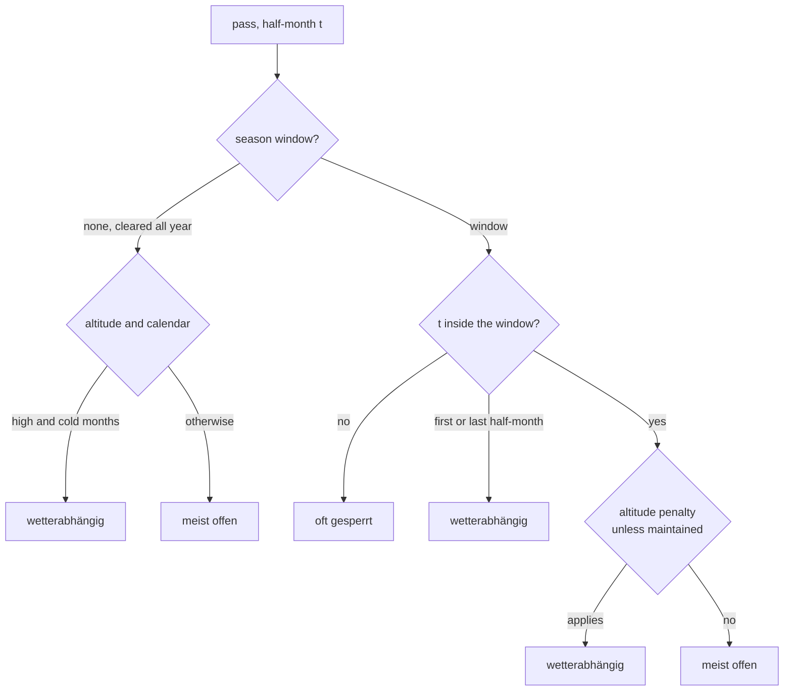
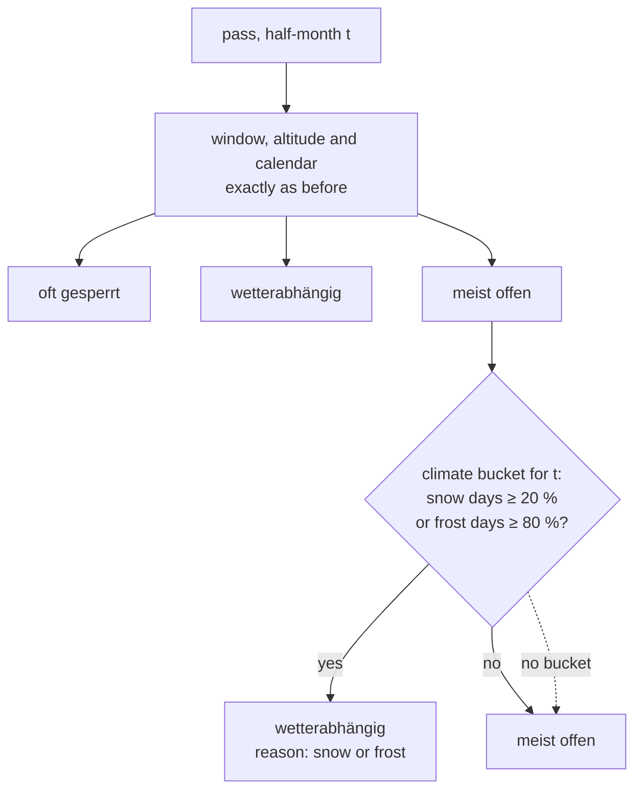

# 04 · Climate-aware status

**Status:** in progress ([PR #4](https://github.com/mdugue/alpen/pull/4)) · **Effort:** S–M · **Depends on:** – · **Unblocks:**
03 (truthful strips), 12 (destination scores), "beste Zeit" per pass

## Goal

`passStatus` uses the ERA5 climate series that `data:build` already
precomputes for every pass, explains its verdict, and yields a "beste Zeit"
range per pass. It stays a heuristic and says so.

## Why now

The current heuristic knows the season window, the altitude and the calendar,
but not the pass's own climate, although 92 × 24 climate buckets sit in
`data/generated/climate.json`. Across all pass × half-month pairs it calls
"meist offen":

| Verdict | n | mean snow-day share | share with snow ≥ 20 % of days |
| --- | --- | --- | --- |
| meist offen | 948 | 7 % | 12 % |
| wetterabhängig | 447 | 25 % | 72 % |
| oft gesperrt | 813 | 32 % | 90 % |

72 "meist offen" pairs have snowfall on 25 % or more of days: Großglockner
early October (37 %), Silvretta early October (29 %), Gotthard/Tremola early
October (27 %), Alpe d'Huez early May (25 %), Roßfeld early March (44 %).
Those are exactly the shoulder-season calls a holiday planner needs to get
right.

## Non-goals

Official closure data (roadmap item 1) and forecast-based status; both would
sit in front of this layer, not replace it.

## The mechanism in one picture

### Before



### After



Climate never produces "oft gesperrt": closures are what the season window
knows, snow days are what the climate series knows.

"Beste Zeit" is the longest run of open half-months with fewer than 10 % snow days:

```
 J   F   M   A   M   J   J   A   S   O   N   D
 ░░  ░░  ░░  ░░  ░▒  ▒▓  ▓▓  ▓▓  ▓▓  ▓▒  ▒░  ░░      status per half-month
                      └── Beste Zeit: Anfang Juli bis Ende September ──┘
```

## Design

### Signature

```ts
export interface StatusVerdict {
  status: Status;
  reasons: StatusReason[];   // "outside-window" | "window-edge" | "altitude" | "snow" | "frost"
}
export function passVerdict(pass: Pass, t: Period, bucket?: ClimateBucket | null): StatusVerdict;
export function passStatus(pass: Pass, t: Period, bucket?: ClimateBucket | null): Status; // = passVerdict().status
```

### Rules

1. Season window and altitude rules exactly as today produce a base status.
2. Climate can only worsen `open` to `risky`, never produce `closed`:
   "oft gesperrt" means road closures, which only the season window knows.
   `if (status === "open" && bucket && (bucket.snowPct >= 20 || bucket.frostPct >= 80)) status = "risky"`.
3. `maintained` roads get the climate rule too. Being cleared does not make
   riding in snowfall on a third of the days pleasant; the elevation exemption
   stays as it is.
4. Passes without a climate series behave as today.

Thresholds: 20 % snow days ≈ 3 of 15 days; 80 % frost days means nightly
frost almost every day. Both come from the table above (the "open" cohort
sits at 7 %, the "risky" cohort at 25 %). They are constants in
`lib/status.ts` with a comment pointing here.

### Reasons in the UI

`StatusBadge` gets a tooltip / the detail panel a line under the badge:
"wetterabhängig – Schneefall an 27 % der Tage in diesem Halbmonat (ERA5-Land
2015–2024)". Reason texts live in `lib/status.ts` as a `Record<StatusReason,
(ctx) => string>`. This is the honesty principle made visible.

### Beste Zeit

```ts
export function bestPeriods(pass: Pass, climate: ClimateYear): [Period, Period] | null
```

The longest run of half-months where the verdict is `open` and
`snowPct < 10`. Shown in the panel as "Beste Zeit: Anfang Juli bis Ende
September" and used by plan 12 for destinations. If the run is shorter than
two half-months, return null and show nothing.

### Data plumbing

`buildPassRows` and `buildTourRows` receive the `climate` map (already a prop
of `Explorer`) and pass the bucket for `filters.period`; `tourStatus` takes
the map as well. `pass-map.tsx` consumes the row status as today.

### Calibration

`scripts/analyze-status.ts` prints the table above before and after and lists
every (pass, period) pair whose verdict changes. Review that list in the PR:
changes should be shoulder-season shifts, not mid-summer surprises. Later
tuning happens by re-running the script, not by feel.

### Documentation

Update the "Status per period" section in `docs/scales.md` and the scales
dialog text: "Heuristik aus Öffnungsfenster, Passhöhe, Jahreszeit und der
Klimareihe des Passes (Schnee- und Frosttage je Halbmonat, 2015–2024)".

## Steps

1. Add `passVerdict`, reasons and thresholds; keep `passStatus` as a thin
   wrapper so nothing else breaks.
2. Thread the climate bucket through `lib/rows.ts` and `tourStatus`.
3. Write `scripts/analyze-status.ts`; paste its output into the PR.
4. Show the reason in `StatusBadge` (tooltip) and the panel; add `bestPeriods`
   and its line in `PassDetail`.
5. Update `docs/scales.md` and `components/scales-dialog.tsx`.
6. Tests: the truth table in plan 10 gains climate cases (Großglockner early
   October → risky with reason "snow"; Galibier late July with 2 % snow → open).

### Documentation

The "after" flowchart replaces the numbered list under "Status per period"
in `docs/scales.md`; the scales dialog gets the one-sentence version and the
reason texts.

## Acceptance criteria

- The analysis script shows the "meist offen" cohort with snow ≥ 20 % at 0 %.
- No pass gains `closed` from climate alone.
- Every non-open badge can explain itself in one German sentence.
- `bestPeriods` returns a plausible range for at least 80 of 92 passes.
- `docs/scales.md` shows the decision flow as a diagram.

## Risks and open questions

- ERA5-Land is a 10 km grid and too mild at altitude (already stated in the
  scales dialog); the thresholds therefore err on the cautious side only in
  the direction of "risky", which is the safe direction for a planner.
- A pass with a season window that is too generous in `passes.json` will now
  show "risky" with a snow reason in months where it is in fact closed. That
  is a data fix in `passes.json`, and the reason text makes it findable.
