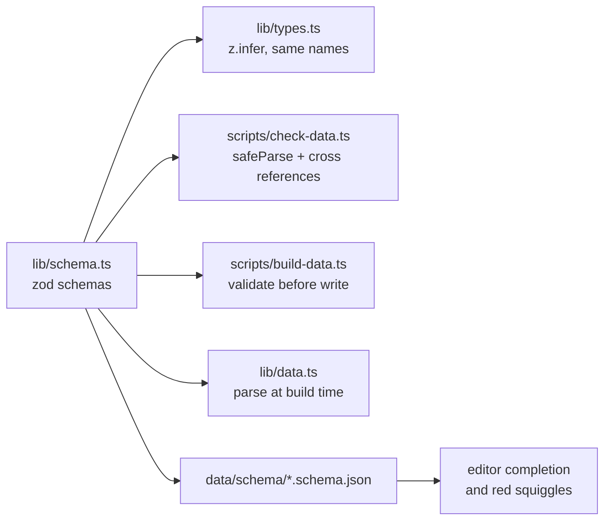

# 09 · Schema validation with zod

**Status:** done ([#9](https://github.com/mdugue/alpen/pull/9)) · **Effort:** S · **Depends on:** – · **Unblocks:** 12
(new entity gets a schema from day one), 05 (`aliases`)

## Goal

Every JSON file in `data/` and `data/generated/` is validated against a zod
schema at check time and at build time, the TypeScript types are inferred
from the schemas, and editors get JSON Schema completion for the hand-
maintained files.

## Why now

- `scripts/check-data.ts` validates a handful of ranges by hand; a typo like
  `"elevaton"` or a string where a number belongs passes silently until the UI
  breaks.
- `Pass.region` in `lib/types.ts` is typed as the union widened with
  `| string`, which defeats the union.
- Plans 00, 05, 07 and 12 all add fields; one place to declare them beats four
  ad-hoc checks.

## Non-goals

Runtime validation in the browser (the data is trusted once it passed CI).

## The mechanism in one picture



Today the same knowledge is spread over hand-written interfaces, a dozen
`if` statements in the check script and the reader's memory.

## Design

- `bun add zod` (4.x). Only server and script code imports it.
- `lib/schema.ts`:

```ts
export const Slug = z.string().regex(/^[a-z0-9]+(?:-[a-z0-9]+)*$/);
export const Period = z.number().refine((t) => PERIODS.includes(t));
export const LatLon = z.object({
  lat: z.number().min(43).max(49),
  lon: z.number().min(4).max(16),
});
export const PassSeason = z
  .object({ opens: Period, closes: Period, maintained: z.boolean().optional() })
  .refine((s) => s.opens < s.closes, "Saisonfenster verdreht");
export const Pass = z.object({
  slug: Slug,
  name: z.string().min(2),
  aliases: z.array(z.string()).optional(),
  country: z.string().regex(/^[A-Z]{2}(\/[A-Z]{2})?$/),
  region: z.enum(["Westalpen", "Zentralalpen", "Ostalpen", "Dolomiten"]),
  lat: LatLon.shape.lat,
  lon: LatLon.shape.lon,
  elevation: z.number().int().min(300).max(3500),
  classicAscent: z.string(),
  beauty: Rating,
  fame: Rating,
  difficulty: Rating,
  traffic: Rating,
  season: PassSeason.nullable(),
  note: z.string(),
  ascents: z.array(z.object({ from: LatLon, label: z.string() })),
});
```

plus `Tour`, `Town`, `RouteGeometry` (≥ 2 points), `ElevationProfile`
(`dist` and `ele` same length, `pts` when plan 07 lands), `ClimateYear`
(length 24), `RoutesMeta`, `Rejected` (plan 00).

- `lib/types.ts` re-exports `z.infer` types under the existing names so no
  import path changes.
- `scripts/check-data.ts`: `safeParse` each file, print path-qualified errors
  (`passes[12].season.closes: …`), then run the cross-reference checks as
  today. Also check canonical formatting of the hand-maintained files
  (`JSON.stringify(data, null, 2)` round-trip) so diffs stay readable.
- `lib/data.ts`: parse once at module load on the server
  (`Pass.array().parse(passesJson)`); a bad file fails `next build`.
- `scripts/build-data.ts`: validate fetched results with the generated-file
  schemas before writing (plan 00 adds the plausibility rules on top).
- Editor support: `scripts/emit-json-schema.ts` writes
  `data/schema/*.schema.json` via `z.toJSONSchema`; `.vscode/settings.json`
  maps `data/passes.json` etc. to them (`json.schemas`). Commit the schema
  files; regenerate in the same PR that changes `lib/schema.ts` (check-data
  verifies they are current).

## Steps

1. Add zod, `lib/schema.ts`, re-exported types; fix whatever `typecheck` now
   flags (expect the `region` widening and a few `as Pass[]` casts to go).
2. Rewrite `check-data.ts` around `safeParse`; keep every existing check.
3. Build-time parse in `lib/data.ts`; verify the page is still static.
4. JSON Schema emission and editor mapping.
5. Document in `docs/data-model.md`: "types come from `lib/schema.ts`".

### Documentation

The diagram goes into `docs/data-model.md`, whose first sentence then reads
"all types come from `lib/schema.ts`".

## Implementation notes

- The hand-maintained files were already indented with one space; the
  canonical form is therefore `JSON.stringify(data, null, 1)` plus a trailing
  newline, not two spaces.
- `REGIONS` and `COUNTRIES` live in `lib/regions.ts` so the client-side
  filters can share them without importing zod.
- `WeatherDay` (the forecast route's response) got a schema too, so
  `lib/types.ts` carries no hand-written interface at all.
- The object schemas are strict (`z.strictObject`): an unknown key such as a
  typo is an error, matching the `additionalProperties: false` the emitted
  JSON Schemas declare.

## Acceptance criteria

- A deliberately broken field in `passes.json` fails `bun run data:check` with
  a path and message, and fails `next build`.
- `lib/types.ts` contains no hand-written data interfaces anymore.
- VS Code shows completion and errors in `data/passes.json`.
- `docs/data-model.md` shows the schema flow.
