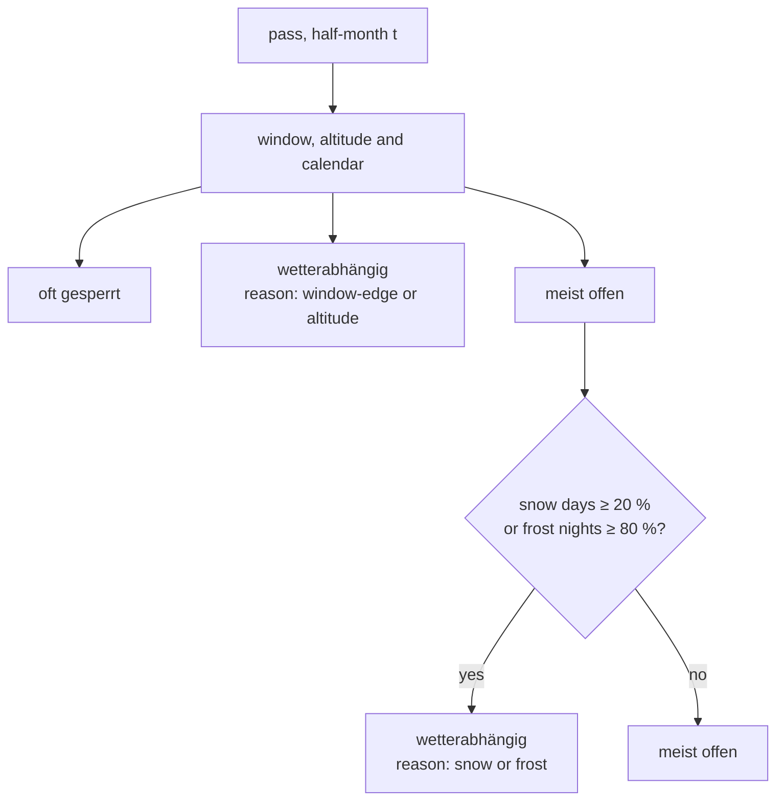
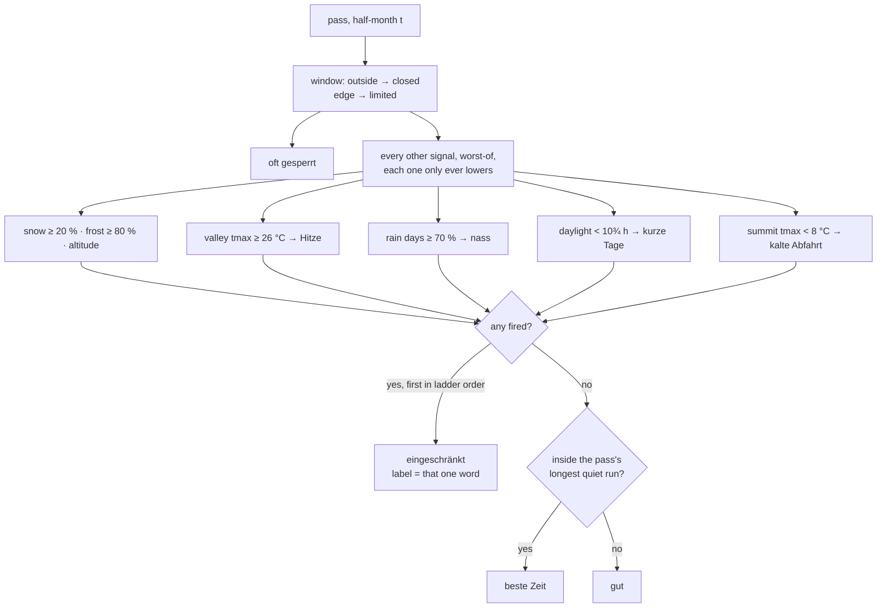

# 13 · Summer axis

**Status:** in progress ([PR #17](https://github.com/mdugue/alpen/pull/17)) · **Effort:** M–L · **Depends on:** 04 (climate series,
reasons, `bestPeriods`) · **Unblocks:** 12 (destination scores that mean
something in July), the "usable hours per day" cell fill and the daily window
in `docs/roadmap.md`

## Goal

The status answers "how good is it to ride there in this half-month" all year
round, not only "can you get over". Heat in the valley, a wet stau position,
short days and a cold descent become reasons like snow and frost already are;
each can only lower a cell, never lift it, and the reason that decided is the
word the cell carries. The strip gains a fourth rung so that July on 2 500 m
and July on 800 m stop looking identical, without a second strip and without
a second colour system.

## Why now

`passVerdict` reads `snowPct` and `frostPct` and nothing else. `ClimateBucket`
also carries `tmax`, `tmin` and `wetPct` for every pass and half-month, unused.
Across the 92 passes the verdict for June to September is one flat green wall:

| Half-month    | pairs | meist offen | wetterabhängig | oft gesperrt |
| ------------- | ----- | ----------- | -------------- | ------------ |
| Ende Juni     | 92    | 92          | 0              | 0            |
| Ende Juli     | 92    | 92          | 0              | 0            |
| Anfang August | 92    | 92          | 0              | 0            |
| Ende August   | 92    | 92          | 0              | 0            |

Stilfser Joch, Galibier and a 900 m pre-alpine pass render as 24 identical
cells in summer. The data behind those cells is not flat at all. Derived to
the lowest ascent start with the standard atmosphere (see "Valley heat"), the
mean daily maximum in late July ranges from 18 °C to 31 °C:

| Late July, valley tmax (derived) | p10  | p25  | median | p75  | p90  | max  |
| -------------------------------- | ---- | ---- | ------ | ---- | ---- | ---- |
| all 80 passes with a profile     | 18.5 | 21.8 | 24.1   | 26.2 | 27.6 | 31.1 |

Mont Ventoux 31 °C, Col de Turini and Colle delle Finestre 29 °C, Alpe d'Huez
and Mortirolo 27 °C, Col de l'Iseran 19 °C. Rain days in the same half-month
run from 14 % (Ventoux) to 82 % (Passo Duran); the Southern French Alps sit at
20–30 %, the Dolomites and Carinthia at 70–86 %. Those are destination
decisions, and the app currently hides them behind the same green.

All numbers in this plan come from `scripts/analyze-status.ts` extended as
described under "Calibration"; the tables are reproduced from a dry run of
that extension over `data/generated/climate.json` and `profiles.json`.

## Non-goals

Everything that needs a new archive run or editorial data, each of them a
plan of its own or a roadmap item: thunderstorm tendency (`cape` or hourly
precipitation), wind and sunshine share (fit into the same Open-Meteo call,
≤ 10 daily variables, currently 4), seasonal crowds (Ferragosto, school
holidays, granfondos), car-free days, the infrastructure season (hotels,
summit inn, lifts) and the "usable hours per day" cell fill. `docs/roadmap.md`
gets one entry per item in this PR.

## The mechanism in one picture

### Before



June to September: every pass lands in `O2`.

### After



The ladder, from what it is on the road: closed is categorically different
(binary and known), the three rungs above it are one gradual scale (Principle 3):

```
██  beste Zeit     green          nothing limits, and it is the pass's best window
██  gut            yellow-green   rideable, no caveat worth a word
██  eingeschränkt  orange         one word: Hitze · nass · kurze Tage · kalte Abfahrt · Schnee · Frost · Höhe · Randzeit
██  oft gesperrt   red            road closed, from the opening window only
```

Mont Ventoux, before and after (Bédoin start at 331 m, 31 °C in the valley
in late July, 14 % rain days; the dry run of the analysis script gives exactly
these cells):

```
 J   F   M   A   M   J   J   A   S   O   N   D
 ░░  ░░  ░░  ░░  ▒▒  ▓▓  ▓▓  ▓▓  ▓▓  ▓▒  ▒░  ░░      before: meist offen from June to early October, "beste Zeit" the whole of it
 ░░  ░░  ░░  ░░  ▒▒  ▓▒  ▒▒  ▒▒  ██  █▒  ▒░  ░░      after:  gut early June, Hitze late June – August, beste Zeit September – early October
```

## Design

### Types: `Status` stays three-valued, `Grade` is the display scale

`Status` (`lib/schema.ts`, zod enum `open | risky | closed`) is the vocabulary
of the filter, the hash (`s=open,risky`), the map circles and the row dot. It
stays exactly as it is, keys included – `risky` is in shared links. Only its
labels move: `open` → "gut", `risky` → "eingeschränkt", `closed` →
"oft gesperrt". "Meist offen" is the wrong sentence for a July cell whose
problem is heat; "wetterabhängig" is wrong for short days.

The fourth rung is not a status. It is `open` plus "inside the pass's best
window", which `bestPeriods` already computes. So:

```ts
// lib/status.ts – a display scale, not data, therefore not in lib/schema.ts
export type Grade = "best" | "good" | "limited" | "closed";
export const GRADE_LABEL: Record<Grade, string>; // beste Zeit · gut · eingeschränkt · oft gesperrt
export const gradeOf = (status: Status, inBest: boolean): Grade;
```

Widening the zod enum instead would put a fourth value into the status filter
("show only best"?), into the hash parser and into the map style, none of
which want it. `Grade` reaches the strip and the histogram; everything that
filters or paints the map keeps `Status`. `PassRow.season` and
`TourRow.season` become `Grade[]`, `PassRow.status` stays `Status`.

### Verdict: worst-of, all reasons collected, ladder order decides the label

```ts
export type StatusReason =
  | "outside-window"
  | "window-edge"
  | "snow"
  | "frost"
  | "altitude"
  | "heat"
  | "wet"
  | "short-day"
  | "cold-descent";

/** Ladder order: the first reason that fired is the one the cell names. */
export const REASON_ORDER: StatusReason[] = [
  "outside-window",
  "window-edge",
  "snow",
  "frost",
  "altitude",
  "heat",
  "wet",
  "short-day",
  "cold-descent",
];

export interface VerdictInput {
  bucket?: ClimateBucket | null;
  /** Lowest ascent start in m (from profiles.json); no value = no heat signal. */
  valley?: number | null;
}
export function passVerdict(
  pass: Pass,
  t: Period,
  input?: VerdictInput,
): StatusVerdict;
```

Rules:

1. `outside-window` alone yields `closed`. Nothing else ever does (unchanged
   from plan 04).
2. Every other signal is evaluated independently and pushed into `reasons`;
   the list is then sorted by `REASON_ORDER`. `status` is `risky` when the
   list is non-empty, `open` otherwise. Today `altitude` fires inside the
   base rule before climate is consulted; with the ladder it is simply one
   more member, and the `risky` verdict is the same – only the first reason
   can change, from "altitude" to "snow" when both apply, which is the more
   informative one.
3. `REASON_WORD: Record<StatusReason, string>` carries the one word for the
   badge and the cell (`Hitze`, `nass`, `kurze Tage`, `kalte Abfahrt`,
   `Schnee`, `Frost`, `Höhe`, `Randzeit`; `outside-window` has none, closed
   needs no word). `REASON_TEXT` gets the four new sentences, each naming its
   number and its provenance, as snow and frost do:
   - heat: "Im Tal um 29 °C am Nachmittag (aus dem Gipfelwert abgeleitet,
     ± 3 °C) – ab dem späten Vormittag nur noch oben angenehm."
   - wet: "Regen an 72 % der Tage (≈ 11 von 15, ERA5-Land 2015–2024) –
     Staulage; ein trockenes Fenster ist Glückssache."
   - short-day: "Nur 10,2 Stunden Tageslicht, Sonnenuntergang gegen 17:10 –
     für eine lange Runde wird es knapp."
   - cold-descent: "Am Gipfel im Schnitt höchstens 7 °C – mit Fahrtwind ist
     die Abfahrt eine um den Gefrierpunkt."
4. `bestPeriods` keeps its definition word for word: the longest run of
   `open` half-months with fewer than `SNOW_BEST_PCT` snow days. Since every
   new reason turns a cell `risky`, a best run is automatically free of heat,
   wet, short days and cold descents. New: `passGrades(pass, climate, valley):
Grade[]` and `tourGrades(...)`, where a tour cell is the worst grade of
   its passes (`closed < limited < good < best`), consistent with
   `tourStatus`.
5. Passes without a climate series behave as today; passes without a profile
   (12 of 92) get no heat signal and say so in the panel ("Talwert nicht
   ableitbar, kein Anstiegsprofil").

### The four signals and their thresholds

All thresholds are constants in `lib/status.ts` with a comment pointing here,
like `SNOW_RISKY_PCT`. They apply only where the verdict is not already
`closed`. Counts are over the 820 (pass, half-month) pairs that are `open`
today.

**Valley heat.** Heat is a valley phenomenon and the series is downscaled to
`pass.elevation` (Open-Meteo's `elevation` parameter, see
`scripts/build-data.ts`). The valley value is
`tmax + 0.0065 · (pass.elevation − valley)` with the standard-atmosphere lapse
rate, `valley` being the lowest `start` of the pass's profiles
(`profiles.json`, keys `${slug}:${index}`). `lib/data.ts` derives that map on
the server (`getValleys()`, `"use cache"`), the page hands it to `Explorer`
next to `climate`, and it is the one new prop that has to be threaded
(`rows.ts`, `explorer.tsx`, `detail-panel.tsx`, `analyze-status.ts`).

| valley tmax ≥ | pairs | passes | half-months hit                            |
| ------------- | ----- | ------ | ------------------------------------------ |
| 24 °C         | 212   | 49     | Ende Juni – Ende August, edges of June/Sep |
| **26 °C**     | 85    | 26     | Ende Juni 8 · Juli 42 · August 35          |
| 28 °C         | 12    | 6      | Juli/August: Ventoux, Turini, Finestre …   |

`HEAT_VALLEY_TMAX = 26`. The value is a mean daily maximum over ten years, so
26 °C means afternoons of 28–30 °C on the lower ramps in a normal summer, and
the derivation is biased low for the highest passes: Stilfser Joch from Prato
comes out at 24.8 °C where the station says ~27 °C, because ERA5-Land keeps
some of the summit's mildness (plan 04's "too mild at altitude", seen from
below). 26 catches the passes a rider would name (Alpe d'Huez, Mortirolo,
Ventoux, Finestre, Glandon, Madeleine, Maloja, San Marco) and spares Galibier,
Iseran and Gavia; 28 catches six passes and would be a Provence flag rather
than a summer axis. The reason text calls the number "abgeleitet" with its
± 3 °C, and `docs/scales.md` explains the derivation.

**Wet.** `wetPct` is the share of days with ≥ 1 mm. Alpine June is wet
everywhere (median 71 % in early June), July and August split the range:

| wetPct ≥ | pairs | passes | half-months hit                                   |
| -------- | ----- | ------ | ------------------------------------------------- |
| 60 %     | 247   | 70     | most of May–August                                |
| 65 %     | 149   | 60     | Anfang Juni 53 · Ende Juli 32 · Anfang Juli 21    |
| **70 %** | 87    | 46     | Anfang Juni 39 · Ende Juli 19 · Anfang Juli 9 · … |
| 75 %     | 46    | 28     | Anfang Juni 25 · Ende Juli 9                      |

`WET_LIMITED_PCT = 70`: two rain days in three. Late July at 70 % is exactly
the Dolomites and Carinthia list (Giau, Falzarego, Rolle, Staulanza, Duran,
Zoncolan, Großglockner, Nockalm, Turracher Höhe) and no French pass, which is
what a rider would expect. That early June turns amber for 39 of 64 open
passes is honest rather than a defect: it is the wettest half-month of the
year, and the strip should say so where the "beste Zeit" underline used to
imply otherwise.

**Short days.** Pure astronomy from `pass.lat` (and `lon` for clock times),
no data. New module `lib/daylight.ts`: NOAA sunrise equation, `sunTimes(lat,
lon, date)` → sunrise, sunset, day length; `dayLength(lat, t)` at the middle
day of the half-month (8th or 23rd). Clock times are formatted in
Europe/Berlin via `Intl`; the DST switch in late October falls inside a
half-month and shifts sunset by an hour within it, which the text tolerates
("gegen 17:10").

| day length < | pairs | half-months hit                                  |
| ------------ | ----- | ------------------------------------------------ |
| 10¼ h        | 4     | November only                                    |
| **10¾ h**    | 34    | Ende Oktober 30 · Anfang November 3 · Ende Nov 1 |
| 11¼ h        | 34    | the same; early October sits at 11,4 h           |

`SHORT_DAY_HOURS = 10.75` (the day length is measured with refraction and the
solar disc, which adds a quarter of an hour to the geometric value; the
cohort is the same as a geometric 10,5 h): sunset before ~17:15 CET. At
46,5° N that is late October onward (and February, where nothing is open). Most late-October cells
are amber already for frost or snow; the word matters for the low passes that
stay green until November (Turini, Ventoux, Couillole), where "kurze Tage" is
the true limit and "wetterabhängig" was never the right word.

**Cold descent.** The task suggests summit `tmin`; the plan uses summit
`tmax` and asks for that decision to be confirmed. `tmin` is the night, the
descent happens at 16–17 h when the summit sits near its daily maximum;
`tmax < 8 °C` means the warmest moment of the day at the top is 8 °C, and at
50 km/h that is wind chill around freezing.

| summit tmax < | pairs | passes | half-months hit                                   |
| ------------- | ----- | ------ | ------------------------------------------------- |
| 6 °C          | 5     | 4      | edges of the season only                          |
| **8 °C**      | 38    | 32     | Ende September 8 · Anfang Oktober 13 · Ende Okt 9 |
| 10 °C         | 127   | 73     | Ende September 35 · Anfang Oktober 38 · May 13    |

`COLD_DESCENT_TMAX = 8`. Late September at 8 °C names the 2 400 m+ passes
(Galibier, Bonette, Stelvio, Umbrail, Furka, Susten, Nufenen, Bernina), early
October the 2 000–2 250 m Dolomites and Graubünden passes. 10 °C would put a
third of all September cells at amber and take the summer axis back into
October caution, which plan 04 already covers via frost. Where frost or snow
fire too, they come first in the ladder and keep their word.

### Vocabulary

- `STATUS_LABEL`: `open` "gut", `risky` "eingeschränkt", `closed` "oft
  gesperrt". `GRADE_LABEL` adds `best` "beste Zeit".
- Badge (`components/status-badge.tsx`): "eingeschränkt: Hitze · Anfang
  August". The reason word comes from `verdict.reasons[0]`; `open` cells show
  "gut" or "beste Zeit". `StatusBadge` takes the verdict, not just the status.
- The panel keeps the sentences (`REASON_TEXT`) under the badge, most
  important first; that is where the raw value and its provenance live.
- `seasonSummary` and the scrubber's `aria-valuetext` move to the same words
  ("gut Anfang Juni bis Ende September, eingeschränkt bis Ende Oktober").
- The scales dialog and `docs/scales.md` describe the ladder and say that
  the amber word is the _first_ limit, not the only one.

### Strip and histogram: four rungs, three fills and the hollow cell

`SeasonStrip` takes `Grade[]` and paints three fills from their own tokens
(`--grade-best/good/limited` in `app/globals.css`, with `@theme inline`
lines and dark values) that differ in lightness as well as hue – deep green,
light yellow, orange – and the closure as the hollow cell with a red
hairline it always was. A pastel ramp with constant lightness and chroma was
tried and reviewed out: green, yellow-green and orange sat too close to tell
apart at 4 px, and a red fill made a winter of closures heavy. The status
tokens stay for the map, the dots and the badge. In the panel every cell carries a tooltip: the
half-month and the grade, then one plain sentence (`GRADE_HINT`), the caveat
named for a limited cell (`cellHint`, `REASON_PHRASE`). The period control's
label carries the four sentences as a tooltip (`GradeLegend`). Two earlier
cuts – a paler green for `good`, then a mark under the green cells – were
reviewed out: the first read as "less" without being a step towards amber,
the second put a distinction into a 2 px bar nobody could hover.

`HistogramBar` becomes `{ period, best, good, limited, closed }`; the stack
in `period-scrubber.tsx` has four segments: the three fills and grey for
the closure, because red is the map's colour and a backdrop must not
compete with it.

`rows.ts`: `PassRow.season`/`TourRow.season` → `Grade[]`, `statusHistogram`
counts grades. Sorting by status keeps `STATUS_RANK` on the three-valued
status.

### The map stays three-stage

`pass-map.tsx` paints circles by `status` via `readColors` and does not learn
the fourth rung. An 8 px circle cannot carry a mark legibly, the circle
answers "can I go there now", and the strip in the row next to it answers
"when". The row dot and the badge dot are the same three colours for the same
reason. This is a deliberate decision, not an omission; if plan 12 wants the
map to show "best" for a destination, it does so with its own mark.

### Filters on the raw signals, overview on the composite

The four-rung scale is for strip and histogram. The filters
(`components/sidebar/filter-panel.tsx`, `lib/app-state.ts`) keep working on
`Status` and gain two raw-signal selects, so the data that makes summer
queryable is not buried under the composite:

| Filter          | Options (hash value → label)                                           | Hash | Applies to                     |
| --------------- | ---------------------------------------------------------------------- | ---- | ------------------------------ |
| `maxValleyTmax` | 99 "egal" · 28 "Tal unter 28 °C" · 24 "Tal unter 24 °C"                | `h`  | pass, and every pass of a tour |
| `maxWetPct`     | 100 "egal" · 50 "Regen höchstens jeden 2. Tag" · 40 "trocken (≤ 40 %)" | `w`  | pass, and every pass of a tour |

Both read the bucket of `filters.period` (and `valleys` for heat), are upper
bounds like traffic, count in `countCriteria`, and are parsed with
`parseAsOneOf` like the existing selects. A pass without a series or without
a profile does not pass an active raw-signal filter: the filter asks for a
measured property, and "unknown" is not "under 28 °C". The panel gets a
second three-column row ("Tal-Hitze", "Regen", one column spare); on the
phone it wraps like the first.

### Panel

`PassDetail` shows, under the badge and the sentences, the derived values
where they exist: "Tal (≈ 725 m): um 27 °C am Nachmittag, abgeleitet" in the
climate section's footnote next to the existing "Niederschlag an 36 % der
Tage", plus "Tag 15,0 h, Sonne 5:52–20:52" from `lib/daylight.ts`. The
raw summit values stay exactly where they are (Principle 3: the composite is
an editorial judgement, the raw values remain visible).

### Calibration

`scripts/analyze-status.ts` grows three sections and keeps the plan 04 table:

1. Distribution tables per half-month for derived valley tmax, `wetPct`,
   summit tmax and day length over the pairs that are `open` today (the
   tables above).
2. Threshold counts: for each signal, pairs and passes hit at the chosen
   constant and one step either side, so a threshold change is a one-line
   diff with visible consequences.
3. Changes: every (pass, period) pair whose verdict or first reason changes,
   grouped by reason, and the "Beste Zeit" run length before and after per
   pass. Paste the summary into the PR and read the list adversarially:
   heat should name valleys, wet should name the Dolomites, nothing should
   turn amber in July for a reason a rider would not recognise.

### Documentation

- `docs/scales.md`: the "after" flowchart replaces the current one under
  "Status per period"; a new subsection "Derived values" explains the valley
  derivation (lapse rate, which elevation the series is downscaled to, the
  ± 3 °C, why passes without a profile have none) and the daylight module.
- `docs/data-model.md`: `climate.json` row mentions which fields the verdict
  reads; new paragraph on the server-derived `valleys` map next to
  `ProfileWithCoords`.
- `AGENTS.md`: "Where things live" gains `lib/daylight.ts`; the rideability
  row names `passVerdict`, `Grade` and the ladder. Principle 3 gets the
  sentence that derived values are labelled as such.
- `components/scales-dialog.tsx`: the ladder, the fills and the mark, the amber
  word, the derived valley value.
- `docs/roadmap.md`: one entry each for the non-goals above.
- Plan header and the row in `docs/plans/README.md`.

## Steps

1. `lib/daylight.ts` with tests (equinox ≈ 12 h at any latitude, Bozen
   21 June ≈ 15,8 h, Nice 21 December ≈ 9,0 h, longitude shifts sunrise clock
   time, half-month lookup). No UI yet.
2. `lib/status.ts`: `REASON_ORDER`, the four signals and constants,
   `passVerdict` collecting all reasons, `REASON_WORD`, the new `REASON_TEXT`
   entries, `Grade`, `gradeOf`, `passGrades`, `tourGrades`, new labels.
   `lib/status.test.ts`: Ventoux late July → `risky` with `heat` first;
   Passo Duran late July → `wet` and late October → `short-day`; Galibier
   late September → `cold-descent`; a pass with snow and altitude names
   snow; a cell in the best run is `best`, an open cell outside it `good`;
   no new reason ever yields `closed`; tour grade is the worst of its passes.
3. `lib/data.ts` `getValleys()`; `app/page.tsx` and `explorer.tsx` thread it;
   `lib/rows.ts` and `lib/rows.test.ts` move to `Grade[]` and four-way
   histogram bars.
4. Extend `scripts/analyze-status.ts`, run it, paste the output into the PR,
   adjust a threshold only with the table as the argument.
5. UI: `season-strip.tsx`, `status-badge.tsx`, `period-scrubber.tsx`,
   `detail-panel.tsx`, `scales-dialog.tsx`.
6. Filters: `lib/app-state.ts` (fields, defaults, `countCriteria`, hash
   parsers `h` and `w`, `app-state.test.ts` round trips), `filter-panel.tsx`,
   `rows.ts` (`withinLimits` reads the bucket).
7. Documentation as listed, roadmap entries, plan status, README row.
8. Verify: `bun run typecheck && bun run lint && bun test && bun run build &&
bun run data:check`; screenshots via `preview-app`: the list with strips
   in late July and in early October, the Ventoux and the Stilfser Joch
   panel, the scrubber histogram, the filter panel with the two new selects,
   light and dark, desktop and phone.

Steps 1–4 are one PR (verdict, data, calibration: every existing screen
keeps working because `passStatus` still returns `Status`), steps 5–8 a
second one if the first grows past comfortable review size.

## Acceptance criteria

- From June to September the 92 passes no longer share one grade: all three
  rideable rungs occur, and in late July the `heat` cohort is the valley
  list from the table above (Ventoux, Finestre, Turini, Alpe d'Huez, Mortirolo among them),
  the `wet` cohort the Dolomites/Carinthia list, and no French Southern Alps
  pass is amber for `wet`.
- No pass gains `closed` from any signal other than `outside-window`
  (unchanged from plan 04, now covered by a test over all 92 × 24 pairs).
- Every amber cell can name one word and every badge one sentence with its
  number and provenance; derived values say "abgeleitet".
- `bestPeriods` still returns a run of ≥ 2 half-months for at least 80 of 92
  passes (today: all 92, shortest run 5).
- The hash round-trips `h` and `w`; an old link without them behaves as
  before; `s=open,risky` still parses.
- The map, the row dot and the badge dot are unchanged in colour.
- `bun run scripts/analyze-status.ts` prints the four distribution tables and
  the change list; the PR carries them.
- Screenshots show the four rungs as distinguishable at row size (96 px,
  24 cells) in light and dark mode.

## Risks and open questions

- **Valley derivation is a model, not a measurement.** The lapse rate ignores
  inversions, foehn and the valley floor's own heat; the bias against station
  values is about −2 to −3 °C for passes with 1 800 m of drop and near zero
  for low passes. The threshold errs towards _not_ flagging heat on the very
  highest passes, which is the safe direction: an amber "Hitze" is a hint, a
  missing one is what the rider expected anyway. Confirm in the PR that the
  `heat` list contains no pass a rider would call cool.
- **June turns amber for wet on most of the Alps.** True to the data and to
  experience, but a big visual shift: the strip loses its "everything green
  from June" look. If it reads as noise in the screenshots, the alternative
  is `WET_LIMITED_PCT = 75` (25 of 64 in early June), decided by the
  screenshots and the table, not by feel.
- **`cold-descent` on tmax rather than tmin** deviates from the task
  statement; the reasoning is above. If the user prefers `tmin`, the
  threshold from the same table is `tmin < 0 °C` (53 pairs, 36 passes, same
  half-months), with the caveat that most of those cells are already amber
  for frost, so the word would rarely appear.
- **Four rungs at 4 px cell height.** Green and yellow are the closest pair
  and are separated by lightness on purpose; the sentence in `aria-label`
  and the "beste Zeit" line in the panel carry the same information, and the
  panel cells are four times the height and explain themselves on hover.
