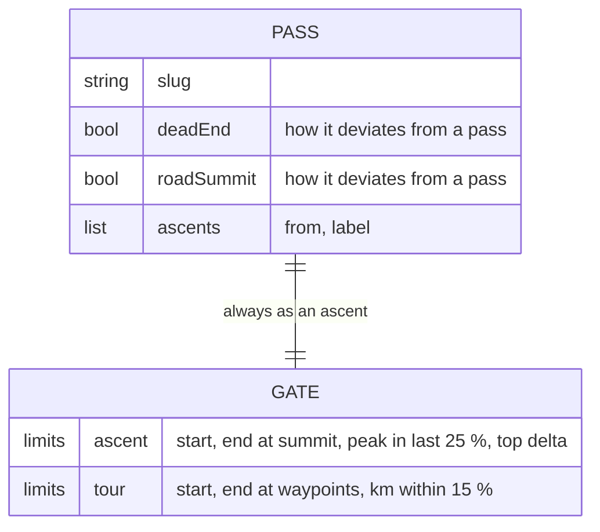
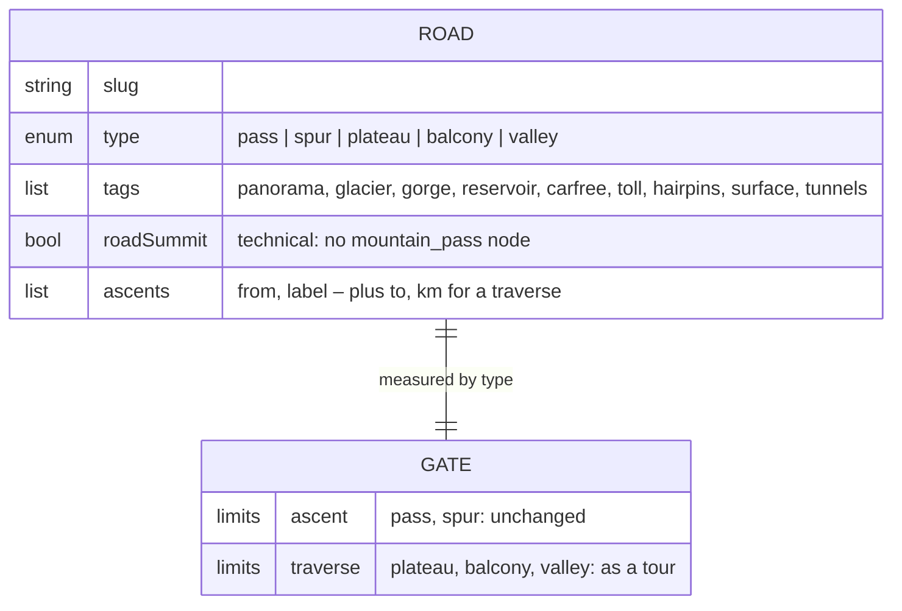

# 14 · Road types and tags

**Status:** in progress – steps 1–4 done, 5 under way (Westalpen · Frankreich
abgearbeitet), 6 open ·
**Effort:** L (M for code, the rest is curation) ·
**Depends on:** 09 (schema), 05 (filters) · **Unblocks:** the sporting roads
that are not passes – spur roads, balcony roads, high roads, quiet valleys –
and the filter "passes only / everything but passes / gorges"

## Goal

The list stops being a list of passes and becomes a list of the roads a road
cyclist travels for. An entry says **what kind of road it is** (a crossing, a
spur to a summit, a high road that stays up, a balcony cut into a gorge wall,
a dead-end valley) and **what riding it is like** (panorama, glacier, gorge,
reservoir, car-free, toll, hairpin monument, cobbles or gravel, tunnels). Both
are filters and both are searchable. The route quality gate keeps its full
strength for every type, which means the types without a summit are measured
the way tours are, not the way ascents are.

## Why now

- The product goal is finding destinations, and a destination is chosen for
  the riding around it – which is not only passes. A holiday in the Vercors is
  chosen for Combe Laval and the Gorges de la Bourne; nobody rides there for a
  col. Today such a place cannot be represented at all.
- The data model already strains against "pass": seven of 92 entries are
  `deadEnd`, nine are `roadSummit`, and the Roßfeld-Panoramastraße, the
  Nockalmstraße and the Villacher Alpenstraße are listed as passes because
  there was no other word. The two flags describe how an entry _deviates_
  from a pass; they cannot say what it is instead.
- What is there cannot be found: there is no filter and no search word for
  "Stichstraße", "autofrei", "Gletscher" or "Maut", although the entries exist.
  The `deadEnd` flag reaches the UI only as one sentence in the detail panel.
- The gate would silently break on the first balcony road. `minPeakAt: 0.75`
  and `maxEndDist` against the pass point are the right checks for a climb
  and the wrong ones for a traverse; routing such an entry as an ascent would
  either reject every one of them or need a `check` on each, and `check` is
  built for exceptions with a note, not for a whole class.

## Non-goals

A new entity kind. A balcony road has the same four editorial scales, the
same season strip, the same profile, climate series and photos as a pass;
same invariants, same fields, so it is a _type_ of the existing entity, not
a new one. Everything keyed by a pass slug (`routes.json`, `profiles.json`,
`climate.json`, `summits.json`, `photos.json`, `nearby`, `Tour.passes`, the
hash) stays as it is.

A change to the map. The dot, the ascent line and the hit layers stay; a
type-specific marker is an open question below, not part of this plan.

Tags for anything the data measures. Steepness (`maxKmGradient`), length,
border crossing (`country` with a `/`), fame and altitude are numbers or
derivable and stay that way – an editorial label next to a measured value is
exactly the drift principle 3 forbids.

Tours without a pass (a Vercors loop). `Tour.passes` needs one slug for the
status. A traverse-type entry counts as a pass for that purpose, so a loop
over Combe Laval and the Bourne can be listed once those entries exist; a
tour with _no_ entry at all remains out of scope.

## The mechanism in one picture

### Before



Every entry is a climb to a point. What is not a climb to a point has no
place, and what is one but not a pass has no name.

### After



The sidebar, before and after:

```
before                                   after
┌ Anfang Oktober ────────────────┐       ┌ Anfang Oktober ─────────────────────────────┐
│ Filter ▾                       │       │ Filter ▾  Art: Pass · Stich · Höhe · Balkon │
│                                │       │           · Tal      Merkmale: ⛰ ❄ ⧗ € …    │
│ PÄSSE 92                       │       │ PÄSSE & STRASSEN 107                        │
│ Ötztaler Gletscherstraße 2.830 │       │ Ötztaler Gletscherstraße  Stich · ❄ € 2.830 │
│ Col de la Bonette        2.802 │       │ Col de la Bonette                     2.802 │
│ Nockalmstraße            2.042 │       │ Nockalmstraße               ⛰ €       2.042 │
│ …                              │       │ Combe Laval               Balkon · ⧗  1.300 │
│ TOUREN 9 · ORTE 48             │       │ TOUREN 9 · ORTE 48                          │
└────────────────────────────────┘       └─────────────────────────────────────────────┘
```

## Design

### Two axes, not one

The **type** is topology: how the road lies in the terrain. Single-valued,
mutually exclusive, and it decides how the gate measures the entry.

| `type`    | Label (UI)   | What it is                                            | Examples                                                        |
| --------- | ------------ | ----------------------------------------------------- | --------------------------------------------------------------- |
| `pass`    | Pass         | a crossing: up one side, down another                 | Stilfser Joch, Galibier, Nockalmstraße (two summits, crosses)   |
| `spur`    | Stichstraße  | a climb to a point where the road ends                | Tre Cime, Ötztaler Gletscherstraße, Kaunertaler Gletscherstraße |
| `plateau` | Höhenstraße  | stays up instead of crossing once: high road, plateau | Zillertaler Höhenstraße, Seiser Alm, Ritten                     |
| `balcony` | Balkonstraße | cut into a wall, no summit the ride aims at           | Combe Laval, Gorges de la Bourne, Gorges du Cians               |
| `valley`  | Talstraße    | a quiet dead-end valley, little gradient              | Vallée de la Clarée, Val Ferret, Sertigtal                      |

The rule for choosing it is operational, not aesthetic: **if the ascents
climb to the entry's point, it is `pass` or `spur`; if the ride is the
traverse itself, it is one of the other three.** An area can yield two
entries (the climb up to the Ritten and the high road across it), but only
when both are worth listing on their own.

`pass` and `spur` replace today's `deadEnd` (`spur` ≡ `deadEnd: true`).
`roadSummit` stays what it is – a technical flag for `data:locate` saying
that OSM has no `mountain_pass` node – but is only ever _set_ on a `pass`;
for every other type it is implied and `data:check` warns when it is written
down redundantly.

The **tags** are character: what riding the road is like. Multi-valued,
editorial, independent of the type, in the exact sense of `TOWN_TAGS` –
labels a planner notices, not counted facts.

| Tag         | Label (UI)             | Given when                                                                           |
| ----------- | ---------------------- | ------------------------------------------------------------------------------------ |
| `panorama`  | Panoramastraße         | the road was built for the view and says so in its name or its layout                |
| `glacier`   | Gletscherstraße        | ends at or runs along a glacier                                                      |
| `gorge`     | Schlucht               | a significant stretch runs through a gorge or canyon                                 |
| `reservoir` | Stausee                | the road exists because of a dam and ends at or along the lake                       |
| `carfree`   | Autofrei               | closed to cars, at least on fixed days (say which in `note`)                         |
| `toll`      | Maut                   | a fee is charged; whether bikes pay goes into `note`                                 |
| `hairpins`  | Kehrenbauwerk          | the hairpins are a monument in themselves (Lacets de Montvernier, San Boldo)         |
| `surface`   | Pflaster oder Schotter | a stretch that is not smooth asphalt – cobbles, gravel top – changes the tyre choice |
| `tunnels`   | Tunnel & Galerien      | unlit tunnels or galleries a rider has to plan for                                   |

`toll` and `season.maintained` are independent: maintained means cleared,
toll means paid for. The Großglockner is both, the Simplon is cleared and
free, a car-free spur is neither. Nothing derives one from the other.

### Data

`data/passes.json` (file name unchanged in this plan, see "Rename" below):

```jsonc
{
  "slug": "combe-laval",
  "name": "Combe Laval",
  "type": "balcony", // required on every entry
  "tags": ["gorge", "tunnels"], // optional, display order = vocabulary order
  "country": "FR",
  "region": "Westalpen",
  "lat": 45.0, // the marker: where the dot sits and the climate is read
  "lon": 5.3,
  "elevation": 1300, // height of the marker, not "the summit"
  "classicAscent": "…",
  "beauty": 5,
  "fame": 3,
  "difficulty": 2,
  "traffic": 2,
  "season": null,
  "note": "…",
  "ascents": [
    {
      "from": { "lat": 45.05, "lon": 5.35 },
      "label": "Saint-Jean-en-Royans",
      "to": { "lat": 44.99, "lon": 5.27 }, // traverse types only
      "km": 17, // traverse types only, from a trusted source
    },
  ],
}
```

Schema (`lib/schema.ts`): `RoadType` and `RoadTag` enums from new
`ROAD_TYPES` / `ROAD_TAGS` vocabularies in `lib/regions.ts` (with `ROAD_TYPE`
and `ROAD_TAG` carrying label and hint, as `TOWN_TAG` does); `type` required;
`tags` optional array, no duplicates; `deadEnd` removed. `Ascent` becomes a
discriminated union on the parent's type – simplest as a `superRefine` on
`Pass`: a `pass`/`spur` ascent must not carry `to`/`km`, a traverse ascent
must. `elevation`'s lower bound of 300 m drops to 100 m for the gorge roads.
`bun run data:schema` regenerates the JSON Schema files in the same PR.

Migration is one mechanical commit: every existing entry gets
`"type": "pass"`, the seven `deadEnd` entries `"type": "spur"`, `deadEnd`
is deleted. A `type` on every entry rather than a default is deliberate:
the file is the product, and an entry that does not say what it is is an
entry nobody has looked at.

### The gate for roads without a summit

Measuring and judging stay separate; what changes is _which_ measurement a
type gets (`scripts/lib/validate.ts`, `scripts/build-data.ts`):

- `pass`, `spur` → `ascentMetrics` + `checkAscent` against `LIMITS.ascent`,
  **unchanged**. The 92 existing routes must come out identical, which is the
  regression test for this step (`bun run data:check --explain` before and
  after, diffed).
- `plateau`, `balcony`, `valley` → `tourMetrics` with `[from, to]` as the
  waypoints and the ascent's `km` as `statedKm`, judged by `checkTour`
  against `LIMITS.tour`. Nothing new is written; the two checks that make
  sense for a line with two curated ends and a known length already exist,
  fitted on nine tours. `AscentCheck` for a traverse ascent therefore takes
  the `TourCheck` limits (`maxKmDelta`, `maxWaypointDist`) – the schema's
  "only the limits its own validator reads" rule is kept by making the
  `check` shape depend on the type too.

Why not a third limit set: a limit set is only worth its name when it catches
a known failure mode. For a traverse the failure modes are exactly the tour's
(the router took a different road: length off; the ends are not where the
curator put them), and inventing a `LIMITS.traverse` that repeats
`LIMITS.tour` would be two places to tune for one behaviour.

The summit checks (`checkSummit`, `checkRoad`) apply to every type: the marker
has a stated height and must sit on a road, whatever the road is. For a
traverse type `data:locate` does not search for a pass node and does not offer
the highest route sample either – it only prints the two measurements, since
the marker is a curated point and there is no better candidate to propose.

Profiles are built for every type as today (`profiles.json`, 100 samples).
The panel's ascent line ("km · Hm · Ø % · steilster km") reads the same; for
a valley it will simply show a small number, which is the point.

### Status

`passStatus` is unchanged. It reads `elevation` and `season`, and for a
traverse the marker height is the honest input: a balcony at 1 300 m without
a season window is "meist offen" all year, and that is what the road
authority's habit says too. What the heuristic cannot know – rockfall closures
on gorge roads, the car-free days of a spur – goes into `note` and nowhere
else. Principle 3: do not claim a season the data does not carry.

`tourStatus` is unchanged; a traverse entry in `Tour.passes` contributes its
verdict like any other. `data:check`'s warning "eine Runde kann dort nicht
hinüber" is keyed on `type === "spur"` instead of `deadEnd`.

### UI

- **Sidebar list**: the section is titled "Pässe & Straßen". A row shows
  the type as a word only when it is not `pass` (the common case needs no
  label) and the tags as glyphs, exactly as `TownTagLine` does – the same
  reasoning applies: three labels spelled out do not fit a 352 px row. The
  icon table in `lib/tag-icons.ts` grows by nine glyphs and its key type
  widens to `TownTag | RoadTag`; `components/town-tags.tsx` generalises to a
  `TagLine`/`TagBadges` pair over both vocabularies (rename the file to
  `tags.tsx`).
- **Filter panel**: two new groups under the existing criteria. "Art" is a
  `ToggleGroup` with `multiple` over the five types – "Pässe und Stiche, aber
  keine Täler" is a real question, so it is a set, not a single choice; all
  five selected means no filter. "Merkmale" is a `ToggleGroup` with `multiple`
  over the nine tags, glyph plus word, **and**-semantics: every selected tag
  has to be present. Or-semantics would make "autofrei + Gletscher" mean
  "either", which is never what a planner wants from two filters. Both feed
  `countCriteria` and `hasActiveFilters`; two new hash keys (`a` for the type
  set, `e` for the tag set, both as comma-joined literals with
  `clearOnDefault`).
- **Tours** see the type filter through their passes like every other
  criterion: a tour needs one pass that clears the lower bounds, and the type
  set is a lower bound in that sense (one member pass of a selected type).
  The tag filter is _not_ applied to tours – a tag describes one road, and a
  loop with a car-free spur in it is not a car-free loop.
- **Detail panel**: the line under the name reads
  `Stichstraße · Westalpen · IT` (type only when not `pass`); tag badges
  below it, glyph and word, as `TownTagBadges`. The "Auffahrten" section is
  titled "Strecke" for traverse types, and the sentence that today follows
  `deadEnd` ("Stichstraße: die Straße endet oben …") is keyed on `spur`.
- **Search** (`lib/search.ts`): the type label and the tag labels join the
  haystack, so "stich", "autofrei" and "gletscher" find things.
- **Scales dialog**: a block "Art und Merkmale" after the town labels, one
  line per value with its hint – the honesty note that these are editorial
  labels covers them too.
- **Map**: no change. The hover popup shows the tag glyphs like it does for
  towns (`tagIconSvg`).

### Rename

`Pass` is the wrong name for the type once `type` exists, and `passes.json`
the wrong name for the file. The rename – `Pass` → `Road`, `passes.json` →
`roads.json`, `PassRow`, `pass-list.tsx`, `passHaystack`, … – is a separate,
purely mechanical PR _after_ the data has landed, so that this plan's diff
stays readable. Three things are wire format and stay: `EntityKind = "pass"`
and the `pass=` hash key (shared links), the `pass:` prefix in `photos.json`
and `nearby`, and the `slug:index` route keys. Each keeps a one-line comment
saying why it did not follow the rename. Plan 02 (real routes) is the moment
to migrate the hash key with a redirect, not before.

## Steps

1. **Vocabulary and schema.** `ROAD_TYPES`/`ROAD_TAGS` with labels and hints
   in `lib/regions.ts`; `type`, `tags`, the traverse ascent shape and the
   type-dependent `check` in `lib/schema.ts`; `deadEnd` removed;
   `bun run data:schema`. Migration commit for the 92 entries. `data:check`
   warns on a redundant `roadSummit` and keys the tour warning on `spur`.
2. **Gate by type.** `build-data.ts` picks ascent or tour metrics by type;
   `locate-pass.ts` skips the candidate search for traverse types. Unit
   tests: one traverse fixture that passes, one with a wrong `to` and one
   with a wrong `km` that fail with the tour sentences. Regression: the
   `--explain` output for the 92 existing entries is byte-identical.
3. **Filters, search, panel, list.** Types and tags in `Filters`, the hash,
   the filter panel, `lib/rows.ts`, the haystack, the row, the detail panel,
   the popup, the scales dialog; `tag-icons.ts` and `tags.tsx` generalised.
   Screenshots: the filter panel with "Art" and "Merkmale" open, a `spur`
   row and a `balcony` detail, light and dark, phone width.
4. **Tags on the existing entries.** One curation pass over the 92:
   `toll` and `panorama` on the toll roads, `glacier` on the Ötztaler,
   `reservoir` on Malta, Fedaia, Nivolet, Silvretta, `surface` and `hairpins`
   on the Tremola, `hairpins` on the Stelvio, `carfree` on Tre Cime and
   Nivolet, `tunnels` on Mangart. No route changes, so no API cost.
5. **The new entries**, from the candidate list in the appendix, curated
   in regional batches through the `curate-data` loop – one PR per batch.
   The binding limit is Open-Meteo's **daily** 10 000 calls, not the hourly
   5 000: a new entry costs ~261 calls for its climate series plus ~100 per
   ascent profile, so roughly 27 entries fill a day. `data:backfill` drains
   the backlog in hourly batches by itself and is resumable, so a batch larger
   than a day simply continues the next day (`BACKFILL_MAX_RUNS=2` is about
   one day's worth). Routing is never the constraint – 2 000 ORS requests a
   day is far more than this needs.
   A candidate that turns out not to belong (road closed, gravel throughout,
   bikes banned) is struck from the appendix with the reason in the same PR,
   never silently dropped. Every entry comes with its four scales judged
   against its neighbours, per `docs/scales.md`, and a `note` that carries
   what the tags cannot (which days are car-free, whether bikes pay).
6. **Rename** (own PR, see above).

### Documentation

The "after" entity diagram and the two vocabulary tables replace the
`deadEnd`/`roadSummit` paragraphs in `docs/data-model.md`; the gate table in
the `curate-data` skill gains the "measured by type" rule and the traverse
fields; `docs/scales.md` gets the line that type and tags are editorial;
`AGENTS.md` "Where things live" points at the vocabularies. The `deadEnd`
mentions in `CLAUDE.md`/`AGENTS.md` go.

## Acceptance criteria

- `bun run data:check` passes with `type` on every entry and no `deadEnd`
  anywhere; `--explain` for the 92 pre-existing entries is unchanged.
- A `balcony` entry with a wrong `km` is rejected with the tour sentence
  ("Länge … weicht … von den angegebenen … ab"); a correct one is stored,
  drawn on the map and has a profile.
- The filter "Art: Stichstraße" alone lists exactly the spur entries; "Art:
  alles außer Pass" lists the rest; "Merkmale: autofrei" lists Tre Cime and
  Nivolet and nothing that is not marked so. Both survive a reload via the
  hash.
- Typing "autofrei" or "gletscher" in the search finds the tagged entries.
- The sidebar section reads "Pässe & Straßen"; a `spur` row shows the word,
  a `pass` row does not; tag glyphs show in the row, glyph and word in the
  panel and the popup; the scales dialog explains all fourteen labels.
- Every row of the appendix is either an entry on the map with a route that
  follows the road (per the `curate-data` look-and-check step) or struck
  through with a reason. At least five entries per new type.

## Risks and open questions

- **Type is a judgement at the edges.** Is the Strada della Forra a `pass`
  with `roadSummit` and `gorge`, or a `balcony`? The operational rule decides
  (it climbs to Pieve, so `pass`), and `note` says the rest. Expect to move
  two or three entries after seeing them in the list.
- **Traverse entries need two more curated numbers** (`to`, `km`). `km` comes
  from the same sources as `tour.km`; a wrong one is caught, a missing one
  fails the schema. Acceptable, and it is what keeps the gate honest.
- **The marker of a traverse is arbitrary** in a way a pass point is not.
  Convention: the highest point of the stretch when there is one, otherwise
  its middle; `data:locate` prints DEM height and road distance for it so a
  wrong one is still caught.
- **Tour membership of traverse entries** makes `Tour.passes` a misnomer too;
  it is covered by the rename PR (`Tour.roads`), with the same wire-format
  rule for the JSON key if it turns out to be referenced by links.
- **Map marker per type** – a spur could be drawn as a half dot, a valley as
  a short bar – is left open. The dot and the status colour carry the
  product's question ("when"); the type is one word in the list. Revisit when
  the first batch is on the map and it turns out to matter.
- **Tre Cime is not car-free** (found in step 4). Its road is a toll road cars
  still drive; what changed in recent summers is that it closes when the car
  park is full, which is capacity and not a car ban. It gets `toll` and no
  `carfree`; the appendix line above was dictated from memory, as the appendix
  says of itself. `carfree` in the existing data is therefore Grosse Scheidegg
  (all but the bus) and Colle del Nivolet (summer weekends), both of which say
  so in their own `note`.
- **A DEM cannot see into a tunnel, and the `tunnels` roads pay for it.**
  Found while routing the first batch: the Copernicus DEM samples the mountain
  _above_ a tunnel, not the road inside it, so the elevation gain of a
  tunnel-heavy road comes out far too high – Combe Laval measures 1 351 Hm
  against 764 m of net climb, the Gorges de la Bourne 1 595 against 800. The
  summit checks are unaffected (`topDelta` stayed inside 80 m for both), and
  `avgGradient` is computed from start and top and is right (6,0 % and 3,2 %),
  but `elevationGain` and `maxKmGradient` are not values to show for a road
  carrying the `tunnels` tag. Options, none of them part of this plan: smooth
  the series, derive the gain from the net climb for such roads, or say in the
  panel that the profile reads the rock above a tunnel. The `tunnels` tag is at
  least the flag that says which roads are affected.
- **Fame filter and the new entries.** Most balcony and valley roads are
  unknown outside their region; "nur Klassiker" will hide them, which is
  correct. `beauty` is where they score, and the beauty filter is the one to
  use with the new types.

## Appendix: candidate entries

What "popular" means here: a road a road cyclist travels for – Tour, Giro
and marathon history, a quäldich or climbbybike entry people quote, or a
fixture of the regional riding – judged the way `fame` is judged, not counted.
The list is dictated from memory to be pruned, not verified: **elevation is
approximate** and is measured by `data:locate`; the **prüfen** column names
what the curation step has to look up before the entry is written. Roads
whose surface is gravel end to end, roads closed to bikes, and the Jura,
Vosges and Pyrenees (roadmap item 2) are left out.

### Westalpen · Frankreich

Abgearbeitet (Batch 1 und 2). Höhe und Merkmale sind jetzt die kuratierten
Werte, nicht mehr die geschätzten; zwei Kandidaten sind gestrichen.

| Name                                         | Typ       | Merkmale                 | Höhe | Ergebnis                                                                                                                                                                  |
| -------------------------------------------- | --------- | ------------------------ | ---- | ------------------------------------------------------------------------------------------------------------------------------------------------------------------------- |
| ~~Col du Granon~~                            | `spur`    | –                        | 2413 | Eintrag `col-du-granon`                                                                                                                                                   |
| ~~Val Thorens~~                              | `spur`    | –                        | 2300 | Eintrag `val-thorens`                                                                                                                                                     |
| ~~Les Arcs 2000 / Arc 1800~~                 | `spur`    | –                        | 2100 | Eintrag `les-arcs`                                                                                                                                                        |
| ~~Orcières-Merlette~~                        | `spur`    | –                        | 1832 | Eintrag `orcieres-merlette`                                                                                                                                               |
| ~~Pra-Loup~~                                 | `spur`    | –                        | 1630 | Eintrag `pra-loup`                                                                                                                                                        |
| ~~Col de Sarenne~~                           | `pass`    | –                        | 1999 | Eintrag `col-de-sarenne`                                                                                                                                                  |
| ~~Col du Télégraphe~~                        | `pass`    | –                        | 1566 | Eintrag `col-du-telegraphe` · eigener Eintrag – der Anstieg ab Saint-Michel steht für sich                                                                                |
| ~~Col du Chaussy (Lacets de Montvernier)~~   | `pass`    | hairpins                 | 1533 | Eintrag `col-du-chaussy` · OSRM routet 34 km statt der 15 km über die Lacets; nach dem ORS-Lauf prüfen                                                                    |
| ~~Col du Mollard~~                           | `pass`    | –                        | 1638 | Eintrag `col-du-mollard`                                                                                                                                                  |
| ~~Col du Pré~~                               | `pass`    | reservoir, panorama      | 1703 | Eintrag `col-du-pre`                                                                                                                                                      |
| ~~Col des Aravis~~                           | `pass`    | –                        | 1487 | Eintrag `col-des-aravis`                                                                                                                                                  |
| ~~Col des Saisies~~                          | `pass`    | –                        | 1633 | Eintrag `col-des-saisies`                                                                                                                                                 |
| ~~Col de la Forclaz de Montmin~~             | `pass`    | panorama                 | 1157 | Eintrag `col-de-la-forclaz-de-montmin`                                                                                                                                    |
| ~~Semnoz (Crêt de Châtillon)~~               | `pass`    | panorama                 | 1667 | Eintrag `semnoz` · Übergang, also `pass`; Marker ist der Crêt de Châtillon                                                                                                |
| ~~Col de Romme~~                             | `pass`    | –                        | 1297 | Eintrag `col-de-romme`                                                                                                                                                    |
| ~~Col de la Ramaz~~                          | `pass`    | –                        | 1619 | Eintrag `col-de-la-ramaz`                                                                                                                                                 |
| ~~Col d'Ornon~~                              | `pass`    | –                        | 1371 | Eintrag `col-d-ornon`                                                                                                                                                     |
| ~~Col du Noyer~~                             | `pass`    | panorama                 | 1664 | Eintrag `col-du-noyer`                                                                                                                                                    |
| ~~Col de Montgenèvre~~                       | `pass`    | –                        | 1860 | Eintrag `col-de-montgenevre`                                                                                                                                              |
| ~~Col de Braus~~                             | `pass`    | hairpins                 | 1002 | Eintrag `col-de-braus`                                                                                                                                                    |
| ~~Col de Vence~~                             | `pass`    | –                        | 962  | Eintrag `col-de-vence`                                                                                                                                                    |
| ~~Col de la Madone (Menton)~~                | `pass`    | –                        | 925  | Eintrag `col-de-la-madone`                                                                                                                                                |
| ~~Col Saint-Martin~~                         | `pass`    | –                        | 1500 | Eintrag `col-saint-martin`                                                                                                                                                |
| ~~Col de Tende (alte Straße)~~               | `pass`    | hairpins, surface        | 1871 | Eintrag `col-de-tende` · Schotteranteil und Sperrungen weiterhin vor Ort prüfen                                                                                           |
| ~~Col du Rousset~~                           | `pass`    | tunnels                  | 1254 | Eintrag `col-du-rousset`                                                                                                                                                  |
| ~~Col de la Machine / Combe Laval~~          | `pass`    | panorama, gorge, tunnels | 1011 | Eintrag `combe-laval`                                                                                                                                                     |
| ~~Gorges de la Bourne~~                      | `balcony` | gorge, tunnels           | 434  | Eintrag `gorges-de-la-bourne`                                                                                                                                             |
| ~~Route de Presles~~                         | `balcony` | gorge, tunnels           | 861  | Eintrag `route-de-presles`                                                                                                                                                |
| ~~Gorges du Nan (Malleval)~~                 | `balcony` | gorge, tunnels           | 674  | Eintrag `gorges-du-nan`                                                                                                                                                   |
| ~~Gorges du Cians~~                          | `balcony` | gorge, tunnels           | 608  | Eintrag `gorges-du-cians`                                                                                                                                                 |
| ~~Gorges de Daluis~~                         | `balcony` | gorge, tunnels           | 872  | Eintrag `gorges-de-daluis`                                                                                                                                                |
| ~~Gorges du Verdon – Route des Crêtes~~      | –         | –                        | –    | **gestrichen:** Einbahnrunde ab La Palud – Start und Ziel fallen zusammen, was die Strecke mit zwei Enden nicht ausdrücken kann. Braucht Wegpunkte wie eine Tour.         |
| ~~Gorges du Verdon – Corniche Sublime~~      | `balcony` | gorge, panorama          | 914  | Eintrag `corniche-sublime`                                                                                                                                                |
| ~~Gorges de la Nesque~~                      | `balcony` | gorge                    | 942  | Eintrag `gorges-de-la-nesque`                                                                                                                                             |
| ~~Gorges du Guil~~                           | `balcony` | gorge, tunnels           | 1215 | Eintrag `gorges-du-guil`                                                                                                                                                  |
| ~~Plateau des Glières~~                      | `spur`    | panorama                 | 1480 | Eintrag `plateau-des-glieres` · als `spur` geführt: die Plateaustraße ist keine Durchgangsstraße                                                                          |
| ~~Plateau d'Emparis (Le Chazelet)~~          | `spur`    | panorama                 | 1794 | Eintrag `le-chazelet` · als `spur` geführt: der Asphalt endet in Le Chazelet, aufs Plateau geht es nur ohne                                                               |
| ~~Vallée de la Clarée (Névache → Laval)~~    | `valley`  | carfree                  | 1619 | Eintrag `vallee-de-la-claree`                                                                                                                                             |
| ~~Vallée du Vénéon → La Bérarde~~            | –         | –                        | –    | **gestrichen:** Nach der Mure vom Juni 2024 ist La Bérarde gesperrt, das Durchfahren des Weilers verboten; die D530 öffnet nur abschnittsweise mit Shuttle. Kein Radziel. |
| ~~Vallée de l'Ubaye → Maljasset~~            | `valley`  | –                        | 1596 | Eintrag `vallee-de-l-ubaye`                                                                                                                                               |
| ~~Vallée des Chapieux → Ville des Glaciers~~ | `valley`  | –                        | 1435 | Eintrag `vallee-des-chapieux`                                                                                                                                             |
| ~~Cirque du Fer-à-Cheval~~                   | `valley`  | –                        | 847  | Eintrag `cirque-du-fer-a-cheval`                                                                                                                                          |

### Westalpen · Piemont und Aostatal

| Name                                     | Typ     | Merkmale                   | Höhe   | prüfen                      |
| ---------------------------------------- | ------- | -------------------------- | ------ | --------------------------- |
| Colle del Sommeiller                     | spur    | surface, reservoir         | ~2 990 | Asphaltende, Schotteranteil |
| Colle dell'Assietta (Strada dei Cannoni) | plateau | surface, panorama, carfree | ~2 470 | Schotter, autofreie Tage    |
| Sestriere                                | pass    |                            | ~2 040 |                             |
| Breuil-Cervinia                          | spur    | panorama                   | ~2 000 |                             |
| Valsavarenche → Pont                     | valley  |                            | ~1 960 |                             |
| Valle di Cogne → Valnontey               | valley  |                            | ~1 700 |                             |
| Valgrisenche (Lago di Beauregard)        | valley  | reservoir                  | ~1 800 |                             |
| Val Ferret (IT) → Arnouvaz               | valley  | carfree                    | ~1 770 | Sperrtage mit Shuttle       |
| Val Veny                                 | valley  | carfree                    | ~1 700 | Sperrtage mit Shuttle       |
| Gressoney → Staffal                      | valley  |                            | ~1 800 |                             |
| Valle Gesso → Terme di Valdieri          | valley  |                            | ~1 370 |                             |
| Valle Maira → Chiappera                  | valley  |                            | ~1 650 |                             |
| Alpe Devero                              | spur    |                            | ~1 640 |                             |
| Val Formazza → Riale                     | valley  | reservoir                  | ~1 730 |                             |

### Zentralalpen · Schweiz und Lombardei

| Name                              | Typ    | Merkmale            | Höhe   | prüfen                          |
| --------------------------------- | ------ | ------------------- | ------ | ------------------------------- |
| Col du Sanetsch                   | spur   | reservoir, tunnels  | ~2 250 |                                 |
| Lac de Moiry                      | spur   | reservoir           | ~2 250 |                                 |
| Grande Dixence                    | spur   | reservoir           | ~2 140 |                                 |
| Lac d'Emosson                     | spur   | reservoir           | ~1 970 |                                 |
| Lac de Mauvoisin                  | spur   | reservoir, tunnels  | ~1 980 |                                 |
| Mattmark                          | spur   | reservoir           | ~2 200 |                                 |
| Arolla                            | valley |                     | ~2 000 |                                 |
| Lötschental → Fafleralp           | valley |                     | ~1 790 |                                 |
| Sertigtal                         | valley |                     | ~1 860 |                                 |
| Val Fex                           | valley | carfree             | ~1 950 | Fahrverbot für Autos, Rad frei? |
| Col de la Forclaz (Martigny)      | pass   |                     | ~1 530 |                                 |
| Col des Montets                   | pass   |                     | ~1 460 |                                 |
| Col des Mosses                    | pass   |                     | ~1 450 |                                 |
| Col du Pillon                     | pass   |                     | ~1 550 |                                 |
| Col de la Croix                   | pass   |                     | ~1 780 |                                 |
| Jaunpass                          | pass   |                     | ~1 510 |                                 |
| Pragelpass                        | pass   | carfree             | ~1 550 | Wochenend-Fahrverbot            |
| Glaubenbielen                     | pass   |                     | ~1 610 |                                 |
| Glaubenberg                       | pass   |                     | ~1 540 |                                 |
| Ibergeregg                        | pass   |                     | ~1 410 |                                 |
| Schwägalp                         | pass   |                     | ~1 280 |                                 |
| Forcola di Livigno                | pass   |                     | ~2 320 |                                 |
| Passo d'Eira                      | pass   |                     | ~2 210 |                                 |
| Lago di Cancano (Torri di Fraele) | spur   | reservoir, hairpins | ~1 950 |                                 |
| Passo del Vivione                 | pass   |                     | ~1 830 |                                 |
| Passo del Maniva                  | pass   |                     | ~1 660 |                                 |
| Madonna del Ghisallo              | pass   |                     | ~750   |                                 |
| Muro di Sormano                   | pass   |                     | ~1 120 |                                 |
| Aprica                            | pass   |                     | ~1 180 | Transitverkehr – lohnt es?      |

### Ostalpen · Österreich, Bayern, Slowenien

| Name                        | Typ     | Merkmale                 | Höhe   | prüfen                                  |
| --------------------------- | ------- | ------------------------ | ------ | --------------------------------------- |
| Kaunertaler Gletscherstraße | spur    | glacier, toll, reservoir | ~2 750 |                                         |
| Schlegeisspeicher           | spur    | reservoir, toll          | ~1 800 |                                         |
| Zillertaler Höhenstraße     | plateau | panorama, toll           | ~2 020 | Mautstrecke, Rad frei?                  |
| Stubaital → Mutterberg      | valley  | glacier                  | ~1 750 |                                         |
| Pitztal → Mittelberg        | valley  | glacier                  | ~1 740 |                                         |
| Kals → Lucknerhaus          | spur    | panorama                 | ~1 920 |                                         |
| Sportgastein                | spur    | toll                     | ~1 590 |                                         |
| Rauris → Kolm-Saigurn       | spur    |                          | ~1 600 | Maut                                    |
| Loser Panoramastraße        | spur    | panorama, toll           | ~1 600 |                                         |
| Tauplitzalm Alpenstraße     | spur    | toll                     | ~1 650 |                                         |
| Hochkar Alpenstraße         | spur    | toll                     | ~1 450 |                                         |
| Gaisberg                    | spur    | panorama                 | ~1 290 |                                         |
| Postalm                     | plateau | toll                     | ~1 200 |                                         |
| Hochtannbergpass            | pass    |                          | ~1 680 |                                         |
| Furkajoch                   | pass    |                          | ~1 760 |                                         |
| Faschinajoch                | pass    |                          | ~1 490 |                                         |
| Staller Sattel              | pass    | tunnels                  | ~2 050 | Einbahnregelung mit Zeitfenstern        |
| Plöckenpass                 | pass    |                          | ~1 360 |                                         |
| Nassfeld / Passo Pramollo   | pass    |                          | ~1 530 |                                         |
| Wurzenpass                  | pass    |                          | ~1 070 |                                         |
| Loiblpass (alte Passstraße) | pass    | carfree                  | ~1 370 | Fahrverbot über den Pass, Rad frei?     |
| Seebergsattel               | pass    |                          | ~1 220 |                                         |
| Kesselberg                  | pass    | hairpins                 | ~860   |                                         |
| Sudelfeld / Tatzelwurm      | pass    |                          | ~1 100 |                                         |
| Riedbergpass                | pass    |                          | ~1 410 |                                         |
| Oberjoch                    | pass    |                          | ~1 180 |                                         |
| Spitzingsee                 | spur    |                          | ~1 130 |                                         |
| Pokljuka                    | plateau |                          | ~1 300 |                                         |
| Sella Nevea                 | pass    |                          | ~1 190 |                                         |
| Predil                      | pass    |                          | ~1 160 | in `vrsic-predil-runde`, fehlt als Pass |

### Dolomiten, Trentino, Südtirol, Friaul

| Name                                     | Typ     | Merkmale          | Höhe   | prüfen                        |
| ---------------------------------------- | ------- | ----------------- | ------ | ----------------------------- |
| Seiser Alm                               | plateau | carfree           | ~1 850 | Fahrverbot 9–17 Uhr, Rad frei |
| Ritten (Rittner Höhenstraße)             | plateau | panorama          | ~1 250 |                               |
| Altopiano di Asiago                      | plateau |                   | ~1 000 |                               |
| Altopiano del Cansiglio                  | plateau |                   | ~1 000 |                               |
| Lessinia (San Giorgio)                   | plateau |                   | ~1 500 |                               |
| Cima Grappa                              | pass    | panorama          | ~1 750 | Übergang (mehrere Straßen)    |
| Monte Bondone                            | pass    | panorama          | ~1 650 |                               |
| Passo San Boldo                          | pass    | hairpins, tunnels | ~710   |                               |
| Passo Valles                             | pass    |                   | ~2 030 |                               |
| Passo Tre Croci                          | pass    |                   | ~1 810 |                               |
| Passo Cibiana                            | pass    |                   | ~1 530 |                               |
| Passo Furcia / Furkelpass                | pass    |                   | ~1 760 |                               |
| Passo di Costalunga / Karerpass          | pass    |                   | ~1 750 |                               |
| Nigerpass                                | pass    |                   | ~1 690 |                               |
| Passo Lavazè                             | pass    |                   | ~1 810 |                               |
| Mendelpass                               | pass    | hairpins          | ~1 360 |                               |
| Gampenjoch                               | pass    |                   | ~1 520 |                               |
| Campo Carlo Magno (Madonna di Campiglio) | pass    |                   | ~1 680 |                               |
| Passo Brocon                             | pass    |                   | ~1 620 |                               |
| Passo Cereda                             | pass    |                   | ~1 360 |                               |
| Monte Crostis                            | pass    | surface, panorama | ~1 980 | Schotteranteil                |
| Strada della Forra (Tremosine)           | pass    | gorge, tunnels    | ~500   | Marker: Pieve                 |
| Val di Genova                            | valley  | carfree           | ~1 600 | Sommer-Fahrverbot mit Shuttle |
| Ultental → Weißbrunn                     | valley  | reservoir         | ~1 900 |                               |
| Martelltal → Zufrittsee                  | valley  | reservoir         | ~2 050 |                               |
| Schnalstal → Kurzras                     | valley  | glacier           | ~2 010 |                               |
| Villnößtal → Zanser Alm                  | valley  |                   | ~1 680 |                               |

Existing entries that gain tags in step 4 (no route change): Großglockner,
Timmelsjoch, Nockalm, Roßfeld, Villacher, Malta, Silvretta, Kitzbüheler
Horn (`toll`); Nockalm, Roßfeld, Villacher, Silvretta (`panorama`); Ötztaler
Gletscherstraße (`glacier`, `toll`); Malta, Fedaia, Nivolet, Silvretta,
Cormet de Roselend (`reservoir`); Tre Cime, Nivolet, Grosse Scheidegg
(`carfree` – Nivolet on summer Sundays, Scheidegg for all but the bus);
Gotthard Tremola (`surface`, `hairpins`); Stelvio (`hairpins`); Finestre
(`surface`); Mangart, Sella … (`tunnels`, to be checked per road).
