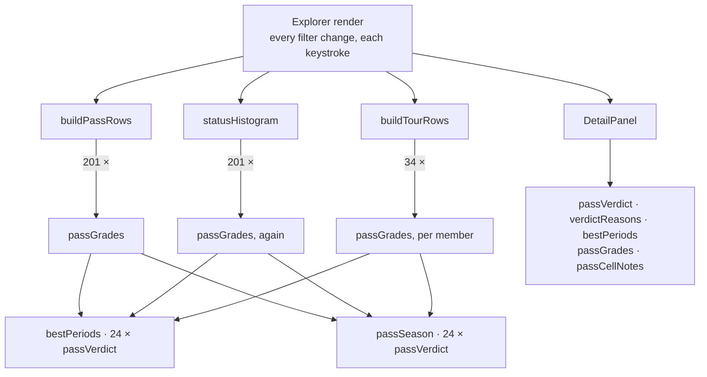
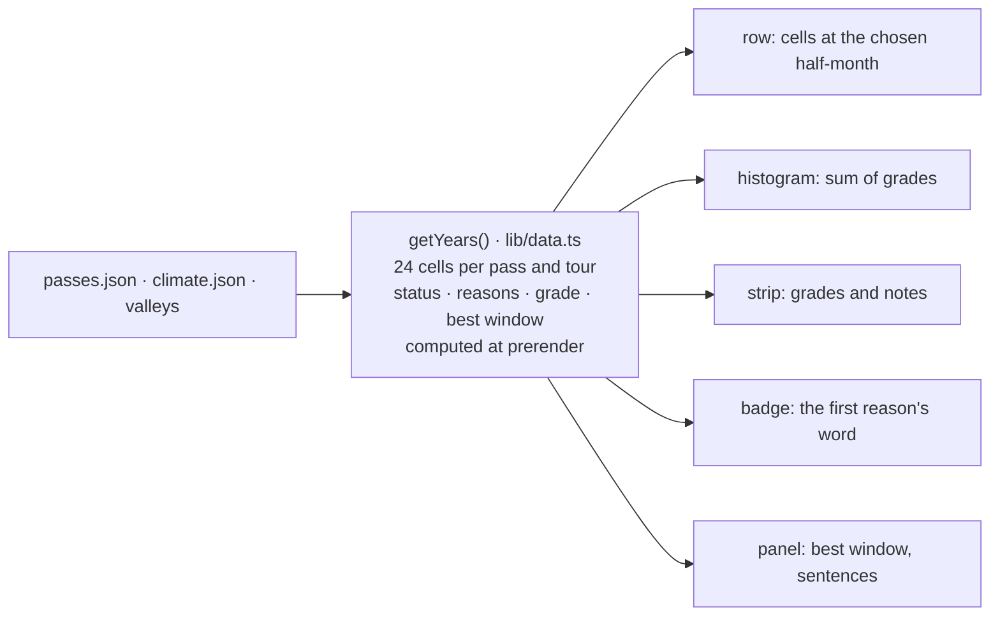

# 15 · The year of a pass, computed once

**Status:** proposed · **Effort:** S–M · **Depends on:** 13 (the reason
ladder, `bestPeriods`) · **Unblocks:** 16, 17; 12 (a destination score reads
the same series instead of running the verdict again)

## Goal

One value per pass and per tour says what its year looks like: 24 cells, each
with the status, the reasons in ladder order and the grade the strip paints.
It is computed once on the server, next to `getValleys`, and the rows, the
histogram, the strip, the badge and the panel read it. Nothing on the client
runs the verdict to find out what a strip should look like.

## Why now

The year of a pass depends on the pass, its climate series and its valley
elevation – all static, build-time data. Today it is recomputed by six series
builders at four call sites on every render of `Explorer`, which re-renders on
every filter change, including each search keystroke:

| Where                                    | Per pass                                                        | Calls of `passVerdict` |
| ---------------------------------------- | --------------------------------------------------------------- | ---------------------- |
| `buildPassRows` (rows.ts:154-160)        | 1 + `passGrades` (= `bestPeriods` 24 + `passSeason` 24)         | 49                     |
| `statusHistogram` (rows.ts:270)          | `passGrades` again                                              | 48                     |
| `buildTourRows` → `tourGrades`           | `passGrades` per member pass                                    | 48 × 34 memberships    |
| `DetailPanel` (detail-panel.tsx:265-275) | verdict, reasons, best window, grades, notes, each from scratch | ≈ 100                  |

201 passes × ≈ 97 ≈ **21 000 verdicts per keystroke**, each one running the
sunrise trigonometry in `lib/daylight.ts`, to produce 24 grades per pass that
never change. The row and the panel compute the same year through two
different call chains, so nothing guarantees they agree. Principle 1 in
`AGENTS.md` says derived data is precomputed; this is the most-computed
derivation in the app and it is recomputed in the browser.

## Non-goals

No change to the verdict, the thresholds, the ladder or the strip's look. No
new file in `data/generated/`: the series depends on the constants in
`lib/status.ts` and, later, on the live closure layer from `docs/roadmap.md`,
so it belongs in a cached getter that revalidates with the build, not in a
committed file. `climate` still reaches the client: the chart draws it and the
summer filters read the raw signals for the chosen half-month.

## The mechanism in one picture

### Before



### After



## Design

### The value

```ts
/** One half-month of one pass or tour; index 0 = early January. */
interface YearCell {
  status: Status;
  grade: Grade; // status split by the best window, what the strip paints
  reasons: StatusReason[]; // ladder order, empty when nothing fired
  snowy: boolean; // ≥ SNOW_BEST_PCT, the "es schneit gelegentlich" note
}
interface Year {
  cells: YearCell[]; // 24
  best: [Period, Period] | null; // the longest quiet run, as today
}
interface Years {
  passes: Record<string, Year>; // by pass slug
  tours: Record<string, Year>; // by tour slug, worst-of per cell
}
```

`passYear(pass, signals)` in `lib/status.ts` is the one pure builder; it
absorbs `passSeason`, `passGrades`, `passCellNotes` and `bestPeriods`, which
stop being exported. `tourYear(tour, passYears)` takes the worst status and
the lowest grade per cell over the member passes, as `tourGrades` does today.
`passVerdict` itself is untouched: it stays the replaceable layer for the
official closure status.

### Where it is computed

`getYears()` in `lib/data.ts`, `"use cache"`, the same shape as `getValleys`.
`app/page.tsx` awaits it with the others and `Explorer` receives `years`.

### Who reads it

- `lib/rows.ts`: `status`, `reason` and `season` of a row come from
  `years.passes[slug]`; `statusHistogram` sums `cells[i].grade`. The filters
  on raw signals (`passMatches`) are unchanged.
- `SeasonStrip` takes `cells` instead of `grades` plus `notes`.
- `StatusBadge` takes the cell.
- `DetailPanel` reads `best`, the cells and the reasons from the year and
  keeps `climate` for the numbers in the sentences and for the chart. Plan 17
  restructures the panel; here it only stops recomputing.

### Live closures later

Roadmap item 1 puts a closure layer in front of `passVerdict`. With this plan
that layer changes one getter's `cacheLife`; no reader changes.

## Steps

1. **Builders.** `passYear`, `tourYear` and their types in `lib/status.ts`.
   Tests: the 24-status snapshot in `status.test.ts` moves onto `passYear`
   unchanged; a tour's cell is the worst of its passes; `grade` equals
   `gradeOf(status, inBest)` for every cell.
2. **Getter and readers.** `getYears` in `lib/data.ts`, the prop through
   `page.tsx` and `Explorer`; rows, histogram, strip and badge read the year.
   Delete the old exports; `rows.test.ts` builds its expectations from
   `passYear` fixtures.
3. **Panel.** `DetailPanel` reads the year for what it shows and calls
   `passVerdict` nowhere.
4. **Measure.** Count `passVerdict` calls per search keystroke before and
   after (a `console.count` in dev, or a spy in a test over the real data)
   and put both numbers in the PR.

### Documentation

`docs/data-model.md` "Derived data": a row for the year, marked "at
prerender, not a file". `AGENTS.md` "Where things live": the rideability row
names `passYear`. `docs/scales.md` "Status per period": one sentence that the
series is computed once on the server.

## Acceptance criteria

- No module under `components/` imports `passSeason`, `passGrades`,
  `passCellNotes`, `bestPeriods`, `tourGrades` or `tourCellNotes`; they no
  longer exist.
- A search keystroke runs zero `passVerdict` calls on the client (before:
  ≈ 21 000), recorded with the command used.
- A test asserts that the row, the histogram and the strip of one pass read
  the same `Year` object.
- The 24-status snapshot passes unchanged; `bun run e2e` unchanged;
  screenshots of a list, the scrubber and a detail identical to before.

## Risks and open questions

- **Payload.** 201 passes × 24 cells as JSON is roughly 150–200 KB before
  compression, in the same order as `climate.json`, which already ships. If
  it matters, encode a cell compactly (status and grade as small integers,
  reasons as ladder indices) inside the getter and decode in one place.
- **Valleys.** The summer filters derive the valley temperature for the
  chosen half-month on the client, so `valleys` stays a prop for now. When the
  cell carries the derived number, the filter can read it and `valleys` goes.
- **Tours** with a member the year does not know (a slug typo) get an empty
  cell set; `data:check` already rejects that, so it is only a type question.
