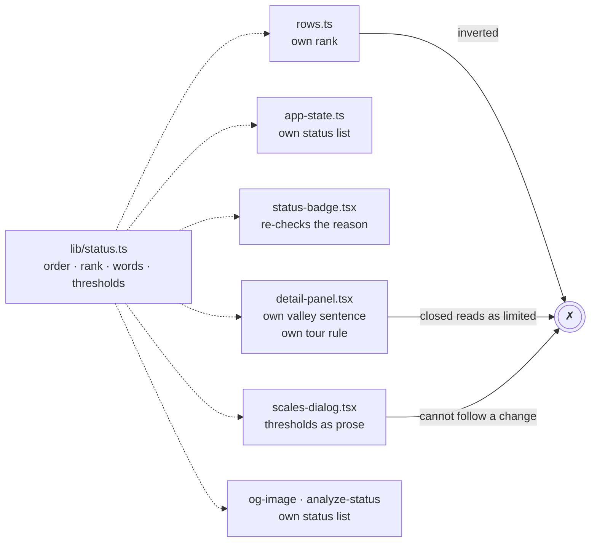
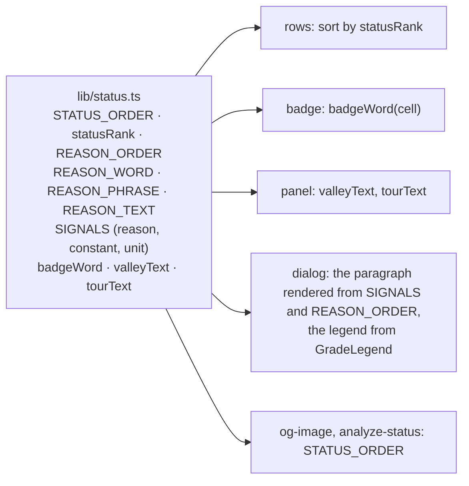

# 16 · One status vocabulary

**Status:** [done](https://github.com/mdugue/alpen/pull/40) ·
**Effort:** M · **Depends on:** 15 (the badge, the
strip and the panel read one cell) · **Unblocks:** 17 (the per-kind panel
modules print sentences they do not compose), 08 (a second language
translates one table)

> **Re-measured 2026-09-21 at `6c1897b`:** every acceptance criterion
> passes (the status triple in two places, `statusRank` once, the dialog
> without threshold literals, the four tests). PR #47 then reintroduced part
> of what this plan removed – a second `GRADE_ORDER` and a second `gradeOf`
> in `lib/destination.ts`, the "beste Zeit" sentence twice in JSX, a dead
> `statusOf` whose body is inlined – and the "abgeleitet" paragraph is still
> assembled in JSX. That tail is phase B of [plan 31](31-panel-model.md).

## Goal

Every word, order, rank, threshold and sentence about the rideability status
has one home, `lib/status.ts`, and the badge, the rows, the panel, the legend,
the scales dialog, the share image and the calibration script read it from
there. A changed threshold reaches the dialog that explains it; a reason that
joins the ladder gets its word, its phrase and its sentence in one edit.

## Why now

Principle 3 in `AGENTS.md` is honesty, and the words that carry it are
scattered. Reading the code found these:

| Fact                               | Homes                                                                                                     | State                                                                                                         |
| ---------------------------------- | --------------------------------------------------------------------------------------------------------- | ------------------------------------------------------------------------------------------------------------- |
| rank of `open · risky · closed`    | `status.ts:445`, `rows.ts:297`                                                                            | same name `STATUS_RANK`, **opposite direction**                                                               |
| the status triple as a literal     | `schema.ts:36`, `app-state.ts:21`, `pass-map.tsx:356`, `opengraph-image.tsx:210`, `analyze-status.ts:143` | five copies                                                                                                   |
| which reasons make "eingeschränkt" | `GRADE_HINT.limited` (status.ts:108), the dialog (scales-dialog.tsx:139)                                  | prose lists them by hand, in an order that is not `REASON_ORDER`                                              |
| threshold values                   | constants (status.ts:267-280), the dialog (scales-dialog.tsx:139-151), analyze-status.ts:136              | the dialog carries seven literals and imports nothing from `lib/status`                                       |
| "im Tal … abgeleitet"              | `REASON_TEXT.heat` (status.ts:383), `detail-panel.tsx:460`                                                | two independent sentences                                                                                     |
| which pass limits a tour           | `tourYear` (status.ts), `detail-panel.tsx` (`limiting`)                                                   | the panel re-derives it with `!== "open"`, so under an "oft gesperrt" badge it prints "Eingeschränkt durch …" |
| `PASS_SORTS`                       | `app-state.ts:30`, `rows.ts:277`                                                                          | two copies                                                                                                    |

None of these has a test, because none of them is a function.

Two line references above drifted before the work started: the second
`STATUS_RANK` is `rows.ts:374`, and `status.ts:445` is `GRADE_RANK`, which
runs the _other_ way (higher is better, because `tourYear` takes the
minimum). So the pair with one name and two directions was `STATUS_RANK` in
`rows.ts` against `statusRank`'s neighbourhood in `lib/status.ts`; the
constant the plan calls `WET_RISKY_PCT` is `WET_LIMITED_PCT`. Everything else
held.

## Non-goals

`Status` (three-valued: filter, hash, map) and `Grade` (four-valued: strip,
histogram) stay two types; `docs/scales.md` explains why. No threshold
changes. No wording changes beyond the tour sentence, which is a defect.
`docs/scales.md` stays hand-written; keeping it in step is plan 11 item 18.

## The mechanism in one picture

### Before

### After

## Design

### Order and rank

`STATUS_ORDER` (`open, risky, closed`) and `statusRank(status)` (higher is
worse) exported once from `lib/status.ts`; `worstStatus(a, b)` for the tour
verdict and the histogram. `app-state.ts` re-exports `STATUS_ORDER` as
`ALL_STATUS` for the filter, `rows.ts` sorts by `statusRank`, the share image
and the calibration script iterate `STATUS_ORDER`. `PASS_SORTS` lives in
`app-state.ts` only; `rows.ts` imports it.

`worstStatus` was dropped while implementing: nothing calls it. Plan 15 had
already made both callers it was meant for reduce by **grade** – `tourYear`
takes the minimum `GRADE_RANK`, and the histogram counts grades – and a grade
is the status refined by the best window, so the lowest grade is always the
worst status too. Adding an export with no caller would have been one more
way to say the same thing, which is what this plan is against.

### The ladder drives the prose

`GRADE_HINT.limited` is built from `REASON_ORDER` and `REASON_PHRASE`, so it
lists every reason that can make a cell "eingeschränkt", in ladder order.

`SIGNALS` is one table, `{ reason, constant, unit, reads }` in ladder order,
with the constants that exist today (`SNOW_RISKY_PCT`, `FROST_RISKY_PCT`,
`HEAT_VALLEY_TMAX`, `WET_RISKY_PCT`, `SHORT_DAY_HOURS`, `COLD_DESCENT_TMAX`,
`SNOW_BEST_PCT`). The scales dialog renders its "Vier Stufen, eine Leiter"
paragraph from it and `REASON_ORDER`; `analyze-status.ts` reads its cohort
thresholds from it. The legend paragraph in the dialog is `GradeLegend`,
which already renders the four grades from `GRADE_ORDER`.

### Sentences

Three sentence builders join `REASON_TEXT` and `seasonText` in
`lib/status.ts`, and the panel prints what they return:

- `badgeWord(cell)`: the one word of the first reason when the cell is
  `risky`, otherwise the status label; replaces the check in `statusText`.
- `valleyText(pass, bucket, valley)`: the one "abgeleitet" sentence, with the
  same "± 3 °C" that `REASON_TEXT.heat` uses.
- `tourText(cell)`: the tour builder returns `limiting: Pass[]`, the passes
  whose status equals the tour's. The sentence carries the word of that
  status: "Oft gesperrt: Stilfser Joch." or "Eingeschränkt durch Gavia,
  Mortirolo." Never "eingeschränkt" for a closed tour.

## Steps

1. **Order, rank, lists.** `STATUS_ORDER`, `statusRank`, `worstStatus`; delete
   the five literals and the inverted twin; `PASS_SORTS` once. A mechanical
   PR with no visible change.
2. **Ladder-driven prose.** `SIGNALS`, `GRADE_HINT.limited` from the ladder,
   the dialog paragraph and the legend rendered from the tables. Screenshot
   the dialog, light and dark, and read the generated paragraph aloud once.
3. **Sentences.** `badgeWord`, `valleyText`, `tourText` with
   the tour builder's `limiting`; the panel and the badge print them. Screenshot a
   tour with a closed pass in the chosen half-month.
4. **Tests.** Every `StatusReason` has a word, a phrase and a sentence;
   `GRADE_HINT.limited` names every reason in ladder order; the dialog
   paragraph contains the value of every `SIGNALS` constant; `tourText` for a
   closed pass says the closed word.

### Documentation

`docs/scales.md` "Status per period": name `SIGNALS` as the table the dialog
reads. `AGENTS.md` "Where things live": the rideability row names the sentence
builders.

## Acceptance criteria

- `grep -r '"open", "risky", "closed"'` matches `lib/schema.ts` and
  `lib/status.ts` only; `STATUS_RANK` exists once.
- The scales dialog imports from `lib/status` and carries no numeric
  threshold literal.
- The tour detail of a tour with a closed pass shows the closed word in the
  sentence under the badge (test on `tourText`, screenshot in the PR).
- The four tests in step 4 pass; `bun run e2e` unchanged.

## Risks and open questions

- **Generated German.** A paragraph assembled from a table can read like a
  list. The dialog's current prose is good; the generated one must be read as
  a sentence in the PR, and the table may carry connective words if needed.
- **The badge for a closed cell.** `REASON_WORD["outside-window"]` is
  "gesperrt" and never rendered today, because the badge shows the status
  label for a closed cell. `badgeWord` keeps that rule; the entry stays for
  the strip's cell hint.
