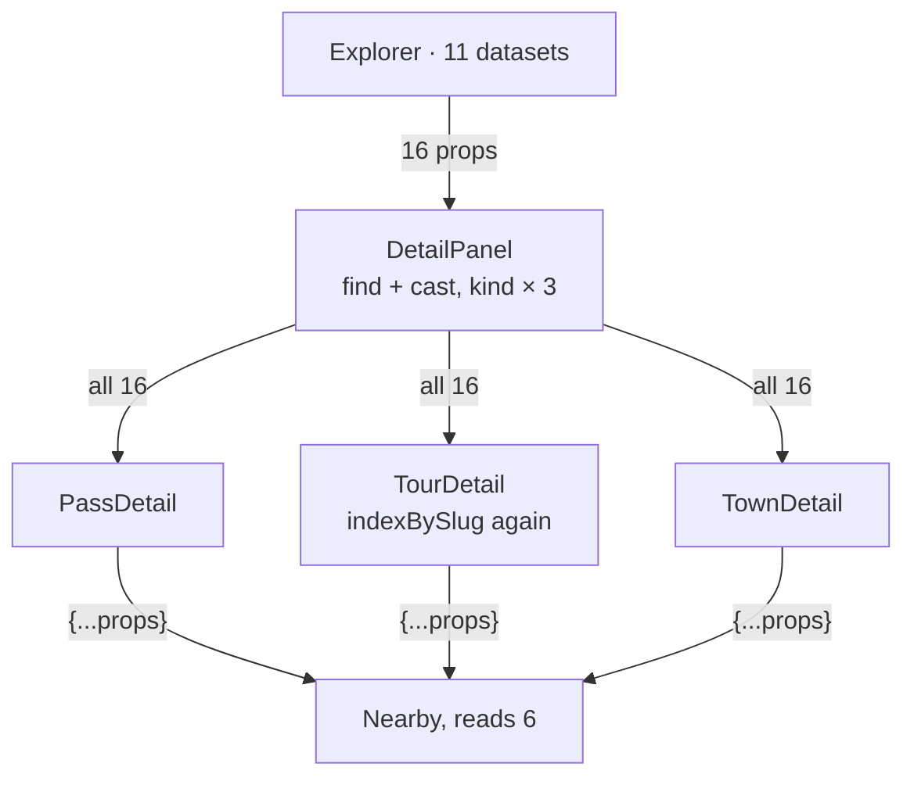
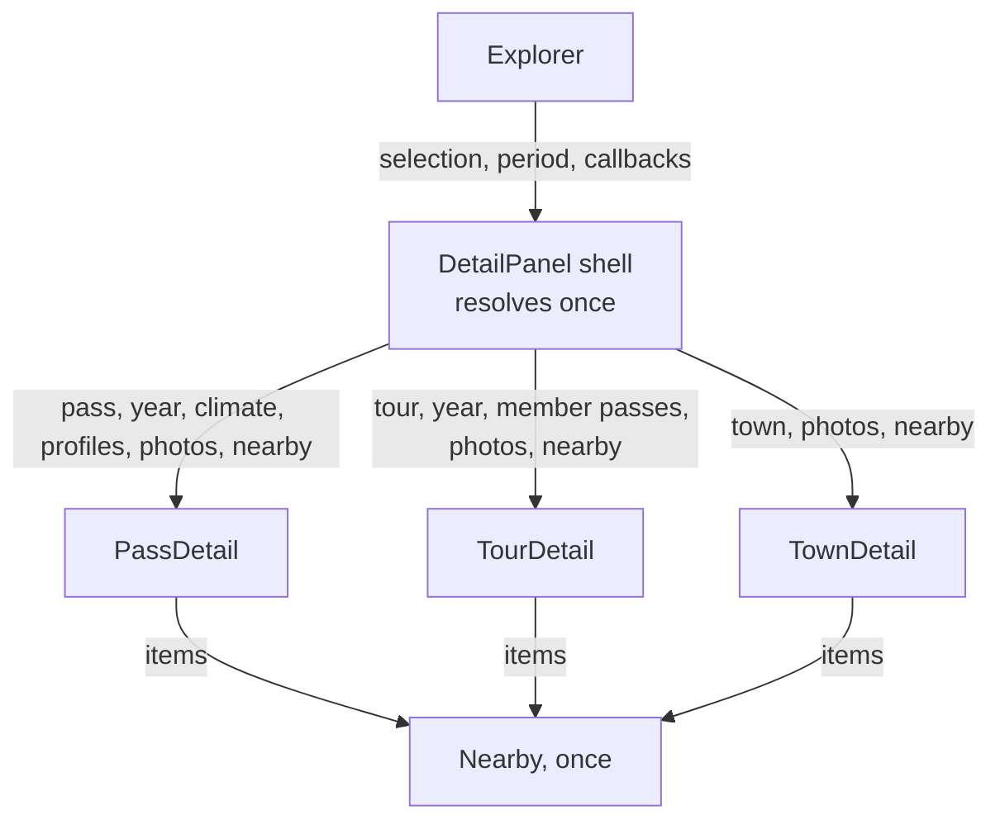

# 17 · Detail panel per kind

**Status:** proposed · **Effort:** M · **Depends on:** 15 (the year arrives
instead of its inputs), 16 (the sentences come from `lib/status.ts`); easier
after 18 (the selection resolves itself) · **Unblocks:** 02 (an entity page
renders the same per-kind module on the server), 12 (a destination detail is
a fourth kind, not a fourth branch)

## Goal

The detail of a pass, a tour and a town is three modules, each with the
interface it actually reads, each renderable in a test with one fixture. The
panel shell resolves the selection once and hands over. Adding a field to what
a pass shows touches the pass module and nothing else.

## Why now

`components/panel/detail-panel.tsx` is the most-changed file in the repository
(21 of 66 commits) and its interface is as wide as its implementation:

- `Props` has 16 fields (detail-panel.tsx:89-111): every dataset the app has
  plus six callbacks.
- Every kind branch takes all of them: `PassDetail(props: Props & { pass })`,
  `TourDetail`, `TownDetail` (263, 500, 591), and `Nearby` receives
  `{...props}` three times to read six fields (481, 576-580, 599).
- `Props` is passed _as_ `Signals` (213, 267, 512, 563) because it happens to
  have `climate` and `valleys` fields.
- The kind is branched three times (636-641, 644-649, 699-707), the entity
  found with `find` and cast (`as Pass`), and `TourDetail` rebuilds
  `indexBySlug(props.passes)` although `Explorer` already holds it.
- Nothing tests it. The e2e suite reads the panel's title and nothing else.

## Non-goals

The layout stays: the folding `Section`s, the photo carousel, the profile,
the weather, the climate chart and the phone sheet are untouched inside. No
new information is shown.

## The mechanism in one picture

### Before



### After



## Design

### The shell

`DetailPanel` keeps the slide-over and sheet contract with `Explorer`:
`selection`, `period`, `onSelect`, `onBack`, and the favourite and profile
callbacks. It resolves the selection to an entity once, gathers what that
entity needs and renders one of the three modules. Where the shell gets the
datasets from is the transport question of plan 18 (a context) or props to
the shell only; either way the kind modules never see a `Record<string, …>`.

### The entity, not the row

A selected pass may be filtered out of the list, so the input of `PassDetail`
is the pass and its `Year` (plan 15), never a `PassRow`.

### The three modules

```ts
PassDetail({ pass, year, climate, valley, profiles, photos, nearby, period, favorite, on… })
TourDetail({ tour, year, passes, photos, nearby, period, favorite, on… })
TownDetail({ town, photos, nearby, period, favorite, on… })
```

`profiles` is that pass's `ProfileWithCoords[]`, `photos` that entity's
`Photo[]`, `nearby` a prepared list of `{ kind, slug, name, status }` items.
Sentences come from `lib/status.ts` (plan 16); the modules compose nothing.

### Tests

`react-dom/server`'s `renderToStaticMarkup` needs no DOM. One test per kind
renders a fixture and asserts the German that matters: the title, the badge
word, the tour sentence for a closed pass, the "abgeleitet" line and
"Talwert nicht ableitbar" when there is no profile. `package.json`'s `test`
script grows to `bun test lib components`.

## Steps

1. **Shell resolves once.** The three kind modules with the props above;
   `Nearby` takes items. No visible change; screenshots identical.
2. **Delete the accidents.** `signalsOf(props, …)`, the `find` + casts, the
   rebuilt `passIndex`, the three spreads.
3. **Tests.** Fixtures for one pass (with and without profile), one tour with
   a closed pass, one town; the test script.

### Documentation

`AGENTS.md` "Where things live": the panel row names the three modules.
Plan 11 item 6 ("slug index instead of `find`") is closed by step 2.

## Acceptance criteria

- No kind module's props include a dataset record (`Record<string, …>`) or a
  whole `passes`/`tours`/`towns` array; no `as Pass`/`as Tour`/`as Town`.
- `bun test components` renders all three kinds from fixtures and passes.
- Screenshots of a pass, a tour and a town, desktop and phone, light and
  dark, identical to before the change.

## Risks and open questions

- **`next/dynamic` in a test.** The climate chart is loaded with
  `next/dynamic`; in `renderToStaticMarkup` it renders its loading state, which
  is what the server does today. If that proves brittle, the chart slot takes
  the chart as a child and the test passes none.
- **Plan 02** wants these modules on the server. Keep them free of client-only
  hooks except where the DOM is needed (the carousel, the profile cursor).
