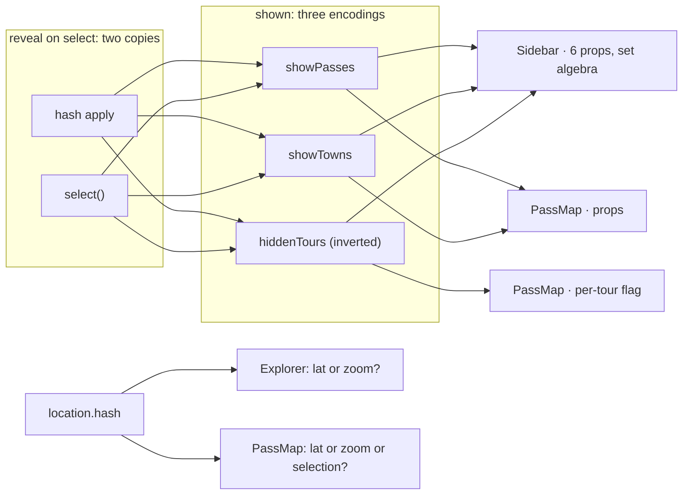
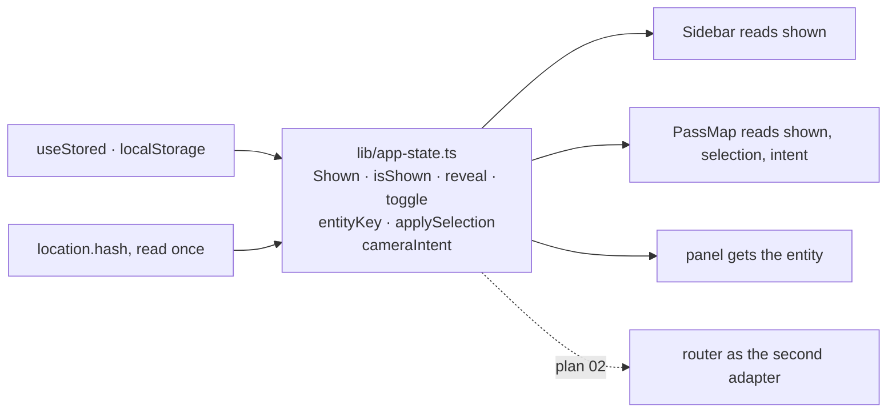

# 18 · Selection, visibility and camera: decided once

**Status:** superseded by [28](28-app-state.md) and
[29](29-camera-machine.md) · **Effort:** M · **Depends on:** – ·
**Unblocks:** 19 (the scene reads one "shown"), 02 (the router becomes the second adapter of
the same rule), plan 11 item 3 (the context is this module's transport)

> **Superseded 2026-09-21.** Re-measured at `6c1897b`: the composite key
> is formatted at nine sites (not six); the reveal rule is one full and two
> partial copies that have diverged (a pasted hash does not set the tab,
> `back()` does not clear the hover); the camera-moving call sites are
> thirteen (not ten), and the sheet's cover is now a camera input. Two
> corrections: the two `defined` helpers no longer "check `NaN` differently"
> (both use `Number.isNaN`; keep the deletion, drop the bug framing), and the
> non-goal "the five camera entry points stay in the map" is re-decided –
> 363 of the map's 415 new lines accumulated under it. The selection, the
> shown value, the period and the sheet state are [plan 28](28-app-state.md);
> the camera and the geometry are [plan 29](29-camera-machine.md).

## Goal

One module says what is shown on the map, what selecting something reveals,
how an entity is keyed and where the camera goes on load. `Explorer`,
`Sidebar`, `PassMap`, the panel and the hash read it; none of them derives it
a second time.

## Why now

Three concepts, each written more than once:

**Shown on the map** has three encodings: `showPasses: boolean`,
`showTowns: boolean` and `hiddenTours: string[]`, an inverted list
(explorer.tsx:119-124). The map receives the first two as props and the third
as a per-tour `visible` flag (pass-map.tsx:74, 88-90); the sidebar does the
set algebra and the "n von m" count itself (sidebar.tsx:231-248, 71-74) and
takes six props for it. The rule "selecting something makes it visible" is
written twice, once for the hash and once for `select` (explorer.tsx:177-180,
229-232).

**Selection** is `{ kind, slug }` with no behaviour. The composite key is
formatted by hand at six sites (explorer.tsx:252, 403; sidebar.tsx:77;
pass-map.tsx:1067; and `photoKey`/`nearbyKey`, which are the same function);
the panel finds the entity again although the explorer holds `passIndex`;
the map derives `selPass` three times (pass-map.tsx:1225, 1267, 1289).

**Camera on load** has two owners. `Explorer` reads the hash and asks
"lat or zoom set?" (explorer.tsx:161-173); `PassMap` reads the hash _again_ in
its build effect and asks "lat or zoom or selection?" (pass-map.tsx:988-997),
with its own copy of `defined` that checks `NaN` differently
(pass-map.tsx:816 vs app-state.ts:187). One side counts a selection, the
other does not.

## Non-goals

The hash keys and `parseHash`/`serializeHash` stay. The controls stay (a
`Switch` per kind, `Toggle`s). No router: plan 02 replaces the hash adapter,
not the rule.

## The mechanism in one picture

### Before



### After



## Design

### Shown

```ts
interface Shown { passes: boolean; towns: boolean; hiddenTours: readonly string[] }
isShown(shown, kind, slug): boolean
toggleKind(shown, kind): Shown
toggleTour(shown, slug): Shown
reveal(shown, selection): Shown   // the one copy of "selecting shows it"
shownTours(shown, allTours): number
```

Stored under the three existing keys, so no migration, but through one
`useShown()` hook. `Sidebar` takes `shown` and two functions instead of six
props; `PassMap` takes `shown` and asks `isShown` where it builds filters.

### Selection

`entityKey(kind, slug)` in `lib/app-state.ts` (client-safe); `photoKey` and
`nearbyKey` become it. `applySelection(state, selection)` is one pure step
that sets `selection` and `lastSelection`, reveals the kind, clears the
profile cursor and picks the sheet snap; `select`, `back` and the hash
initialisation in `Explorer` all call it.

### Camera intent

```ts
type CameraIntent = { kind: "view"; view: MapView } | { kind: "selection" } | { kind: "fit" }
cameraIntent(hash: Hash): CameraIntent  // shared link, else selection, else fit to what is drawn
```

Computed once where the hash is read and handed to `PassMap` as a prop. The
map's build effect waits for a non-null intent; `readHash` leaves
`pass-map.tsx`, and so does its `defined`. The five camera entry points stay
in the map, but the "already fitted" tolerance moves next to the intent so it
is a tested number.

### Storage keys

One `STORAGE` table in `lib/app-state.ts` with every `alpenpaesse:*` key,
including the map's `base` and `overlays`.

### Transport

The module is pure. Whether the explorer hands it down as props or through
the `ExplorerProvider` of plan 11 item 3 is decided in the PR; the rule does
not depend on it, and plan 02 later swaps the hash adapter for the router
without touching the rule.

## Steps

1. **Shown.** The type, the functions, the hook, tests; `Sidebar` and
   `PassMap` read it. Delete the two reveal copies.
2. **Selection.** `entityKey`, `applySelection`, tests; delete the six
   literals and the panel's `find`.
3. **Camera.** `cameraIntent`, the prop, the map without `readHash`; the
   e2e for a shared link (camera) and for the fit-on-open must pass.
4. **Storage table.**

### Documentation

`AGENTS.md` "Where things live": the filter/selection row names `Shown`,
`applySelection` and `cameraIntent`. Plan 11 item 3 gets a note that the
rule now exists and the context is its transport.

## Acceptance criteria

- `reveal`, `isShown`, `applySelection` and `cameraIntent` have unit tests,
  including "a shared link with a selection but no camera flies to the
  selection and does not fit".
- `grep -rn '\${.*kind}:\${.*slug}'` outside `entityKey` returns nothing;
  `readHash` is imported by `explorer.tsx` only.
- `Sidebar` no longer receives `showPasses`, `showTowns`, `hiddenTours` or
  their setters.
- `bun run e2e` passes, including the camera scenarios (3 and 9).

## Risks and open questions

- **One effect tick.** The map read the hash itself because child effects run
  before the parent's. With the intent as a prop the map builds one tick later
  than today, which is invisible next to MapLibre's own setup; e2e 9 confirms
  a shared link opens on its camera without a fit flash.
- **`lastSelection`** exists so the closing sheet keeps its content.
  `applySelection` owns it, which is clearer, but the sheet's animation is the
  reason it exists and must be re-checked on a phone.
