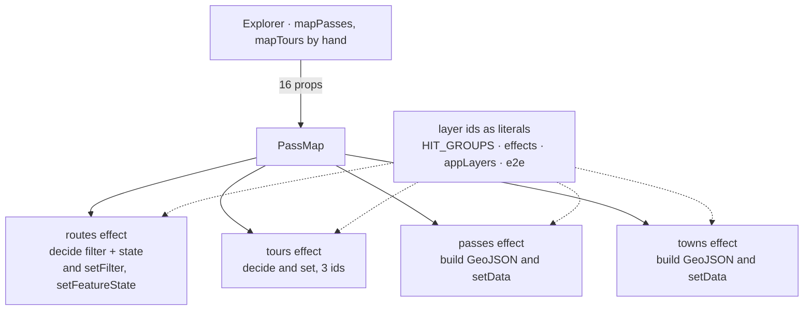
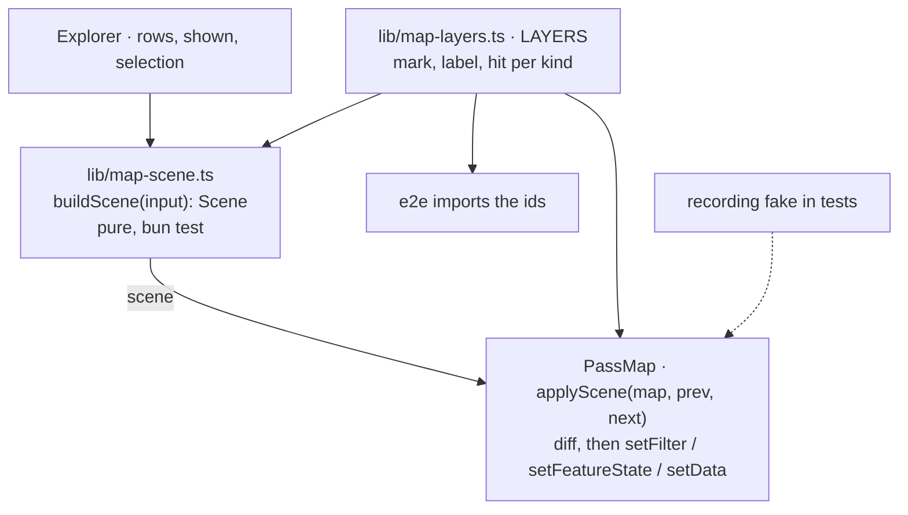

# 19 · A map scene between the rows and MapLibre

**Status:** proposed · **Effort:** M–L · **Depends on:** 18 (one `shown`,
one selection), 01 (filters and feature state) · **Unblocks:** the official
closure status on the map (a scene input, not an effect edit), 12
(destinations as a fifth mark come in through the scene)

## Goal

What the map should show is a value: a pure module turns rows, `shown` and
the selection into a scene – the filters, the feature state, the point
features and the frame – and `PassMap` applies it. The scene is tested
without WebGL, the layer ids live in one table, and a hit layer cannot drift
from the mark it widens.

## Why now

`components/map/pass-map.tsx` is 1 571 lines and the second most-changed file
(20 commits). Deciding what to draw and telling MapLibre happen in the same
four effects:

- the routes effect builds a filter and per-ascent feature state _and_ calls
  `setFilter`/`setFeatureState` (pass-map.tsx:1226-1237); the tours effect
  the same on three layer ids (1246-1257); the passes and towns effects
  build GeoJSON with seven and six properties _and_ call `setData`
  (1268-1283, 1290-1306); `visibleBounds` frames from the same inputs
  (903-911).
- `Explorer` already translates rows into map entities by hand
  (explorer.tsx:207-222).
- Layer ids are string literals at every site: `HIT_GROUPS` (176-189), the
  effects (1231, 1248), `appLayers`, and the e2e suite (e2e/app.test.ts:
  259-269). `AGENTS.md` says "a hit layer needs the same filter as the layer
  it widens, or a hidden tour still answers"; that invariant is upheld by two
  adjacent literals.
- Nothing in `components/` has a unit test; the e2e reaches the map through
  `window.__alpen.map` and raw `queryRenderedFeatures`.

## Non-goals

The setup effect, `pickAt` and `HIT_GROUPS`'s priority, 3D, base and scheme
switching, the popup, the camera (plan 18) and the style stay as they are.
`pass-map.tsx` stays one component, as `oxlint.config.ts` says by design; the
new modules sit beside it.

## The mechanism in one picture

### Before



### After



## Design

### The scene

```ts
interface Scene {
  routes: { filter: Expression; state: Record<string, { status: Status; selected: boolean }> };
  tours: { filter: Expression; state: Record<string, { status: Status; selected: boolean }> };
  passes: FeatureCollection<Point, PassProps>;
  towns: FeatureCollection<Point, TownProps>;
  frame: BBox | null; // what the fit button frames
}
buildScene({ passRows, tourRows, townRows, shown, selection, hovered, coarse }): Scene
```

`lib/map-scene.ts`, client-safe and without a MapLibre import: a filter is a
plain expression array, a feature collection is plain GeoJSON. The explorer's
`mapPasses`/`mapTours` translation goes; `PassMap` takes `scene`.

### The layers

`lib/map-layers.ts` holds `LAYERS`, one entry per kind with its mark, label
and hit ids, and `hitFor(mark)`. `appLayers` is built from it, `HIT_GROUPS`
reads it, the e2e imports it. The hit layer's filter is _derived_ from its
mark's filter in one place, which is what makes the invariant structural.

### Applying

```ts
type SceneTarget = Pick<maplibregl.Map, "setFilter" | "setFeatureState" | "removeFeatureState"> & {
  setData(source: string, data: FeatureCollection): void;
};
applyScene(target: SceneTarget, prev: Scene | null, next: Scene): void
```

Diffs the state per key and sets only what changed; sets everything when
`prev` is null, which is the `style.load` case `AGENTS.md` describes. Tested
with a recording fake that logs its calls.

## Steps

1. **Layer table.** `LAYERS`, `hitFor`, `appLayers` and `HIT_GROUPS` from it,
   the e2e importing the ids. No behaviour change.
2. **Scene.** `buildScene` with tests; `PassMap` takes `scene`; the four
   effects read from it instead of computing. The explorer's hand translation
   goes.
3. **Apply.** `applyScene` with the fake; the four effects become one call.
4. **Invariant.** A test that every mark layer's hit layer carries the same
   filter, over the built `appLayers`.

### Documentation

`AGENTS.md` "Where things live": the map row gains `lib/map-scene.ts` and
`lib/map-layers.ts`; the "What answers the pointer" convention says the hit
filter is derived, not repeated.

## Acceptance criteria

- `buildScene` tests: a hidden tour is absent from the tour filter and from
  its hit filter; a selected ascent carries `selected` state; a favourite pass
  carries its flag; the frame equals today's `visibleBounds` for the same
  input.
- `applyScene` with two equal scenes makes zero calls on the fake.
- `grep -rn '"routes-hit"\|"passes-hit"\|"towns-hit"\|"tours-hit"'` matches
  `lib/map-layers.ts` only.
- `bun run e2e` unchanged; screenshots of the map with a hidden tour, a
  selected ascent and the fit frame identical to before.

## Risks and open questions

- **Feature state and tiles.** MapLibre keeps state per source and applies it
  to tiles as they load, so a diff must never skip a key that is new since
  `prev`; the "set everything on `style.load`" rule stays and is tested.
- **Hover.** The hovered town's reach hull is drawn from feature state too;
  it is part of the scene input (`hovered`) so it does not need a side path.
- **Size of the scene.** 201 points and 300 route states per build is small;
  the React Compiler memoises `buildScene`'s inputs, so it runs when the rows
  change, as the effects do today.
