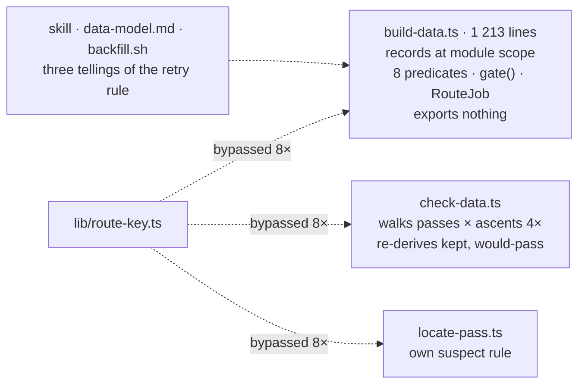
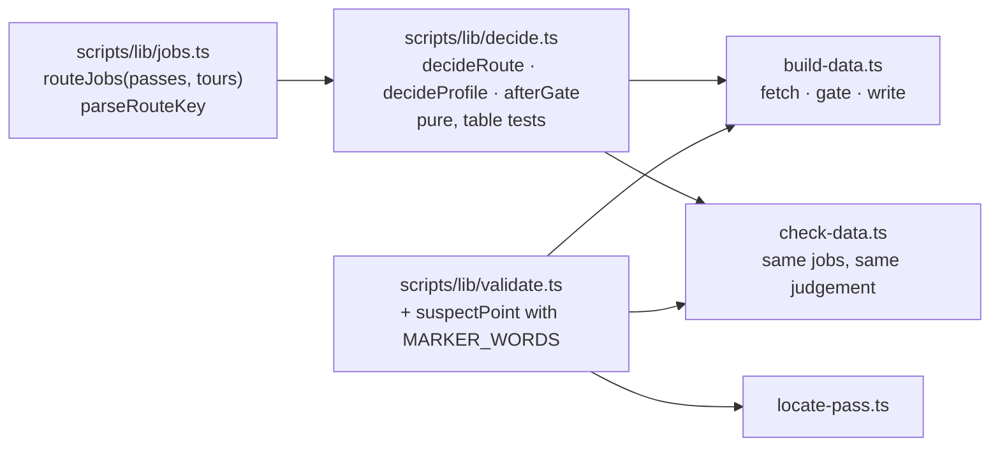

# 20 · The gate's decisions out of the build script

**Status:** superseded by [32](32-pipeline-planner.md) · **Effort:** M–L ·
**Depends on:** 00 (the gate) ·
**Unblocks:** 21 (an offline pipeline test needs decisions it can import),
roadmap 1 (a closures step reuses the job list), 12 (destinations enter the
pipeline as jobs)

> **Superseded 2026-09-21.** Re-measured at `6c1897b`: sixteen
> derivations (not eight) over six mutable records, `gate()` is six
> functions and 242 lines, the route key is bypassed at eleven sites, the
> retry rule is told seven times and `backfill.sh` still contradicts it.
> New: `check-data.ts` disagrees with the build in two measurable ways,
> `--only` is honoured by two of nine counters, the keep/restore path has
> never run against the stored data (0 of 9 rejections sit beside a stored
> route), and two spent migrations run on every invocation. All of it is
> phase B of [plan 32](32-pipeline-planner.md).

## Goal

Which route is fetched, retried, kept, dropped or deferred is a pure module
with table tests. `build-data.ts` fetches and writes; `check-data.ts` judges
with the same module instead of restating it; a route key is built and parsed
in one place; and "is the pass point suspect" has one answer.

## Why now

The header of `scripts/build-data.ts` names the two invariants that keep the
gate "from eating its own work". Their implementation is eight predicates
closing over module-level records and flags (`upgradable`, `provisional`,
`needsRoute`, `retryDue`, `isRejected`, `summitOff`, `pendingRoutes`,
`pendingProfiles`, build-data.ts:677-760) and the keep/restore state machine
in `gate()` (1010-1093). None of it is importable: the script reads
`passes.json` at import, parses `argv` and starts its pipelines at top level.
`validate.test.ts` covers measuring and judging, which makes the rest of the
gate look tested; the retry rule, the deferral of profiles for provisional
routes and the budget cut-off have no test.

The same decisions are restated elsewhere:

- `check-data.ts` re-derives "kept" and "would pass today" (387-403), walks
  passes × ascents four times and recovers the kind from the string with
  `key.startsWith("tour:")`.
- `lib/route-key.ts` exists "so the map assets, the nearby computation and
  the panel cannot drift apart on a string literal" and is bypassed at eight
  sites (`build-data.ts:613, 651`; `check-data.ts:238, 315, 413, 418`;
  `locate-pass.ts:115`; `lib/profile.ts:167`).
- "Is the pass point suspect" is implemented three times with three answers
  for an unmeasured road distance: not a finding (`build-data.ts:705-715`),
  a separate "ungeprüft" warning (`check-data.ts:206-228`), suspect
  (`locate-pass.ts:130-138`). Only `check-data.ts` knows the wording for a
  traverse, so the build log says "Passpunkt" for a Höhenstraße.
- The prose has already drifted: `scripts/backfill.sh:80` tells the curator
  to run `--retry-rejected` after fixing coordinates; the `curate-data` skill
  and `docs/data-model.md` say the retry is automatic once the inputs change.

## Non-goals

No threshold changes, no change to what is fetched or when (plan 21), no
change to the files: every generated file is byte-identical after the
refactor, and so is the output of `data:check --explain`.

## The mechanism in one picture

### Before



### After



## Design

### Jobs and keys

`routeJobs(passes, tours): RouteJob[]` derives, once, what today's `RouteJob`
derives: the key via `ascentKey`/`tourKey`, traverse or climb from `type`,
the `check`, the inputs hash and the waypoints. `parseRouteKey(key)` joins
`lib/route-key.ts` and returns `{ kind: "ascent", slug, index }` or
`{ kind: "tour", slug }`; the eight literal sites and the `startsWith` go.

### Decisions

```ts
interface Stored { routes; meta; rejected; profiles; summits } // what data/generated holds
interface Flags { ors: boolean; upgradeOsrm: boolean; retryRejected: boolean }
decideRoute(job, stored, flags): "keep" | "route" | "upgrade" | "retry" | "rejected"
decideProfile(job, stored, routeDecision): "keep" | "profile" | "defer" | "none"
afterGate(job, stored, verdict): Partial<Stored>   // keep/restore, cached profile, stale drop
```

`scripts/lib/decide.ts`. The eight predicates become these three functions
over an explicit `Stored` value; `report()` and `--status` count from them.
`build-data.ts` loads `Stored`, maps jobs to decisions, runs the fetchers for
what needs fetching and writes what `afterGate` returns.

### Suspect pass point

`suspectPoint(summit, pass)` in `scripts/lib/validate.ts`, next to
`checkSummit` and `checkRoad`, with `MARKER_WORDS`. One answer for an
unmeasured road distance: it is its own finding, "ungeprüft", as
`check-data.ts` says today, never silently fine. Three callers.

### One telling of the retry rule

`backfill.sh`, the skill and `docs/data-model.md` describe the rule
`decideRoute` implements, in the same words, and a test on `decideRoute`
states it: a rejection is retried when its inputs hash changes or when its
stored metrics pass the current limits, and not otherwise.

## Steps

1. **Keys and jobs.** `parseRouteKey`, `routeJobs`, the literal sites
   replaced. Regression: `data:check --explain` byte-identical.
2. **Decisions.** `decideRoute`, `decideProfile` with table tests;
   `build-data.ts` and `--status` use them.
3. **After the gate.** `afterGate` with tests for keep/restore on a failed
   upgrade, the cached profile and the stale drop.
4. **Suspect point.** `suspectPoint`, three callers, `MARKER_WORDS` moved.
5. **check-data.** Imports jobs and decisions; the four walks become one.
6. **Docs.** `backfill.sh`, the skill and `data-model.md` say the same.

### Documentation

`docs/data-model.md` "The route quality gate": the diagram names `decide.ts`
between the stored files and the router. `AGENTS.md` "Where things live": the
route quality gate row gains `jobs.ts` and `decide.ts`.

## Acceptance criteria

- `bun run data:check --explain` and `bun run data:build --status` produce
  byte-identical output before and after, on the current data.
- Tests cover: the three branches of the retry rule; a provisional OSRM
  route defers its profile; "same source as before: nothing gained"; the
  restore of a kept route after a failed upgrade; the budget cut-off between
  geometry and profile; `suspectPoint` with an unmeasured road distance.
- `grep -rn 'startsWith("tour:")'` and the `${slug}:${i}` literals return
  nothing outside `lib/route-key.ts`.
- `backfill.sh` no longer tells the curator to run `--retry-rejected` after
  a coordinate fix.

## Risks and open questions

- **Module-level state.** The script's records are loaded at import and read
  by everything; passing an explicit `Stored` value means the top-level
  pipeline moves into a `main()` that loads first. That is the whole point,
  and the reason the regression check is byte-identical output.
- **`--only`** filters jobs today by string prefix; it filters the job list
  after `routeJobs` instead.
- **Speed of `check-data`.** One walk instead of four; it must not get
  slower, and the `--explain` run is the measure.
