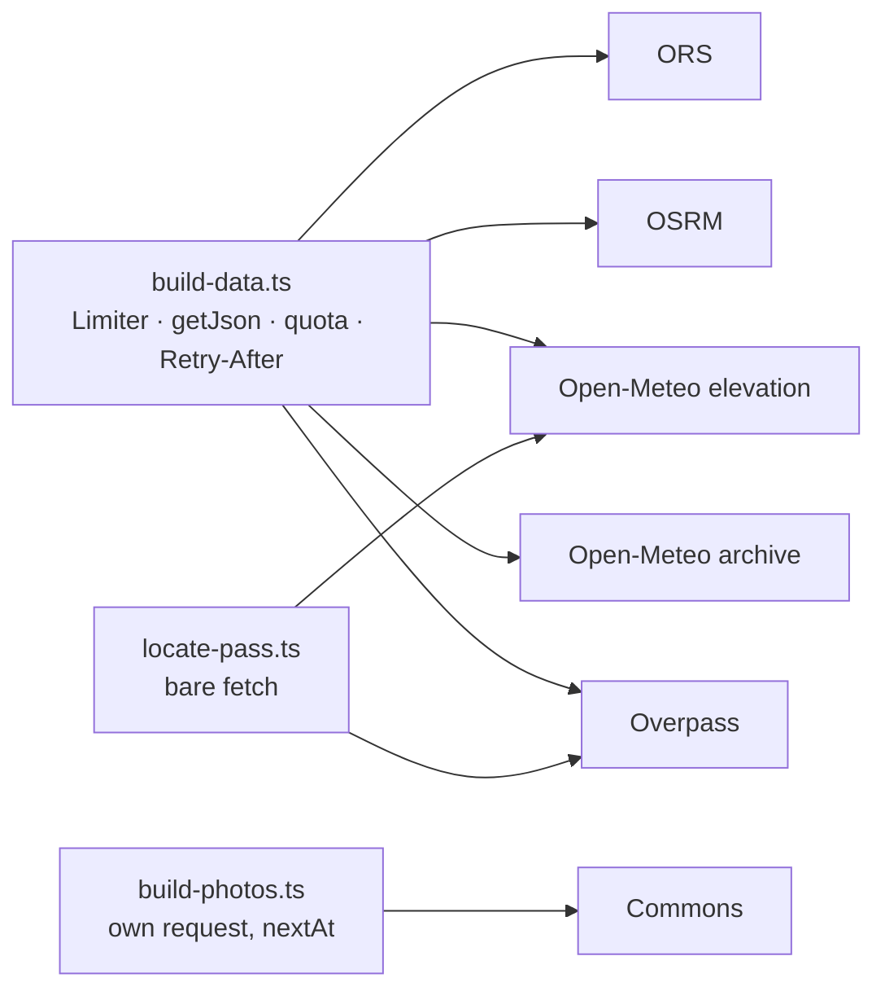
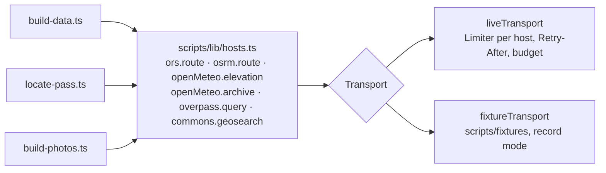

# 21 · One adapter per external host

**Status:** superseded by [32](32-pipeline-planner.md), whose phase A is this
plan ([#62](https://github.com/mdugue/alpen/pull/62)) · **Effort:** M ·
**Depends on:** 20 (decisions that can be imported) · **Unblocks:** an offline pipeline test; roadmap 1 (closure
sources) and 4 (Overpass traffic) plug in as hosts

> **Superseded 2026-09-21.** Re-measured at `6c1897b`: four pacers (not
> three) and five `fetch(` sites – PR #50 hand-rolled the duplicate this
> plan predicted in `locate-pass.ts`. It also built `scripts/lib/osm.ts`,
> which is the seam this plan describes with two live adapters, so the seam
> is real and the risk is retired. The transport, the hosts and the fixture
> adapter are phase A of [plan 32](32-pipeline-planner.md).

## Goal

Every host the scripts talk to – ORS, OSRM, Open-Meteo elevation and archive,
Overpass, Wikimedia Commons – is one adapter behind one seam with one pacer.
A recorded-fixture adapter behind the same seam lets the gate run offline in
`bun test`, end to end, on two passes and a tour.

## Why now

Three pacing stacks exist for the same hosts. `build-data.ts` has the careful
one: a `Limiter` per host, quota detection, `Retry-After` (182-323).
`locate-pass.ts` bypasses it with bare `fetch` and `throw` on `!res.ok`
against the same two hosts (85-99). `build-photos.ts` has a third (63-113).
The Open-Meteo elevation URL is composed by hand in three places
(`build-data.ts:432, 472`, `locate-pass.ts:93`); every answer shape is an
inline generic at its call. The only seam today is a URL: `OSRM_HOST` and
`OVERPASS_URL`.

The consequence is that nothing which touches a fetcher is testable. `--backfill`
and `--format` exist partly because derivations had to be re-runnable without
the network, and plan 20's decisions can be table-tested but never exercised
through a real run.

## Non-goals

No change to which requests are made, to budgets or to quotas. No fixture
for the whole dataset: two passes and one tour, small enough to review.

## The mechanism in one picture

### Before



### After



## Design

### The seam

```ts
interface Transport {
  getJson<T>(host: HostId, url: string, init?: RequestInit): Promise<T>;
}
```

`scripts/lib/hosts.ts` holds one function per request kind, each taking a
`Transport` and returning a typed answer; the URL, the weight and the quota
words of a host are known there and nowhere else.

### Two adapters

- `liveTransport(env)`: today's `Limiter`, `getJson`, `HttpError` and
  `QuotaExhaustedError`, moved without change.
- `fixtureTransport(dir, { record })`: answers from
  `scripts/fixtures/<host>/<hash>.json`, keyed by a hash of the request with
  secrets stripped; with `RECORD_FIXTURES=1` it records what the live
  transport returns. Refreshing a fixture is one run, not a hand edit.

### The pipeline test

`bun test` runs `routeJobs` → `decideRoute` → the gate → `afterGate` over the
fixture passes with the fixture transport and asserts that the routes and
profiles it produces equal the stored ones in canonical form. That is the
first test that crosses the whole pipeline.

## Steps

1. **Hosts and live transport.** Move, no behaviour change; a
   `data:build --status` run is identical.
2. **The other two scripts** on the same seam; `locate-pass` gets pacing and
   quota handling for free.
3. **Fixture transport** and the recordings for two passes and a tour.
4. **Pipeline test.**

### Documentation

`docs/data-model.md` "What it costs": name the transport as the place budgets
live. `AGENTS.md` "Where things live": a row for `scripts/lib/hosts.ts` and
the fixtures.

## Acceptance criteria

- `grep -rn 'fetch(' scripts/` matches the live transport only; one
  `Limiter` construction site.
- The pipeline test passes with the network unreachable (run with
  `HTTPS_PROXY=http://127.0.0.1:9` and no `ORS_KEY`).
- `scripts/fixtures/` stays under 1 MB and contains no API key.
- `bun run data:build --status` output identical before and after.

## Risks and open questions

- **Fixture rot.** A host changes its answer shape and the fixtures go stale
  while the live run works. The record mode makes a refresh one command, and
  the answer types in `hosts.ts` fail the typecheck when the shape moves.
- **Secrets.** The ORS key is a query parameter today; the fixture key must
  strip it before hashing and before writing.
- **Overpass and Commons** answers are large; record only what the fixture
  entities need, and let the test set be small on purpose.
