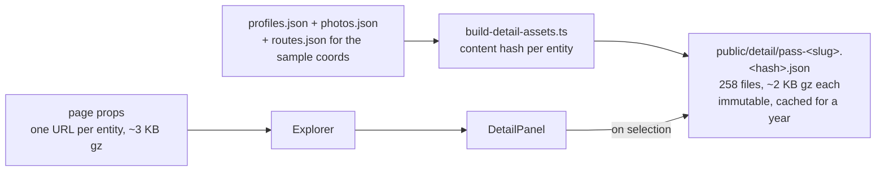

# 22 · Detail data out of the React payload

**Status:** done · **Effort:** S–M · **Depends on:** 01 (the mechanism) ·
**Unblocks:** –

## Goal

The start page stops shipping the elevation profiles of all 201 passes and the
photo metadata of every entity. Both become one content-hashed static file per
entity, fetched by the detail panel for what is selected – plan 01's
"optional phase 4", with the same mechanism one layer up.

## Why now

Plan 01 took the route geometry out of the payload. What it left is now the
majority of what remains. Measured per prop on the prerendered page
(`JSON.stringify`, gzipped, September 2026):

| Prop         |    raw |   gzip | read by                             |
| ------------ | -----: | -----: | ----------------------------------- |
| **profiles** | 828 KB | 297 KB | `DetailPanel`, one entity at a time |
| **photos**   | 664 KB |  77 KB | `DetailPanel`, one entity at a time |
| climate      | 302 KB |  42 KB | sidebar filters **and** the panel   |
| passes       | 109 KB |  26 KB | everything                          |
| years        | 403 KB |   9 KB | every row, every count              |
| rest         |      – |  17 KB | map, nearby, reach                  |

The two heavy ones are read by exactly one component, about exactly one entity,
after a click that most visitors make a handful of times. Shipping all of them
so that one can be looked at is the mistake plan 01 fixed for the geometry.

The second reason is a budget. The app is on Vercel Hobby, whose 100 GB of
monthly transfer is a hard stop (the project is paused, not throttled), and a
cold visit was ~520 KB of HTML before anything else loaded.

## Non-goals

Moving the climate series (see below). Splitting `years` (9 KB gzipped – it
compresses almost perfectly). Any change to how the photos themselves are
served: they stay on Wikimedia's CDN.

## The mechanism in one picture

### Before


### After



What travels when:

```
                  before                      after
first load        HTML 522 KB gz              HTML 144 KB gz
look at a pass    0 (already paid for)        ~2 KB gz, then free for a year
five passes       522 KB                      ~154 KB
```

## Design

### The file

One JSON per pass, tour and town, named `<kind>-<slug>.<hash>.json` – a dash
rather than the key's colon, which is not a legal file name on Windows. It
holds what the panel reads and nothing else: the profiles of that pass's
ascents (keyed as `routes.json`, with the sample coordinates the map cursor
needs) and that entity's photo metadata. An entity with neither gets no file
and no URL, so the panel makes no request for it.

The name is the content hash, exactly as in `lib/map-assets.ts`: no manifest,
nothing generated to commit, and the file is safe to cache for a year.
`scripts/build-detail-assets.ts` writes them before `dev` and `build` and
prunes stale ones; `lib/data.ts` derives the same names and throws if a file is
missing, so a build that skipped the script fails instead of 404-ing in a
visitor's browser.

### Why the climate series stays a prop

It is not detail. `buildPassRows` and `facetCount` read a pass's half-month out
of it on every keystroke, so a climate that arrives a request late would mean a
sidebar counting wrong for a moment – which is what "no chip lies" forbids.
At 42 KB gzipped it is also not what makes the page heavy. If it ever has to
move, the filters need a compact summer-signal slice in the payload first, and
only the full 24-bucket year for the chart belongs in the file.

### Loading behaviour

Everything a list row already showed is still in the page – name, status,
season strip, ratings – so the panel opens complete and only two blocks wait.
`PhotoCarousel` already rendered nothing without photos. The ascent list shows
a skeleton in the profile's own aspect ratio (`PROFILE_ASPECT`, exported from
`elevation-profile.tsx` so the placeholder cannot drift from the drawing) and
holds back "Kein Höhenprofil vorhanden." until the file is in, so an ascent
that has a profile never claims it has none.

## Steps

1. `lib/detail-assets.ts`: `DetailData`, `DetailAssets`, `detailAssets()`.
2. `scripts/build-detail-assets.ts`, wired into `dev` and `build`;
   `public/detail` git-ignored, immutable header in `next.config.ts`.
3. `lib/data.ts`: `getDetailAssets()` replaces `getProfiles`/`getPhotos`.
4. `app/page.tsx` and `Explorer`: one `detail` prop instead of two data props.
5. `DetailPanel` fetches its entity's file with `useFetch`; skeleton.
6. `lib/detail-assets.test.ts`; e2e 2 waits for the profile to arrive.

### Documentation

The "after" picture lives in `AGENTS.md` as the bullet after "Route geometry
never travels as props", together with the line between what is detail and
what the sidebar reads.

## Acceptance criteria

- The prerendered page is well under half its previous gzipped size; no
  profile or photo metadata is left in it.
- A selected pass shows its profiles and photos; a second look at the same
  pass makes no new request (immutable).
- `bun run typecheck && bun run lint && bun test && bun run build && bun run data:check`
  and `bun run e2e` all pass.

## Risks and open questions

- **A request between the click and the profile.** Accepted: the panel is
  complete without it and the skeleton reserves its space. The file is ~2 KB
  gzipped and same-origin.
- **258 files in `public/`.** Well inside Vercel's limits, and the pruning
  keeps the directory from growing across builds.
- **Hash determinism.** The body is `JSON.stringify` of parsed data plus
  `profileCoords`, which does index arithmetic only – no transcendental
  functions, so Bun and the Next server agree (the concern documented in
  `lib/map-assets.ts`).
