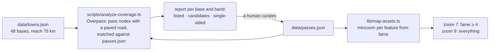

# 24 · Depth per destination

**Status:** in progress ([#59](https://github.com/mdugue/alpen/pull/59)) –
steps 1–3 done, 4 (the split) waits for the 300th entry, 5 (curation rounds)
is plan 23 and what follows it · **Effort:** M for code, then ongoing curation ·
**Depends on:** 00 (the gate measures what is added), the reach bands of
PR #47 · **Unblocks:** 23, 25 and 26 have a measure to curate against; 12
gets destinations whose numbers mean something

## Goal

"Depth" stops being a feeling and becomes a number the data can report, so
curation goes where a base is thin rather than where a name is famous. Three
things: a coverage report per base town (which paved passes within its reach
the app does not list), the rule that a pass carries every classic side, and
a prominence rule on the map so that 400 roads read as well at zoom 7 as
200 do today. Together they answer the question behind plan 23 in general
form: yes, the app can offer more depth everywhere, and this is how it stays
honest and readable while it does.

## Why now

The list is already past "the famous ones". Counted over `data/passes.json`
(201 entries, September 2026):

| Fame  | 1   | 2   | 3   | 4   | 5   |
| ----- | --- | --- | --- | --- | --- |
| Roads | 1   | 96  | 69  | 26  | 9   |

Half the entries are fame 2, which is the depth the destination question
needs. But it is uneven in a way nobody can see from the list:

- **103 of 201 roads have a single ascent.** A pass is a crossing; a rider
  planning a loop needs to know both sides. The Ventoux has its three, the
  Galibier two; the majority have one, and there is no rule that says when
  one is enough.
- **Coverage per country:** FR 60, IT 67, CH 27, AT 23, DE 5, SI 2 (plus the
  border pairs). The Austrian and Bavarian pre-Alps, which hold the April
  answer for the German-speaking audience, are the thinnest.
- **The reach model rewards a thin base.** `gradeOf` grades a half-month
  against the base's own peak (`docs/scales.md`), so a town with three roads
  in reach gets a full strip. That was the right decision for the strip
  (Bédoin proves it), and it makes the _count_ the honest complement – "Von
  33 Pässen im Umkreis" – which is exactly what a coverage report measures.
- **The file will pass 300 entries** with plans 23, 25 and 26, the line
  `docs/roadmap.md` §2 draws for splitting `passes.json` by region.

## Non-goals

Automatic import of anything. A candidate is a line in a report that a human
reads; nothing enters `data/passes.json` without the four scales, the season
and a note (Principle 4). Difficulty or traffic computed from the profile
(`docs/roadmap.md` §5, §6). Destinations as an entity (plan 12).

## The mechanism in one picture

### Before

```
curation  →  "which famous pass is missing?"  →  passes.json  →  the map
                                                      ↑
                                          no measure of what a base reaches
```

### After



The report is read, never applied; the map rule is what lets the report's
results land without turning the overview into noise.

## Design

### The coverage report

`scripts/analyze-coverage.ts`, in the family of `analyze-status.ts` and
`analyze-destinations.ts`: it prints, it writes nothing under `data/`.

For every town it asks Overpass for the `mountain_pass=yes` and
`natural=saddle` nodes within `REACH_MAX_KM` (`lib/geo.ts`) that carry an
`ele` above a floor (600 m outside the Alps' foothills, 1 000 m inside – a
flag) and have a paved `highway` within `ROAD_RADIUS` (`scripts/lib/locate.ts`
already knows how to ask that). Each node is matched against the existing
entries by distance to the marker (≤ 500 m is the same road, the gate's own
"end of the route" limit); the rest are candidates. The answers are cached in
the scratch directory per bounding box so a re-run costs nothing, and the
Overpass host and fallback come from `scripts/lib/osm.ts`.

Per town and reach band the report prints:

```
Bormio          door  listed 6   candidates 2   (Passo di Verva 2 290 m, …)
                day   listed 14  candidates 5   (…)
                trip  listed 13  candidates 9   (…)
single-sided passes in reach: 11 (Passo dell'Aprica, …)
```

and a summary line per town that a PR can quote. "Candidates" are sorted by
elevation, because in the Alps that is the best free proxy for "worth a
holiday"; the human decides.

### The second side

A rule, not a check: a `pass` carries every side that is a classic climb,
and a single-sided `pass` says why in its note (the other side is a motorway
feeder, a gravel track, a tunnel). `data:check` prints the count of
single-sided passes as an information line so the number is visible in every
data PR; it is not a warning, because the note is the honest state for many
of them.

### Prominence on the map

Every feature in the pass GeoJSON (`lib/map-assets.ts`) gets a `minzoom`
property derived from fame – fame 5 and 4 always, fame 3 from zoom 7.5, fame
2 and 1 from zoom 8.5, the numbers to be tuned on the built map – and the
dot, label and hit layers filter on it. Selection, hover and the tour band
ignore the rule: what is selected is always drawn, as today. The list is not
affected: a filter is a chip and this is not a filter, it is a level of
detail, and the legend line under the map says so ("bei dieser Zoomstufe:
bekannte Pässe").

`["zoom"]` is legal in a MapLibre filter as the input of a top-level `step`;
if that reads badly in `pass-map.tsx`, a symbol layer with `symbol-sort-key`
from fame and collision on is the fallback that gets the same effect from
the renderer.

### Splitting the file

When `passes.json` passes ~300 entries, `data/passes/` holds one file per
region (per range and region after plan 25), `lib/data.ts` and
`scripts/check-data.ts` read the directory and concatenate, slugs are unique
across all files, and `FILES` in `lib/schema.ts` names the directory with
one schema for all of them. The generated files keep their single key space.
The split is mechanical and is done in the PR that crosses the line, not
before.

## Steps

1. `scripts/analyze-coverage.ts` with the Overpass cache; run it once over
   the 48 towns and paste the summary into the PR – that table is the first
   measurement of depth and the baseline for every later data PR.
2. `data:check` information line for single-sided passes; the sentence in
   the `curate-data` skill.
3. `minzoom` in `lib/map-assets.ts`, the layer filters, the legend line;
   screenshots at zoom 6.5, 7.5 and 9 (`preview-app`).
4. The split of `passes.json`, in whichever PR first crosses 300 entries.
5. Curation rounds driven by the report: the thinnest bases first (from the
   baseline, expected: the Austrian and Bavarian pre-Alps, Valais, Aosta).

### Documentation

`docs/data-pipeline.md` gains the report in its command table and a sentence
on how a candidate becomes an entry; `docs/map-rendering.md` gets the
prominence rule next to "What answers the pointer is not what is drawn";
`AGENTS.md` gets the one-line version ("the overview draws by fame, the
list draws everything").

## Acceptance criteria

- The report runs offline on the second invocation and prints a line per
  town and band; its summary is in the PR that adds it.
- `data:check` prints the single-sided count.
- At zoom 6.5 the map shows only fame ≥ 4 dots, at zoom 9 all of them; a
  selected or hovered fame 2 pass is drawn at every zoom.
- After the first curation round the two thinnest bases of the baseline have
  at least six roads in their day band.
- `bun run typecheck && bun run lint && bun test && bun run build && bun run data:check`
  pass.

## Risks and open questions

- **Overpass load.** 48 queries of 75 km radius are a few minutes and a
  cache; acceptable for a script that runs a few times a year. If the host
  throttles, the fallback in `scripts/lib/osm.ts` applies.
- **OSM `ele` is unreliable** on minor nodes; the report is a shortlist, the
  DEM check in `data:locate` is the truth, as today.
- **Prominence by fame hides the quiet gems** at low zoom, which is what
  fame means. A future "beauty ≥ 4 at every zoom" tweak is a one-line change
  in the derivation and a decision for later, with screenshots.
- **The 600 m / 1 000 m floor** is a starting value; the report prints how
  many candidates each floor admits so it can be tuned with numbers.
- **The baseline (September 2026, 48 towns, 201 roads)** confirmed the
  expectation: the thinnest day bands are Bédoin (0), Innsbruck (2),
  Mayrhofen (2), Berchtesgaden (1), Kitzbühel (2) and Schladming (4); Cuneo
  reaches 4 in a day and has 30 candidates. 747 distinct candidates above
  1 000 m across all bases. Plan 23 answers Bédoin; the Austrian and Bavarian
  pre-Alps are the next round.
- **Overpass mirrors.** `overpass-api.de` refused every connection during
  the first run; `OVERPASS_URL=https://overpass.openstreetmap.fr/api/interpreter`
  answered all 48 queries. The report needs Overpass – the map-API fallback
  cannot answer a 75 km circle – so it names the host in its first line.
