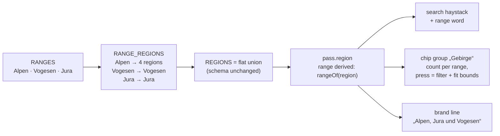

# 25 · Vosges and Jura: a second and a third range

**Status:** in progress – steps 1–3 and 6 done (the vocabulary, the search
word, the "Gebirge" chip with its frame, the town range); step 4 half: the
frame guard is a minimum opening zoom rather than a box test, because the
map opens on the frame around what it draws and a far range would zoom that
frame out, not fall out of it; the brand line and the dialog section on the
ranges wait for the first road outside the Alps, and so does the chip, which
shows once two ranges hold a road (Principle 3: nothing names a range the
map cannot show); step 5, the data, needs Open-Meteo and Overpass, which
answered 429 and 403 in the session that built the mechanism ·
**Effort:** M for code, L for curation ·
**Depends on:** 09 (schema), 05 (filters and search) · **Unblocks:** 26
(the Pyrenees reuse the range mechanism), the weekend answer for the
German-speaking audience

## Goal

The app carries mountain ranges that are not the Alps. The vocabulary learns
one level above the region, the filters and the search learn the new word,
the brand line says what the map covers, and the first two ranges – the
Vosges and the Jura – are curated to the same depth as an alpine area. The
mechanism is built so that the Pyrenees (plan 26) are data and a bounds box
away.

## Why now

- Both ranges fit inside today's schema without a change: the Vosges lie at
  about 47.8–48.7° N and 6.8–7.3° E, the Jura at 46.2–47.5° N and 5.5–7.3° E
  with the Grand Colombier at 45.9° N – all inside the 43–49° N and 4–16° E
  that `LatLon` in `lib/schema.ts` allows. The routers, Open-Meteo, Overpass,
  Commons and the OpenFreeMap tiles are global. What is missing is the word.
- They answer a question the Alps cannot: the weekend. From Freiburg, Basel,
  Karlsruhe or Stuttgart the Vosges are an hour and the Jura two; the season
  runs from March to November on the low cols. The app's audience is the one
  that lives there.
- They have the classics the audience knows: Grand Ballon, Ballon d'Alsace,
  Col de la Schlucht and the Route des Crêtes; Grand Colombier (Tour de France
  2012 to 2023), Mont du Chat, Col de la Faucille, Chasseral. The heuristic
  applies unchanged: the Route des Crêtes has a real winter closure, and the
  rest is what the climate signals say.
- `docs/roadmap.md` §2 has listed them since the roadmap exists.

## Non-goals

The Pyrenees, and with them a change to the coordinate bounds and the
country list (plan 26). The Massif Central, the Black Forest, the Erzgebirge:
the mechanism will carry them, the decision is a product one and is taken
per range (see the last risk). A change to the reach bands: in the Vosges
75 km covers the whole range, which is fine – the grade is relative to each
base's own peak, so nothing breaks, the "Orte als Standort" ranking only
gets flatter.

## The mechanism in one picture

### Before

```
REGIONS = ["Westalpen", "Zentralalpen", "Ostalpen", "Dolomiten"]
pass.region ∈ REGIONS                 the search knows the region word
SITE_NAME "Alpenpässe"                DEFAULT_VIEW centred on the Alps
```

### After



No new field in the JSON: the range is a function of the region, so the
data files and every generated key stay as they are.

## Design

### Vocabulary

`lib/regions.ts` gains `RANGES`, `RANGE_REGIONS` and `rangeOf(region)`;
`REGIONS` becomes the flat union so `lib/schema.ts` and every reader keep
working. Each range carries its German label and a one-line hint for the
scales dialog, like the road types do. The Vosges and the Jura are one
region each for now; a split (Nordvogesen, Bugey) is a vocabulary edit when
the data asks for it.

### Filter and search

A chip group "Gebirge" in `FilterBody` (`components/sidebar/filter-panel.tsx`),
one chip per range with the count it would leave, counted disjunctively like
every other group, in the hash under its own key (`lib/app-state.ts`),
listed by `appliedFilters`. Pressing a range chip also frames the range: the
camera fits the bounds of the range's passes, computed once in
`lib/map-assets.ts` alongside the tour bounds. That is a filter that moves
the camera, which the conventions allow as long as the padding travels with
the flight (`docs/map-rendering.md`). The search haystack (`lib/search.ts`)
gets the range word so "jura" and "vogesen" find their roads.

Towns carry no region today; they get the range through the nearest pass in
their reach, computed in `lib/data.ts` where the reach already is. That is
enough for the chip count; a town far from every pass has no reach and no
range.

### The frame and the brand

`DEFAULT_VIEW` stays hard-coded and alpine-centred: the two ranges lie at
the north-western edge of the current frame and are visible at zoom 6.5 on a
desktop, and reached by their chip everywhere. A small unit test asserts that
every pass coordinate lies inside the default frame at a reference viewport
(a mercator helper, twenty lines), so a range that falls out of the frame
fails the build instead of going unnoticed – plan 26 is the first to trip it
and decides then.

`SITE_NAME` stays "Alpenpässe". `SITE_DESCRIPTION` and `SITE_CLAIM` in
`lib/brand.ts` name the ranges ("… in den Alpen, im Jura und in den
Vogesen"); the share image's line "Welche Region lohnt sich wann?" is
already range-neutral. Renaming the app is a decision for plan 26, where the
Pyrenees make it real.

### Status

Nothing changes in `lib/status.ts`. The Route des Crêtes gets its winter
window from the road authority's habit; every other road is `season: null`
and the climate signals do the rest. `scripts/analyze-status.ts --changes`
after the curation must show the Vosges cells in December to February as
"Höhe", "Schnee" or "Frost" and a best window from May to September; a
Vosges col that reads "gut" in January is a bug in the thresholds for low
ranges, and the fix is discussed with the numbers, not assumed.

### Data

Candidates, approximate elevations, verified by `data:locate` per the
`curate-data` skill:

**Vosges.** Grand Ballon (pass, ~1 340 m; the Route des Crêtes closes in
winter), Col de la Schlucht (pass, ~1 140 m), Col du Calvaire (pass,
~1 145 m), Col du Bonhomme (pass, ~950 m), Ballon d'Alsace (pass, ~1 180 m),
Petit Ballon (pass, ~1 165 m), Col du Platzerwasel (pass, ~1 195 m), Col du
Hundsruck (pass, ~750 m), Col d'Oderen (pass, ~885 m), Col de Bussang (pass,
~730 m), Col du Bramont (pass, ~955 m), Col de la Croix des Moinats (pass,
~890 m), Col de Grosse Pierre (pass, ~955 m), Col du Firstplan (pass,
~720 m), Col de la Charbonnière (pass, ~960 m), Champ du Feu (spur, ~1 100 m),
Col du Donon (pass, ~730 m), Col du Kreuzweg (pass, ~770 m), Col de
Sainte-Marie (pass, ~770 m), Col du Wettstein (pass, ~880 m), Hohneck (spur,
~1 360 m), and the Route des Crêtes itself from the Schlucht to the Grand
Ballon (plateau, ~30 km). Bases: Munster, Gérardmer, La Bresse, Thann,
Colmar (train). Loops: Munster – Schlucht – Route des Crêtes – Grand Ballon –
Munster; Gérardmer – Bramont – Grosse Pierre – Gérardmer.

**Jura.** Grand Colombier (pass, ~1 500 m, four sides, fame 4), Col de la
Biche (pass, ~1 325 m), Col de Richemond (pass, ~1 035 m), Mont du Chat
(pass, ~1 500 m), Col du Chat (pass, ~640 m), Col de la Faucille (pass,
~1 325 m), Col de la Givrine (pass, ~1 230 m), Col du Marchairuz (pass,
~1 450 m), Col du Mollendruz (pass, ~1 180 m), Col des Etroits (pass,
~1 150 m), Col de la Vue des Alpes (pass, ~1 285 m), Chasseral (spur, ~1 550 m
road end), Col du Mont-Crosin (pass, ~1 230 m), Weissenstein (pass,
~1 280 m), Col de la Croix de la Serra (pass, ~1 050 m), Col de la Savine
(pass, ~990 m), Col de Berthiand (pass, ~780 m), Col de la Lèbe (pass,
~915 m). Bases: Culoz (train, for the Colombier), Saint-Claude, Les Rousses,
Saint-Cergue or Nyon (train), Le Sentier in the Vallée de Joux, Saint-Imier.
Loops: Culoz – Grand Colombier – Biche – Richemond – Culoz; Le Sentier –
Marchairuz – Mollendruz – Le Sentier.

Roughly 40 roads, 11 towns, 4 loops: about 60 profiles and 40 climate
series, two to three hours of Open-Meteo windows through
`bun run data:backfill`.

## Steps

1. Vocabulary: `RANGES`, `RANGE_REGIONS`, `rangeOf`, labels and hints; the
   scales dialog lists them; `data:check` accepts the two new regions.
2. Search haystack and the "Gebirge" chip group with its hash key and its
   applied-filter chip; range bounds in the map assets; the fit on press.
3. Town range via reach in `lib/data.ts`; the count on the chip.
4. The frame test; the brand line in `lib/brand.ts`.
5. Vosges data (one PR), then Jura data (one PR), each with photos and
   aliases and the `analyze-status --changes` read-back in the PR.
6. Documentation.

### Documentation

`docs/data-model.md` gets the range level in its vocabulary table;
`docs/ui-conventions.md` the chip that frames; `AGENTS.md` the one-line
version and `lib/regions.ts` in "Where things live" gains "ranges".
`docs/roadmap.md` §2 is rewritten to point here and to plan 26.

## Acceptance criteria

- `bun run data:check` accepts a road in region "Vogesen" and rejects an
  unknown region.
- The "Gebirge" chips show correct counts; pressing "Jura" lists only Jura
  roads and towns and frames the Jura with the panels' padding respected;
  the hash round-trips the range.
- "vogesen" in the search finds the Grand Ballon.
- The default frame test passes with every committed pass.
- After curation: each range has at least 18 roads, 5 bases and 2 loops; the
  Vosges strip reads a best window from May to September and "Höhe",
  "Schnee" or "Frost" in the winter half-months.
- `bun run typecheck && bun run lint && bun test && bun run build && bun run data:check`
  pass.

## Risks and open questions

- **A filter that flies.** The chip is the first filter that moves the
  camera. The alternative – a chip that only filters, and a "Gebirge" entry
  in the search results that frames – keeps the two concerns apart. Decide
  on the built app; either is a small change.
- **Low-range thresholds.** The snow and frost thresholds were calibrated on
  passes above 1 800 m. A Vosges col at 900 m in December may read "gut" when
  every rider knows it is not. The `altitude` fallback for `season: null`
  already covers December to February; if March comes out too rosy, the
  read-back in step 5 shows it and a low-range clause in `baseReasons` is the
  place, discussed with the table.
- **Which ranges next.** The mechanism makes every range cheap; the product
  question stays. The rule this plan proposes: a range is added when it is a
  destination for a week or a long weekend of road cycling _and_ has at least
  a dozen roads that a rider travels for. The Vosges, the Jura and the
  Pyrenees pass; the Black Forest and the Erzgebirge are for a later
  conversation with that rule in hand.
