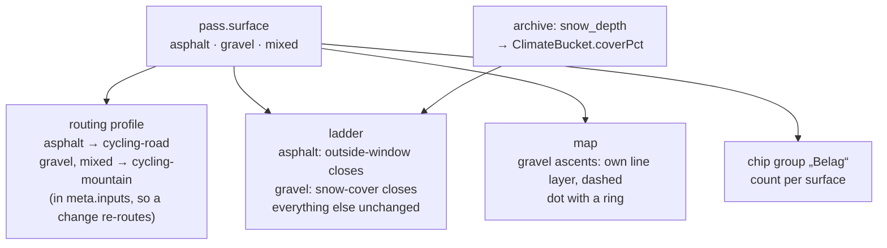

# 27 · Gravel

**Status:** mechanism done (September 2026), data open – `surface` on every
road and loop with the migration and the `cobbles` rename, the profile by
surface in the jobs and in `meta.inputs`, `coverPct` in the buckets and the
`snow-cover` rung with its two provisional shares, the "Belag" chips, the
dashed line and the ringed dot, the words in the kicker and the popup, the
dialog and the docs. Open, because every host it needs was rate-limited this
session: the archive run for `snow_depth` (the field is read when it comes;
until then a gravel road is never closed on a guess), the first data batch
(it needs `data:locate` and an `ORS_KEY`), the curated-geometry escape hatch
(no road needs it yet) and the tagline (waits for twenty gravel roads).
`locate.ts` already includes every track in its road query, without the
`tracktype` filter and for every surface – broader than the plan, and the
gate catches what that lets through. Two rules differ from the text on
purpose: only a mountain profile enters `meta.inputs`, so the routes stored
before the field existed keep their hash; and a loop's surface is held to
_at least_ its roads, so a loop whose connecting stretches are gravel can say
so. The archive request itself is not widened until a live run has confirmed
the variable and its cost – the bucket function reads `snow_depth_mean` the
day the series carries it ·
**Effort:** L–XL (M for the schema and the routing, M
for the snow-cover signal, M for the UI, the rest is curation) ·
**Depends on:** 14 (types and tags: the gravel classics are plateaus and
spurs), 16 (one status vocabulary: the new reason word has one home), 13
(the signal pattern the snow cover follows) · **Unblocks:** gravel
destinations in 12; the snow-cover signal for paved passes
(`docs/roadmap.md` §8)

## Goal

The app answers the destination question for gravel bikes the way it does
for road bikes: which unpaved passes and high roads, where to stay, when.
Gravel roads become first-class entries with their own surface, a verdict
ladder whose closing rung is the snow cover rather than a road authority's
barrier, their own routing profile, their own line on the map and their own
chips in the filter. Road stays the default; nothing a road cyclist sees
today changes unless a chip is pressed.

## Why now

- The data already points at it. Three roads carry the `surface` tag whose
  hint reads "ändert die Reifenwahl": Colle delle Finestre (eight gravel
  kilometres), the Tremola (cobbles) and the Vršič (cobbled hairpins). The
  tag answers the road cyclist's question ("can I ride this on 28 mm?"); a
  gravel rider asks the reverse, and the tag conflates two surfaces.
- Everything the app computes is discipline-neutral except two things: the
  closing rung of the ladder (`outside-window`, a barrier) and the routing
  profile (`cycling-road`). Half-months, climate series, reach bands, the
  destination verdict, photos, profiles: all of it applies to the Assietta
  as it does to the Galibier.
- The alpine gravel classics – Strada dell'Assietta, Col du Parpaillon,
  Colle del Sommeiller, Via del Sale, Passo di Tremalzo, the Strada dei
  Cannoni – are exactly the "where and when" question: high, unplowed,
  rideable in a window the snow decides, and each of them a reason to book a
  base in a valley the app already lists (Susa, Guillestre, Cuneo, Riva).
- A bigger refactoring is acceptable (decision of September 2026); the
  minimal version – surface as a tag – was rejected because it cannot carry
  the season.

## Non-goals

Mountain biking: trails, bike parks, lifts, shuttles and the S-scale are a
different data model with different sources, and a different app if ever.
Multi-day bikepacking routes such as the Torino–Nice Rally
(`docs/roadmap.md` §3). GPX export and route planning (§9). Surface
detection from OSM tags along the routed line (a later refinement of the
`mixed` value, like §5 for traffic).

## The mechanism in one picture

### Before

```
Pass { type, tags: ["surface"?] }      one ladder: outside-window · snow · frost · …
routing: cycling-road for everything   one line style on the map
```

### After



One field decides three things, and each of the three is one branch in a
place that already exists.

## Design

### Schema

`Pass.surface: "asphalt" | "gravel" | "mixed"`, required (the file is the
product: an entry that does not say what it is rolled on is an entry nobody
has looked at). `Tour.surface` likewise, derived-checked: a tour is `gravel`
or `mixed` if any member road is. The migration sets `asphalt` on every
existing entry, `mixed` on the Finestre, and renames the `surface` tag to
`cobbles` ("Pflaster") on the Tremola and the Vršič – cobbles change the
tyre, not the discipline.

Per-ascent surface is not modelled: the Finestre is `mixed` and its note
says which side. If a fourth value ever looks necessary, that is the sign to
model it per ascent, not to add "mostly gravel".

### The ladder

`passVerdict` reads the surface. For `asphalt` nothing changes. For `gravel`
and `mixed`:

- The closing rung is a new reason `snow-cover` ("Schneedecke"): the share of
  days in the half-month with a snow depth above 10 cm at the marker, from
  the ERA5-Land archive. Above `COVER_CLOSED_PCT` the cell is closed, above
  `COVER_LIMITED_PCT` it is limited; both constants go into `SIGNALS` with
  their sentence so the scales dialog explains them, and
  `scripts/analyze-status.ts` prints their distribution before they are set.
- `outside-window` still applies where a `season` exists (the Assietta is
  closed by ordinance in winter; some military roads have dates), and wins
  as today. `CLOSING_REASON` becomes the set of the two, and `GRADE_HINT.closed`
  names the reason the cell carries instead of "in der Regel wegen der
  Wintersperre".
- Every other rung is unchanged: heat, wet, short days and the cold descent
  apply to a gravel road exactly as they do to asphalt.

The signal is computed for every pass, paved ones included, and stored in
`ClimateBucket.coverPct`, but it enters the paved ladder only through a
separate decision with its own table (`docs/roadmap.md` §8 lists it): a
paved pass under 50 cm of snow is closed by its barrier already, and the
question there is the March edge, not the winter.

### The archive call

`scripts/build-data.ts` asks the archive for `snow_depth` as an hourly
variable and aggregates it to a daily mean before the half-month buckets
(the daily endpoint has snowfall but no depth). The request weight goes
into the `--status` estimate; the header's quota arithmetic is updated with
the measured cost of the first run. Existing climate series lack the field:
`coverPct` is optional in the schema until a backfill run fills it, and
`data:check` counts the gaps.

### Routing and the gate

`build-data.ts` picks the OpenRouteService profile by surface –
`cycling-road` for asphalt, `cycling-mountain` for gravel and mixed – and
writes the profile into `meta.inputs`, so a changed surface re-routes by
itself (Principle 4). The OSRM fallback is a car profile and will refuse
tracks with `motor_vehicle=no`; for a gravel road an OSRM miss is the
expected case and is reported as such, not as an upgrade candidate. The
gate's limits apply unchanged; the traverse rule from plan 14 measures the
Assietta as a plateau.

For the rare road no router carries, curated geometry is the escape hatch:
`data/geometry/<key>.geojson`, hashed into `meta.inputs`, allowed only with a
`note` like a `check` – an exception that explains itself, never the rule.

`scripts/lib/locate.ts` learns that a gravel marker may sit on a
`highway=track`: the "nearest drivable way" query includes tracks of
`tracktype` grade1 to grade3 when the entry's surface is not asphalt.

### Scales and words

The four scales stay and are judged inside the discipline; `docs/scales.md`
gets a paragraph: fame is fame among gravel riders, difficulty includes the
surface (a 6 % gravel ramp rides like a 9 % asphalt one), traffic is usually
1 and stays a scale rather than a constant because the Via del Sale carries
motorcycles on toll days. The `cobbles` tag gets its sentence. The scales
dialog lists the surfaces with one line each.

### UI

- **Chip group "Belag"** in `FilterBody`: Asphalt, Schotter, gemischt, with
  counts, in the hash, in `appliedFilters`; all three pressed is no filter,
  the default. Tours filter through their own surface.
- **Map:** gravel and mixed ascents in their own line layer with a dash
  pattern – `line-dasharray` is not data-driven, so the split is a layer and
  a filter, which is how visibility works here anyway
  (`docs/architecture.md`). The dot gets a ring in the same status colour.
  The hit layers include the new line layer; `HIT_GROUPS` is unchanged.
- **Panel:** the surface word in the header line next to the type word
  (`surfaceWord`, empty for asphalt like `roadTypeWord` is for a pass), the
  snow-cover sentence in the strip's popover, "Schotter" in the popup.
- **Brand:** `SITE_TAGLINE` "Rennradkarte" becomes "Rennrad- und
  Gravelkarte" once twenty gravel roads are in; before that the tagline
  would promise what the data does not hold.

### Data

First batch, approximate elevations, verified by `data:locate`:

Strada dell'Assietta (plateau, ~2 470 m at the top, Sestriere to Pian
dell'Alpe, car-free on fixed summer days), Colle del Sommeiller (spur,
~2 990 m, from Bardonecchia, the highest), Col du Parpaillon (pass, ~2 640 m,
Embrun or Crévoux to La Condamine, the tunnel), Via del Sale with the Colle
di Tenda old road (plateau, ~1 870–2 100 m, Limone to Monesi, toll days),
Colle delle Finestre (exists, becomes `mixed`), Passo di Tremalzo (pass,
~1 700 m, Garda, the tunnel), Strada dei Cannoni (plateau, Colle di Sampeyre
ridge, ~2 300 m), Colle del Preit (spur, ~2 080 m), Col de la Moutière
(pass, ~2 450 m, the Bonette's gravel neighbour). Bases: Bardonecchia, Limone Piemonte,
Sampeyre; Susa, Guillestre, Cuneo and Riva exist. Loops: Sestriere –
Assietta – Finestre – Susa – Sestriere; Limone – Tenda – Via del Sale –
Monesi – Limone; Embrun – Crévoux – Parpaillon – Col de Vars – Guillestre –
Embrun.

## Steps

Each a PR that leaves `main` deployable; 1 to 3 change nothing visible.

1. Schema: `surface` on `Pass` and `Tour`, the migration, the `cobbles`
   rename, `data:check`, the emitted JSON schema.
2. Routing: profile by surface in `build-data.ts` and in `meta.inputs`; the
   track-aware query in `locate.ts`; the curated-geometry escape hatch.
3. Archive: `snow_depth`, `coverPct`, the backfill, the cost in `--status`;
   `analyze-status.ts` prints the cover distribution over all passes.
4. Ladder: `snow-cover`, the two constants in `SIGNALS`, `CLOSING_REASON`
   as a set, the sentences; calibration table in the PR.
5. UI: chip group, line layer and ring, panel and popup words, the scales
   dialog.
6. Data: the first batch above, in two PRs (Piedmont, then the rest), with
   the read-back; the tagline when the count allows.
7. Documentation.

### Documentation

`docs/scales.md`: the snow-cover rung and the gravel paragraph;
`docs/data-model.md`: the field and the `cobbles` tag; `docs/data-pipeline.md`:
the profile by surface and the escape hatch; `docs/map-rendering.md`: the
dashed layer; `AGENTS.md`: "The surface decides the routing profile and the
closing rung" as a one-line convention with its link.

## Acceptance criteria

- Every existing entry carries `surface: "asphalt"` except the Finestre; the
  Tremola and the Vršič carry `cobbles`; no verdict of a paved pass changes
  (`analyze-status --changes` prints nothing for them).
- Every gravel road in the first batch is routed with the mountain profile
  and passes the gate, or has a `check` or curated geometry with a note.
- The Assietta strip closes from November to May by snow cover and has a
  best window inside July to September; the Parpaillon closes longer than
  the Assietta.
- The "Belag" chips count correctly; with "Schotter" alone pressed the list
  and the map show only gravel and mixed roads; a gravel ascent is drawn
  dashed at every zoom.
- The scales dialog explains the two new constants with their numbers.
- `bun run typecheck && bun run lint && bun test && bun run build && bun run data:check`
  pass, and `bun run e2e`.

## Risks and open questions

- **`snow_depth` cost.** Hourly data over ten years is 24 times the daily
  volume; the archive weights requests by period, not by variable, so the
  cost may be modest – measured in step 3 before anything depends on it. If
  it is prohibitive, the fallback is `snowfall_sum` with a decay model, an
  estimate that says "abgeleitet" like the valley temperature does.
- **The mountain profile's taste.** OpenRouteService may prefer a trail to
  the road on a gravel plateau. The gate catches a wrong length; a wrong
  line that is the right length needs the eye in the `curate-data` loop, as
  today.
- **One list, two disciplines.** A road cyclist who has pressed no chip sees
  a dashed Assietta among the Susa roads. The dash and the word are the
  minimal cure; remembering the last "Belag" choice per device (the map
  settings already live in `localStorage`) is the larger one, if the mix
  turns out to annoy.
- **"Oft gesperrt" for a road with no barrier.** The status word is shared
  with asphalt (plan 16); "oft zugeschneit" would be truer for gravel and
  would be a fourth vocabulary. The reason word in the cell and the closed
  sentence naming it are the compromise this plan takes; revisit with the
  built strip in hand.
- **Second ascents on gravel.** The Sommeiller has one road; the Parpaillon
  two; the rule from plan 24 applies.
