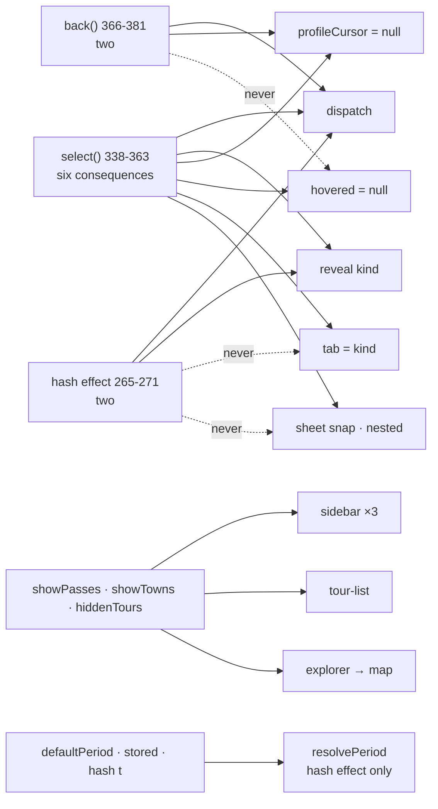
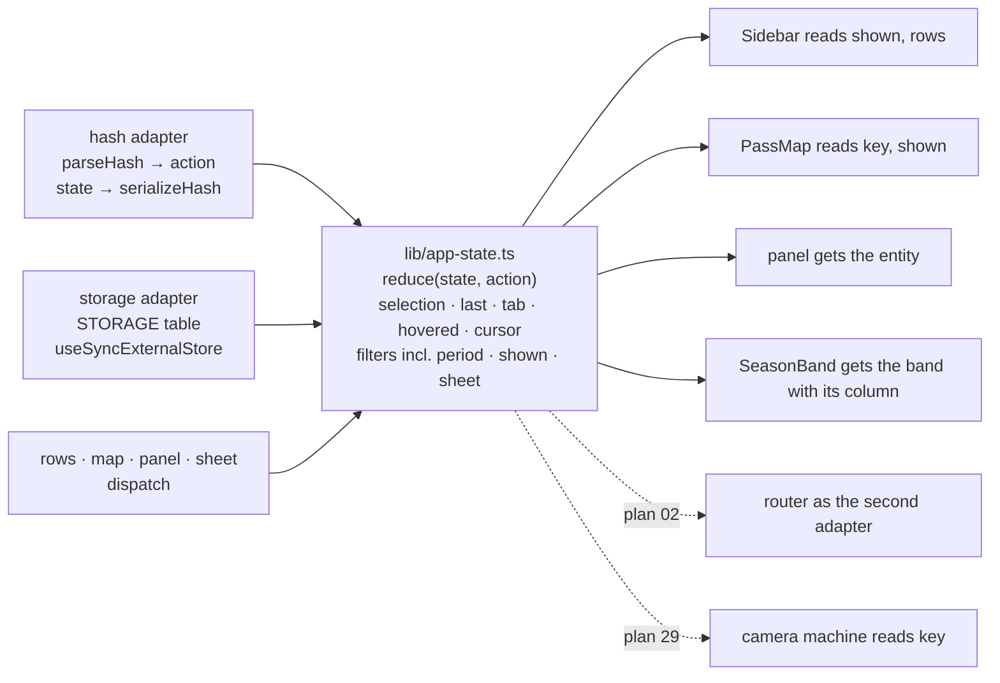

# 28 · One app state: the reducer and its adapters

**Status:** proposed · **Effort:** M · **Depends on:** 15, 16 (done) ·
**Supersedes:** 18 · **Unblocks:** 29 (the camera reads one selection key
and one inset), 30 (the scene reads one `shown`), 31 (the panel gets the
resolved entity), 02 (the router is the second adapter of the same reducer),
33 (the reducer is the first piece of the functional core)

## Goal

Everything the explorer decides – the selection and its consequences, what is
shown on the map, the half-month, the filters, the phone's sheet snaps – is
one pure reducer in `lib/app-state.ts`, `(state, action) → state`, with table
tests. The hash and `localStorage` are adapters: on load they turn the world
into actions, afterwards they subscribe to the state. `Explorer` dispatches;
it no longer derives anything a second time.

## Why now

Measured at `6c1897b` (2026-09-21). Plan 18 described the first three items;
all of them grew, and the rest accumulated in PRs #47 to #56.

- **`Explorer` holds 19 state bindings** (13 `useState`, 1 `useReducer`, 5
  `useStored`; explorer.tsx:162-231) and passes 25 props to `Sidebar`, 19 to
  `DetailPanel`, 18 to `PassMap`.
- **"Selecting something" is written three times, and the copies have
  diverged.** `select()` (338-363) does six things: dispatch, clear the
  profile cursor, clear the hover, set the tab, reveal the kind, pick the
  sheet snap and nesting. The hash effect (265-271) does two: dispatch and
  reveal. `back()` (366-381) does two: dispatch and clear the cursor. Two
  live defects follow: a pasted `#tour=…` while the pass tab is open leaves
  the highlighted row behind a tab (the comment at 341-343 says `setTab`
  exists to prevent exactly this), and Escape leaves the last hovered
  entity ringed on the map. The `selectionState` reducer (143-146) owns two
  of the six consequences; its name claims the rule.
- **Shown on the map** still has three encodings (169-174), now decoded at
  five sites (sidebar.tsx:82-85, 146-162, 277-281; tour-list.tsx:52;
  explorer.tsx:322). Nothing asserts `hiddenTours ⊆ tours`: a slug that left
  `data/tours.json` stays in storage, the master switch reads "off"
  (sidebar.tsx:155) while every tour is drawn and the n/m count is
  suppressed.
- **The half-month is encoded five ways** – a member of `Filters`
  (app-state.ts:201), a storage key written only by `setPeriod`
  (explorer.tsx:499-503), hash key `t` (app-state.ts:427), the server prop
  `defaultPeriod`, and `resolvePeriod` (app-state.ts:680) – and the resolver
  is called only in the hash effect (256-260), not in the initial state
  (162-165). A returning visitor sees today's half-month flip to the stored
  one, and the three row builders and the season band run twice over 258
  entities before the first interaction. The current bar is derived twice
  (explorer.tsx:310 and season-band.tsx:163).
- **The filter arithmetic has dead and duplicated parts.** `countCriteria`
  (app-state.ts:267) and `hasActiveFilters` (279) have zero production
  callers and are tested; `statusMatches` (692) is `Array.includes` with a
  test; `filterCount` lives in `filter-panel.tsx:50` and is why `Explorer`
  imports from `components/sidebar/` (explorer.tsx:12); the relief
  arithmetic ("the best idea in the panel") is verbatim at
  filter-panel.tsx:206-212 and list-empty.tsx:50-56 with no test;
  `sortPassRows` is applied past the seam (pass-list.tsx:60), so the list,
  the map (explorer.tsx:312) and the count (505-506) see three orderings.
- **The phone's sheets are eight fragments of state** in `Explorer`
  (`listOpen` 182, `filtersOpen` 186, `listSnap` 187, `detailNested` 198,
  `detailSnap` 199, the `listRest` ref 211, the snap tables 112-115, the
  `sheetPx` arithmetic 473-478). `listRest` exists only so that `select`
  does not close over `listSnap`; the comment at 200-210 measures the cost
  ("~50 ms of script per snap change"). The rule "a detail opens at least as
  high as the list it covers" (355-362) and "which parent it renders under"
  (666-685) live three screens from the state they read.
- **The selection's identity is a string literal at nine sites**
  (pass-map.tsx:978, 1255, 1617; sidebar.tsx:96; detail-panel.tsx:1039;
  explorer.tsx:375, 585; `photoKey` in lib/photos.ts:17 and `nearbyKey` in
  lib/nearby.ts:19, the same function twice), and the map splits it back
  apart (pass-map.tsx:1637).
- **Ten `alpenpaesse:*` storage keys** in three modules; `useStored`
  hand-rolls an external store (a `listeners` Set at 549, a `cache` Map at 551) that `useSyncExternalStore` provides.

Two corrections to plan 18: its claim that the two `defined` helpers "check
`NaN` differently" is stale (pass-map.tsx:903 and app-state.ts:305 are
behaviourally identical; the duplication remains, the bug framing does not),
and its non-goal "the five camera entry points stay in the map" is re-decided
by plan 29 (there are thirteen).

## Non-goals

The hash keys and `parseHash`/`serializeHash` stay. The controls stay. No
router: plan 02 replaces the hash adapter, not the rule. No library: a
reducer with a discriminated action union is enough here, because nothing in
this state involves time or hierarchy; XState is considered in plan 29,
where both exist. The pixel value the sheet covers (`sheetCover`,
`SHEET_INSET_PX`) is the camera's input and moves in plan 29. The CSS copy of
the scroll lock (`app/globals.css:405`) stays: it is the drag-frame adapter
of the same rule, required by "a drag of the sheet may spend the frame on
nothing else", and is named as such in a comment.

## The mechanism in one picture

### Before



### After



## Design

### State and actions

```ts
interface AppState {
  selection: Selection | null;
  last: Selection | null; // what the closing sheet still shows
  tab: Kind;
  hovered: Selection | null;
  profileCursor: number | null;
  filters: Filters; // period included
  shown: Shown;
  sheet: {
    list: { open: boolean; snap: Snap };
    filters: boolean;
    detail: { snap: Snap; nested: boolean };
  };
}

type Action =
  | { type: "select"; selection: Selection; from: "row" | "map" | "hash" }
  | { type: "back" }
  | { type: "hover"; selection: Selection | null }
  | { type: "profileCursor"; index: number | null }
  | { type: "filters"; filters: Filters }
  | { type: "period"; period: Period }
  | { type: "toggleKind"; kind: "pass" | "town" }
  | { type: "toggleTour"; slug: string }
  | { type: "sheet"; sheet: Partial<AppState["sheet"]> }
  | { type: "tab"; tab: Kind };

reduce(state: AppState, action: Action, env: { mobile: boolean }): AppState;
initialState(input: { defaultPeriod; stored: Stored; hash: Hash; tours: readonly string[] }): AppState;
```

`select` is the one copy of "selecting something": it sets `selection` and
`last`, sets `tab`, clears `hovered` and `profileCursor`, reveals the kind in
`shown`, and on a phone picks the detail snap and nesting from
`sheet.list` – which is state now, so the `listRest` ref goes. `back` is the
same case with `null`. The hash adapter emits `select` with `from: "hash"`,
so the hash path gets every consequence.

### Selectors

Pure functions of the state, next to the reducer, each with a test:
`entityKey(selection)` (replaces the nine literals and `photoKey`/`nearbyKey`,
which are deleted rather than renamed); `isShown`, `shownTours`,
`reconcileShown(shown, tourSlugs)` (drops stale slugs on read); `currentBar(
state, band)` (the one derivation `AppHeader` and `SeasonBand` share);
`sheetExpanded(state)`; `filterCount`, `bestRelief(filters, countWith)` and
`resetFilters` in `lib/filter-summary.ts`.

### Period

`initialState` resolves the half-month once, from the hash, then storage,
then today – on the first render, not in an effect. The write-through to
storage is the storage adapter's subscription, not a setter.

### Filters

`buildPassRows` applies every member of `Filters`, the sort included, so the
rows that cross the seam are the rows everything sees. `countCriteria`,
`hasActiveFilters` and `statusMatches` are deleted with their tests.

### Adapters

- **Hash.** On load, `parseHash(location.hash)` becomes the `hash` input of
  `initialState`; after each change, `serializeHash(state)` →
  `history.replaceState`. Plan 02 swaps this adapter for the router.
- **Storage.** One `STORAGE` table names every `alpenpaesse:*` key, the
  map's `base` and `overlays` included. `useStored` becomes
  `useSyncExternalStore` over one store; the persisted slices (`shown`,
  `period`, favourites) are written by one subscriber.
- **Transport into the tree.** `useReducer` in `Explorer` with props, or
  the context of plan 11 item 3; React Compiler makes either cheap. Decide
  in the PR, the reducer does not care.

### What `Explorer` keeps

`useMediaQuery`, the measured bar heights, the composition. Target: at most
350 lines (from 691), `Sidebar` at most 15 props (from 25).

## Steps

One PR each unless noted.

1. **Reducer.** `reduce`, `initialState`, the selectors, the tests listed
   under acceptance. `Explorer` dispatches; `select`, `back` and the hash
   effect become one path; `selectionState` and `listRest` go. `entityKey`
   replaces the nine literals and the two twins.
2. **Shown.** Into the reducer with `reconcileShown`; `Sidebar` takes
   `shown` and two dispatchers instead of six props; `PassMap` asks
   `isShown`.
3. **Period.** `initialState` resolves on first render; `SeasonBand` takes
   the band with its current column, `AppHeader` takes the bar.
4. **Filters.** The deletions, `bestRelief` once, the sort inside
   `buildPassRows`, `filterCount` and `resetFilters` in `lib/filter-summary.ts`.
5. **Storage table** and `useSyncExternalStore`.

### Documentation

`AGENTS.md` "Where things live": the filter, selection and URL state row
names `reduce`, `entityKey`, `Shown` and `STORAGE`. `docs/ui-conventions.md`
gets the after picture under a new "One reducer, two adapters" section. Plan
18's header points here; plan 11 item 3 notes that the context, if chosen, is
this reducer's transport.

## Acceptance criteria

- `reduce` has table tests for: select from a row, from the map and from the
  hash each set the tab, clear the hover and the cursor, reveal the kind and
  pick the snap; `back` clears the hover; a hash with `#tour=…` while the
  pass tab is open shows the tour tab; a stale slug in `hiddenTours` is
  dropped; the period resolves from storage on the first render.
- `grep -rn '\${.*kind}:\${.*slug}'` outside `entityKey` returns nothing;
  `photoKey` and `nearbyKey` are gone.
- `countCriteria`, `hasActiveFilters` and `statusMatches` are gone with
  their tests; `bestRelief` is tested once and used twice.
- `Sidebar` receives at most 15 props; `Explorer` is at most 350 lines and
  holds no `useState` for anything the reducer owns; `listRest` is gone.
- `bun run e2e` passes, plus one scenario: with a stored period, the first
  painted headline already names it (no flip).
- `serializeHash` produces the same string for the same state as before
  (its tests are unchanged).

## Risks and open questions

- **The stability `listRest` bought.** With the reducer, `select` closes
  over `dispatch` only, which is stable; re-measure the drag on a phone (the
  "~50 ms per snap change" number) and keep it gone.
- **Reducer size.** Keep the cases small and the selectors separate; if the
  file passes about 300 lines, split by slice but keep one `reduce`.
- **Context or props.** Either is fine under React Compiler; the sheet's
  drag frame decides – measure it after the change, one variant per build.
