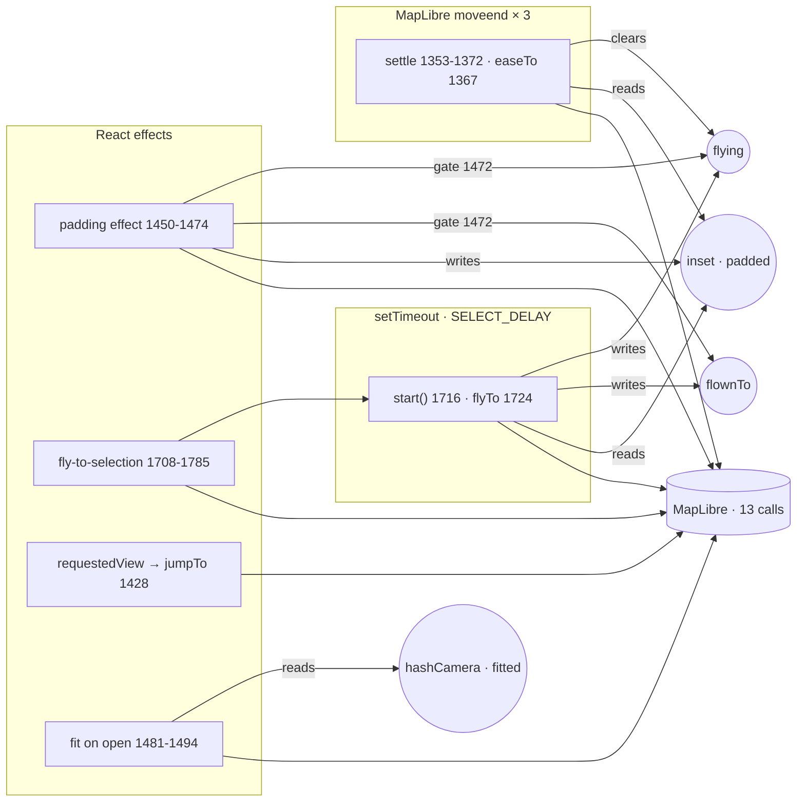
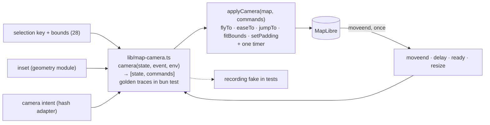

# 29 · The camera as a machine: one owner, one command

**Status:** [done](https://github.com/mdugue/alpen/pull/62) · **Effort:** M–L
· **Depends on:** 28 (the selection key and the sheet state arrive as values) ·
**Unblocks:** 30 (the scene's applier shares the MapLibre adapter), 02 (the
router's camera intent is one event), 33 (the machine is the second piece of
the functional core)

## Goal

Where the camera goes is a pure function `(state, event) → [state, commands]`
in `lib/map-camera.ts`, with table tests. `PassMap` turns what happens – a
selection, a new inset, a shared link, `moveend`, a timer, the style parsing
– into events, and issues the commands through a four-method adapter. The
rule "a flight owns the padding until `moveend`" becomes one transition in a
machine, not a boolean over refs whose truth depends on the order of three
schedulers.

## Why now

Measured at `6c1897b` (2026-09-21).

- **`pass-map.tsx` is 1 986 lines**, 415 more than when plan 19 was
  written; 363 of those landed in the camera and the popup (PR #43 +51,
  #45 +70, #47 +120, #48 +86, #53 +59, #56 +28) – exactly the two areas plan
  19 declared non-goals and plan 18 left inside the map ("the five camera
  entry points stay in the map"). There are thirteen now.
- **Thirteen camera-moving call sites** (`jumpTo` 1431; `setPadding` 1467;
  `easeTo` 1367, 1473, 1776, 1793, 1796, 1868; `flyTo` 1690, 1724, 1830;
  `fitBounds` 1491, 1838), 17 `useEffect`, 17 `useRef`, six of them camera
  state (`hashCamera` 953, `fitted` 954, `inset` 960, `padded` 961,
  `flownTo` 967, `flying` 976).
- **The rule is one boolean at 1472**, `if (selKey && (flying.current ||
selKey !== flownTo.current)) return;`, whose correctness depends on write
  order across a React effect (1450-1474 writes `inset`/`padded`), a
  `setTimeout` callback (1716-1777 writes `flying`/`flownTo`, reads `inset`
  at 1717) and a `moveend` handler registered at mount (1353-1372 clears
  `flying`, eases the padding at 1367). Three `moveend` handlers exist
  (1289, 1343, 1353); their order is load-bearing and unwritten; one
  selection writes the hash at least twice.
- **The settle does not consult `flownTo`** (1364-1371): a flight for A that
  lands inside B's `SELECT_DELAY` window eases the padding into B's flight.
- **`requestedView` is outside the discipline** (1428-1437): a `jumpTo`
  with no padding, no reduced motion, no interaction with the flight state;
  its deps `[requestedView, ready]` re-fire on `ready`, so a pasted hash both
  constructs the map with the view (1135-1146) and jumps to it (1431).
- **Camera on load has three deciders inside the map** (1122-1129 reads
  the hash with its own `defined` at 901-904; 1428; 1481-1494 gated by
  `hashCamera` and `fitted`) plus the explorer's (250-279).
- **`lib/map-camera.ts` (PR #45) is deep and tested – and holds no
  decision.** 81 lines, four exports (`fitInset`, `sameInset`, `toInset`,
  `shellEdge`), all arithmetic; the decisions stayed in the effects.
- **The only tests need WebGL.** Zero unit tests under `components/`; e2e
  scenarios 12-14 (e2e/app.test.ts:505, 579, 667) exist only for the camera,
  monkey-patch `setPadding` to count jumps (496-500), and one carries a
  45 000 ms timeout with a six-line apology (622-631).
- **The geometry that feeds the camera is written in four languages.**
  `SHEET_INSET_PX = 8` (mobile-sheet.tsx:24) duplicates `--drawer-inset:
--spacing(2)` in `components/ui/drawer.tsx:124`, a generated file that
  `ui:init` rewrites, on the path `sheetCover` → `insetBottom` → the flight
  (1717). The panel widths are pixels (explorer.tsx:87-91, "keep in sync
  with the Tailwind widths below") beside the classes (575, 589); the
  breakpoints are in JS (233-234) and CSS; `--shell-bottom`/`--shell-left`
  (529-530) are read by `globals.css:294` with `!important` against DOM
  MapLibre creates; `insetTop` is camera padding and a DOM offset (1855);
  `lg:right-40` (615) encodes where the attribution sits.
- **The map takes nine ambient inputs beside its 18 props**: the hash
  (1122), storage (979, 984), four media queries (164, 180/1409, 187 and a
  verbatim inline copy at 1130, 1177), `process.env` (1152), computed tokens
  (336-351), a `ResizeObserver` (1376). `appLayers` is documented pure (467)
  and reads `matchMedia` (470); `scheme` is computed twice (184, 1411);
  `switchBase` (1800) is a pass-through; `overlays` has no reconciling
  effect while `base` has one (1391).

## Non-goals

The style, the layers, 3D, base and scheme switching, the popup, `pickAt`
and the four scene effects stay as they are here – plan 30 takes them. No
`react-map-gl`: its controlled `viewState` would replace the whole imperative
map and fights the padding rule. No XState in the first cut (see risks).

## The mechanism in one picture

### Before



### After



## Design

### Events, states, commands

```ts
type CameraEvent =
  | { type: "ready" } // style parsed, the map is usable
  | { type: "intent"; intent: CameraIntent } // view | selection | fit, from the hash adapter
  | { type: "selection"; key: string | null; bounds: Bounds | null }
  | { type: "inset"; inset: Inset }
  | { type: "requestedView"; view: MapView }
  | { type: "delay" } // SELECT_DELAY elapsed
  | { type: "moveend"; byUser: boolean }
  | { type: "resize" };

type CameraState =
  | { phase: "cold"; intent: CameraIntent | null }
  | { phase: "idle"; padded: Inset; fitted: boolean }
  | { phase: "awaiting"; key: string; padding: Inset } // the panel is open, the flight is scheduled
  | { phase: "flying"; key: string; padding: Inset }
  | { phase: "settling"; padded: Inset };

type CameraCommand =
  | { cmd: "jumpTo"; view: MapView; padding: Inset }
  | { cmd: "flyTo"; bounds: Bounds; padding: Inset; duration: number }
  | { cmd: "easeTo"; padding: Inset; duration: number }
  | { cmd: "fitBounds"; bounds: Bounds; padding: Inset }
  | { cmd: "schedule"; ms: number }
  | { cmd: "cancel" }
  | { cmd: "writeHash" };

interface CameraEnv {
  reduceMotion: boolean;
  fitTolerance: { zoom: number; metres: number }; // the 0.05 and 2000 of today, as tested numbers
}

camera(state: CameraState, event: CameraEvent, env: CameraEnv): [CameraState, CameraCommand[]];
```

The rules, as transitions:

- `inset` while `awaiting` or `flying` updates the pending flight's padding
  and issues nothing: the flight owns it. `inset` while `idle` issues
  `easeTo` unless `sameInset`.
- `selection` enters `awaiting(key)` and schedules the delay; `delay` issues
  `flyTo` with the current inset and enters `flying`; `moveend` in `flying`
  enters `idle` with `padded` set to the flight's padding and issues
  `writeHash` once.
- `selection` B while `flying` for A cancels and enters `awaiting(B)`; the
  settle can no longer ease into B's flight.
- `requestedView` goes through the same function and gets padding and
  motion like everything else.
- `ready` with intent `fit` and not yet fitted issues `fitBounds` over the
  visible bounds; `visibleBounds` becomes a pure function of the rows, the
  `shown` value and the asset boxes, returning plain numbers (plan 30 reuses
  it as a scene input).
- `moveend` with `byUser` in `idle` changes nothing but the hash.

### The adapter

`applyCamera(map, commands, timer)`: the four MapLibre methods and one timer,
in one function of about thirty lines. One `moveend` listener forwards one
event; the three handlers of today (hover on a fine pointer 1289, the spin
1343, the settle 1353) become one listener that dispatches, and the hover
concern moves with plan 30. In tests the adapter is a recording fake; the e2e
stops patching `setPadding`.

### Geometry: one `Inset`, one environment

- `lib/shell-geometry.ts`: `(bars, viewport, sheet) → { inset, widths }`,
  and the `--shell-*` tokens are emitted from it once. The panel widths get
  one source that both the pixel arithmetic and the classes read (a token
  map consumed by both, or the widths as custom properties the classes
  use). `sheetCover` moves here; the sheet inset is read from the drawer's
  own token once (`--drawer-inset`), never copied.
- `MapEnvironment = { scheme, coarsePointer, reduceMotion, mobile }` arrives
  as one prop built from `useMediaQuery` in `Explorer`; `appLayers(colors,
env)` becomes pure in fact; the `coarsePointer` and `scheme` helpers and
  the inline copy at 1130 go; `overlays` gets the reconciling effect `base`
  has.
- `readHash` and the duplicate `defined` leave the map: the intent is an
  event from the hash adapter of plan 28.
- `window.__alpen` shrinks to the map handle; what the e2e read from it
  (`passBounds`) is asserted in the machine's tests instead.

## Steps

One PR each.

1. **Machine.** _Done._ `camera`, the types, golden-trace tests: select → fly →
   moveend; a second selection during a flight; an inset change during a
   flight; `requestedView`; load with a view, with a selection, with
   nothing; reduced motion; a user drag while idle. `PassMap` dispatches
   events into it and applies the commands; the six refs are deleted. No
   visible change.
2. **One `moveend`, one hash write.** _Done._ The three handlers become one
   listener; e2e 12-14 become machine tests; what remains of them is a
   smoke check with a normal timeout.
3. **Geometry and environment.** _Done._ `lib/shell-geometry.ts`, the
   environment prop, `sheetCover` moved, `SHEET_INSET_PX` and the pixel
   constants gone, `--shell-*` from one place, `lg:right-40` derived from the
   same source.
4. **Ambient clean-up.** _Done._ `switchBase`, the duplicate `coarsePointer`
   and `scheme` gone; `overlays` reconciled; `window.__alpen` reduced.
   `readHash` and the duplicate `defined` had already left the map with steps
   1 and 2.

### What steps 3 and 4 settled differently

- **The widths are custom properties, not a second table.** `shellGeometry`
  returns the numbers _and_ the `--shell-*` properties the classes read
  (`w-(--shell-sidebar)`, `lg:right-(--shell-right)`), which is the only form
  of "one source" that survives a Tailwind step being renamed.
- **The drawer's inset is measured, not read as a token.** A custom property
  is not resolved to pixels by `getComputedStyle`, so what is read is the
  popup's own bottom margin – which is what `--drawer-inset` is spent on.
- **The provenance controls stay placed with the map.** They only _move_ in
  an effect: added after the style has parsed, MapLibre's attribution has
  something to say before the compact flag is set and unfolds itself.
- **`window.__alpen` is the map alone.** `passBounds` did not move into a test
  – `flightFor`'s traces already pin it – but into the e2e itself, which
  derives the boxes from the app's own `mapAssets` over the app's own data.

### What steps 1 and 2 settled differently

- **No `resize` event.** The `ResizeObserver` tells MapLibre its canvas
  changed and asks nothing of the camera, so a case every phase ignores would
  be a case that lies. The `moveend` `resize()` fires goes through the machine
  like any other.
- **`CameraEnv` is `reduceMotion` alone.** The fit button's tolerance is not a
  transition: it is `fitDone` beside `FIT_TOLERANCE` in the same module, pure
  and tested. The button asks the map where a box would put the camera
  (`cameraForBounds`, the one question only a map can answer) and issues
  `fitBounds` or a flight back to the overview.
- **`setPadding` is a command.** "The first padding is set outright" is a rule
  worth keeping, and the alternative – an `easeTo` of no duration – is the same
  jump under a name that hides it.
- **The intent carries the view.** It is what the map is built with, so the map
  waits one tick for it instead of reading the hash itself; `CameraIntent` is
  `{ kind, view }` rather than a union, because the view is owed in all three
  cases (a tilt in the link is not a camera, but it is still what the map is
  built with).
- **`flightFor` is the pure half of a flight**, `cameraForBounds` the MapLibre
  half: the command carries the box, the breathing room, the maximum zoom and
  the point to fall back to.

### Documentation

`docs/map-rendering.md` "The padding is never set on its own" gets the after
picture and the transition table; `AGENTS.md` "Camera padding for the panels"
names the machine and the geometry module; plan 18's header points here.

## Acceptance criteria

- `camera` has the golden traces above as table tests, including "a flight
  for A that lands during B's delay does not ease the padding into B".
- The MapLibre camera methods appear in `pass-map.tsx` only inside
  `applyCamera`; no `useRef` in the file holds camera state.
- One `moveend` listener; a selection writes the hash once (an e2e counts
  `replaceState`).
- The `__jumped` monkey-patch and the 45 s timeout are gone from the e2e.
- `SHEET_INSET_PX` is gone; `grep -n "keep in sync" components/explorer.tsx`
  is empty; `window.matchMedia` appears only in `lib/use-media-query.ts`.
- `appLayers` takes the environment as an argument.
- Screenshots: a desktop selection, a phone selection with the list open,
  reduced motion.

## Risks and open questions

- **A timer inside a pure machine.** `schedule` is a command the adapter
  runs; tests advance by dispatching `delay`. This is the whole trick and it
  is enough. If the machine later gains hierarchy (closures, destinations,
  the router), XState v5's `transition(machine, snapshot, event)` returns
  `[snapshot, actions]` in exactly this shape, and Stately draws the chart
  for the docs; that is a drop-in later, not a decision now.
- **User moves.** MapLibre's `moveend` fires for drags too; the `byUser`
  flag comes from the event's `originalEvent`, and the trace "drag while
  idle" pins it.
- **The first tick.** The map built one tick earlier because it read the
  hash itself; with the intent as an event it builds one tick later, which
  is invisible next to MapLibre's own setup. The shared-link e2e confirms
  there is no fit flash.
