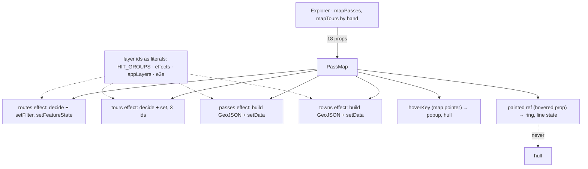
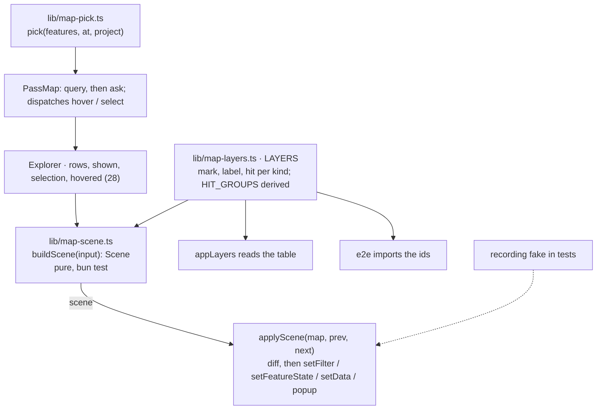

# 30 · The scene: what the map shows, as a value

**Status:** proposed · **Effort:** M–L · **Depends on:** 28 (one `shown`,
one selection, one `hovered`), 01 (filters and feature state); shares the
MapLibre adapter with 29 · **Supersedes:** 19 · **Unblocks:** the official
closure status on the map (a scene input, not an effect edit), 12
(destinations as a fifth mark come in through the scene), 33 (the scene is
the third piece of the functional core)

## Goal

What the map should draw is a value: a pure module turns the rows, the
`shown` value, the selection and the hover into a scene – the layer filters,
the feature state, the point features, the ring, the hull, the popup target –
and `PassMap` applies it. Every layer id lives in one table that the style,
the hit groups and the e2e read. What answers the pointer is a pure decision
over plain records. The scene is tested without WebGL.

## Why now

Measured at `6c1897b` (2026-09-21). Plan 19's evidence holds at new line
numbers; two things it did not cover have grown beside it.

- **Deciding and telling MapLibre still happen in the same four effects**:
  routes 1501-1517 (filter and per-ascent state, then `setFilter` and
  `setFeatureState`), tours 1522-1537 (the same on three layer ids), passes
  1543-1563 and towns 1565-1586 (GeoJSON with seven and six properties, then
  `setData`); `visibleBounds` (1034-1042) frames from the same inputs;
  `Explorer` translates rows into map entities by hand (explorer.tsx:312-327).
  These are the least changed part of the file since plan 19.
- **Layer ids are literals at every site**: `HIT_GROUPS` (219-232), the
  effects (1510, 1527), `appLayers`, and now four places in the e2e
  (e2e/app.test.ts:342, 346, 352, 427). `HIT_GROUPS` hand-mirrors ids that
  `appLayers` generates from a fame table (`pass-label-5…1` at 221-226
  versus `` `pass-label-${fame}` `` at 795): a sixth fame level silently
  stops answering the pointer. The hit-filter invariant AGENTS.md states is
  upheld two different ways – `routes-hit`/`tours-hit` by a matching
  `setFilter`, `passes-hit`/`towns-hit` by filtering the source data.
- **The map keeps two hover states, and they disagree.** `hoverKey` is a
  local in the build effect (1237), owned by the map's own pointer, and
  drives the popup (1266) and the reach hull (`paintReach`, called at 1250,
  1270, 1594 only). `painted` is a ref (948), owned by the `hovered` prop,
  and drives the ring source (1648) and the line feature state (1622-1634).
  Nothing reconciles them: a town hovered in the list draws no hull; the
  prop's docstring (81-82, "hovered or selected") contradicts the
  implementation comment (1267-1269, "only on hover"); and the hover effect
  reads `passes`/`towns` (1628, 1644) outside its deps `[hovered, ready]`
  (lint disabled at 1661), so a pass filtered out before the hover clears
  keeps `hovered: 1` on its ascents and redraws at width 5 (644) the next
  time the filter lets it through.
- **`pickAt` (265-302) is a pure decision welded to the map instance**: it
  ranks by `HIT_GROUPS`, breaks ties by projected distance and maps route
  hits to passes, and needs only a list of records and a `project`
  function; it takes the whole `MLMap` (four calls). The rule behind every
  click has no unit test; the e2e searches a 200 px spiral for a pixel only
  a label answers (338-360).
- **The popup is 47 lines of pure string work with no test** (`escapeHtml`,
  `roadPopup`, `popupHtml`, 853-899), and `lib/tag-icons.ts` exists "because
  this popup is an HTML string and not React" (866-868).

## Non-goals

The setup effect, 3D, base and scheme switching, the style and the camera
(plan 29) stay. `pass-map.tsx` stays one component, as `oxlint.config.ts`
says by design; the new modules sit beside it. No change to what is drawn.

## The mechanism in one picture

### Before



### After



## Design

### The layer table

`lib/map-layers.ts` exports `LAYERS`: per kind, the mark, the label(s) and
the hit layer, with the label ids generated from the same fame table
`appLayers` uses. `HIT_GROUPS` is derived from it, so hit membership cannot
drift from the ids; the filter of a hit layer is the filter of the layer it
widens by construction, for all four kinds the same way.

### The scene

```ts
interface Scene {
  routes: { filter: Expression; state: Record<string, FeatureState> };
  tours: { filter: Expression; state: Record<string, FeatureState> };
  passes: FeatureCollection<Point, PassProps>;
  towns: FeatureCollection<Point, TownProps>;
  hover: { ring: Point | null; lines: string[]; hull: Polygon | null; popup: PopupContent | null };
  bounds: Bounds | null; // what "fit to visible" frames; plan 29 consumes it
}
buildScene(input: { rows; shown; selection; hovered; assets; townReach; env }): Scene;
```

`hovered` is the one value from plan 28. The map's own pointer no longer
paints anything: on a fine pointer it dispatches `hover(hit)` upwards and
the scene comes back with the ring, the lines, the hull and the popup
content, so a town hovered in the list and a town hovered on the map draw
the same thing. The popup content is a value (`PopupContent`, the typed
lookup plan 11 item 20 asked for); rendering it to HTML is the applier's
last step, and `lib/tag-icons.ts` becomes its private helper.

### The applier

`applyScene(map, prev, next)` diffs the two scenes and calls `setFilter`,
`setFeatureState`, `setData`, the ring source and the popup only for what
changed. It is the only place these methods appear. In tests it runs against
a recording fake; the e2e no longer needs `queryRenderedFeatures` to know
what is drawn.

### The pick

`pick(features, at, project)` in `lib/map-pick.ts`: the ranking by
`HIT_GROUPS`, the tie-break by projected distance and the route-to-pass
mapping over plain records. `PassMap` queries the rendered features and
asks. The e2e asserts on the hit, not on a pixel found by spiral.

## Steps

One PR each.

1. **The table.** `LAYERS`, `HIT_GROUPS` derived, `appLayers` and the e2e
   read it. No behaviour change.
2. **The scene and the applier.** `buildScene` with tests for the filters,
   the feature state, the point properties and the bounds; `applyScene`
   with a recording fake; the four effects become one. `Explorer`'s hand
   translation goes.
3. **One hover.** The hover half of the scene; `hoverKey`, `painted` and
   `paintReach` go; the map pointer dispatches; the docstring at 81-82
   becomes true; the lint disable at 1661 goes with the effect.
4. **The pick and the popup.** `pick` over records with tests for the
   priority and the tie-break; `PopupContent` as a value; `escapeHtml` and
   friends move behind the applier; the pixel spiral leaves the e2e.

### Documentation

`docs/map-rendering.md` "What answers the pointer is not what is drawn" and
"Translucent lines need `line-layer-opacity`" get the scene as their picture;
`AGENTS.md` "Map, layers, 3D, markers…" names `LAYERS`, `buildScene`,
`applyScene` and `pick`; plan 19's header points here; plan 11 item 20 is
closed by step 4.

## Acceptance criteria

- `buildScene` and `pick` have unit tests: visibility per kind, selection
  and status state, the hover surfaces for a list hover and a map hover
  (identical), the hit priority and the tie-break.
- `setFilter`, `setFeatureState` and `setData` appear in `pass-map.tsx`
  only inside `applyScene`; `queryRenderedFeatures` once, feeding `pick`.
- `grep -rn '"pass-label-' components e2e lib` finds the table only;
  `HIT_GROUPS` is not hand-written.
- A town hovered in the list draws its reach hull (e2e); the effect deps
  lint disable is gone.
- The e2e spiral search is gone; `window.__alpen` exposes the map handle
  only.
- `bun run e2e` passes; screenshots of a hovered pass and a hovered town
  from the list and from the map.

## Risks and open questions

- **Diffing cost.** A scene per keystroke is cheap (arrays of a few
  hundred), but `applyScene` must diff rather than reapply, or MapLibre
  re-tiles the point sources on every hover; the recording fake asserts the
  call count.
- **Hover latency on the map.** Dispatching up and rendering down adds a
  React tick to the ring. Measure it; if it shows, the applier may paint
  the ring optimistically from the same `pick` result while the scene
  confirms it – one place, not two states.
- **The popup on touch** stays absent (plan 11 item 16); the scene's
  `popup` is `null` under a coarse pointer, which is the environment value
  plan 29 introduces.
