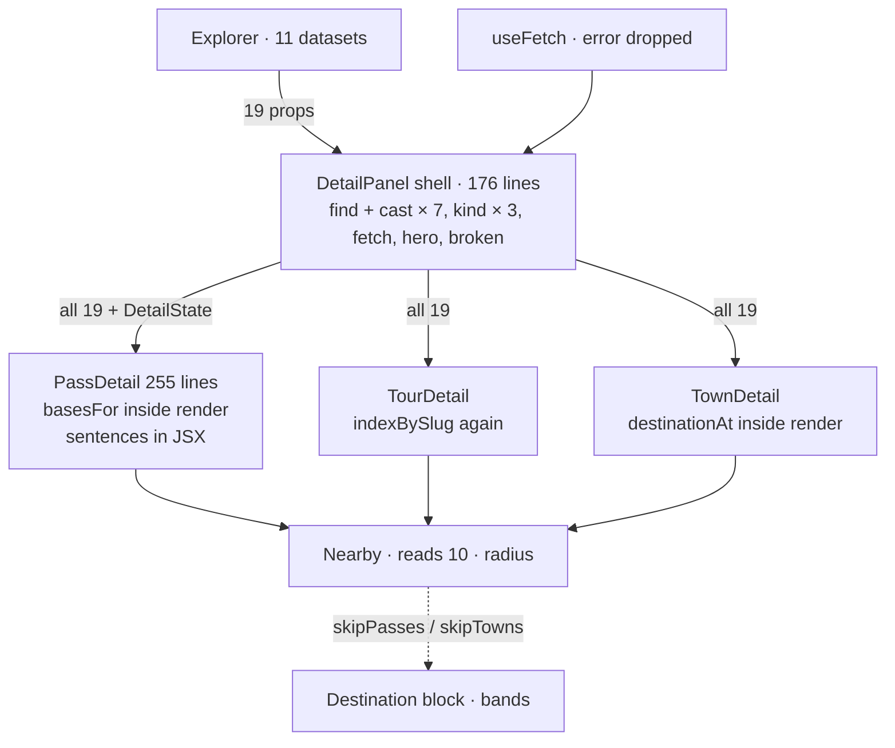
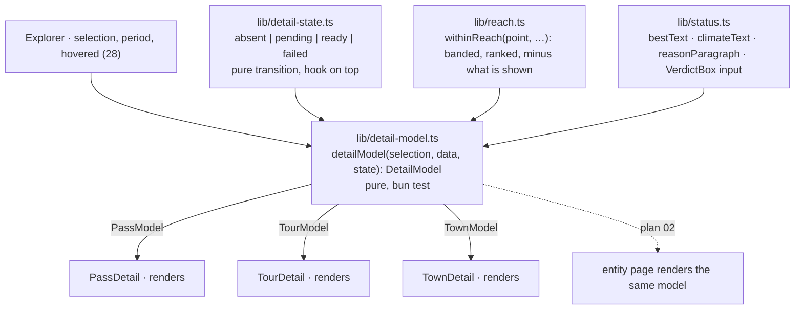

# 31 · The panel as a model: data in, three thin renderers out

**Status:** done ([#62](https://github.com/mdugue/alpen/pull/62)) ·
**Effort:** L (four phases, one PR each) ·
**Depends on:** 15, 16 (done), 28 (the resolved entity and `entityKey`
arrive from the reducer) · **Supersedes:** 17 · **Unblocks:** 02 (an entity
page renders the same model on the server), 12 (a destination detail is a
fourth kind, not a fourth branch), 24 (its coverage report already reads
the reach bands from `lib/geo.ts` and reads the reach module afterwards), 33
(the model is the fourth piece of the functional core)

## Goal

What a pass, a tour or a town shows is a value: `detailModel(selection,
data, state)` is a pure function that returns the resolved entity, its
sentences, its lists within reach, its photos and profiles with their fetch
state, and which blocks apply. Three kind modules render it and nothing else;
the shell resolves once. Every sentence in the panel comes from `lib/status.ts`,
every "near here" from one reach module, and the fetch's outcome is one
discriminated value. Adding a field to what a pass shows touches the pass
module and nothing else.

## Why now

Measured at `6c1897b` (2026-09-21). Plan 17's evidence holds and grew; three
things it could not know appeared in PRs #44, #47 and #49.

- **`detail-panel.tsx` is 1 115 lines** (682 when plan 16 merged, +63 %),
  changed in 23 of 62 commits. `Props` has 19 fields (was 16; 125-162):
  eight datasets, seven callbacks, four state. Every kind branch takes all
  of them plus the fetched `DetailState` (`PassDetail` 23 fields, reads 12;
  `TourDetail` and `TownDetail` 20 each, read 6); `Nearby` receives
  `{...props}` three times (596, 691, 729) and reads ten; the kind is
  branched three times (1014-1019, 1022-1027, 1102-1110) with seven casts;
  `Props` is passed as `Signals` once (368); `TourDetail` rebuilds
  `indexBySlug` (622) that `Explorer` already holds.
- **The fetch has three ideas of "not there yet", and one never ends.**
  `useFetch` returns `{data, error, loading}`; the panel discards `error`
  (972). The profile skeleton reads `loading` (480-481, 492-500) and is
  honest; the photo skeleton is driven by `loaded.photos.length === 0`
  (1095), which `PanelHead` documents as "the detail file is still on its
  way" (770); `hero` stays true while `photos.length === 0` (1036-1038).
  A 404 after a stale deploy leaves an `aria-busy` skeleton forever, and
  nothing can test it. `photo-carousel.tsx:69-88` documents props it no
  longer has (`count`, `fallback`); `const shown = photos` (102) is the
  residue.
- **Plan 16's "one home for the words" was broken two PRs later.**
  `GRADE_ORDER` has two homes (status.ts:290, destination.ts:40-45);
  `gradeOf` is one name for two functions (status.ts:300, destination.ts:99);
  `statusOf` (status.ts:310) has no caller anywhere while its body is inlined
  at destination.ts:173-174; the "beste Zeit X – Y" sentence is
  character-identical JSX at detail-panel.tsx:393-398 and
  destination.tsx:222-227; the verdict box is three copies (390, 642,
  destination.tsx:219); the "abgeleitet" paragraph (558-566) is six German
  fragments glued in JSX around `valleyText`, with the day length formatted
  by a raw `toLocaleString` while `REASON_TEXT["short-day"]` writes the same
  fact with `fmt(…, 1)` (principle 2); `reasons.join(" ")` (403) is the
  panel's own paragraph rule. `lib/status.ts` exports 70 names, 16 of which
  have no caller outside the module and its test (`BEST_SIGNAL`,
  `CLOSING_REASON`, `FROST_RISKY_PCT`, `GRADE_RANK`, `LAPSE_RATE`,
  `LIMITING_REASONS`, `PassSignals`, `REASON_PHRASE`, `REASON_SHORT`,
  `REASON_WORD`, `Signal`, `climateBucket`, `signalOf`, `signalText`,
  `signalValue`, `statusOf`).
- **"What is near here" has four answers in one panel.** `Nearby`
  (277-289) uses a flat radius, point to point, sorted by distance, under
  the heading `Im Umkreis von ${REACH_MAX_KM} km`; `nearbyTours` (282) was
  measured line to point on the server and is keyed by the selection, not
  by the coordinates the block takes; `destinationAt` (destination.ts:203-251)
  and `basesFor` (304-339) rank by band, weight and score one screen-fold
  above. `Nearby` needs `skipPasses`/`skipTowns` (270-273, "a block above
  already ranks them") to know what a sibling drew. `basesFor` runs a whole
  `destinationAt` per town – a `ReachedPass` with 24 cells per reachable
  pass – and keeps two numbers (319-327), inside the render of `PassDetail`
  (584-590). `docs/plans/README.md:84-86` records the rule PR #47 set: use
  the bands, not a radius.
- **The shell is 176 lines and knows the sheet, the hash and the photo
  failures**: `useSheetExpanded` (946) beside the prop `backToList` (161)
  for the same phone fact; `broken` (958) held here although
  `PhotoCarousel` discovers it; `pastHead` (965) from a hand-rolled
  measurement (1075-1085); `useShare` (948) sharing `location.href`.
- **`lib/data.ts` promises eleven getters** (66-189) for one page bundle
  (page.tsx:63-117), which is why `Explorer` has eleven datasets and the
  panel eight; the one real constraint is at data.ts:50-55 – the weather
  route's cold start must not drag the derivations in.
- **Nothing tests the panel.** The e2e reads the title, the profile's
  `aria-label` and the close control; no assertion touches the verdict box,
  the badge word, the sentences, the nearby lists or the destination
  ranking. `package.json:15` is `"test": "bun test lib"`.

## Non-goals

The layout stays: the folding `Section`s, `PanelHead` and `PanelBar` (which
are already the kind-agnostic shape this plan wants – six and nine named
fields, no dataset), the carousel, the profile, the weather, the climate
chart, the phone sheet. No new information is shown. No fetch library: the
URLs are content-hashed and immutable, so the browser cache already dedupes,
and the fix is the shape of the value, not a cache.

## The mechanism in one picture

### Before



### After



## Design

### Phase A · The detail file as one value

```ts
type DetailState =
  | { phase: "absent" } // the entity has no file (no photos, no profiles)
  | { phase: "pending"; photos: number } // the count the page already knows
  | { phase: "ready"; photos: Photo[]; profiles: Profiles; broken: ReadonlySet<string> }
  | { phase: "failed" };
detailState(asset, fetched: Fetched<DetailData>, broken): DetailState; // pure
useDetailState(asset: DetailAsset | undefined): { state: DetailState; markBroken };
heroShape(state: DetailState): "hero" | "plain"; // the one decision, six rows of test
```

The seam is the transition, not the fetcher: `detailState` takes what a fetch
said as a value, so the four phases are a table test with no network and no
DOM, and the hook is the thin half over `useFetch`. A fetcher parameter was
the first shape and cannot be had – passing a hook is what the
`react(hooks)` lint rule forbids. `PanelHead`, the profile block and the
"nicht vorhanden" sentences read one value; `broken` lives in the state,
reported by the carousel through one callback; the stale prose in
`photo-carousel.tsx` and the `shown` alias go. The weather block's fetch is
the model for reading `error` and stays as it is.

### Phase B · The words, finished (plan 16's tail)

`bestText(year)`, `climateText(pass, bucket, signals, sun)` and
`reasonParagraph(reasons)` join `valleyText`, `tourText` and `badgeWord` in
`lib/status.ts`, each pinned by a test; `fmt` formats the day length. One
`VerdictBox` renders from a cell at the three call sites. `GRADE_ORDER` and
`statusOf` are imported by `lib/destination.ts`, not copied; the second
`gradeOf` is renamed to say what it grades (`gradeOfBase`). The exports with
no external caller become module-private – the 16 measured above minus
`statusOf`, which `lib/destination.ts` now imports, plus `REASON_TEXT`,
`reasonTexts` and `valleyText`, whose last external caller was the JSX the
three sentence builders replace; `climateBucket` had no caller at all and
goes. 55 exports are left, each with a reader outside the module. Plan 16's header flips to done in the same PR, as its
acceptance criteria already pass.

### Phase C · One reach module

```ts
withinReach(point, opts: { passes; towns; tourReach; years; period; exclude; claimed }): Reach;
// Reach = { passes: Reached[]; tours: Reached[]; towns: Reached[] }, each banded and ranked
reachCount(town, passes, years, period): GradeCount; // the entry point basesFor needs
```

`lib/reach.ts` grows out of `lib/destination.ts` and `lib/geo.ts`: bands,
weight and score are the one vocabulary; the server-measured tour reach is
an input; `claimed` is what the block above already showed, so the skip
flags go; `basesFor` calls `reachCount` and stops allocating 24 cells per
pass per town. The panel renders lists, not distance arithmetic. Plan 24's
coverage report reads the same module.

### Phase D · The model and the three modules (plan 17)

```ts
type DetailModel =
  | { kind: "pass"; pass; year; cell; verdict; sentences; reach; bases; detail: DetailState; blocks: BlockId[] }
  | { kind: "tour"; tour; year; members; reach; detail; blocks }
  | { kind: "town"; town; destination; reach; detail; blocks };
detailModel(selection, data: PageData, state: { period; hovered }): DetailModel;
```

The shell calls it once and renders one of `PassDetail`, `TourDetail`,
`TownDetail`, each taking its model and the callbacks and nothing else.
`blocksFor` is a three-row table; the kicker is a three-row table; the casts
go. `PanelHead`/`PanelBar` stay as they are. `renderToStaticMarkup` renders
each kind from one fixture in `bun test`, no DOM needed. `backToList` follows
`expanded` through the sheet context, so the shell has one transport for
the phone.

Optional in the same phase: `lib/data.ts` exposes `getPageData()` for the
page and keeps `getPass(slug)` for the weather route, with the ten
derivations private behind the first; the model takes `PageData` as one
value. The cold-start constraint at data.ts:50-55 holds.

## Steps

1. **Phase A** (S): `DetailState`, `heroShape`, the injected fetcher, the
   carousel prose; a test for each of the four phases and the six hero rows.
2. **Phase B** (S–M): the three sentence builders, `VerdictBox`, the
   deduplications, the 16 exports made private, plan 16 marked done.
3. **Phase C** (M): `lib/reach.ts` with tests grown from
   `destination.test.ts` and `nearby.test.ts`; the panel's `Nearby` renders
   what it is given; `basesFor` on `reachCount`.
4. **Phase D** (M): `detailModel` with table tests for blocks, kicker,
   sentences and reach per kind; the split into three files under
   `components/panel/`; the shell at about 80 lines; `"test"` in
   `package.json` widened so tests beside components run.

### Documentation

`docs/ui-conventions.md` "The panel folds" gets the after picture and a
"Model in, markup out" paragraph; `AGENTS.md` "Detail panel" names
`detailModel`, `DetailState` and `lib/reach.ts`; "Tours within reach" names
`lib/reach.ts`; plans 16 and 17 headers updated; `docs/plans/README.md:84-86`
points at the module instead of the rule.

## Acceptance criteria

- Phase A: a fetch that fails renders "keine Fotos" and no `aria-busy`
  skeleton (unit test with the failing fetcher, plus an e2e that blocks the
  detail URL); `PanelHead`'s `loading` doc matches what is passed.
- Phase B: `grep -rn "beste Zeit" components` finds one site; `GRADE_ORDER`
  and `statusOf` are defined once; `toLocaleString` appears in `lib/utils.ts`
  only; `lib/status.ts` exports at most 55 names, every one with a caller
  outside the module; every German sentence the panel shows is produced by
  a tested function.
- Phase C: `haversine` is not imported by anything under `components/`;
  `skipPasses`/`skipTowns` are gone; `basesFor` allocates no `ReachedPass`.
- Phase D: `DetailPanel` receives at most 8 props; no `as Pass`/`as Tour`/
  `as Town` in `components/panel/`; no `{...props}`; each kind module has a
  `renderToStaticMarkup` test from one fixture; `indexBySlug` is built once.
- The e2e suite passes unchanged; screenshots of the three kinds, light and
  dark, phone.

## Risks and open questions

- **Optional against deliberate.** The flat radius list may read
  differently from the ranked list on purpose (nearest first, no judgement);
  `withinReach` returns both orderings from one computation rather than
  choosing for the panel.
- **The 16 private exports.** Some are read by `scripts/analyze-*.ts` in
  spirit if not by import (plan 32 phase F); make them private only after
  that grep is clean.
- **Server rendering (plan 02).** The model must not close over browser
  state; `hovered` and `period` arrive as arguments, which is why they are
  in the signature.
