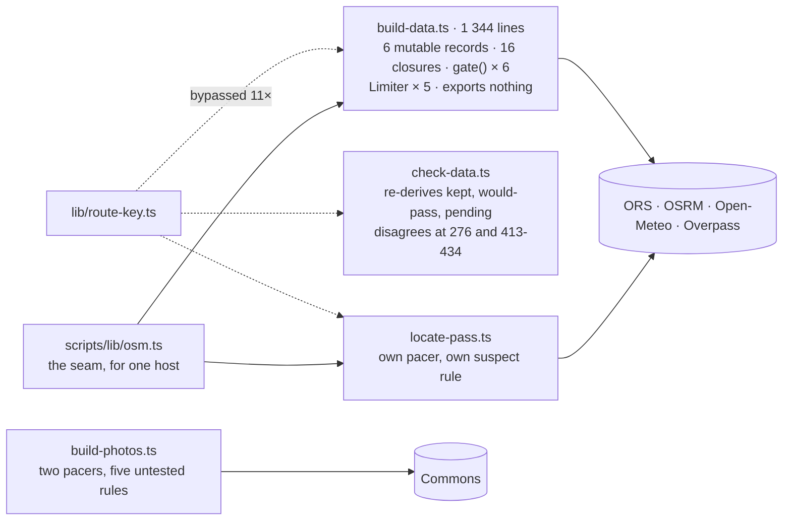
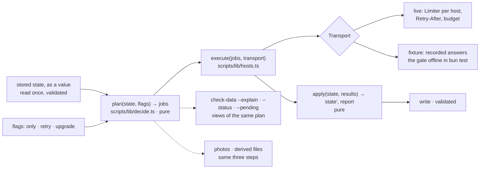

# 32 · The pipeline as plan → execute → apply

**Status:** proposed · **Effort:** L (six phases, one PR each) ·
**Depends on:** 00 (the gate) · **Supersedes:** 20, 21 · **Unblocks:**
roadmap 1 (a closures step is one more host and one more job kind), 12
(destinations enter the pipeline as jobs), 24 (its coverage report's
Overpass call is one more host behind the transport), 33 (the pipeline half
of the functional core)

## Goal

Every script becomes three steps with one shape: `plan(state, flags)`
decides which jobs exist and what each needs; `execute(jobs, transport)`
talks to hosts through one adapter; `apply(state, results)` produces the
next stored state and the report. The decisions are pure and table-tested;
`data:check --explain`, `--status`, `--pending` and `--only` are views of
the same plan; a recorded-fixture transport runs the whole gate offline in
`bun test` on two passes and a tour; and every generated file is
byte-identical after the refactor.

## Why now

Measured at `6c1897b` (2026-09-21). Plans 20 and 21 hold; their evidence
grew, and in two places the duplication they predicted has happened.

- **The decisions are 16 closures over six module-scope records**
  (`routes`, `profiles`, `climates`, `meta`, `rejected`, `summits`, loaded
  at build-data.ts:571-585) plus four argv flags: `ofRoad` 621 … `pendingRoads`
  784, 173 lines (plan 20 counted eight, 84 lines). The gate is six
  interlocking functions, 971-1212, 242 lines, and three of them (`reject`
  992, `accept` 1039, `noteDecline` 1092) mutate the records and call
  `write()` in the same body. Nothing is importable: 775 lines of top-level
  statements and four `process.exit`.
- **The subtlest 90 lines have never run against the data they guard.**
  0 of 9 rejections sit next to a stored route, so the keep/restore path
  (`storedFor` 1111, the `keep` parameter through `reject`/`fetchProfile`/`gate`,
  the "kept" counter) is unexercised, untested, and reachable only through a
  live ORS run on a road ORS both routes and mis-routes.
- **`check-data.ts` restates the build's decisions and now disagrees**: it
  warns `Profil fehlt` (276) for an ascent `pendingProfiles` deliberately
  skips as summit-blocked (761-773); `--explain` re-derives "would pass
  today" (413-434) but never reads `r.inputs`, so it cannot say "you already
  moved this coordinate, the next build picks it up" – the one promise the
  retry rule makes; `measure` (675-678) and `judge` (680-683) restate
  `roadMetrics` and `checkRoadAscent` (validate.ts:220-238) with the
  traverse fork re-derived from a different input each time; and 428
  asserts a full verdict from metrics that are partly `null` (three of six
  limits silently unjudged).
- **`--only` is honoured by 2 of 9 counters** (`pendingRoutes` 753,
  `pendingProfiles` 766). `data:build --only stelvio` still fetches every
  missing climate series and summit; `--status --only X` mixes filtered and
  unfiltered numbers in one sentence.
- **Two spent migrations run on every invocation**: `reconcileInputs`
  (843-875) whose guard is true for 0 of 300 meta entries and 0 of 9
  rejections, and `--backfill` (895-946); `report()` computes a total
  (840) all three callers discard; `--pending` (881-888) counts a different
  set than `report()`.
- **Four pacers for six hosts, five `fetch(` sites.** `build-data.ts`
  188-330 has the careful one (five `Limiter` instances, quota words,
  `Retry-After`); PR #50 hand-rolled a second weighted pacer in
  `locate-pass.ts` 130-137 with the same gap arithmetic as `Limiter.run`
  (245) and the same quota test (146 versus 303); `build-photos.ts` has two
  (125-168 and the adaptive blur pacer 103-114); `build-glyphs.ts:60` fetches
  bare, and PR #59 added a sixth bare site, `scripts/lib/coverage.ts:84`,
  against Overpass with a cache of its own. The body normalisation exists three times, the elevation URL three
  times. **And one host already has the seam plan 21 describes**:
  `scripts/lib/osm.ts` takes `viaMap`/`viaOverpass` as injected fetchers
  (48-56, 76), with two live adapters (build-data.ts:458, locate-pass.ts:117).
- **`lib/route-key.ts` is bypassed at 11 sites** (build-data.ts:631, 666;
  check-data.ts:263, 341, 414, 420, 439, 444, 468; locate-pass.ts:183;
  lib/profile.ts:191); `check-data.ts` imports it and spells the key by hand
  in the same file.
- **The retry rule is told seven times, one contradicting**: `backfill.sh:80-81`
  still tells the curator to run `--retry-rejected` after a coordinate fix,
  which the automatic rule makes unnecessary; PR #52 added two more tellings
  in `docs/data-pipeline.md`. "Is the pass point suspect" has four tellings
  and three answers for an unmeasured road distance (build-data.ts:737-748,
  check-data.ts:230-253, locate-pass.ts:317-326, build-data.ts:1241-1247);
  `MARKER_WORDS` lives in `check-data.ts:202-221` only, so the build log
  says "Passpunkt" for a Höhenstraße.
- **The derived-file rule is stated six times**: the sha256-and-eight-hex
  name in `lib/map-assets.ts:223` and `lib/detail-assets.ts:105`, the prune
  regex in both, the cache-header pattern twice in `next.config.ts:25-26`;
  the mkdir-and-prune loop is duplicated between the two build scripts and
  half a third time in `build-map-style.ts`; the invariant "written name
  matches prune pattern matches cache header" is tested on the detail side
  only (detail-assets.test.ts:79-95).
- **The photo pipeline's choosing sits outside its tested modules.**
  `photo-rank.ts`, `blur.ts` and `lib/photos.ts` are deep and tested; the
  geosearch-to-name fallback (build-photos.ts:207), the `-NEAR_BONUS`
  penalty (197), the per-kind radius (64), a tour borrowing its passes'
  photos (368-377) and the re-blur trigger (266-299) are in the 405-line
  script with no test; shared `Photo` objects are mutated in place (293,
  297, 371); 1 521 `Bun.Image` decodes run on every no-op `data:photos`.
- **The calibration scripts restate the rules they are evidence for**:
  `analyze-status.ts:277-289` restates `passYear`'s run rule and checks
  itself against it at run time (310-317); `analyze-destinations.ts` inlines
  `gradeOf`'s thresholds four times; the two define `quantile` differently
  (155 versus 65).
- **Two scripts that spend API calls do not validate their input**:
  `build-data.ts` and `build-photos.ts` import the JSON and cast, while the
  four scripts that spend nothing parse with zod (principle 4).
- Tests: 339 pass across 22 files; **zero cover a script body**.
  `"test": "bun test lib"` matches by path substring, so a test at
  `scripts/decide.test.ts` would silently not run.

## Non-goals

No threshold changes, no change to what is fetched or when, no new host.
Every generated file is byte-identical after each phase, and so is the
output of `data:check --explain`. No fixture for the whole dataset: two
passes and one tour.

## The mechanism in one picture

### Before



### After



## Design

### Phase A · One transport, one adapter per host (plan 21)

```ts
type GetJson = (url: string, init?: RequestInit) => Promise<unknown>; // as osm.ts today
interface Transport {
  getJson(host: HostId, url: string, init?: RequestInit): Promise<unknown>;
}
```

`scripts/lib/hosts.ts` holds one function per request kind – `ors.route`,
`osrm.route`, `openMeteo.elevation`, `openMeteo.archive`, `osm.*` (moved
from `osm.ts`), `commons.geosearch`, `commons.file` – each taking a
`Transport` and returning a parsed answer; the URL, the weight and the quota
words of a host are known there and nowhere else. `liveTransport(env)` is
today's `Limiter`, `getJson`, `HttpError` and `QuotaExhaustedError`, moved
without change; `fixtureTransport(dir, { record })` answers from
`scripts/fixtures/<host>/<hash>.json` and records with `RECORD_FIXTURES=1`.
`locate-pass.ts`, `build-photos.ts` and `scripts/lib/coverage.ts` drop
their own fetches and pacers; the blur host is one more host with its
adaptive gap inside the live transport, and the coverage cache becomes the
fixture transport's record mode.

### Phase B · The decisions (plan 20)

```ts
routeJobs(passes, tours): RouteJob[];          // scripts/lib/jobs.ts, with parseRouteKey
decideRoute(job, stored, flags): RouteVerdict;  // fetch | retry | keep | skip(reason) | blocked(reason)
decideProfile(job, stored, verdict): ProfileVerdict;
afterGate(job, stored, measured): Partial<Stored>; // keep/restore as a value
suspectPoint(summit, entry): Finding | null;    // beside checkSummit in validate.ts, with MARKER_WORDS
```

All pure over an explicit `Stored` value. `build-data.ts` loads, validates,
calls `plan`, executes, applies, writes. `check-data.ts` calls the same
`plan` and reports the build's verdicts: "already retried, waiting for the
next build" is a verdict it can now print, `Profil fehlt` is not raised for
what the build will not fetch, and the "would pass today" sentence says
which limits it could judge. `--only` is a flag `plan` applies to every job
kind; `--status`, `--pending` and `report()` are three renderings of one
plan. `reconcileInputs` and `--backfill` are deleted; the `optional()` on
`inputs` in the schema goes with them once `data:check` confirms no entry
lacks it.

### Phase C · The offline pipeline test

`scripts/pipeline.test.ts`: two passes and a tour through `plan → execute
(fixtureTransport) → apply`, asserting the verdicts, the written files and
the report against fixtures. `bun test` runs it because `"test"` is widened
to `bun test lib scripts` (or a `bunfig.toml` test root).

### Phase D · Derived files as one module

`lib/derived-file.ts`: `(kind, body, dir) → { name, prune, cachePattern }`
owns the hash, the name, the prune regex and the shape `next.config.ts`
promises; `mapAssets` and `detailAssets` are its two callers, the three
build scripts become parse → produce → hand over, and the invariant test
runs once for both sides.

### Phase E · The photo pipeline's choosing

The fallback, the penalty, the radius, the borrowing and the re-blur
trigger join `rank`/`best`/`blurUri` behind one interface that takes host
answers and the previous `photos.json` and returns the next one; the script
executes through the transport and writes. `Photo` objects are not mutated;
"needs a placeholder" is decided from the stored record, not by decoding.

### Phase F · The calibration scripts tabulate

`passYear` and `gradeOf` take their constants as parameters with today's
values as defaults, so "this rule with that constant" is an argument, not a
copy; `analyze-status.ts` and `analyze-destinations.ts` only tabulate, share
one `quantile`, and get `package.json` entries.

## Steps

One PR per phase, in the order A, B, C, D, E, F; D is independent and may
go first if convenient. Each PR ends with `bun run data:check`, `data:build
--status` and a `git diff --stat data/` that is empty.

### Documentation

`docs/data-pipeline.md` gets the after picture as its opening and one
telling of the retry rule that the skill, `docs/data-model.md` and
`backfill.sh` point at instead of paraphrasing; `AGENTS.md` "Precomputation,
data checks" and "Route quality gate" name `decide.ts`, `hosts.ts` and the
transport; plans 20 and 21 headers point here; plan 11 items 13, 17, 19 and
21 are closed or folded by the phases that touch their files.

## Acceptance criteria

- After every phase: `git status` clean under `data/` after `data:build
--status` and `data:check --explain`; their outputs byte-identical to
  before the phase (recorded in the PR).
- Phase A: `grep -rn "fetch(" scripts --include='*.ts'` finds one site, in
  the live transport; one `Limiter` construction site; `locate-pass.ts` has
  no `nextDem`; the elevation URL is composed once.
- Phase B: `decideRoute`, `decideProfile`, `afterGate` and `suspectPoint`
  have table tests including the keep/restore path with a rejection beside
  a stored route; `data:check` no longer warns `Profil fehlt` for a
  summit-blocked ascent; `--explain` prints "bereits neu versucht" for a
  rejection whose inputs changed; `--only X` filters every counter;
  `reconcileInputs` and `--backfill` are gone; `startsWith("tour:")` appears
  nowhere; `backfill.sh` no longer recommends `--retry-rejected` after a
  coordinate fix.
- Phase C: `bun test` runs the pipeline offline in under five seconds;
  `RECORD_FIXTURES=1` refreshes the fixtures in one run.
- Phase D: the hash-and-name rule is defined once; `lib/map-assets.test.ts`
  asserts the prune and cache patterns the way the detail test does.
- Phase E: a no-op `data:photos` decodes no image; every choosing rule has
  a test; `photos.json` unchanged.
- Phase F: no threshold literal in `scripts/analyze-*.ts`; one `quantile`.

## Risks and open questions

- **Fixture drift.** A recorded answer ages; the fixture directory carries
  the recording date, and refreshing is one env var.
- **The Limiter's semantics.** Open-Meteo's weighted quota is not what
  `p-throttle` or `bottleneck` model; keep the custom `Limiter`, moved, not
  rewritten.
- **`Stored` as a value.** Six records become one object passed through;
  the scripts are already `async` top to bottom, so no streaming concern,
  but the memory shape is the same as today.
- **Phase F touches plan 31's private exports** – do the grep before making
  `lib/status.ts` names private.
