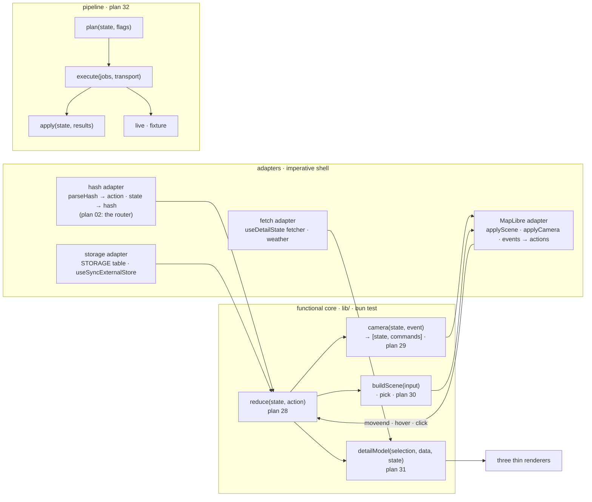

# 33 · Functional core, imperative shell

**Status:** proposed · **Effort:** M (the closing steps; the substance is
delivered by 28–32) · **Depends on:** 28, 29, 30, 31, 32 · **Unblocks:** 02
(the router is an adapter swap), roadmap 1 (the official closure status is
a scene input, a reducer case and a pipeline job, no effect touched), 12,
24, 27 (each arrives as data through the same core)

## Goal

Plans 28 to 32 each deepen one cluster. This plan names what they add up to
and makes it checkable, so that none of them stops at "the pure part is
extracted" while the decisions stay in effects – which is how plans 15, 16
and 22 and PR #45 (`lib/map-camera.ts`, arithmetic without decisions) ended.

The target: the app is a **functional core** of four pure modules – the
reducer (28), the camera machine (29), the scene (30), the detail model
(31) – behind **four adapters** – the hash (later the router), storage,
MapLibre, fetch. The pipeline is `plan → execute → apply` behind one
transport (32). Every decision is a value with a table test; every effect
in `components/` applies a value; nothing in `lib/` touches `window`,
`document`, `location`, `localStorage`, `fetch` or a MapLibre instance
except the named adapter files. `Explorer` is composition. The e2e suite is
a smoke test.

## Why now

Without a named target the five plans are five refactors, and the seams
they cut can grow back the way plan 16's did in PR #47 (plan 31, "Why
now") and plan 19's non-goals did in PRs #43 to #56 (plan 29, "Why now").
The measure of the whole is not in any one plan:

- 0 unit tests under `components/` today; the e2e is the only verification
  of the camera, the scene, the panel and the hover, and it needs WebGL,
  reaches into the map through `window.__alpen`, monkey-patches a MapLibre
  method and carries a 45 s timeout.
- 17 `useEffect` in `pass-map.tsx`, 3 in `explorer.tsx`, and in each of
  them a decision next to the call that applies it.
- Nine ambient inputs into the map beside its props; the hash read in two
  modules; ten storage keys in three.
- The next features on the roadmap – the official closure status, the
  destination entity, gravel – each need a place to enter that is data,
  not an effect edit.

## Non-goals

No framework, no event bus, no generic "store": four named pure functions
and four named adapters, nothing more abstract than that. No XState unless
plan 29's risk becomes real. The CSS drag-frame copy of the scroll lock and
the generated `components/ui/` stay outside the core by design. No behaviour
change.

## The mechanism in one picture

## Design

### The invariants, each with a check

1. **`lib/` is pure.** No module under `lib/` imports `maplibre-gl` (types
   excepted) or reads `window`, `document`, `location`, `localStorage`,
   `fetch`, `matchMedia`, except the adapter files, which are listed by name
   in `oxlint.config.ts` overrides: `lib/use-stored.ts` (or where 28 puts the
   storage adapter), `lib/use-media-query.ts`, `lib/use-fetch.ts`,
   `lib/hash-adapter.ts`, `lib/use-height.ts`, `lib/use-share.ts`. Enforced
   with `no-restricted-globals` and `no-restricted-imports` per path; if a
   rule cannot express it, a `scripts/check-seams.ts` grep runs in
   `data:check`'s spirit and in CI.
2. **Every effect applies a value.** A `useEffect` under `components/`
   calls an adapter with a value the core produced; it does not branch on
   state to decide what to call. Check: `pass-map.tsx` has at most six
   effects (build, scene, camera, environment, resize, test hook),
   `explorer.tsx` at most two (the hash adapter, the storage adapter), and a
   reviewer can name what each applies.
3. **One transport per world.** The hash is read in one file and written in
   one; storage keys appear in `STORAGE` only; MapLibre methods appear in
   `applyScene` and `applyCamera` only; `fetch` in the fetch adapter and
   the weather route only. Checks: the greps in plans 28-31.
4. **The core carries the tests.** `bun test` covers the reducer, the
   machine, the scene, the pick, the model and the pipeline; the e2e is at
   most ten scenarios with default timeouts, no monkey-patching, and reads
   nothing off `window.__alpen` but the map handle.
5. **The litmus test.** A new feature enters as data: the official closure
   status (roadmap 1) is one pipeline job kind, one field on the row, one
   scene input and one reducer case, and it needs no effect edited. The plan
   for it is written against this architecture and says so.

Sizes are smells, not rules, but they are recorded: `pass-map.tsx` at most
700 lines (from 1 986), `explorer.tsx` at most 350 (from 691),
`detail-panel.tsx` at most 120 as the shell (from 1 115), `build-data.ts`
at most 400 (from 1 344).

### What each plan delivers to the core

| Plan | Core module                         | Adapter                         | Leaves behind                                        |
| ---- | ----------------------------------- | ------------------------------- | ---------------------------------------------------- |
| 28   | `reduce`, selectors, `entityKey`    | hash, storage                   | the three selection copies, `listRest`, 3 dead fns   |
| 29   | `camera`, `shellGeometry`           | `applyCamera`, one `moveend`    | 6 refs, 13 call sites, `SHEET_INSET_PX`, `readHash`  |
| 30   | `buildScene`, `pick`, `LAYERS`      | `applyScene`, pointer → actions | 4 effects, 2 hover states, `HIT_GROUPS` literals     |
| 31   | `detailModel`, `DetailState`, reach | fetcher injected                | 19 props, 7 casts, 4 "near here", sentences in JSX   |
| 32   | `plan`/`decide`, `apply`, derived   | `Transport`: live, fixture      | 16 closures, 4 pacers, 2 migrations, 11 key bypasses |

### The closing steps (this plan's own work)

1. **The seam rules.** The oxlint overrides or `check-seams.ts`, wired into
   `bun run lint` and CI, with the adapter allow-list and a comment per
   entry saying which world it touches.
2. **`Explorer` as composition.** Whatever the five plans left: the context
   or the props decided once, no derived state, no import from
   `components/sidebar/` or `components/map/` for a domain value.
3. **The e2e as smoke.** Delete scenarios the core tests now cover; keep
   load, a selection on desktop and phone, a shared link, the filters, dark
   mode, and the closure of the detail; default timeouts; `window.__alpen`
   reduced to the handle.
4. **Plan 02 re-read.** Its design section says the router replaces the
   hash adapter of plan 28 and emits the same actions; nothing else in it
   changes.
5. **Documentation.** `docs/architecture.md` gains "Functional core,
   imperative shell" with the picture above, the five invariants and the
   adapter list; `AGENTS.md` gets the one-line convention "Decisions are
   values; effects apply them" under Architecture with its why-link, and the
   "Where things live" table names the four core modules and the four
   adapters on one row each.

## Acceptance criteria

- The seam check runs in CI and passes; adding `window.matchMedia` to a
  file under `lib/` outside the allow-list fails `bun run lint`.
- The effect counts and the size ceilings above hold, recorded in the PR.
- `bun test` covers the reducer, the machine, the scene, the pick, the
  model and the offline pipeline; the e2e file has at most ten scenarios
  and no `setTimeout` above the default.
- `grep -rn "location.hash" components lib` finds the hash adapter only;
  `grep -rn "alpenpaesse:" components lib` finds `STORAGE` only;
  `grep -rn "\.flyTo\|\.easeTo\|\.setFilter\|\.setData\|\.setFeatureState"
components lib` finds the two appliers only.
- The litmus test is written as the first paragraph of the closure-status
  plan when that plan is opened.
- `docs/architecture.md` carries the section; `AGENTS.md` carries the line.

## Risks and open questions

- **Over-abstraction.** The core is four functions with names; the moment a
  generic dispatcher, a middleware chain or a "store" abstraction appears,
  this plan has failed in the other direction. The reducer is a switch; the
  machine is a switch; the scene and the model are functions.
- **The allow-list grows.** Every new adapter needs a comment and a reason;
  review the list when it passes eight entries.
- **Order.** 28 first; 29 and 31 after it, in either order; 30 after 28 and
  best after 29 so the MapLibre adapter is written once; 32 any time; this
  plan last. A plan landed out of order still holds its own acceptance
  criteria, only the shared adapter gets written twice.
