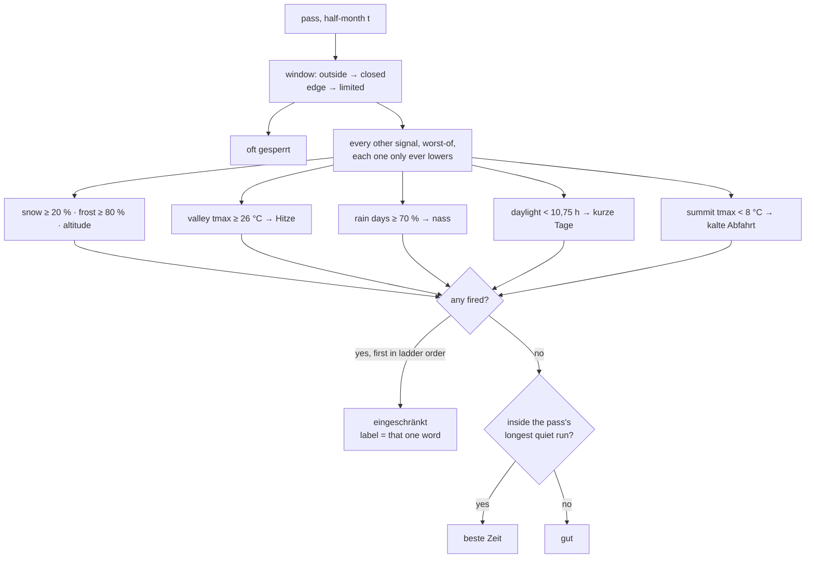

# Scales and where they come from

The four 1–5 scales are **editorial assessments**, assigned based on the general
reputation of the passes (cycling literature, Grand Tour history, reports on
quaeldich.de, climbbybike, Cyclingcols). They are neither measured values nor
user ratings. They are suitable for rough classification, not for point-by-point
comparison. The scales dialog in the app says exactly that – please keep that
honesty.

| Scale          | 1                         | 3                     | 5                                                                          |
| -------------- | ------------------------- | --------------------- | -------------------------------------------------------------------------- |
| **Fame**       | barely known              | known in the scene    | legend (Galibier, Stelvio, Ventoux, Alpe d'Huez, Glockner)                 |
| **Beauty**     | forest road with no view  | solid                 | high-alpine scenery with a spectacular road (Bonette, Iseran, Gavia, Giau) |
| **Difficulty** | short or flat             | ordinary alpine pass  | > 1,000 m of elevation gain with ramps above 10 %, or very long and high   |
| **Traffic**    | almost car-free, dead end | ordinary pass traffic | through road (Simplon, Lautaret, Julier)                                   |

Fame is anchored on Grand Tour history, and that anchor is what keeps the
scale honest in the south: a Ligurian or Provençal col that the winter-training
crowd knows and nobody else is a 2, and a 3 needs a reason in the note
(Milano–Sanremo, Il Lombardia, a Tour or Paris–Nice passage). The Poggio and
the Cipressa are fame 5 with difficulty 1 – the scales dialog already says that
fame is not difficulty, and those two are the proof.

For anyone wanting to make this objective: `difficulty` could be computed from
`profiles.json` (length, average gradient, maximum ramp, summit elevation),
`traffic` approximately from the OSM road classes along the routed ascent. Both
are listed in `docs/roadmap.md`.

## Town labels

`tags` in `data/towns.json` (vocabulary and German labels in `lib/regions.ts`)
are editorial in exactly the same sense: they say what a planner would notice
on arrival – "Radsport-Mekka", "Werkstätten & Verleih", "Ruhig", "Lange
Saison" – and nothing is counted. The scales dialog lists all of them with the
sentence that defines each next to its glyph, `docs/data-model.md` has the
table. One to four per
town; `data:check` warns above four.

## Road types and labels

`type` and `tags` in `data/passes.json` (vocabulary and German labels in
`lib/regions.ts`) are editorial too, in the same sense as the town labels. The
**type** says how the road lies in the terrain – it is the one axis that also
has a mechanical consequence, because the route quality gate measures a
traverse the way it measures a tour. The **labels** say what riding it is
like: "Panoramastraße", "Autofrei", "Maut", "Kehrenbauwerk". Neither is a
measured value, and nothing the data already measures may become one: length,
gradient, altitude and a border crossing are numbers next to them, not labels
among them. The scales dialog lists all fourteen with the sentence that
defines each, `docs/data-model.md` has the tables.

### Gravel: the surface decides the routing profile and the closing rung

`surface` (`asphalt`, `gravel`, `mixed`; `SURFACES` in `lib/regions.ts`) is
the one field a road carries for the second discipline (plan 27), and it is
read in three places rather than sprinkled through the app. The **routing
profile**: `profileOf` in `scripts/lib/validate.ts` picks OpenRouteService's
road-cycling graph for asphalt and its mountain graph for the rest – the road
graph leaves tracks out – and the profile enters `meta.inputs`, so a changed
surface re-routes by itself; only a mountain profile enters the hash, which is
what keeps every route stored before the field existed valid. The **closing
rung**: nobody plows a military road, so `outside-window` (a barrier) closes
asphalt while the snow cover closes a track – `snow-cover` in the ladder,
with the two shares in the table below, read off `ClimateBucket.coverPct`; a series
without the value (every one until the archive is asked for `snow_depth`)
grades a gravel road by the other rungs and never closes it, which the strip
shows as it is rather than guessing. The **picture**: an unpaved ascent is
dashed over its status colour and its dot carries a dark ring, so a road
cyclist who has pressed no chip still sees what the Assietta is.

The four scales stay and are judged inside the discipline: fame is fame among
gravel riders, difficulty includes the surface (a 6 % gravel ramp rides like a
9 % asphalt one), traffic is usually 1 and stays a scale because the Via del
Sale carries motorcycles on toll days. `cobbles` ("Pflaster") is what the old
`surface` label became: cobbles change the tyre, not the discipline. The two
cover constants are provisional – set from the plan's expectation until a
backfill lets `analyze:status` print the distribution – and the scales dialog
says so with the rest of the ladder.

## Destinations: reach and the derived year

A town has no climate series and no season of its own. What it has is the
passes it reaches, and every one of those is already graded for all 24
half-months. Everything the destination block shows is therefore **derived**,
and says so on screen (Principle 3): the counts, the grade bar and the strip.
`lib/destination.ts` is the whole of it, `scripts/analyze-destinations.ts` is
the calibration.

### Reach: three bands and a gradient

The old single radius (60 km) answered "is it in?" and nothing else, so a
pass 1 km away and one 59 km away read alike while one at 61 km was gone.
Two mechanisms replace it, deliberately different so neither has to do the
other's job:

| Band   | up to | what it means on a bike       |
| ------ | ----- | ----------------------------- |
| `door` | 18 km | ride out of the door, no car  |
| `day`  | 45 km | inside a day's loop from here |
| `trip` | 75 km | worth the transfer            |

- **Bands are what a person reads.** They group the list and they are a
  sentence – "vier Pässe vor der Haustür" – which a weight can never be.
- **`reachWeight` is what the machine ranks with.** A cosine ease, 1 at the
  door, 0 at `REACH_MAX_KM`, so `|w(59) − w(61)| < 0.05` where the old cut was
  1 → 0. It is a factor in the ordering score, never a filter, and it is never
  shown: nobody can read "Gewicht 0,62".

`REACH_MAX_KM` (75 km) is where the list stops. A cut-off still exists because
a list has to end, but the weight is already near zero there, so the edge
costs almost nothing.

### The grade: relative to this base's own peak, not to a count

`gradeOfBase` grades a half-month against the **best half-month that base ever
has**:

| Grade           | condition                                     |
| --------------- | --------------------------------------------- |
| `beste Zeit`    | ≥ `RIDEABLE_BEST_SHARE` (0,8) of its own peak |
| `gut`           | ≥ `RIDEABLE_GOOD_SHARE` (0,5) of its own peak |
| `eingeschränkt` | at least one rideable pass                    |
| `oft gesperrt`  | none                                          |

This was an absolute count first – six rideable passes for "beste Zeit",
three for "gut" – and the measurement killed it. Over all 48 towns × 24
half-months:

- **47 of 48 towns cleared the top threshold in early September**, 45 of 48 in
  late July. The top grade landed on 40 % of all cells and on **73 % of the
  non-winter ones**, so from late June to early October the strip was a solid
  block for every sizeable base.
- The median base reaches 26 passes and has 19–26 rideable at its peak, four
  times the threshold. No absolute number serves both that and Bédoin, which
  reaches two.

The deeper fault is that an absolute count makes the strip encode two things
at once: how _big_ a base is and when it is at its _best_. A 24-cell strip is
a seasonal instrument – its question is "when should I come here" – so it must
answer only the second. The same year, both ways
(`# beste Zeit, + gut, . eingeschränkt`, January to December twice over):

```
Bédoin     reaches  2   relative |    ++++++#     +##     |   absolute |    .......     ...     |
Innsbruck  reaches 15   relative |       ...+#######.     |   absolute |       ...#########     |
Bormio     reaches 33   relative |     ......#+++##+.     |   absolute |     ..+.+#########     |
Cavalese   reaches 43   relative |    .......++.++##+     |   absolute |    .++############     |
```

Bédoin relative is the case that proves it: a long spring, a hole in high
summer where the heat on Ventoux makes it punishing, and a second peak in
September. Absolute, it is a flat dim line and the app knows nothing.

**"How much is there" is not lost, it is said in words.** `destinationText`
and the grade bar sit directly above the strip – "Von 33 Pässen im Umkreis:
12 zur besten Zeit, 11 gut, 10 eingeschränkt" – and the line under it names
what the strip is relative to. The picture carries the shape, the sentence
carries the magnitude; the same split as the bands and the weight above.

The two shares are set where every base still gets a named best window. At
0,8 five of the 48 towns – Bormio among them – peaked in a single half-month,
so `bestRun` found no run of two and the panel's "beste Zeit X – Y" line
vanished for them; at 0,75 all 48 keep one, with a median length of three
half-months, and the grade split barely moves (best 20 % of all cells against
16 %).

The two shares are editorial like every other number here. Re-run
`bun run analyze:destinations` after the data grows: section 3 is
the absolute rule that was dropped, section 4 the relative one in use, and
section 5 prints the strips above.

### Ranking within a band

`beauty + fame/2`, scaled by the grade in the chosen half-month and by
`0,35 + reachWeight(km)`. A closed pass is not an argument for a base however
pretty it is, so the grade is the strongest term; the weight is a factor and
not a filter, so a genuinely better pass at 70 km can still out-rank a dull
one at 5 km. The inverse list in a pass panel (`basesOf`, "Orte als
Standort") uses the same bands and the same weight, scaled by how many passes
each town reaches instead — because the nearest village is rarely the best
base.

### An area, judged like a base

A destination (`docs/destinations.md`) is judged the way a base is, over its
members instead of over a reach: the roads inside the circle, their 24 cells
counted per half-month, graded against the area's own peak with the two
shares above. There is no band and no nearness weight – the curator drew the
circle, and everything in it counts once.

What ranks the list of areas is a score that is never shown:
Σ beauty of the open roads + `RISKY_WEIGHT` (0,4) × Σ beauty of the limited
ones, nothing for a closed road (`areaScore` in `lib/destination.ts`). It is
editorial like the scales it sums, and it will be tuned after the app has
planned one real trip; the scales dialog says both.

## Status per period

`passVerdict()` in `lib/status.ts` answers "how good is it to ride there in
this half-month", not only "can you get over". The opening window decides
what is closed; every other signal is judged on its own, can only lower a
cell, never lift it, and the first one in ladder order is the word the cell
carries:



The ladder order is `REASON_ORDER`: `outside-window → window-edge → snow →
frost → altitude → heat → wet → short-day → cold-descent`. Every reason that
fired stays in `StatusVerdict.reasons`, in that order; the badge shows the
first as one word (`REASON_WORD`, via `badgeWord`), the panel every one as a
sentence with its number and provenance (`REASON_TEXT`).

The thresholds in the diagram above are not written twice. `SIGNALS` in
`lib/status.ts` is one table – reason, value, unit and the clause that
explains it – in ladder order, and the scales dialog renders its "Vier
Stufen, eine Leiter" paragraph from it (`ladderText`), so a constant that
moves reaches the text explaining it. `scripts/analyze-status.ts` reads the
same table when it re-runs the calibration. The reasons without a number –
the opening window, its edge and the altitude fallback – are calendar rules
rather than thresholds and are named by `REASON_PHRASE` only.

Three builders in the same module compose the sentences the UI prints, so no
component joins the word tables itself: `badgeWord(cell)` (the badge and,
through `statusWord`, the row), `valleyText()` (the one "abgeleitet"
sentence, always with its `VALLEY_TMAX_ERROR`) and `tourText(cell, names)`
(the sentence under a tour's badge, carrying the word of the tour's own
status and naming the members that share it – `YearCell.limiting`, recorded
by `tourYear`).

Four rungs (`--grade-*` in `app/globals.css` for the fills):

```
██  beste Zeit     deep green     the longest stretch without a caveat and with < 10 % snow days
▓▓  gut            light yellow   rideable, no caveat worth a word; a shorter stretch, or 10–19 % snow days
▒▒  eingeschränkt  orange         one word: Hitze · nass · kurze Tage · kalte Abfahrt · Schnee · Frost · Höhe · Randzeit
░░  oft gesperrt   hollow, red hairline   road closed, from the opening window only
```

The three fills differ in lightness as well as hue, so they are told apart at
4 px; the closure has no fill, so a winter of closures stays light and a
closed road keeps reading as a different kind of statement. In the panel every cell
carries a tooltip – the half-month and the grade in the first line, then the
sentence from `GRADE_HINT`, with the caveat named for a limited cell
(`cellHint`, `REASON_PHRASE`). A limited cell's popover is the only
explanation that half-month has – the sentences above it describe the
_selected_ half-month – so `REASON_PHRASE` may carry its own sub-clause,
while the list of eight in `GRADE_HINT.limited` uses the shorter
`REASON_SHORT`. The period control's tooltip lists the four
sentences once.

`Status` (`open | risky | closed`, `lib/schema.ts`) stays three-valued: it is
the vocabulary of the filter, the hash and the map. `Grade` (`best | good |
limited | closed`, `lib/status.ts`) is what the strip and the histogram
read: `open` split by whether the half-month lies in the best window, the
longest run of "gut" half-months with fewer than 10 % snow days. The map
circles, the row dot and the badge dot keep the three status colours.

All 24 half-months of a pass are judged **once, on the server**: `passYear()`
runs the verdict over the whole year and `getYears()` (`lib/data.ts`) does that
for every pass and tour at prerender, so the row, the histogram, the strip, the
badge and the detail panel all read one `Year` instead of each grading the pass
again in the browser (plan 15). A tour takes, per half-month, the cell of the
member pass with the lowest grade – whole, so its colour, its word and its snow
note come from the same pass.

Nothing but the opening window produces "oft gesperrt": a closure is what the
window knows; snowfall, heat or short days are what the series and the
calendar know – and a road stays open through them, it just stops being a
good idea. A closed road and a 34 °C valley are not the same kind of
statement, which is why the hollow cell is categorically apart from the
amber one.

### Thresholds

All constants sit in `lib/status.ts`; the tables they were read off are in
`docs/plans/04-climate-aware-status.md` (snow, frost) and
`docs/plans/13-summer-axis.md` (the rest). `bun run analyze:status` prints the
cohort tables, the per-half-month distributions of every signal, the counts one
step either side of every threshold, and every (pass, half-month) pair whose
verdict changes – re-run it after touching a constant.

| Signal        | Constant            | Value   | Reads                                                                               |
| ------------- | ------------------- | ------- | ----------------------------------------------------------------------------------- |
| Schnee        | `SNOW_RISKY_PCT`    | 20 %    | `snowPct`, share of days with ≥ 1 cm                                                |
| Frost         | `FROST_RISKY_PCT`   | 80 %    | `frostPct`, share of nights below 0 °C                                              |
| Hitze         | `HEAT_VALLEY_TMAX`  | 26 °C   | `tmax` derived to the lowest ascent start                                           |
| nass          | `WET_LIMITED_PCT`   | 70 %    | `wetPct`, share of days with ≥ 1 mm                                                 |
| kurze Tage    | `SHORT_DAY_HOURS`   | 10,75 h | day length from `lat`, `lib/daylight.ts`                                            |
| kalte Abfahrt | `COLD_DESCENT_TMAX` | 8 °C    | `tmax` at the summit, the afternoon of a descent                                    |
| beste Zeit    | `SNOW_BEST_PCT`     | 10 %    | `snowPct` inside a run of "gut"                                                     |
| zugeschneit   | `COVER_LIMITED_PCT` | 20 %    | `coverPct`, share of days with ≥ 10 cm of snow cover – unpaved roads only, a caveat |
| zugeschneit   | `COVER_CLOSED_PCT`  | 50 %    | `coverPct` – unpaved roads only, closes the road the way a barrier closes a pass    |

### Derived values

The climate series is ERA5-Land, downscaled by Open-Meteo to `pass.elevation`
(the `elevation` parameter in `scripts/build-data.ts`), so every bucket
describes the summit. Heat is a valley phenomenon, and the valley is not
measured: `valleyTmax()` takes the summit `tmax` down to the lowest ascent
start (`valleyElevations()` in `lib/profile.ts`, from `profiles.json`) with
the standard-atmosphere lapse rate of 0,65 °C per 100 m. That is a model:
inversions, foehn and the valley floor's own heat are not in it, and against
station values it runs about 2–3 °C low for passes with 1 800 m of drop
(Stilfser Joch from Prato: 24,8 °C derived, ~27 °C measured) and close for
low ones. The threshold therefore errs towards _not_ flagging heat on the
highest passes, which is the safe direction for a planner, and every place
the value shows says "abgeleitet". Passes without a profile (twelve, until
their routes pass the quality gate) have no valley value and no heat signal;
the panel says so.

Day length and sunrise/sunset are pure astronomy (`lib/daylight.ts`, the NOAA
sunrise equation, good to a minute or two), taken in the middle of the
half-month (the 8th or the 23rd) and shown in Europe/Berlin clock time. The
DST switch in late October falls inside a half-month, so the sunset shown
there is an hour off for part of it; the text says "gegen".

The cold descent reads the summit's daily **maximum**, not its minimum: the
descent happens in the afternoon, when the summit is at its warmest, and a
maximum of 8 °C means wind chill around freezing at 50 km/h.

For tours the worst status among their passes applies, and the worst grade
per half-month. All of this is deliberately coarse and does not replace
official information. `passVerdict` is the place where real closure data will
hook in later.
