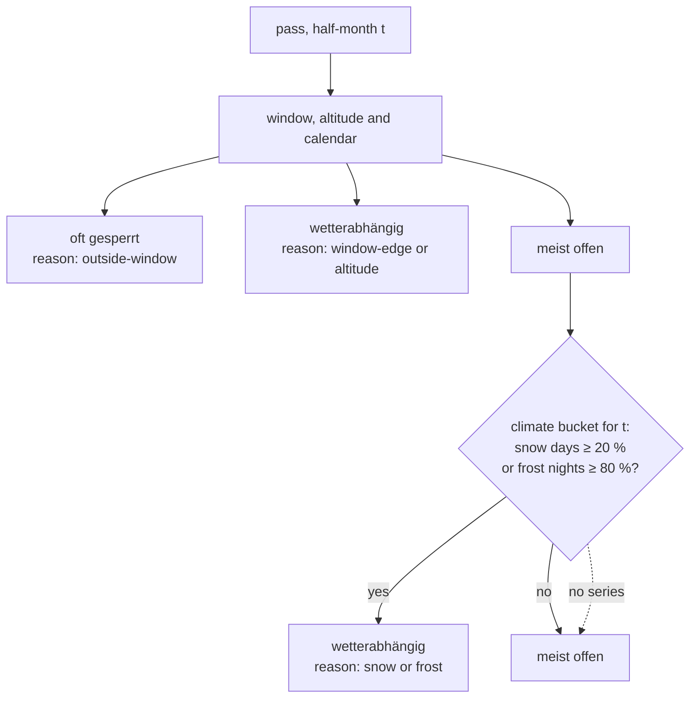

# Scales and where they come from

The four 1–5 scales are **editorial assessments**, assigned based on the general
reputation of the passes (cycling literature, Grand Tour history, reports on
quaeldich.de, climbbybike, Cyclingcols). They are neither measured values nor
user ratings. They are suitable for rough classification, not for point-by-point
comparison. The scales dialog in the app says exactly that – please keep that
honesty.

| Scale          | 1                         | 3                     | 5                                                                          |
| -------------- | ------------------------- | --------------------- | -------------------------------------------------------------------------- |
| **Fame**       | barely known              | known in the scene    | legend (Galibier, Stelvio, Ventoux, Alpe d'Huez, Glockner)                 |
| **Beauty**     | forest road with no view  | solid                 | high-alpine scenery with a spectacular road (Bonette, Iseran, Gavia, Giau) |
| **Difficulty** | short or flat             | ordinary alpine pass  | > 1,000 m of elevation gain with ramps above 10 %, or very long and high   |
| **Traffic**    | almost car-free, dead end | ordinary pass traffic | through road (Simplon, Lautaret, Julier)                                   |

For anyone wanting to make this objective: `difficulty` could be computed from
`profiles.json` (length, average gradient, maximum ramp, summit elevation),
`traffic` approximately from the OSM road classes along the routed ascent. Both
are listed in `docs/roadmap.md`.

## Status per period

`passVerdict()` in `lib/status.ts` – the opening window, the pass altitude and
the calendar decide the base verdict, the pass's own ERA5 climate series can
then downgrade "meist offen" to "wetterabhängig":

Climate never produces "oft gesperrt": a closure is what the opening window
knows, snowfall is what the climate series knows – and a road stays open
through snowfall, it just stops being reliable. The thresholds
(`SNOW_RISKY_PCT`, `FROST_RISKY_PCT`) are calibrated on all 92 passes; across
the pass × half-month pairs the "meist offen" cohort sits at 4 % snow days
after the change, the "wetterabhängig" cohort at 25 %. Re-run
`bun run scripts/analyze-status.ts` after touching them: it prints the cohort
table and every verdict that changes.

Every non-open verdict carries a reason (`StatusReason`) with one German
sentence in `REASON_TEXT`, shown under the badge in the detail panel.

`bestPeriods()` returns the longest run of half-months that are "meist offen"
with fewer than 10 % snow days – the "Beste Zeit" line in the panel.

For tours the worst status among their passes applies. All of this is
deliberately coarse and does not replace official information. `passVerdict`
is the place where real closure data will hook in later.
