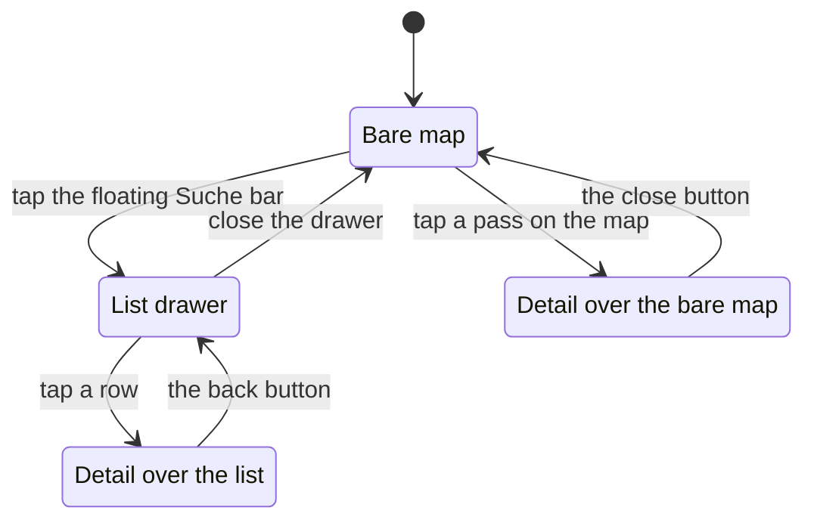

# UI conventions

How the interface is built and why it is built that way. The rules here are
binding for anything under `components/` and `app/`; `AGENTS.md` links to each
section and keeps the one-line version.

The map's own rules – camera, layers, hit testing, basemap – live in
[`map-rendering.md`](./map-rendering.md); what the page is allowed to ship and
how it is cached lives in [`architecture.md`](./architecture.md).

## The component layer

### shadcn/ui, style "mira" (`base-mira`)

`components/ui/` holds the official components generated from the preset
(`bun run ui:init`, `bun run ui:add`). They are built on `@base-ui/react`, not
Radix, so the API differs from older shadcn snippets: `ToggleGroup` takes
`multiple` instead of `type="multiple"`, `Slider.onValueChange` receives
`number | number[]`, and button icon sizes are `icon-sm`/`icon-xs`, not
`iconSm`. Do not edit files in `components/ui/` by hand; domain-specific
styling (status badges, etc.) goes into the consuming component via
`className`. Re-running `ui:init` overwrites `app/globals.css`; the domain
tokens (`--status-open`, `--status-risky`, `--status-closed`, `--tour`,
`--town`, the strip's `--grade-*` ramp, plus their `@theme inline` lines), the
`--text-2xs` step below Tailwind's `text-xs`, the MapLibre rules at the end,
the coarse-pointer font-size rule next to them and the dark-mode setup must be
restored afterwards.

### Sizes come from the scale, not from pixels

Font sizes, spacing and radii are Tailwind steps; an arbitrary value
(`text-[13px]`, `rounded-[3px]`) is only for what the scale genuinely cannot
express, such as a `calc()` width or the inset shadow marking the current row.
The dense map furniture needs one step below `text-xs`, so the scale carries
`text-2xs` (10 px) as a token – add to the scale rather than reaching for a
pixel value.

### Touch targets follow the pointer, not the width

Safari on iOS zooms the page in when a focused form control carries a font size
below 16 px, and on a map that fills the viewport that zoom has no way back. An
unlayered rule at the end of `app/globals.css` gives every control 16 px on a
coarse pointer – unlayered because it has to beat the `text-xs` utilities the
components carry – and `TOUCH_CONTROL` and `TOUCH_ICON` in `lib/utils.ts` grow
the boxes to match, on the same `pointer-coarse` condition (`TOUCH_SELECT` did
the same for a native select and is unused, see below). With a mouse everything
stays as dense as it was. The rule cuts both ways: a control that is _not_ a
text field gains nothing from the 16 px and loses the row's scale, which is why
the app has no `<select>` left – the sort picker is a `DropdownMenu` and the
filters are chips, both ordinary markup the rule never touches.

### Charts come from the shadcn `chart` component (recharts under the hood)

It is the only heavy dependency in the app, so the one chart that uses it
(`components/panel/climate-chart.tsx`) is pulled in with `next/dynamic` and
never reaches the first load. Stat tiles and dense rows use `Item`, stepper
groups use `ButtonGroup`.

## Layout

### The map is the page

No header, toolbar or footer. On desktop the map fills the viewport and two
translucent panels float over its left edge: the collapsible sidebar
(`components/sidebar/`: search, filters, and one list per kind behind a tab
row) and, while something is selected, the detail slide-over next to it. Their
widths are mirrored in `explorer.tsx` (`SIDEBAR_W`, `DETAIL_W`) and fed to
MapLibre as left padding so camera targets stay visible. Below `lg` there is
**no** panel at rest: the map is the page on a phone too, so nothing covers it
until something is asked for. What floats over its bottom-left corner is
`MapSearch` – a button reading "Suche" (or the current query) with the three
counts beside it and the filter badge after them, which is also the only thing
on the first screen that says what the app holds. It is a **button** and is
styled as one: a field there would bring the software keyboard up in the same
moment as the drawer moves, and the two animations fight over where the field
ends up – the field a thumb reaches is always in a drawer that already stands
still. MapLibre's own corner controls are lifted above the bar by
`--sheet-peek`, which needs `!important`: MapLibre's stylesheet is bundled
after `globals.css` at equal specificity, so the rule had never applied. From
there, **two** independent `MobileSheet`s (`components/mobile-sheet.tsx`, the
Base UI `Drawer` with `modal={false}` and snap points), the list and the
detail, each mounted only while it is open and each with its own snap state
(`LIST_SNAPS`, `DETAIL_SNAPS` in `explorer.tsx`). The search bar opens the
list; a tap on the map opens the detail over the bare map; a tap on a list row
opens it over the list. Whichever is in front feeds MapLibre its height as
bottom padding, and with neither open that is the floating bar's height
(`FLOATING_BAR_PX`, kept in step with `--sheet-peek`). It was one sheet holding
either content, after a stint as two sheets that were always both on screen.
The always-on pair failed because a drawer that cannot leave has to rest
somewhere, so the layout grew a peek row, a swipe handle over it and a trigger
button inside the thing it triggers – a piece of the list permanently parked on
the map before anything had been asked for, and a second handle behind it that
did nothing. Collapsing them into one sheet removed the second handle but kept
the peek, and made "back to the list" something the app had to reconstruct: a
detail reached from the map had no list behind it, and one reached from a row
had to keep the list mounted under a `hidden` so its scroll position, its tab
and its search survived. Opening on demand settles both. The stack is simply
the truth, the list keeps its state by never being unmounted while it is open,
and nothing has to rest on screen, so there is no peek snap to measure. What
leaving a detail means still depends on what is underneath, and the control
says which: a labelled `‹ Liste` back button while the list drawer is open
behind it (`backToList` on `DetailPanel`), the `✕` when the detail is alone
over the map. A drawer sizes itself from `--drawer-snap-point-offset`: the
popup is a full `100dvh` and padded off at the bottom by that offset, so its
content box ends at the fold. What else floats over the map is one cluster in
its top-left corner (`MAP_CLUSTER`, next to the panels' left edge): the period
scrubber and, on the same panel surface, the three map tools – layers, 3D, fit.
The tools are one segmented column in the same outline as the scrubber's own
stepper, stretched to its height, so they read as pressable and the cluster
keeps an even edge; `MAP_TOOL` settles the outline, because `Button` and
`Toggle` disagree about hover, border token and dark fill. The scrubber reaches
the map through the `scrubber` prop rather than `children`, which is what stays
free-floating beside the cluster – today the sidebar's own toggle. On a phone
the cluster is nearly as wide as the screen, so it is padding there like the
sheet below it (`MAP_CLUSTER_PX`, keep it in step with what the cluster
actually measures). The scrubber carries the 24 half-months, the histogram of
what is rideable and the "heute" marker, and every list row repeats the same 24
cells as a `SeasonStrip`. Map visibility is always a `Switch` ("auf der
Karte"), one per kind, two-state buttons are always a `Toggle`. Without a
camera or a selection in the hash the map opens on the frame the fit button
produces, not on a fixed overview.

On a phone that makes four states, and which control leaves a detail depends
on which of them it is in:

Whichever drawer is in front feeds MapLibre its height as bottom padding; with
neither open that is the floating bar's height.

### Dark mode follows the OS, nothing else

There is no theme toggle and no `next-themes`; the dark tokens sit in a
`prefers-color-scheme` media query and Tailwind's default `dark:` variant is
used. Delete the `@custom-variant dark (&:is(.dark *))` line that `ui:init`
writes.

## The sidebar

### A filter is a chip, and no chip lies

Every filter in the sidebar is the same shape: a small pressable word, outlined
while it is off and filled with the primary colour while it is on
(`FilterChip`). There is no slider and no select among them. A slider is for a
value where the exact number matters and the scale is wide; a 1–5 editorial
judgement and four round height thresholds are neither, and on a phone its
thumb is the one control that is regularly missed – small, indistinguishable
against the filled track at either end, and it swallows the sheet's swipe. A
chip is a target with a label that says what it does before it is pressed.
Three rules keep the panel out of states that answer nothing. A "which of
these" set (status, road type) is stored as what stays visible, and the whole
vocabulary means _no filter_, so nothing reads as pressed then; `toggleMember`
turns the last one out back into the whole set, so "none selected" – an empty
list by construction – cannot be reached. A threshold group (`ThresholdChips`)
holds at most one pressed chip and pressing it again lifts the filter, and its
"egal" value is the first option of the list and deliberately has no chip of
its own. The difficulty is five cells that always span one window
(`toggleLevel`), which is a range without a second thumb to aim at. A threshold
on one of the 1–5 scales carries the same five-bar mark the list rows draw
(`Rating`, `mark` on `ThresholdChips`), so the filter and the thing it filters
show one picture instead of a word here and a glyph there. The word stays in
front of it, because the mark alone carries "at least" implicitly and
`maxTraffic` is an upper bound – a bare rating row would read as the opposite
of what it does there. Inside a pressed chip the mark takes `tone="current"`:
the surface _is_ the primary colour, so a primary bar disappears exactly where
the filter is active. Every chip carries how many roads it would leave
(`facetCount` in `lib/rows.ts`, handed down as `countWith`), and that number is
counted **disjunctively**: with all other groups' filters applied but its own
group's filter lifted. Counted the other way – with the group's current choice
still in force – every unpressed chip in a group reads 0 although each is one
tap away. The disjunctive rule buys a second thing: a group's numbers do not
depend on that group's own state, so they hold still while a thumb works that
group and only move when another group changes. A chip that would leave none is
disabled rather than hidden, because hiding it raises the question of where it
went and the 0 is the answer; a pressed chip is never disabled, it has to stay
liftable. The difficulty cells are the one exception to "what happens if I
press this": a cell moves a window rather than replacing it, so its number is
how many roads sit at that level. Counting has its own path rather than going
through `buildPassRows`: a count needs neither the row objects nor the season
strip hanging off them, and the panel asks it once per option on every
keystroke. Since [plan 15](./plans/15-pass-year.md) the saving is allocation
rather than arithmetic – both
paths read the grades from the precomputed year – but it is still 201 rows
built per option to produce one number. And when a combination does run empty,
the count line names the single filter that would bring the most back rather
than saying nothing. What is filtered away is written down outside the panel
too: `AppliedFilters` turns `appliedFilters()` in `lib/filter-summary.ts` into
one removable chip per decision, and the same list's length is the badge on the
trigger, so the two can never disagree. Nothing is applied on a button – the
count line at the end of the panel says what the current answer is, which is
what makes live filtering answerable at all.

### The panel scrolls with the lists, not above them

The sidebar's header is a fixed row and holds only the search field, the
trigger and the chip row; the panel body itself is the first thing inside the
scroll container the lists live in. A growing panel inside a fixed row simply
runs off the bottom of the phone's sheet with no way to reach its lower half,
and two scroll containers stacked inside one drawer is the other half of the
same bug. The four decisions a holiday planner makes first (status, difficulty,
height, bookmarks) are always visible, the eight sharper ones wait behind
"Weitere Filter", which opens by itself when a link carries one of them.

### One list at a time, chosen by a tab row

The three kinds used to be collapsible blocks stacked inside one scroll
container, which made the sidebar a single 12 841 px column against a 730 px
viewport: the tours sat below all 201 roads and the towns below those.
`KindTabs` (`components/sidebar/kind-tabs.tsx`) puts the choice in the fixed
header and the scroll container holds one list. The tabs also solve what kept
the old section headers from sticking. A pinned header needs an opaque
background to stay legible over the rows scrolling under it, and a
`backdrop-blur` cannot supply one – the panel already filters its backdrop, and
a nested filter never sees the content inside that backdrop root. In the header
row nothing scrolls underneath, so the counts simply stay on screen, and the
count on a tab is the answer to the filter: narrowing to "ab 2.500 m" collapses
the tours from 9 to 2 where it can be seen. Each kind's "auf der Karte" switch
rides in that list's own toolbar (`ListToolbar`), never beside the tab row: a
control next to three tabs reads as acting on all three, and a bare switch says
what it does only once it has been flipped, so it carries the words too.

### A long list is one tab stop

Every row used to be two (the bookmark toggle and the row itself) – 562
focusable elements on the built page, so reaching the map meant holding Tab
down for several hundred presses, and a screen reader's rotor held two hundred
buttons all called "Merken". `useRoving` (`lib/use-roving.ts`) makes each list
the composite widget the platform expects: one stop, arrows inside it,
Home/End/PageUp/PageDown, and the tab stop stays on the row last focused. It
works off the DOM rather than an index in state, because which rows exist
changes on every keystroke in the search field. Every bookmark toggle is named
after the thing it bookmarks, and `app/page.tsx` carries a skip link to the
map.

## The detail panel

### The panel folds

Every block below the title is a `Section` (`components/panel/section.tsx`),
open by default. The panel is a column on a map and a phone sheet shows two
blocks at a time; whoever wants the climate should not scroll past two
elevation profiles first. Which blocks are folded is one `sessionStorage` entry
shared by all of them (`SECTIONS_KEY`), keyed by section id and holding the
_closed_ ones: a fold carries over to the next pass looked at, a new section
opens by itself, and the next visit starts unfolded again. A section title says
what the block is and nothing else; where a source or its caveat has to be
named, one short sentence sits behind the `info` popover, opened by tap or
click – a tooltip needs hover, which a phone cannot give it, and the detail
panel is where a phone reaches this app most. A header never opens a dialog –
the scales dialog belongs to the sidebar footer, which is where it stays.

### Photos are borrowed, not owned

The detail panel opens with a slideshow of Wikimedia Commons photos
(`components/panel/photo-carousel.tsx`). `scripts/build-photos.ts` picks them
once, without an editorial step – a geosearch around the pass point, a name
filter that keeps signs and maps out, a rank by name match – and stores only
metadata in `data/generated/photos.json`: the thumbnail URL, the author, the
licence and the file page. The files themselves stay on Wikimedia's CDN and
reach the browser through a plain ``, never `next/image`; they are already
rendered and already cached, mirroring them would put ~25 MB of binaries into
the repo, and the optimiser would add a hop, a `remotePatterns` entry and a
bill for the same bytes. What it would have brought is had without it.
Wikimedia renders a fixed ladder of widths and answers a direct request for
anything else with a 400, so `thumbUrl` composes the smaller rungs of that
ladder and the slide carries a `srcset` off it (`photoSrcSet`, `PHOTO_SIZES`):
a 1× panel fetches 500 px where it used to fetch 960. And the one thing that
cannot be fetched in time is precomputed – `Photo.blur` is the same photo
`BLUR_WIDTH` px wide as a data URI, laid under the photo in a layer of its own,
so a slide opens on its own colours instead of an empty box. That layer is
blurred and scaled up rather than left to the browser's upscaling, which at
twenty times the width is visibly blocky; it is a layer because `filter`
reaches an element's children, and it is scaled because a blur samples past the
edges. It travels inside the entity's detail file, because a placeholder that
needs a request of its own loses the race it exists to win; generating one on
demand and caching it would lose the same race for every first visitor to a
pass. No image library is involved either way: Wikimedia renders the 40 px
version, `scripts/lib/blur.ts` strips the metadata it inherits – a wide-gamut
photo's ICC profile is 30 KB around a 480-byte picture, and re-encoding does
not drop it – and `Bun.Image` turns what is left into ~475 bytes of WebP. A
hash (BlurHash, ThumbHash) would be twenty times smaller and lower fidelity
than that, and would want a decoder and a canvas paint in the frame the panel
is trying to keep smooth; the thumbnail is already rendered, so there is
nothing to approximate. **And the box is there before the photo is.** The panel
opens before its detail file arrives, so `DetailAsset` carries the photo count
next to the URL and `PhotoCarousel` reserves the slide while it waits – the
block that used to appear late and push everything under it down. An entity
with no photos reserves nothing. That is the same rule as the profile skeleton
and the chart's placeholder, and the reason the panel is not a server
component: a selection would then cost a server round trip where it now costs
an immutable file from the CDN, and the jump was never about where the markup
came from. Attribution is not decoration: every slide carries author and
licence, baked into the slide rather than derived from the carousel's index, so
it cannot drift out of sync with what is on screen.
